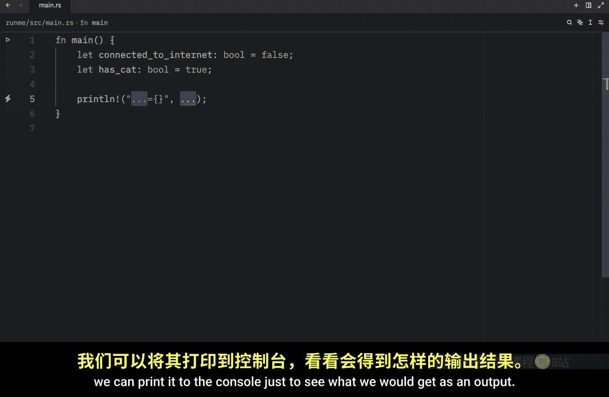
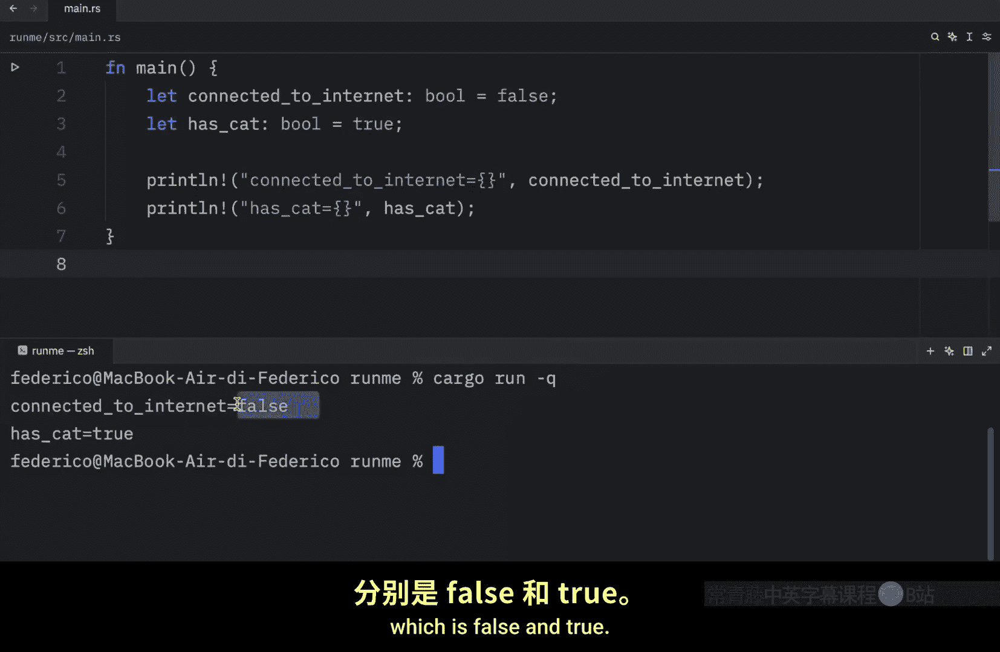
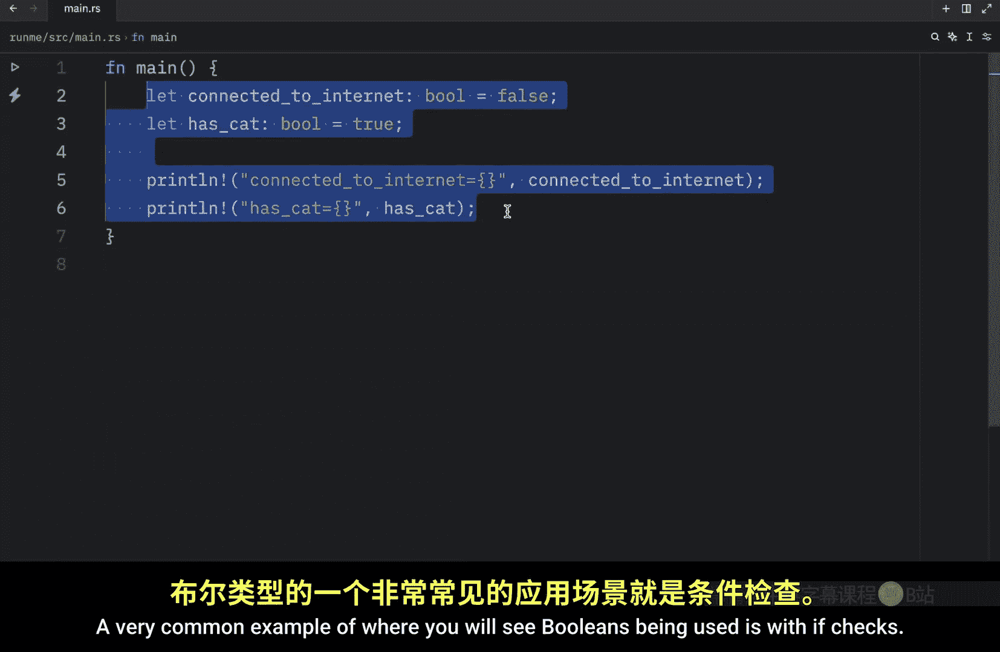
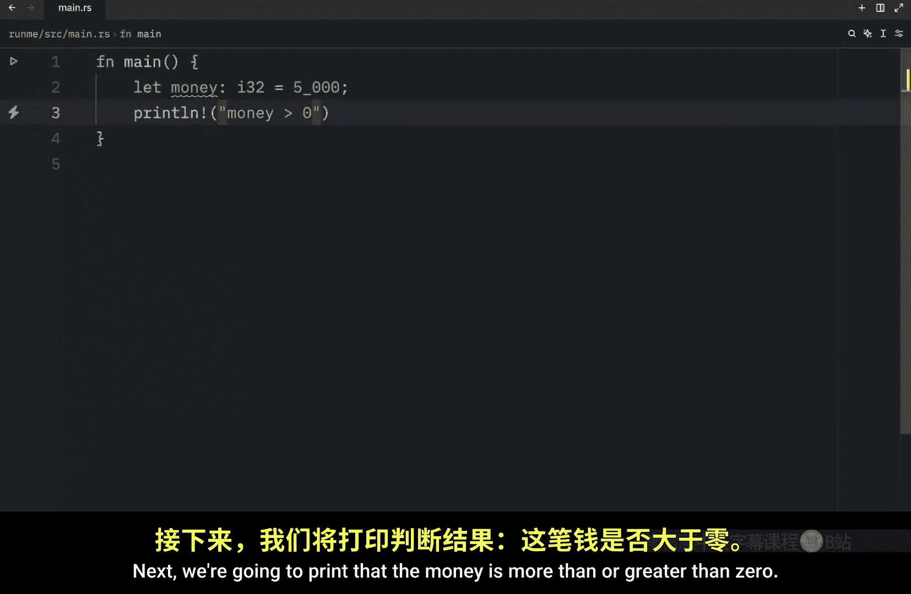
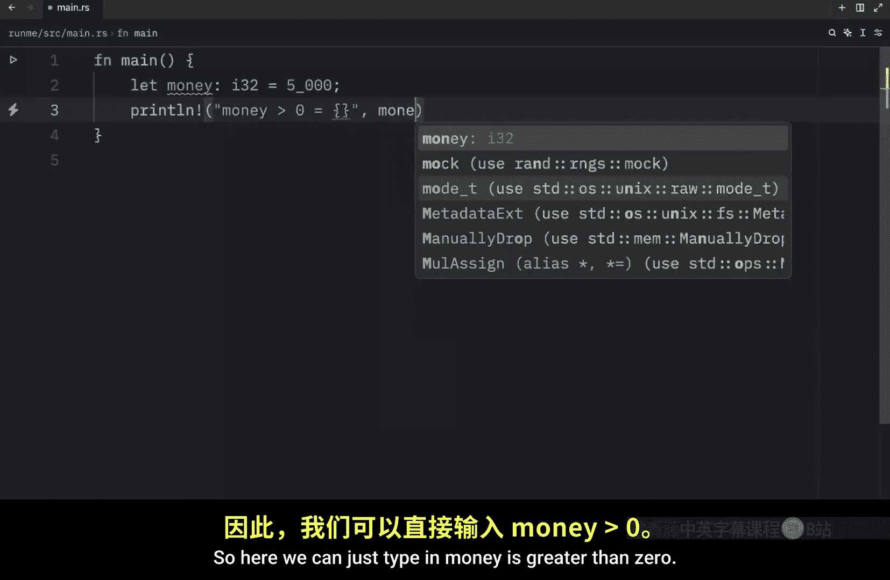
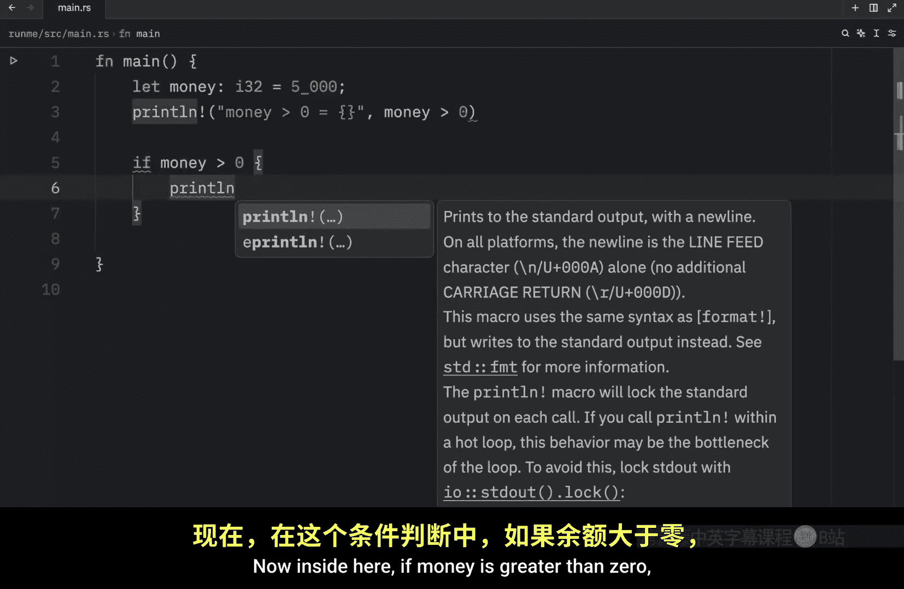
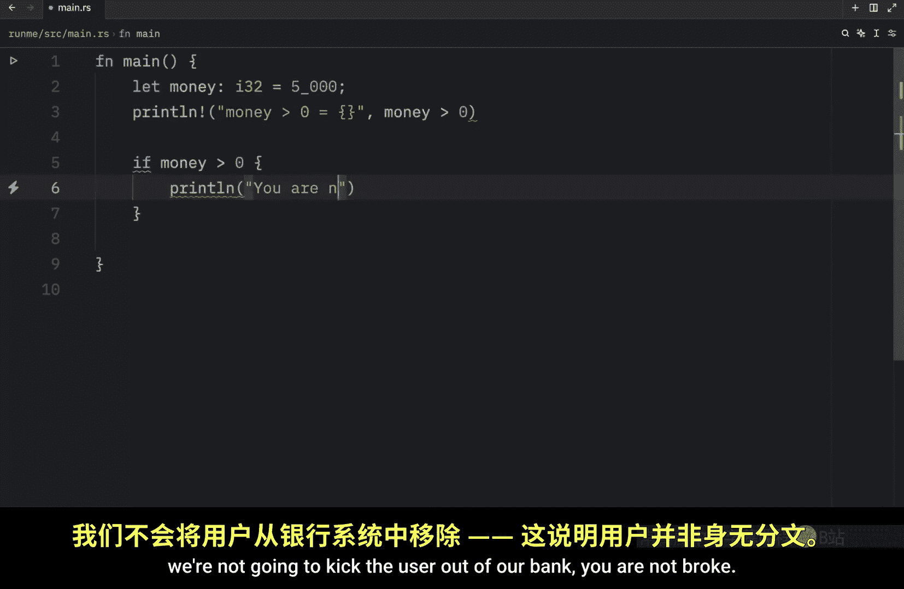
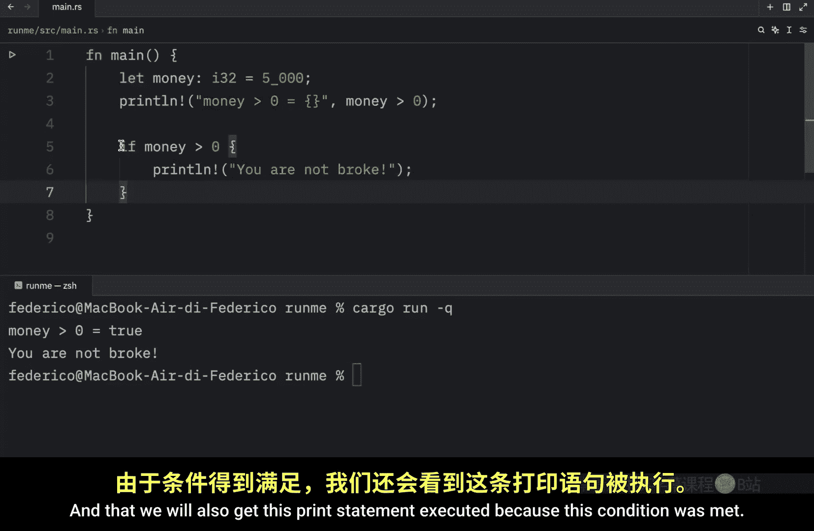
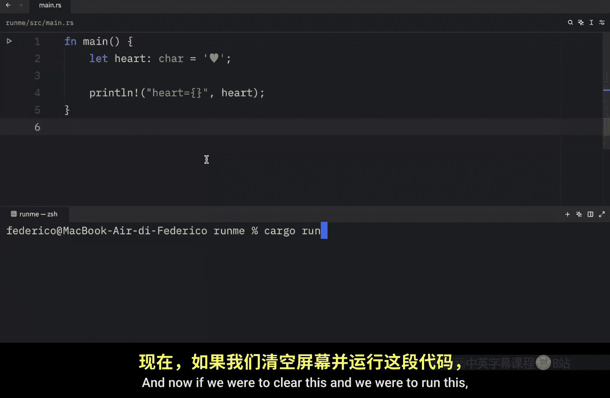

# 009：详解布尔类型与字符类型 🔤

在本节课中，我们将学习 Rust 中两种常用的基本数据类型：**布尔类型**和**字符类型**。布尔类型用于表示逻辑上的真与假，而字符类型用于表示单个 Unicode 字符。掌握它们是编写具有逻辑判断和文本处理能力程序的基础。

## 布尔类型：真与假

布尔类型是编程中最基础的数据类型之一，它只有两个可能的值：`true`（真）和 `false`（假）。在 Rust 中，其类型标注为 `bool`。




以下是定义布尔变量的示例：

```rust
let connected_to_internet: bool = false; // 表示没有有效的网络连接
let has_cat: bool = true; // 表示用户有一只猫
```

我们可以使用 `println!` 宏将这些值打印到控制台进行查看。

布尔类型最常见的用途之一是配合 `if` 语句进行条件判断。例如，我们可以检查一个表示金额的变量是否大于零：

```rust
let money: i32 = 5000;
println!("Money is greater than zero: {}", money > 0); // 输出：true
```

表达式 `money > 0` 会进行比较运算，并返回一个布尔值结果。因为 5000 大于 0，所以结果为 `true`。







这种特性使得我们可以在程序中引入逻辑。想象一个银行程序，需要检查用户是否有余额：




```rust
if money > 0 {
    println!("You are not broke.");
}
```

只有当 `money > 0` 这个条件为 `true` 时，花括号 `{}` 内的代码块才会被执行。这就是利用布尔值控制程序流程的基本方式。

## 字符类型：单个 Unicode 字符

在学习了布尔类型之后，我们来看看 Rust 中的字符类型。字符类型用于存储单个字符，其类型标注为 `char`。在 Rust 中，字符使用**单引号** `'` 来定义。

以下是定义字符变量的示例：



```rust
let letter: char = 'Z';
let omega: char = 'Ω';
let heart: char = '❤';
```







即使不显式标注类型，Rust 也能通过单引号识别出这是一个 `char` 类型。但需要注意的是，`char` 类型**只能包含一个字符**。尝试放入多个字符（如 `'AB'`）将导致编译错误。

我们可以轻松地打印出字符：

```rust
println!("{}", heart); // 输出：❤
```

字符类型支持包括 ASCII 和 Unicode 在内的各种字符，这使得 Rust 能够处理全球多语言的文本。

## 总结

本节课我们一起学习了 Rust 中的两种基本数据类型。


*   **布尔类型 (`bool`)**：表示逻辑值，只有 `true` 和 `false` 两种状态。它是程序中进行条件判断和逻辑控制的核心。
*   **字符类型 (`char`)**：表示单个 Unicode 字符，使用单引号 `'` 定义。它是构建字符串和处理文本的基础单元。





理解并熟练使用这两种类型，是迈向编写更复杂、更智能的 Rust 程序的重要一步。在接下来的课程中，我们将开始探讨 Rust 中的复合数据类型。