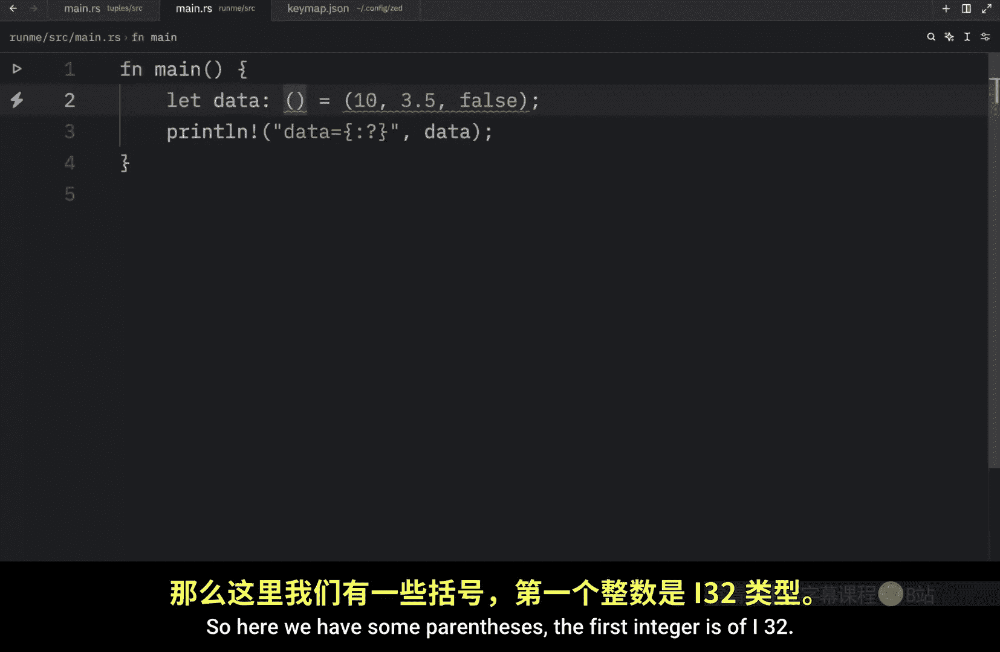
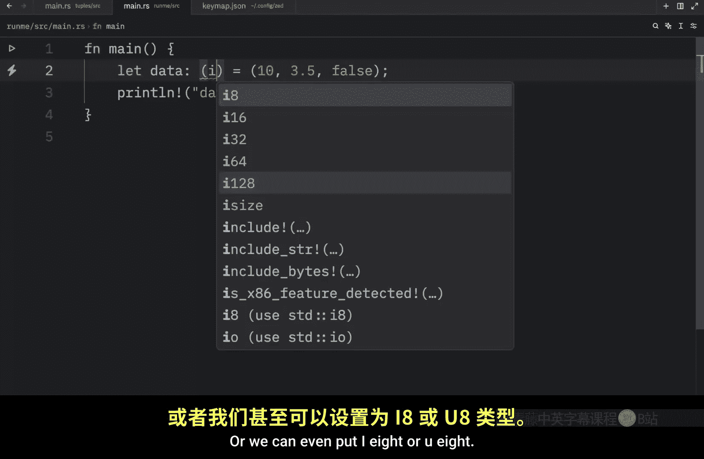
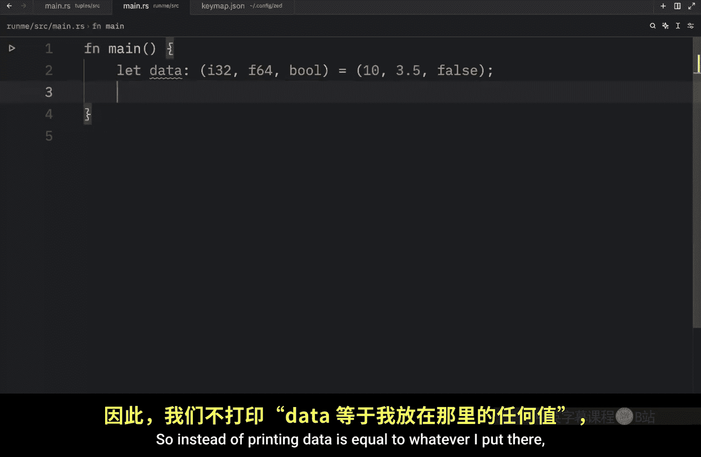
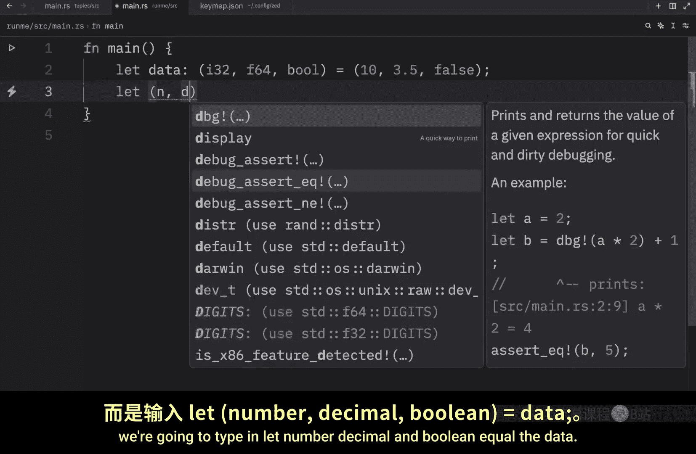
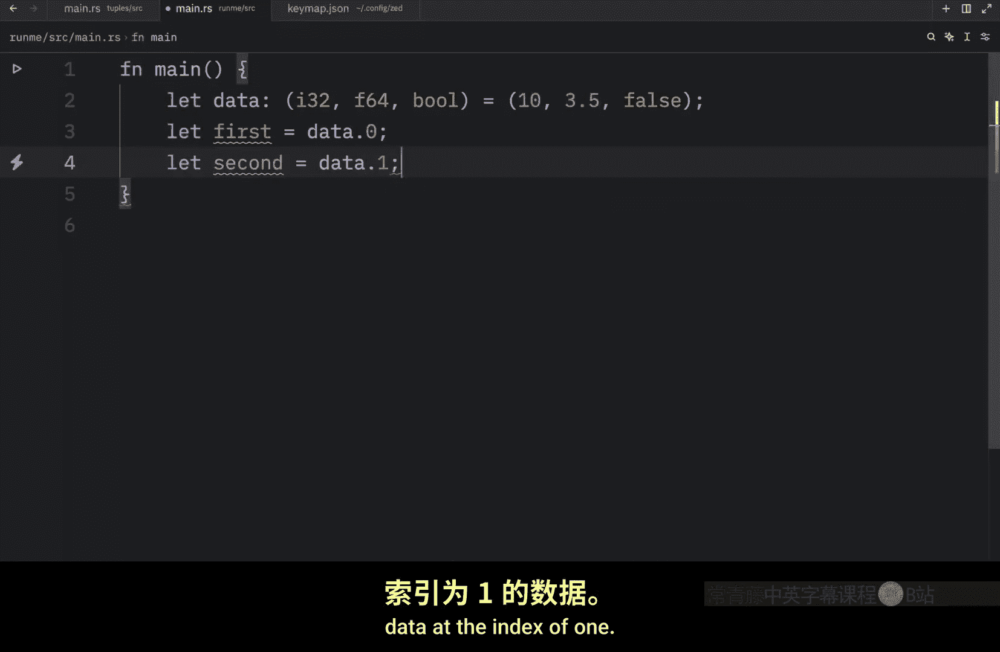
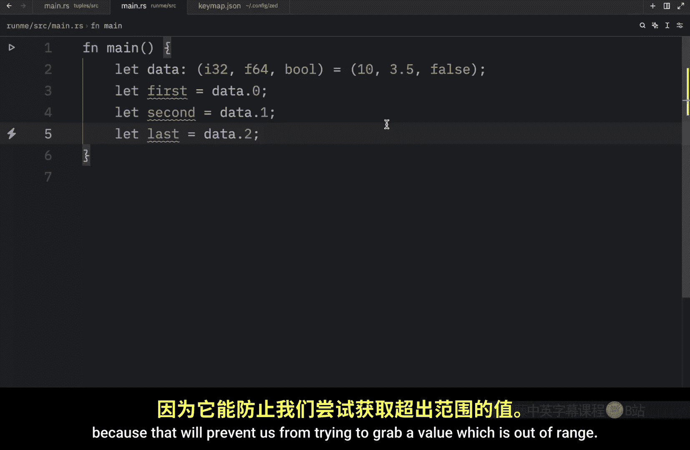
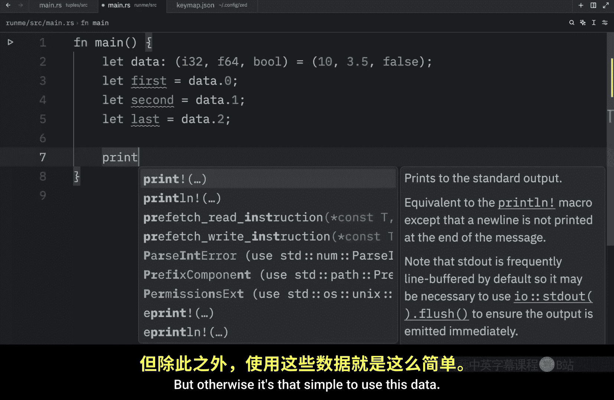
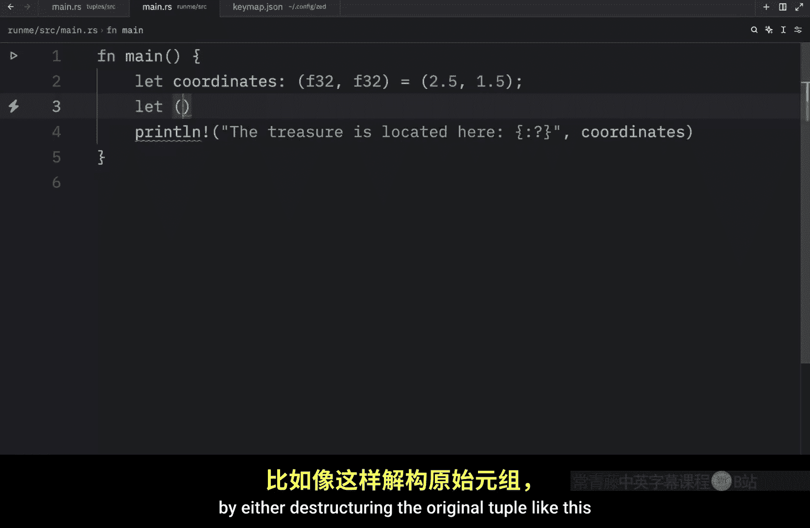
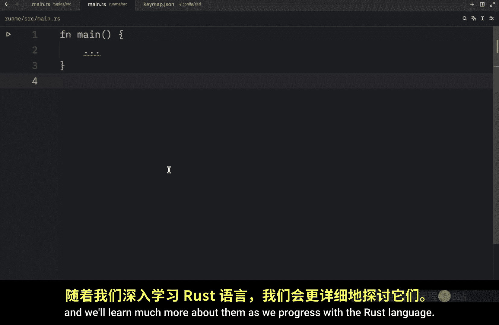

# 010：元组 🧩

在本节课中，我们将要学习 Rust 中的第一个复合数据类型——元组。元组是一种将多个不同类型的值组合成一个复合类型的通用方式。我们将学习如何创建元组、访问其中的数据，并了解一些相关的核心概念。

## 什么是元组？

根据 Rust 官方文档的定义，元组是一种将多个不同类型的值组合成一个复合类型的通用方式。元组具有固定长度，一旦声明，其大小就无法增长或缩小。

## 创建元组

要创建一个元组，我们需要将值放入圆括号 `()` 中，并用逗号 `,` 分隔这些值。元组中的每个位置都有一个类型，并且这些类型不必相同。

以下是创建元组的代码示例：

```rust
let data = (10, 3.5, false);
```

在这个例子中，我们创建了一个名为 `data` 的变量，它包含三个值：一个整数 `10`、一个浮点数 `3.5` 和一个布尔值 `false`。我们满足了创建元组的所有条件：值被圆括号包围，用逗号分隔，并且这些值可以是不同类型。

## 打印元组

如果要打印元组，我们必须使用调试模式。这意味着在格式化占位符中需要添加 `:?`。


```rust
println!("data = {:?}", data);
```





运行上述代码，你将看到类似 `data = (10, 3.5, false)` 的输出。

## 类型注解

你也可以为元组提供类型注解。类型注解的写法如下：





```rust
let data: (i32, f32, bool) = (10, 3.5, false);
```

这里，我们明确指定了元组中每个元素的类型：第一个是 `i32` 整数，第二个是 `f32` 浮点数，第三个是 `bool` 布尔值。如果你觉得麻烦，大多数现代代码编辑器允许你悬停在变量上，直接复制推断出的类型。

## 访问元组数据

上一节我们介绍了如何创建元组，本节中我们来看看如何访问其中的数据。有两种主要方法：解构和使用索引。



### 方法一：解构

解构允许我们将元组中的值分别提取到不同的变量中。

```rust
let (number, decimal, boolean) = data;
println!("N: {}, D: {}, B: {}", number, decimal, boolean);
```

运行这段代码，你将能够单独使用 `number`、`decimal` 和 `boolean` 这三个变量。




### 方法二：使用索引




我们也可以通过索引来访问元组中的特定元素。元组的索引从 `0` 开始。

```rust
let first = data.0;   // 访问第一个元素 (10)
let second = data.1;  // 访问第二个元素 (3.5)
let last = data.2;    //访问第三个元素 (false)
println!("第一个元素是 {}", first);
```

大多数现代代码编辑器会提供自动补全，这可以防止我们访问不存在的索引。例如，尝试访问 `data.3` 会导致编译错误，因为我们的元组只有三个元素。

## 元组的实际应用

元组在大多数编程语言中都很常见。一个非常典型的例子是表示坐标。

```rust
let coordinates: (f32, f32) = (2.5, 1.5);
println!("宝藏位于坐标: {:?}", coordinates);
```

你可以像之前一样，通过解构或索引来使用坐标的各个部分：




```rust
// 解构
let (x, y) = coordinates;
// 或使用索引
let x = coordinates.0;
let y = coordinates.1;
```

## 空元组（单元类型）

最后，还有一个重要的概念需要了解：空元组。在 Rust 中，空元组有一个特殊的名称，叫做 **单元（Unit）**，其类型表示为 `()`。

```rust
let empty: () = ();
```

单元类型通常用于表示不返回任何有意义值的表达式，我们会在未来的课程中更深入地探讨它。


## 总结




本节课中我们一起学习了 Rust 中的元组。我们了解了元组是一个固定长度、可以容纳不同类型值的复合数据类型。我们掌握了使用 `(value1, value2, ...)` 的语法来创建元组，以及通过解构 `let (x, y) = tuple` 或索引 `tuple.0` 来访问其中的数据。我们还看到了元组在表示像坐标这样的数据时的实际应用，并认识了特殊的空元组——单元类型 `()`。元组是 Rust 中组织数据的简单而强大的工具，随着学习的深入，我们还会遇到更多它的用例。