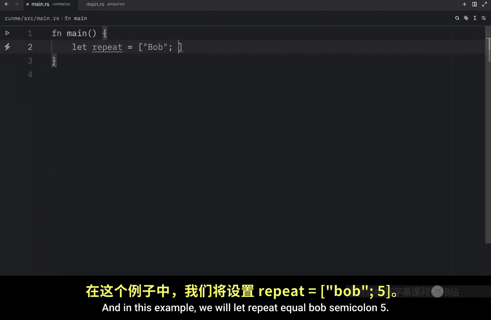
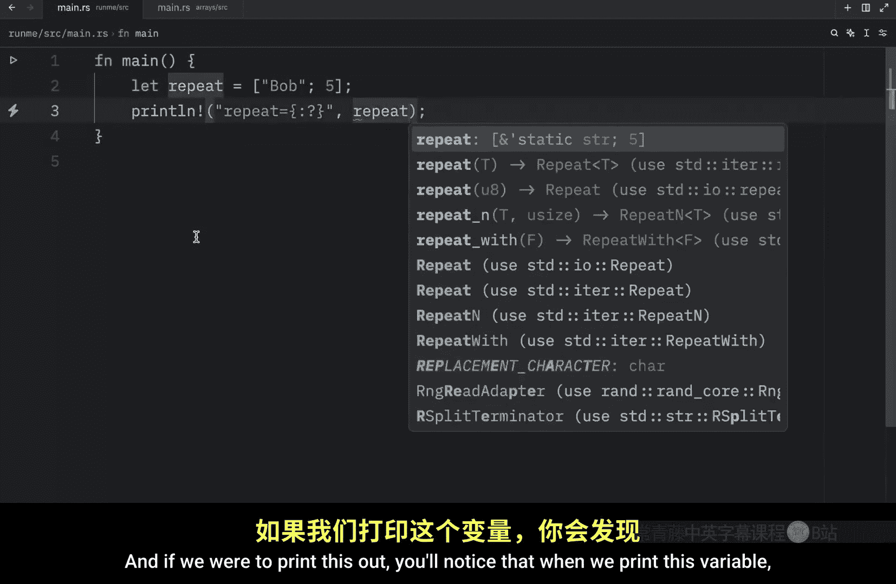
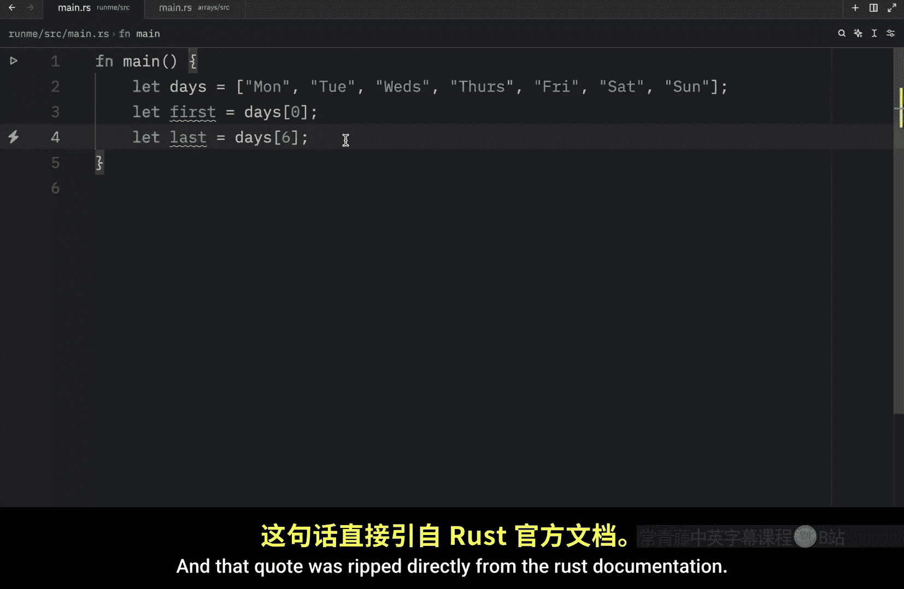
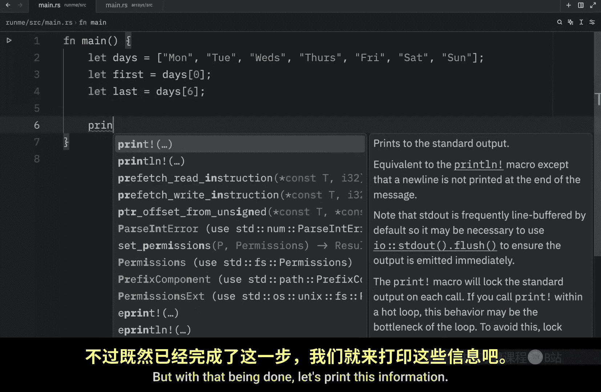
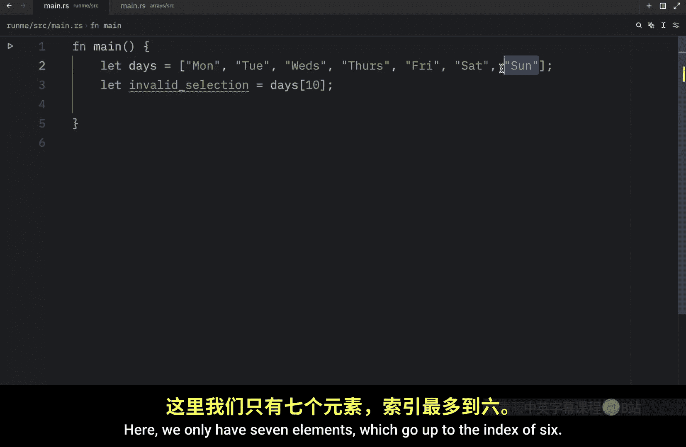

# 011：Rust 中的数组 🧱

在本节课中，我们将要学习 Rust 中的数组类型。数组是一种存储多个相同类型值的集合，并且长度固定。我们将了解如何创建数组、指定其类型、访问其中的元素，以及一些需要注意的常见错误。

## 数组的基本概念

与元组不同，数组中的所有元素必须是**相同类型**。此外，与其他一些语言不同，Rust 中的数组**长度固定**。

创建数组的语法很简单：使用变量名，然后在方括号 `[]` 内用逗号分隔各个值。

```rust
let numbers = [1, 2, 3, 4, 5];
```

上面的代码创建了一个包含五个整型元素的数组。如果尝试在其中插入一个布尔值，代码将无法编译，因为数组要求所有元素类型一致。

数组非常有用，特别是当你希望数据分配在**栈**上，而非**堆**上时。栈和堆是程序执行时用于存储数据的两个不同内存区域，我们将在后续视频中详细讨论这个概念。

当你明确知道元素数量不需要改变时，使用数组是理想的选择。例如，存储一周的天数：

```rust
let days = [“Monday”, “Tuesday”, “Wednesday”, “Thursday”, “Friday”, “Saturday”, “Sunday”];
```

一周总是有七天，不会每周都发明新的一天，因此这是一个使用数组的完美例子。

Rust 还有一种更灵活的数据类型叫做**向量**，它允许你动态地添加和移除元素。我们将在不久的将来学习它。

## 指定数组类型

上一节我们介绍了数组的基本创建方法，本节中我们来看看如何显式地指定数组的类型。

我们可以像这样声明一个数组，明确其元素类型和长度：

```rust
let numbers: [u8; 3] = [1, 2, 3];
```

在这段代码中，`[u8; 3]` 告诉 Rust：我们想要一个包含 `u8` 类型元素的数组，并且该数组的长度为 3。这里的长度必须精确匹配，如果我们尝试放入四个元素 `[1, 2, 3, 4]`，就会导致编译错误。

## 数组的初始化语法





除了逐个列出元素，Rust 还提供了一种便捷的语法来创建所有元素值都相同的数组。

以下是其语法格式：

```rust
let repeat = [“Bob”; 5];
```

这行代码会创建一个包含五个字符串 “Bob” 的数组。你可以将数字 `5` 替换为任何你想要的重复次数。

## 访问数组元素

现在我们已经知道如何创建数组，接下来看看如何访问其中的数据。


数组元素通过**索引**来访问，索引从 0 开始。例如，对于存储星期的数组：





```rust
let days = [“Monday”, “Tuesday”, “Wednesday”, “Thursday”, “Friday”, “Saturday”, “Sunday”];
let first_day = days[0]; // 访问第一个元素
let last_day = days[6];  // 访问最后一个元素
println!(“First day: {}, Last day: {}”, first_day, last_day);
// 输出：First day: Monday, Last day: Sunday
```

之所以能这样索引，是因为数组是**一块已知固定大小的连续内存**，可以分配在栈上。

## 需要注意的错误

访问数组时，一个需要特别注意的问题是：**索引越界**。

如果你尝试访问一个不存在的索引，程序将会在运行时崩溃。例如：

```rust
let invalid_selection = days[10]; // 错误！数组只有 7 个元素，索引范围是 0 到 6。
```

这种情况在实际编程中可能更常见，例如，当程序允许用户选择一个选项，而用户可能选择了超出范围的选项时。在后续课程中，我们将学习如何恰当地处理这类错误。




本节课中我们一起学习了 Rust 数组的核心知识：数组是固定长度、同类型元素的集合；我们学会了如何创建数组、指定其类型、使用便捷语法初始化，以及如何通过索引安全地访问元素。同时，我们也了解了索引越界这一常见错误。掌握数组是理解 Rust 数据存储的基础，下一节我们将探索更灵活的动态集合——向量。