# 013：升级你的Rust函数 🚀

在本节课中，我们将学习如何在 Rust 函数中使用参数和返回类型。这两项功能将极大地增强我们函数的能力和灵活性。

## 概述

我们将通过创建几个示例函数来掌握参数和返回值的用法。首先，我们将创建一个可以向任意指定名字问好的函数。接着，我们会学习如何定义多个参数。最后，我们将重点介绍如何让函数返回一个值，并探索几种不同的返回值写法。

---

## 使用参数


上一节我们介绍了函数的基本结构，本节中我们来看看如何让函数接收外部输入，即参数。


参数允许我们向函数传递数据，使得同一个函数可以处理不同的输入，从而大大提高代码的复用性。

以下是创建一个带参数的 `hello` 函数的步骤：

1.  在函数签名 `hello(name: &str)` 中，定义了一个名为 `name` 的参数，其类型为字符串切片 `&str`。
2.  在函数体内，我们可以像使用普通变量一样使用这个 `name` 参数。
3.  调用函数时，在函数名后的括号内传入具体的值（称为“实参”），例如 `hello("Bob")`。

```rust
fn hello(name: &str) {
    println!("Hello {}", name);
}

fn main() {
    hello("Bob");
    hello("James");
}
```

运行此程序，控制台将输出：
```
Hello Bob
Hello James
```
这样，我们无需为每个名字创建单独的函数，极大地提升了代码的复用性。


---

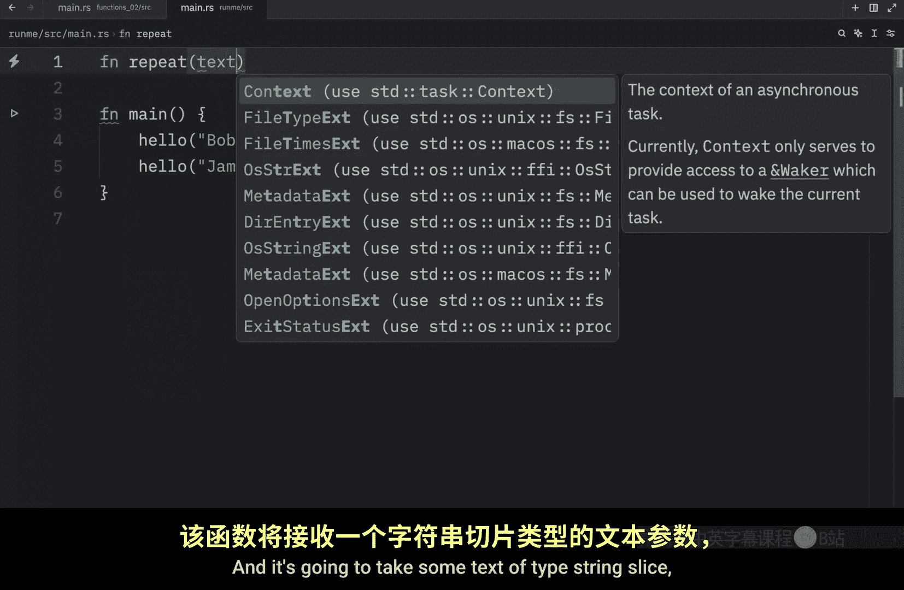

## 多个参数

一个函数不仅可以接收一个参数，还可以接收多个。接下来，我们创建一个 `repeat` 函数，它接受一段文本和重复的次数。

以下是 `repeat` 函数的定义和调用：

1.  函数签名定义为 `repeat(text: &str, times: usize)`，它接收两个参数。
2.  在函数体内，我们使用字符串的 `repeat` 方法来生成重复的文本。
3.  调用时，依次传入文本和次数，例如 `repeat("Bob", 3)`。

```rust
fn repeat(text: &str, times: usize) {
    println!("{}", text.repeat(times));
}

fn main() {
    repeat("Bob", 3);
    repeat("Z", 10);
}
```


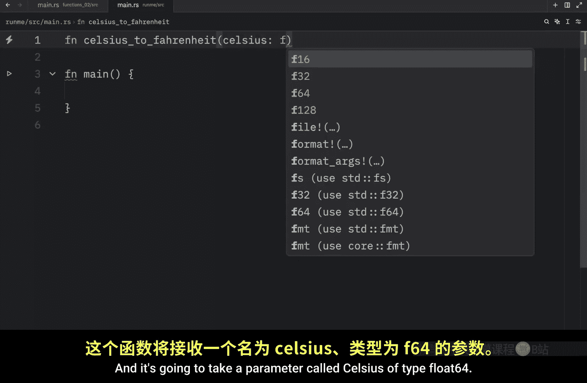

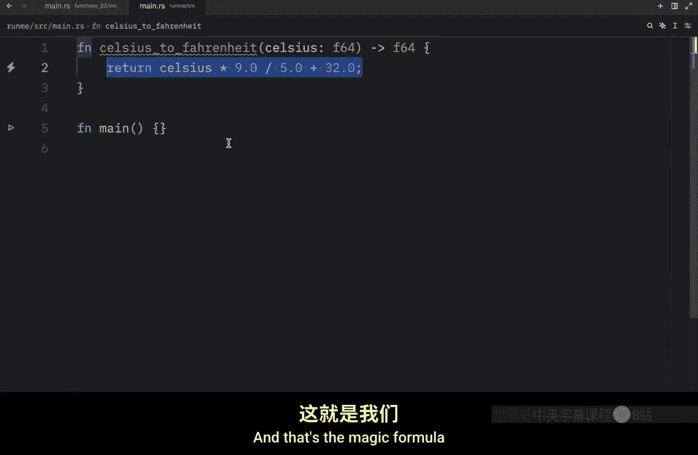

运行后，控制台将输出：
```
BobBobBob
ZZZZZZZZZZ
```

---

## 返回值

到目前为止，我们的函数都只是执行操作。但函数另一个强大的功能是**返回一个值**。例如，我们可以创建一个将摄氏温度转换为华氏温度的函数。

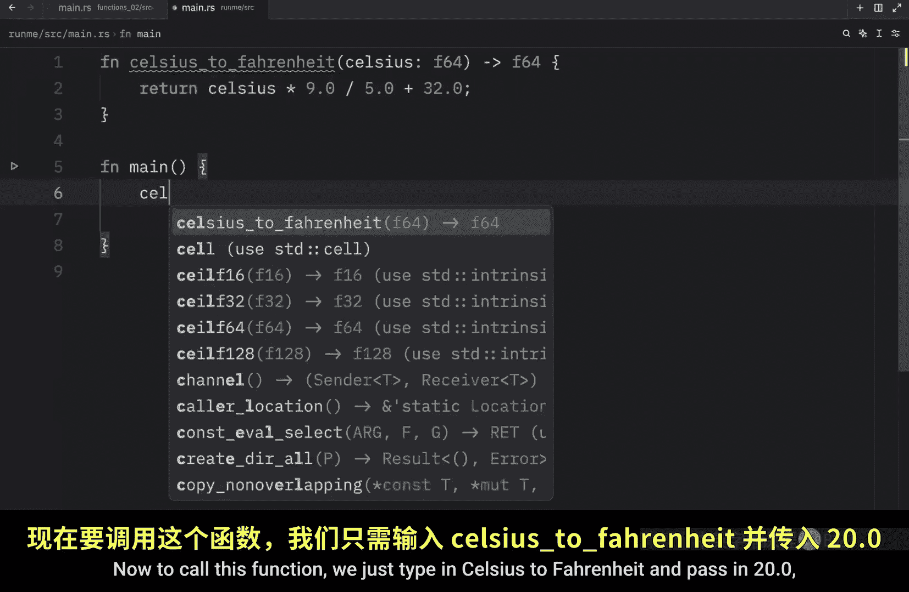

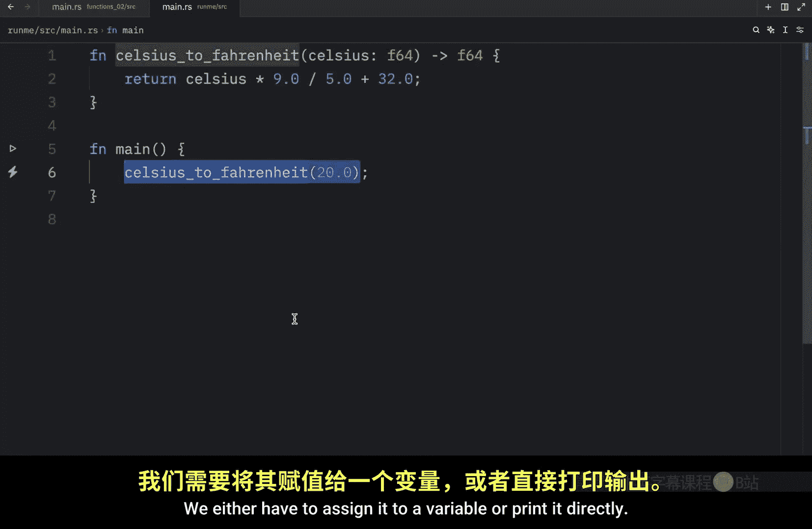

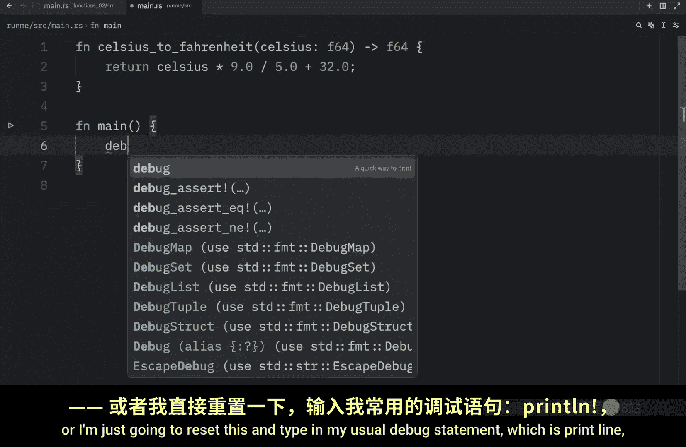

在 Rust 中，如果函数需要返回值，必须在函数签名中使用箭头 `->` 指定返回类型。

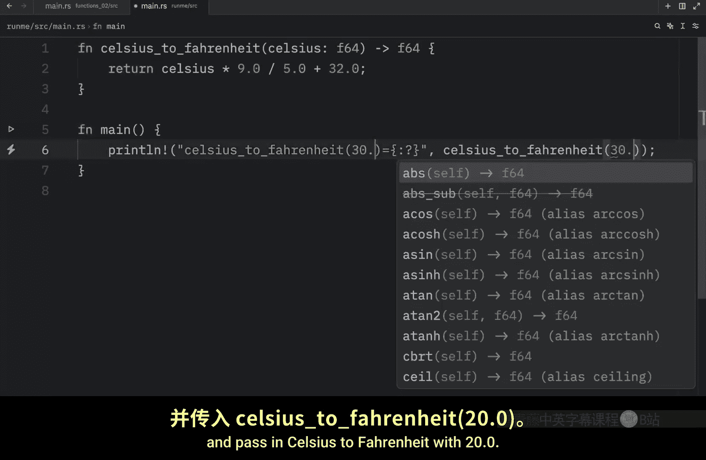

以下是摄氏度转华氏度的函数 `celsius_to_fahrenheit`：

1.  函数签名声明为 `fn celsius_to_fahrenheit(celsius: f64) -> f64`，表示它接收一个 `f64` 类型的参数，并返回一个 `f64` 类型的值。
2.  转换公式为：**`华氏度 = 摄氏度 × 9.0 / 5.0 + 32`**。
3.  因为这个函数有返回值，所以调用时通常需要将其结果赋值给一个变量或直接使用（例如打印）。

```rust
fn celsius_to_fahrenheit(celsius: f64) -> f64 {
    celsius * 9.0 / 5.0 + 32.0
}

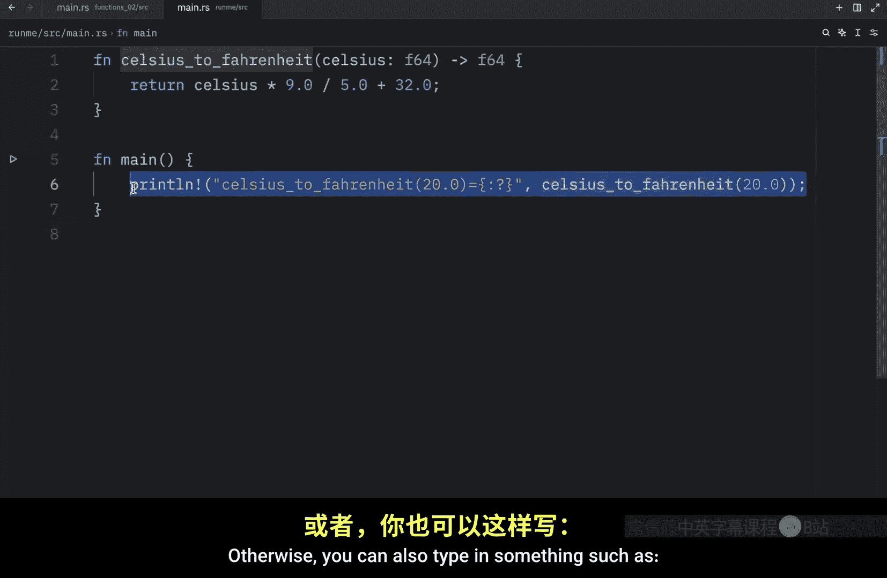

fn main() {
    println!("{}", celsius_to_fahrenheit(20.0)); // 直接打印
    let converted = celsius_to_fahrenheit(10.0); // 赋值给变量
    println!("Converted is {}", converted);
}
```


---

## 返回值的简写语法

在 Rust 中，返回一个值有更简洁的写法。你甚至可以不使用 `return` 关键字和分号。

以下是几种等价的返回值写法：

1.  **显式返回**：使用 `return` 关键字并以分号结尾。这是最明确的写法。
2.  **隐式返回**：如果函数体的最后一行是一个表达式（**没有分号**），Rust 会自动将其作为返回值。这是最常用且简洁的写法。
3.  即使返回值是一个简单的字面量（如数字10），上述规则同样适用。

```rust
// 方法1：使用 return 关键字
fn explicit_return() -> i32 {
    return 10;
}

// 方法2：省略 return 和分号（推荐）
fn implicit_return() -> i32 {
    10 // 注意：这一行没有分号
}


fn main() {
    println!("Explicit: {}", explicit_return());
    println!("Implicit: {}", implicit_return());
}
```

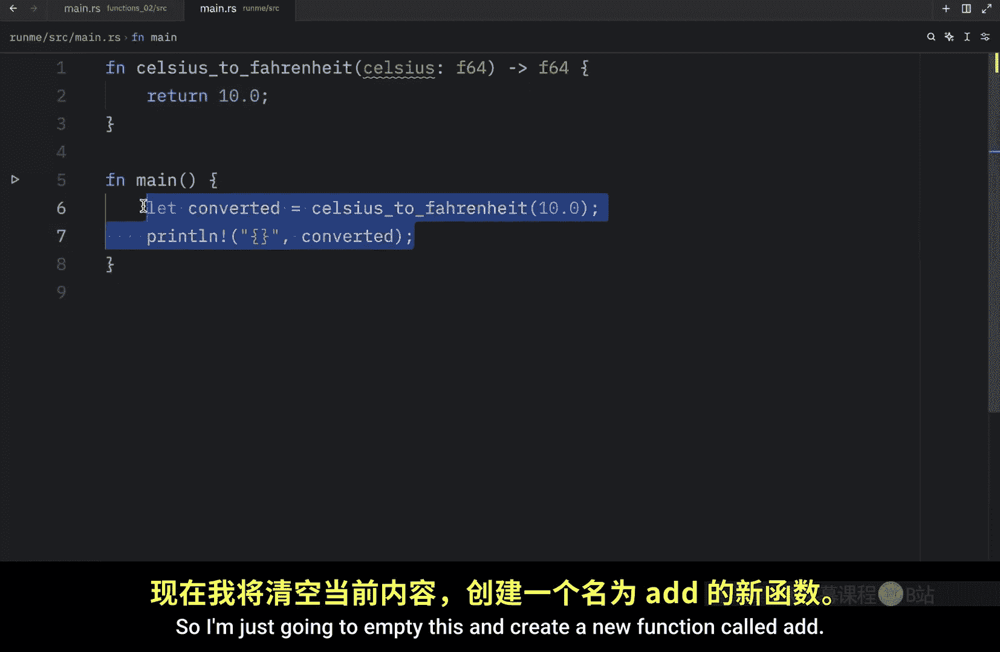


**关键点**：当使用隐式返回时，最后一行代码**不能**有分号 `;`，因为分号会将表达式转换为语句，而语句没有值。

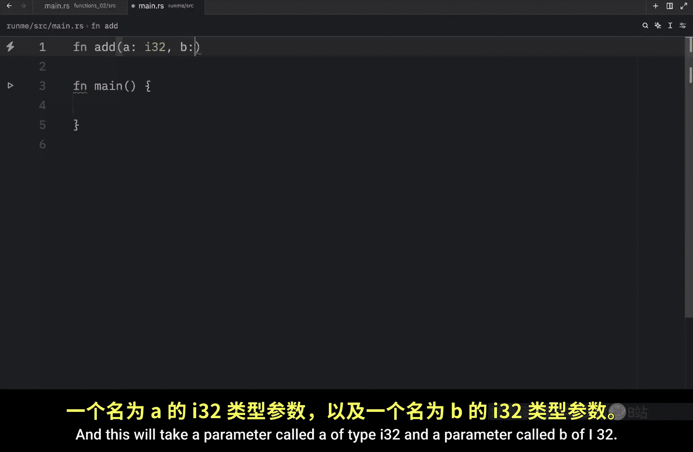

---

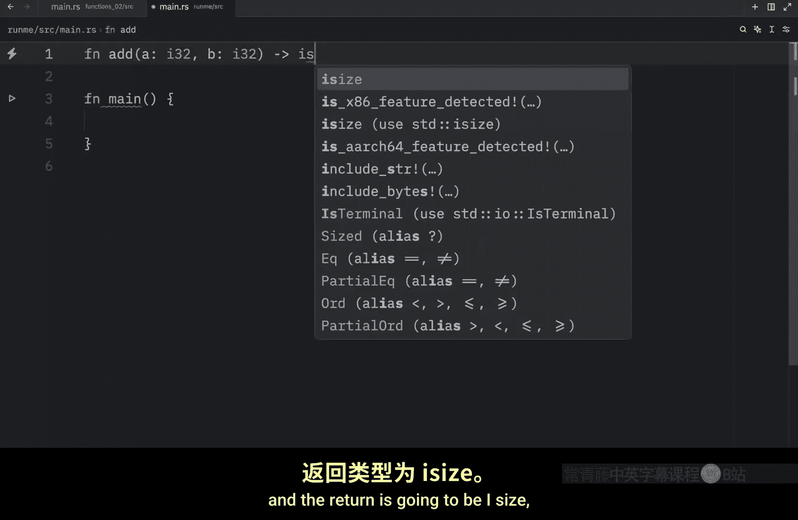

## 综合示例：加法函数

让我们结合参数和返回值，创建一个完整的 `add` 函数。

以下是 `add` 函数的实现：

1.  函数签名 `fn add(a: i32, b: i32) -> i32` 声明它接收两个 `i32` 整数，并返回一个 `i32` 整数。
2.  函数体内可以先执行一些操作（例如打印日志），最后一行 `a + b` 作为表达式隐式返回结果。
3.  调用函数后，可以使用 `dbg!` 宏来方便地调试和输出结果。

```rust
fn add(a: i32, b: i32) -> i32 {
    println!("Adding {} and {}", a, b);
    a + b // 隐式返回相加的结果
}

fn main() {
    let result = add(10, 20);
    dbg!(result); // 使用 dbg! 宏输出调试信息
    let another_result = add(50, 20);
    println!("Another result: {}", another_result);
}
```

运行后，你将看到相加的结果被正确计算和输出。通过改变传入的参数，我们可以轻松地复用这个函数进行不同的计算。

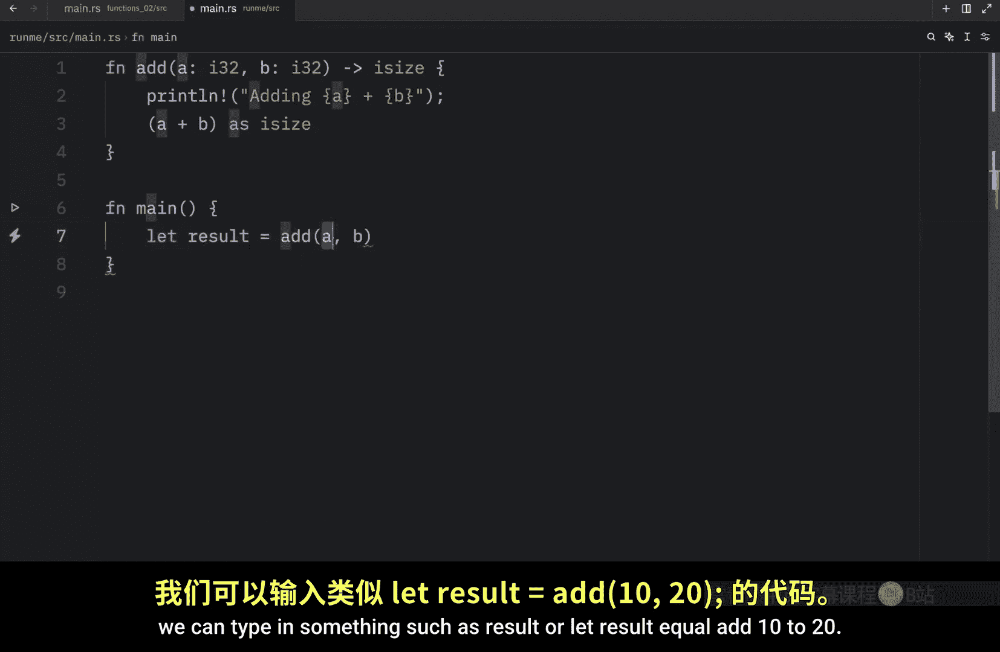

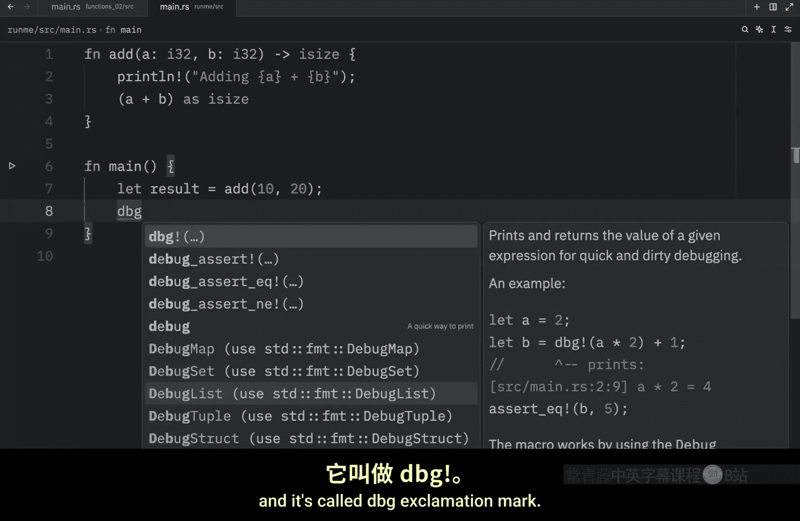

---

## 总结

本节课中我们一起学习了如何升级 Rust 函数：
*   **参数**：通过在函数签名中定义参数，我们可以向函数传递数据，使函数更加通用和可复用。
*   **多个参数**：函数可以接收任意数量的参数，只需在签名中依次列出。
*   **返回值**：使用 `->` 指定返回类型，可以让函数计算结果并返回给调用者。
*   **返回语法**：我们掌握了显式（`return`）和隐式（省略最后一行分号）两种返回值写法，后者更为简洁常用。


掌握参数和返回值是编写模块化、高效 Rust 代码的关键。我们的目标是让函数尽可能可复用，而这两项功能在此过程中提供了巨大的帮助。