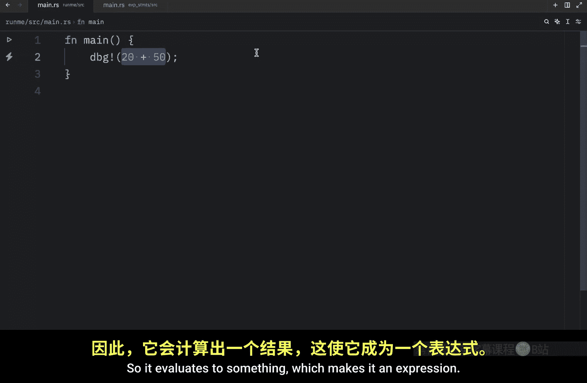
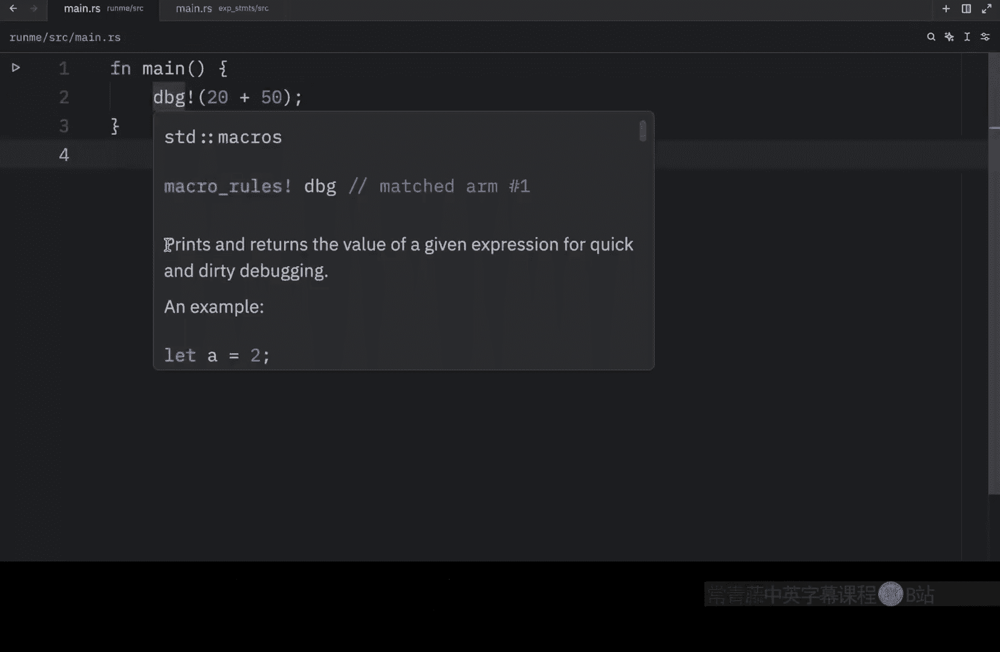
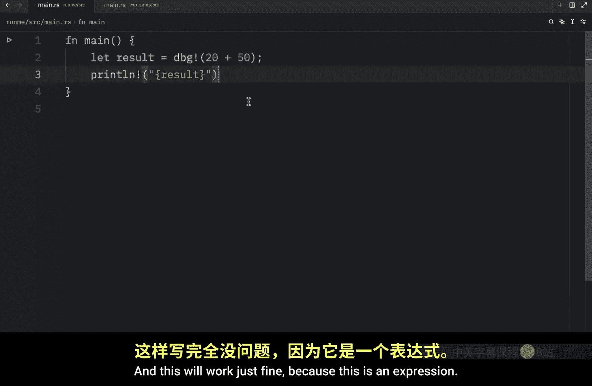
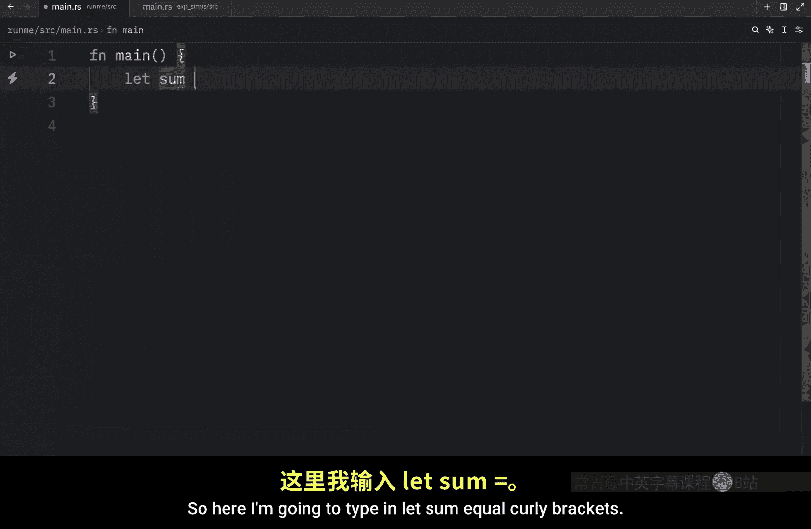
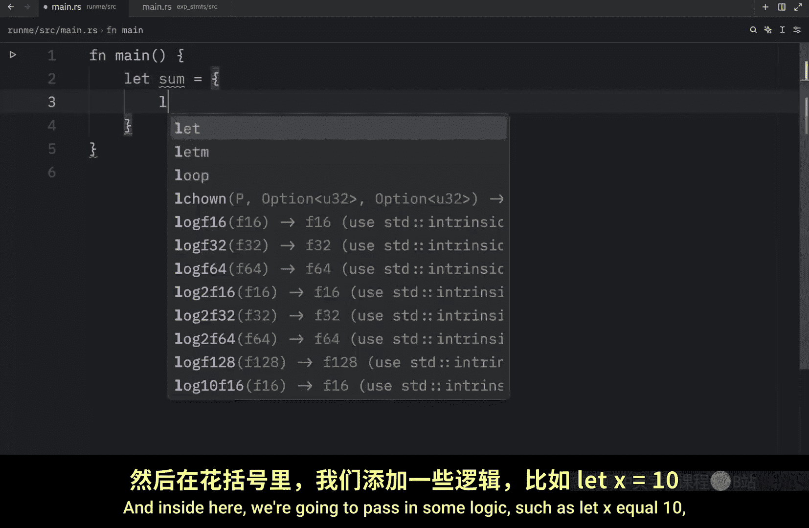

# 014：语句与表达式 📝

在本节课中，我们将要学习 Rust 中两个核心概念：**语句**与**表达式**。理解它们的区别至关重要，因为 Rust 是一门**基于表达式的语言**。我们将首先解释它们的定义，然后通过具体示例来加深理解。

## 概述

语句和表达式是构成 Rust 代码的基本单元。简单来说，**语句执行操作但不返回值**，而**表达式则会计算并产生一个值**。这种区别影响了代码的编写方式，尤其是在变量赋值和函数返回值时。

## 语句：执行但不返回

语句是执行某些动作的代码行，但它本身不产生一个可供使用的值。这意味着你不能将一个语句的结果赋值给变量。

以下是语句的两个例子：

1.  **变量声明**：`let name = "Bob";` 这行代码是一个语句。它执行了将字符串 `"Bob"` 绑定到变量 `name` 的操作，但自身不返回任何值。
2.  **宏调用**：`println!("Hello, {name}");` 这行代码也是一个语句。它执行了打印文本到控制台的操作，同样不返回任何值。



由于语句不返回值，因此不能将它们用作值。例如，在像 C 或 Ruby 这样的语言中，`let a = (let b = 10);` 可能是有效的，因为赋值操作会返回值。但在 Rust 中，这是无效的，因为 `let b = 10;` 是一个语句，不返回值，所以不能被赋值给变量 `a`。

## 表达式：计算并返回值




表达式是代码中会计算（求值）并产生一个结果的片段。这个结果值可以被使用，例如赋值给变量或传递给函数。

让我们来看几个表达式的例子：








1.  **算术运算**：`10 + 20` 是一个表达式，它计算并返回值 `30`。因此，`let result = 10 + 20;` 是有效的，整个 `let` 声明是语句，但 `10 + 20` 这部分是表达式。
2.  **`dbg!` 宏**：`dbg!(20 + 50)` 会打印调试信息并返回括号内表达式的值（即 `70`）。因为它返回值，所以它本身也可以作为表达式使用。例如：
    ```rust
    let result = dbg!(20 + 50); // dbg! 作为表达式，返回值 70 并赋给 result
    println!("{result}"); // 输出: 70
    ```
3.  **代码块**：在 Rust 中，用花括号 `{}` 包裹的代码块本身就是一个表达式，它会返回块中最后一个表达式的值（注意不能有分号）。
    ```rust
    let sum = {
        let x = 10;
        let y = 20;
        x + y // 注意这里没有分号，这是一个表达式，返回值 30
    };
    dbg!(sum); // 输出: [src/main.rs:2] sum = 30
    ```
    在上面的代码块中，`let x = 10;` 和 `let y = 20;` 是语句，而 `x + y` 是表达式，它的值 `30` 成为整个代码块的值，并被赋值给变量 `sum`。

## 总结


本节课我们一起学习了 Rust 中语句与表达式的核心区别。

*   **语句**：执行操作，**不返回值**。例如变量声明 (`let`)、表达式后加分号、以及某些宏调用。
*   **表达式**：进行计算，**总会产生一个值**。例如字面量、算术运算、函数调用、宏调用（如 `dbg!`）以及代码块。


牢记 `Rust 是基于表达式的语言`，这意味着很多结构（如 `if`、`match`、函数体）本身都是表达式，可以返回值。理解这一点对于编写地道的 Rust 代码和阅读文档至关重要。