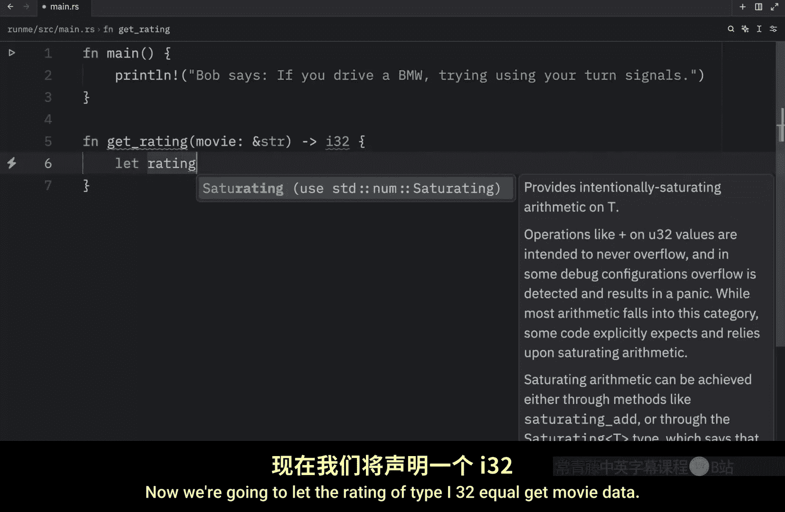
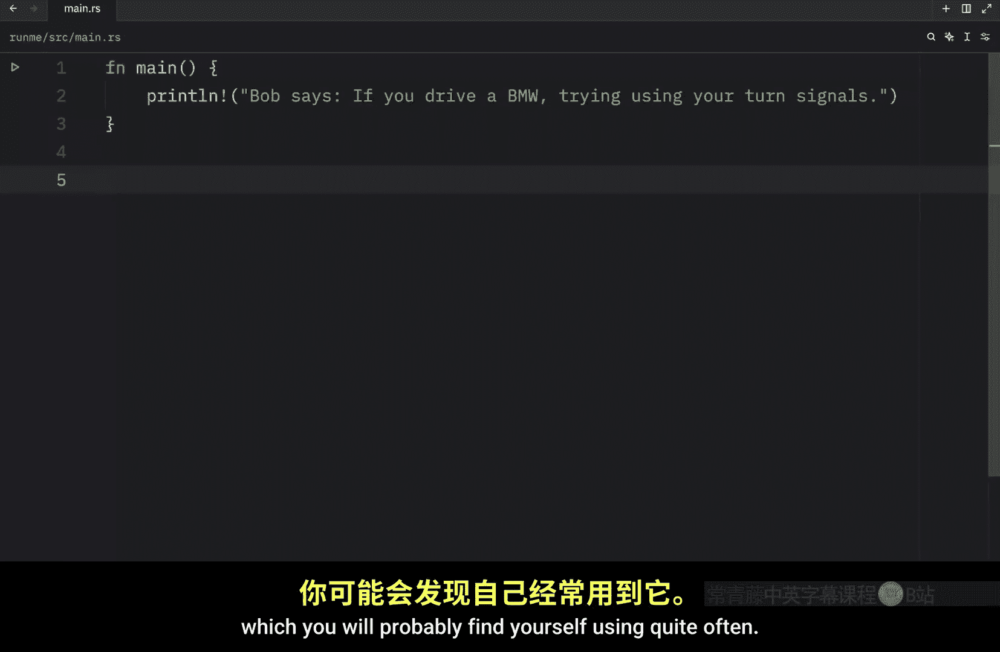
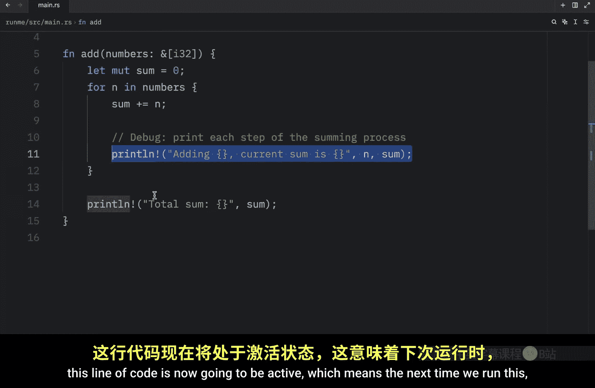
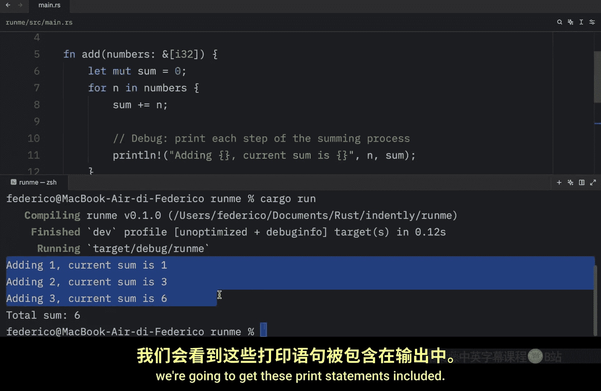
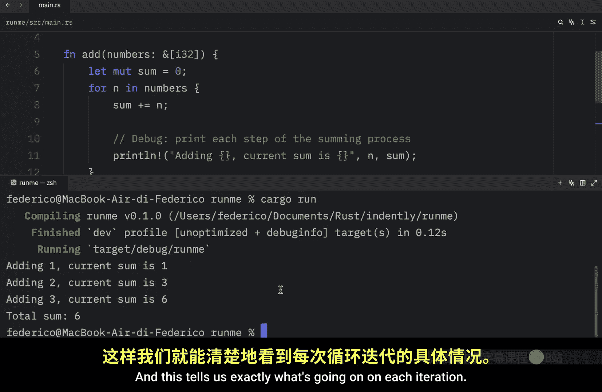
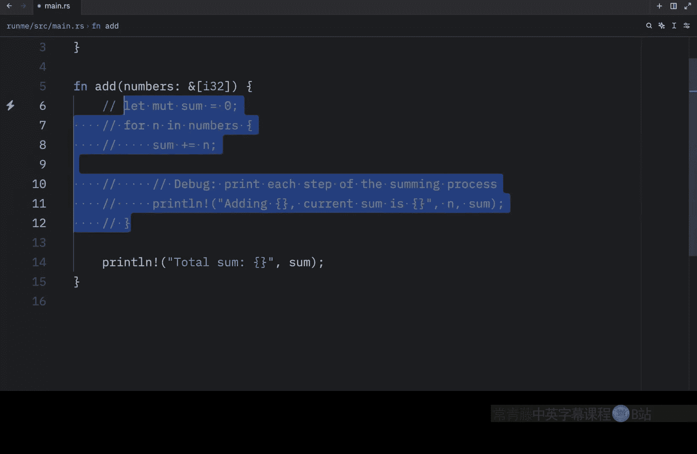
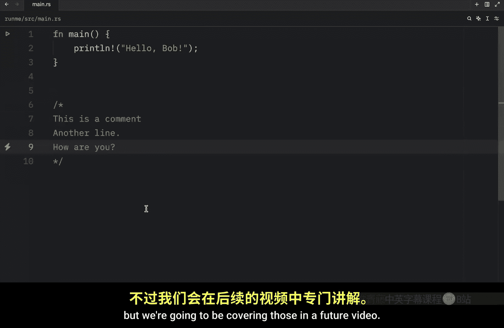

# 015：在 Rust 中添加注释 🗒️

在本节课中，我们将要学习如何在 Rust 代码中添加注释。注释是用于解释代码、提供额外上下文或临时禁用代码行的文本，它们会被编译器忽略，但对开发者理解代码至关重要。

## 为什么需要注释

有时编写的代码需要一些额外的背景信息，提供这些信息的最佳方式就是使用简短的注释。你可能会听到“好的代码不需要注释”这种说法，在理想情况下这或许成立。但在现实中，完美的代码并不常见。因为对许多开发者而言，按时完成任务通常比确保一切都遵循完美的命名规范或旧代码遵循最佳实践更重要。因此，简短的注释会非常有用。

## 注释的实用示例


上一节我们介绍了注释的基本作用，本节中我们来看看具体的应用场景。



### 为函数提供上下文

假设我们有一个名为 `get_rating` 的函数。它的作用是接收一个 `&str` 类型的电影名，并返回该电影的评分。这里我们返回 `i32` 类型，它也很容易是 `i8` 或 `u8`。

以下是示例代码：

```rust
let rating: i32 = get_movie_data(movie);
return rating;
```

这个函数在我们的代码中尚不存在。我们需要在 `get_movie_data` 函数下快速创建它。该函数接收一个 `&str` 类型的电影名，并返回 `i32`。作为虚拟数据，我们返回 10。


```rust
fn get_movie_data(movie: &str) -> i32 {
    // 这是一个用于测试的虚拟函数
    10
}
```

仅看代码本身，其意义并不明确。因此，在这些上下文中添加一些注释会很有用。

以下是几种有用的注释类型：

*   **功能说明**：例如，“这是一个用于测试的虚拟函数”。这是一个完全可以接受的注释。
*   **外部资源链接**：我们可以在函数上方添加注释，说明它使用了某个电影 API 并链接到文档。例如：
    ```rust
    // 使用 Bob 的电影评分 API，文档：https://www.bobs-movie-ratings.co/docs
    fn get_rating(movie: &str) -> i32 {
        // ... 函数实现
    }
    ```
    这个注释对于函数运行并非必需，但它为查看此代码的人提供了关于函数的额外背景信息。如果他们想编辑此函数，可能需要研究这个 API。多亏了这个注释，他们可以直接复制这个 URL 并粘贴到浏览器中，这将帮助他们理解这个电影 API 的实际工作方式。

### 为学习做笔记

第二个例子是创建快速笔记。例如，在 `main` 函数顶部，我们可以输入：




```rust
// 这是我们的主程序入口点
fn main() {
    // ... 代码
}
```

这对于做笔记特别有用，尤其是如果你是编程新手，到处添加注释可以让你更容易记住某些代码的作用。在专业的代码库中，你可能会希望省略这个注释，因为 `main` 函数作为主入口点是众所周知的，无需额外说明。但如果你是 Rust 或编程新手，到处注释会非常有用。

## 调试时注释代码


注释实际上还有另一个你会经常用到的场景。为了演示，我将粘贴以下代码片段：

```rust
fn add_numbers() {
    let numbers = vec![1, 2, 3];
    let mut sum = 0;
    for num in numbers {
        sum += num;
        // println!("当前数字: {}, 当前总和: {}", num, sum); // 调试时启用
    }
    println!("总和: {}", sum);
}
```

这个函数计算总和，然后对我们函数中的每个整数，将其加到总和中并打印总结果。你可能已经注意到，里面有一段被注释掉的代码。这是因为我只想在调试这个函数时使用这段代码。

例如，现在如果我们运行这段代码（通过 `cargo run`），你会看到我们得到的总和是 6，因为它执行了那个操作。但有时事情不会按计划进行，循环中可能会发生一些奇怪的事情。

因此，我可以快速取消这行代码的注释。如你所见，这行代码现在将变为活动状态，这意味着下次我们运行时，调用函数时将包含这些打印语句。这告诉我们每次迭代时到底发生了什么。

如果你想测试一行代码，可以快速将其注释掉，然后再取消注释。每个代码编辑器都应该有相应的快捷键（例如，在许多编辑器中是 `Ctrl + /` 或 `Cmd + /`）。这在你想要测试替代方法时非常有用，因为如果你必须将代码剪切、保存到某处，然后每次想调试这个函数时再粘贴回来，很快就会变得非常麻烦。


## 多行注释




最后，今天我还想讨论另一种注释类型：多行注释。要创建它，只需输入 `/*` 和 `*/`，这将打开一个多行注释块，允许你在这个封闭的空间内自由输入。







```rust
/*
这是一个注释。
作者：Bo
x = x + 1 或 1 + 1
*/
```

你可以在这里自由书写任何内容，Rust 在编译代码时会忽略它。

或者，大多数代码编辑器在你每次按回车键时，都会用 `//` 开始一个新行，因此你可能并不总是需要使用多行注释。在许多代码库中，你只会看到使用 `//`。

```rust
// 这是一个注释
// 另一行
// 你好吗？
```

如你所见，每次我按回车键，它都为我开始了一个新的行注释。我发现这比必须输入 `/*` 和 `*/` 稍微方便一些。但归根结底，请尝试选择你觉得最方便的方式。

还有其他特殊的注释类型（如文档注释 `///` 和 `//!`），我们将在未来的视频中介绍它们。

## 总结




本节课中我们一起学习了在 Rust 中使用注释。我们了解了注释的重要性，它能为代码提供上下文、辅助学习做笔记，以及在调试时临时禁用代码。我们介绍了单行注释 `//` 和多行注释 `/* ... */` 的用法，并讨论了在不同场景下如何选择使用它们。合理使用注释能让代码更易读、更易维护，是每个开发者都应掌握的基本技能。