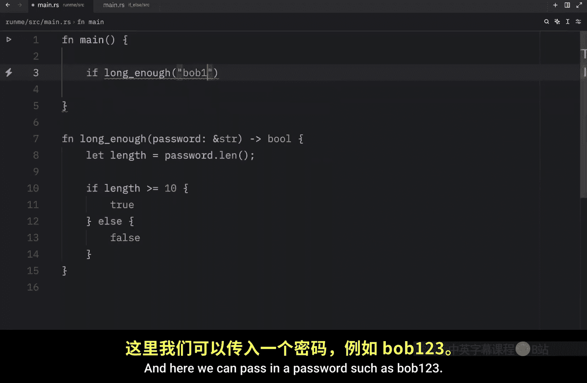
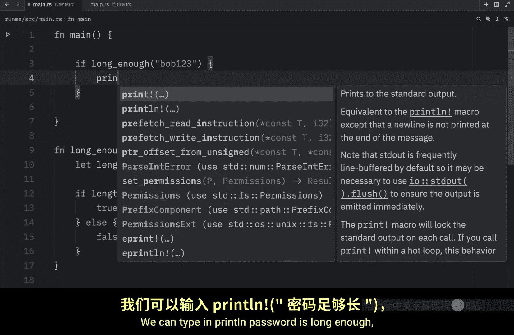
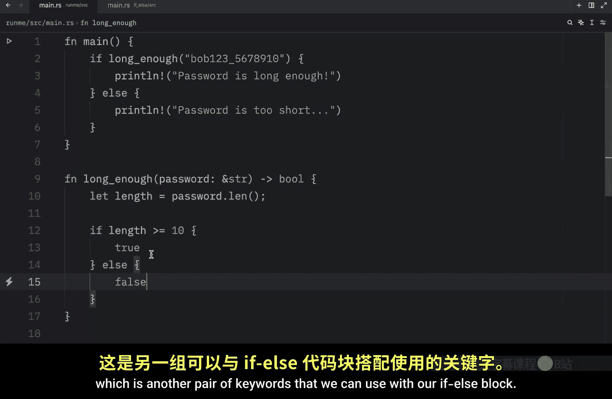

# 016：Rust 中的控制流 - if else 表达式 🧠

在本节课中，我们将学习 Rust 语言中一个最基础且无处不在的概念：`if else` 表达式。它允许你的代码根据特定条件来决定执行哪一部分功能，从而赋予程序更强的逻辑控制能力。

## 概述

`if else` 表达式是编程中进行条件判断的核心工具。通过它，我们可以让程序在不同的情况下做出不同的反应。本节将通过一个密码长度验证的例子，来演示如何在 Rust 中使用 `if else`。

## 使用 `if else` 进行条件判断

想象一个场景：你需要检查用户创建的密码长度，以确保密码足够安全。我们可以创建一个验证函数来实现这个逻辑。

以下是实现此功能的基本步骤：

1.  **定义函数**：创建一个名为 `check_length` 的函数，它接收一个字符串切片（`&str`）类型的密码作为参数。
2.  **获取长度**：使用字符串的 `.len()` 方法获取密码的长度。
3.  **条件判断**：使用 `if` 关键字判断长度是否大于等于 10。
4.  **执行分支**：根据条件判断的结果，执行不同的代码块。

让我们看看具体的代码实现：

```rust
fn check_length(password: &str) {
    let length = password.len();
    if length >= 10 {
        println!("密码足够长。");
    } else {
        println!("密码不够长，请添加更多字符。");
    }
}

fn main() {
    check_length("Bobhasahat123"); // 输出：密码足够长。
    check_length("Bob123");        // 输出：密码不够长，请添加更多字符。
}
```

运行上述代码，程序会根据传入密码的长度打印出不同的提示信息。这展示了 `if else` 如何根据条件 `length >= 10` 的真假，来控制程序执行不同的分支。

## 使用 `if else` 表达式返回值

`if else` 在 Rust 中不仅仅是一个语句，它还是一个**表达式**，这意味着它可以产生一个值。我们可以利用这个特性，让函数直接根据条件返回布尔值。

例如，我们可以重构上面的函数，让它返回一个 `bool` 类型的结果：

```rust
fn long_enough(password: &str) -> bool {
    let length = password.len();
    if length >= 10 {
        true
    } else {
        false
    }
}

fn main() {
    if long_enough("Bob123") {
        println!("密码足够长。");
    } else {
        println!("密码太短。");
    }
}
```

在这个例子中，`long_enough` 函数根据密码长度是否大于等于 10，返回 `true` 或 `false`。然后在 `main` 函数中，我们根据这个返回值再次使用 `if else` 来打印相应的信息。

## 简化条件返回值





对于上面这种直接返回条件判断结果的情况，Rust 提供了一种更简洁的写法。由于条件表达式 `length >= 10` 本身就会求值为 `bool` 类型（`true` 或 `false`），我们可以直接返回它，而无需显式地使用 `if else` 块。

因此，`long_enough` 函数可以简化为一行：

```rust
fn long_enough(password: &str) -> bool {
    password.len() >= 10
}
```

这种写法更加符合 Rust 的惯用风格，代码也更清晰。我们之前展示的完整 `if else` 形式是为了说明其作为表达式返回值的可能性。

## 总结

本节课我们一起学习了 Rust 中 `if else` 表达式的基本用法。我们了解到：

*   `if else` 用于根据条件执行不同的代码路径。
*   在 Rust 中，`if else` 是一个表达式，可以产生值，这使得我们可以写出 `let result = if condition { value1 } else { value2 };` 这样的代码。
*   对于简单的布尔条件判断，可以直接返回条件表达式本身，这是更简洁的写法。



掌握了 `if else`，你就拥有了编写具有逻辑判断能力程序的基础。在下一节中，我们将学习另一个可以与 `if else` 搭配使用的关键字：`else if`，它用于处理多个连续的条件判断。