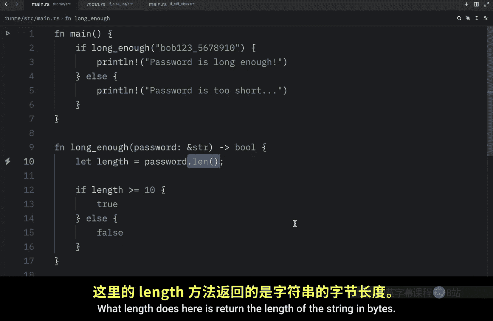
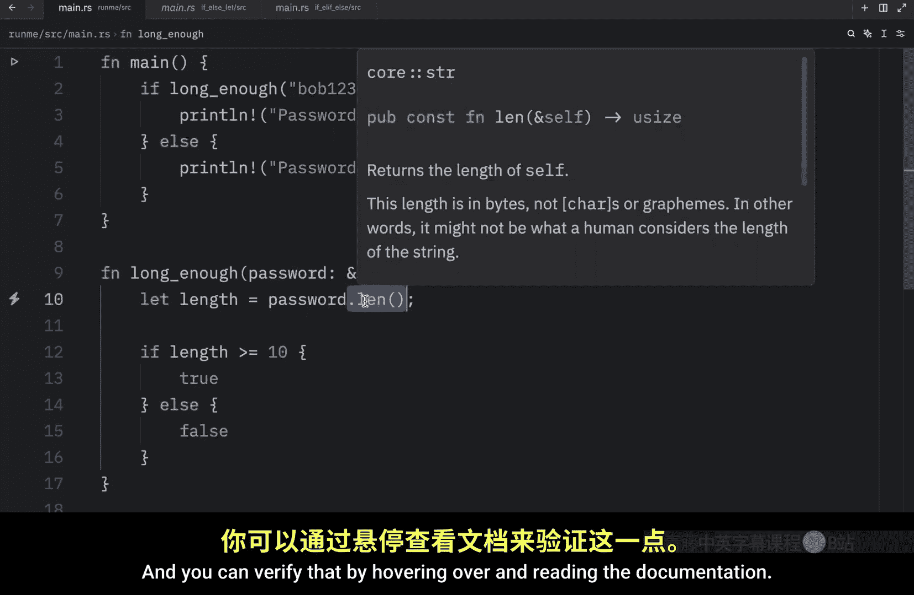
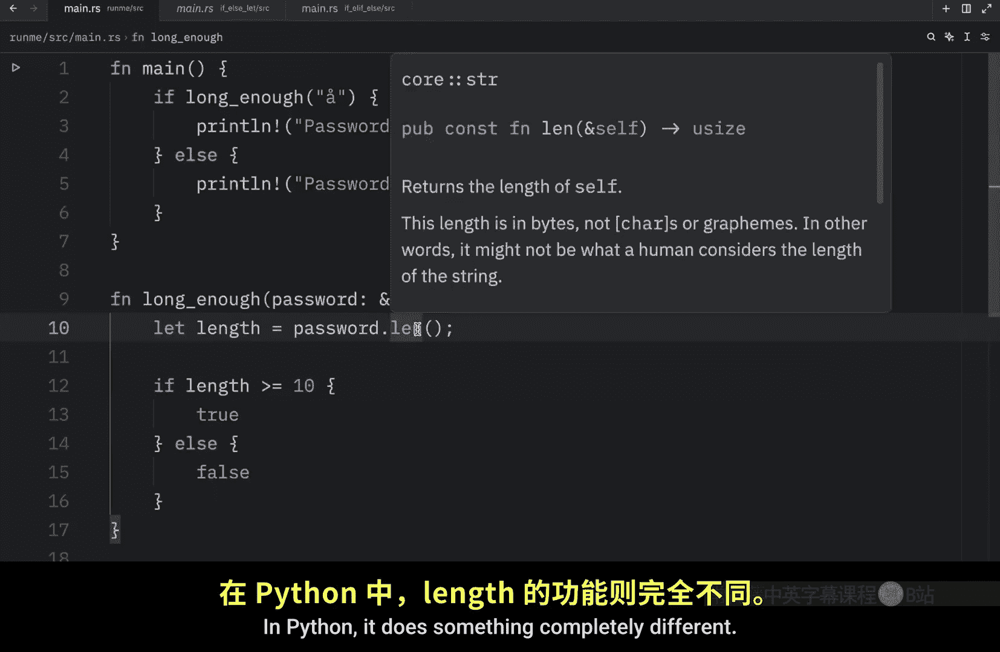
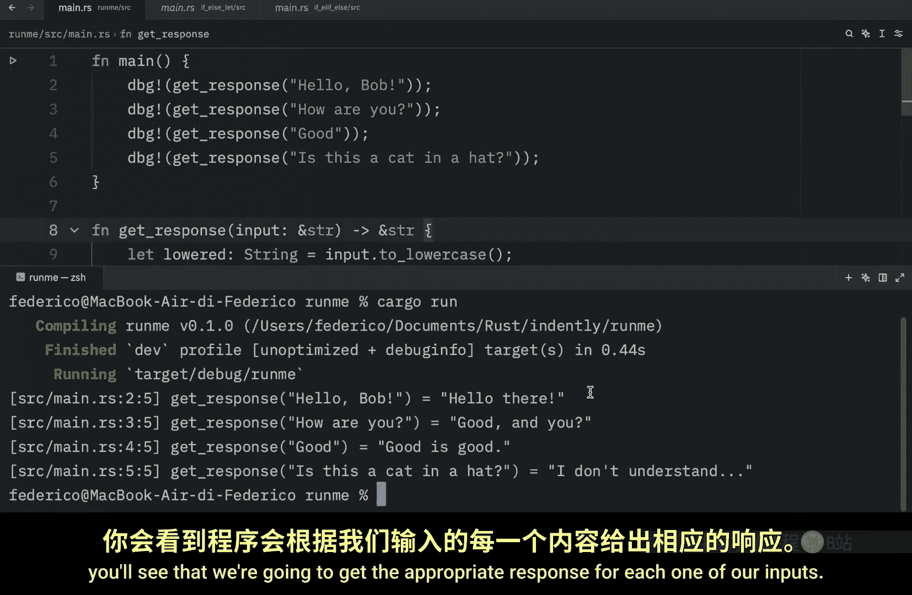
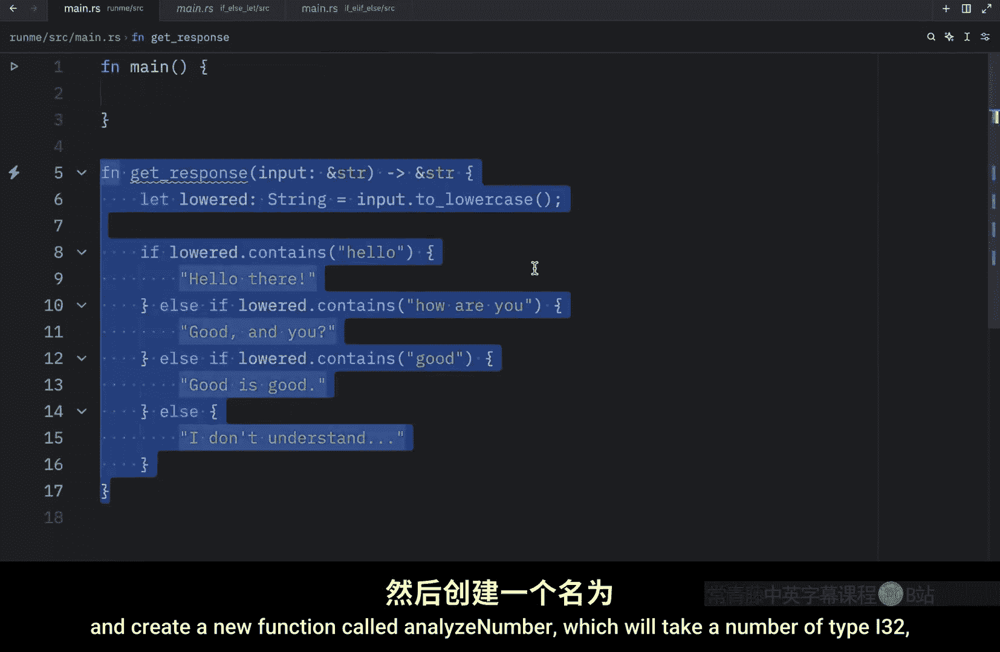
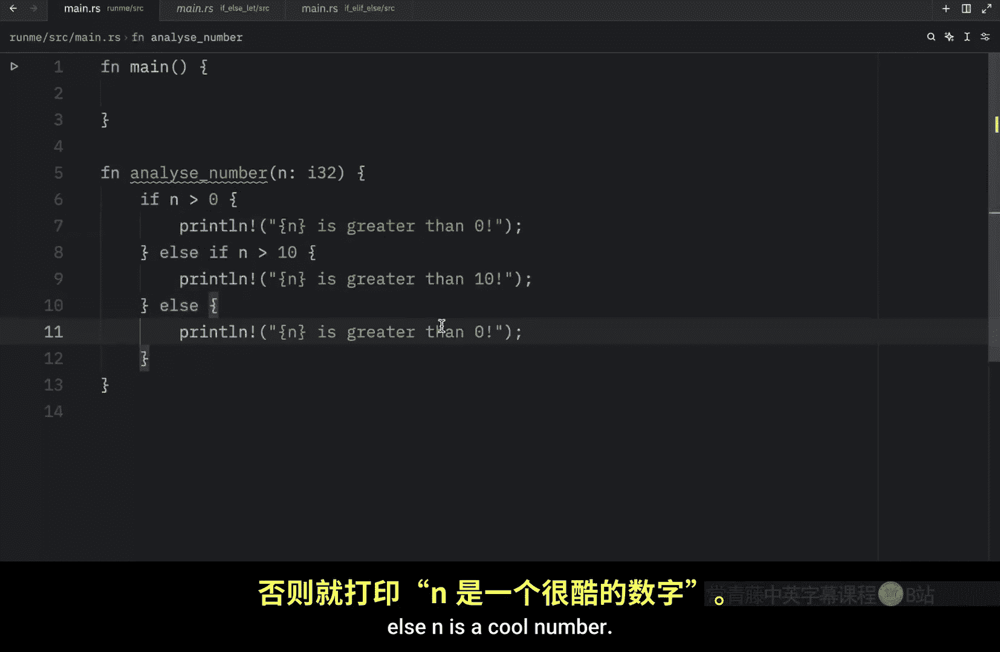
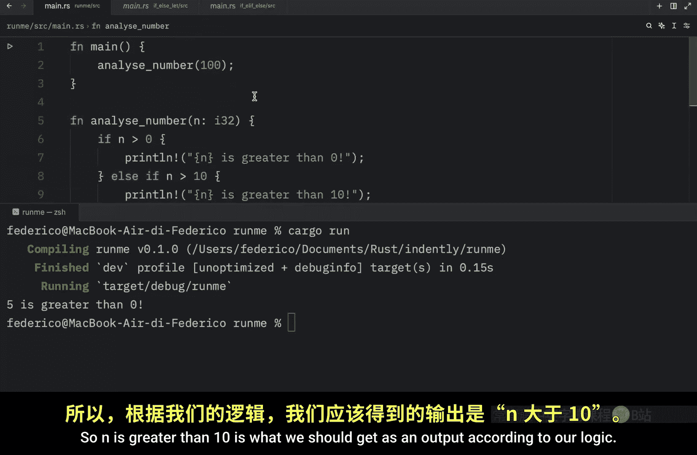
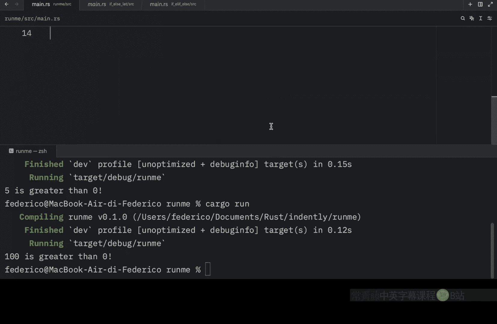

# 017：更多控制流

在本节课中，我们将学习 Rust 中处理多个条件判断的方法，并澄清一个关于字符串长度方法的常见误解。我们将通过构建一个简单的响应函数来实践 `if`、`else if` 和 `else` 的组合使用。

## 关于 `len()` 方法的澄清

上一节我们介绍了 Rust 中的 `if` 和 `else`，以及如何根据条件执行代码。在继续之前，需要澄清一点：`len()` 方法的作用与我在 Python 中的认知不同。



在 Python 中，`len()` 可用于计算字符串的字符数或列表的元素数。但在 Rust 中，`len()` 返回的是字符串的**字节长度**，而非字符数。你可以通过悬停查看文档来验证这一点。



为了使函数准确计算字符数，我们需要先获取字符，然后再进行计数。

```rust
// 错误示例：返回字节长度
let length_in_bytes = "ø".len(); // 可能返回 2

// 正确示例：返回字符数
let character_count = "ø".chars().count(); // 返回 1
```

`len()` 方法的问题在于，某些字符（如斯堪的纳维亚字符 `ø`）可能占用多个字节。这意味着 `"ø".len()` 会返回 `2` 而不是 `1`，这通常不是我们想要的结果。

这个故事的启示是：在学习新语言时，务必阅读文档。因为 `len()` 在 Rust 中的行为与 Python 完全不同。我很高兴犯了这个错误，因为从现在起，我会更加注意那些与 Python 方法同名但功能不同的方法。

## 处理多个条件：`else if`

之前我们学习了使用 `if` 和 `else` 根据特定条件执行代码。但如果我们想处理多个条件呢？在本节中，我们将通过创建一个简单的响应函数来学习如何使用 `else if`。




我们将创建一个名为 `get_response` 的函数，它接收一个字符串切片作为用户输入，并返回一个字符串切片作为响应。

```rust
fn get_response(input: &str) -> &str {
    // 代码将在这里展开
}
```


首先，我们创建一个名为 `lowered` 的 `String` 类型变量。它将接收输入，并将其转换为小写。这使字符串比较变得更容易，因为带大写 `H` 的 `"Hello"` 不等于带小写 `h` 的 `"hello"`。我们希望它们被识别为相同的内容。

```rust
let lowered = input.to_lowercase();
```

接下来，我们进行 `if-else` 检查。如果 `lowered` 包含 `"hello"`，则返回 `"hello there"`，否则返回 `"I don't understand"`。

```rust
if lowered.contains("hello") {
    return "hello there";
} else {
    return "I don't understand";
}
```

到目前为止，这只是我们上节课学过的内容。但只有一个响应显得不够好。接下来，我们将添加多个响应，为此我们将使用 `else if` 关键字（或关键字组合）。


`else if` 本质上是第二个 `if` 检查。如果第一个 `if` 失败，程序会继续检查这个 `else if`。这意味着我们现在可以检查 `lowered` 是否包含 `"how are you"`。

以下是添加多个条件判断的完整函数：

```rust
fn get_response(input: &str) -> &str {
    let lowered = input.to_lowercase();

    if lowered.contains("hello") {
        "hello there"
    } else if lowered.contains("how are you") {
        "good and you"
    } else if lowered.contains("good") {
        "good is good"
    } else {
        "I don't understand"
    }
}
```

通过这种方式，我们可以以多种方式处理用户输入。让我们通过调试来测试这个函数。

```rust
fn main() {
    dbg!(get_response("Hello, Bob"));
    dbg!(get_response("How are you"));
    dbg!(get_response("Good"));
    dbg!(get_response("Is this a cat in the hat"));
}
```

运行此程序，你会看到我们为每个输入都得到了恰当的响应。


你可以插入任意多个 `else if` 表达式，但有一点需要注意：**这些条件的放置顺序很重要**。因为一旦其中一个条件评估为 `true`，其余的条件就会被忽略。



## 条件顺序的重要性

为了说明顺序的重要性，让我们创建一个新函数 `analyze_number`，它接收一个 `i32` 类型的数字。

```rust
fn analyze_number(n: i32) {
    if n > 0 {
        println!("{} is greater than zero", n);
    } else if n > 10 {
        println!("{} is greater than ten", n);
    } else {
        println!("{} is a cool number", n);
    }
}
```




在 `main` 函数中调用它并传入数字 `5`：

```rust
fn main() {
    analyze_number(5);
}
```

运行程序，输出是：`5 is greater than zero`。




现在，如果我们传入 `100`，根据逻辑，我们应该触发 `n > 10` 这个条件块，输出 `100 is greater than ten`。但运行后你会发现，输出是 `100 is greater than zero`。

这是因为**顺序至关重要**。第一个检查 `n > 0` 通过了，因此它执行了对应的代码行，并忽略了其余部分。

如果你希望代码按预期工作，必须在检查 `n > 0` 之前先检查 `n > 10`，因为 `n > 0` 有可能在 `n > 10` 之前就通过检查。当然，相应地修改输出字符串也会有用。





调整顺序后的函数如下：

```rust
fn analyze_number(n: i32) {
    if n > 10 {
        println!("{} is greater than ten", n);
    } else if n > 0 {
        println!("{} is greater than zero", n);
    } else {
        println!("{} is a cool number", n);
    }
}
```

现在，再次运行程序：
- 输入 `100` 会输出 `100 is greater than ten`。
- 输入 `5` 会输出 `5 is greater than zero`。


这是因为程序按顺序检查条件。由于 `5` 不大于 `10`，程序能够继续检查下一个条件 `n > 0`，该条件返回 `true`，因此执行了对应的代码行。


## 总结

本节课中我们一起学习了：
1.  **澄清了 `len()` 方法**：在 Rust 中，`str.len()` 返回的是字节长度，而非字符数。要获取字符数，应使用 `str.chars().count()`。
2.  **使用 `else if` 处理多个条件**：通过组合 `if`、`else if` 和 `else`，可以构建复杂的条件判断逻辑。
3.  **理解了条件判断的顺序重要性**：`if-else if` 链会按顺序评估条件，一旦某个条件为 `true`，后续条件将被跳过。因此，条件的顺序直接影响程序的逻辑和输出。


下节课，我们将学习如何在赋值语句中直接使用 `if-else` 表达式。