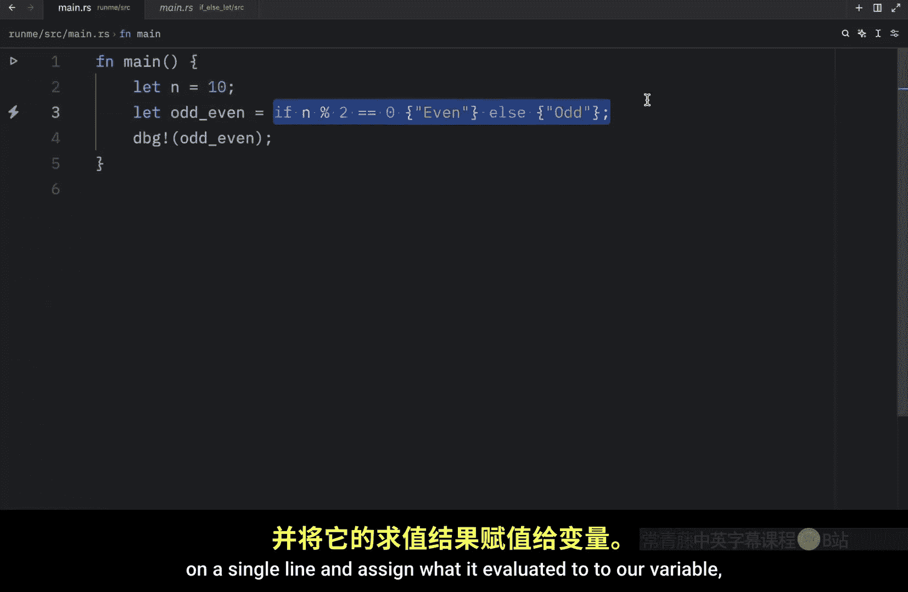
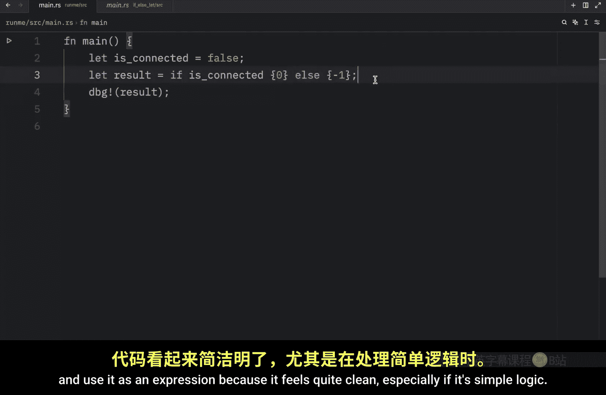

Rust 初学者教程：P18：使用 `let` 与 `if..else` 进行条件赋值

在本节课中，我们将学习 Rust 中 `if..else` 作为表达式的一个强大特性：如何用它来直接为变量赋值。这个特性能让代码更简洁，尤其是在处理简单的条件逻辑时。

---

上一节我们介绍了 `if..else` 的基本用法。本节中我们来看看如何将它用作表达式来赋值。

由于 `if` 在 Rust 中是一个表达式，这意味着它可以产生一个值。因此，我们可以直接将 `if..else` 的结果赋值给一个变量。其基本公式如下：

```rust
let variable_name = if condition { value_if_true } else { value_if_false };
```

以下是具体步骤：

1.  **定义条件变量**：首先，定义一个需要判断的变量。
2.  **使用 `let if` 赋值**：然后，使用 `let` 关键字声明一个新变量，并用 `if..else` 表达式为其赋值。
3.  **输出结果**：最后，可以打印或使用这个新变量。

让我们通过一个例子来理解。假设我们有一个整数 `n`，我们想创建一个变量来告诉我们它是奇数还是偶数。

```rust
fn main() {
    let n = 11; // 要判断的数字
    let odd_even = if n % 2 == 0 { "even" } else { "odd" };
    println!("The number is: {}", odd_even);
}
```

在这段代码中：
*   `n % 2 == 0` 是条件，检查 `n` 除以 2 的余数是否为 0。
*   如果条件为真（即余数为 0），整个 `if` 表达式的值就是字符串 `"even"`。
*   如果条件为假（即余数不为 0），表达式的值就是字符串 `"odd"`。
*   这个值被直接赋值给了变量 `odd_even`。

运行这段代码，因为 11 是奇数，所以会输出 `The number is: odd`。如果将 `n` 的值改为 10，则会输出 `The number is: even`。

---

使用 `let if` 时有一个非常重要的规则需要牢记。


**`if` 和 `else` 分支返回的值必须是相同的类型。** 如果类型不匹配，Rust 编译器会报错，程序将无法通过编译。




请看一个错误的例子：

```rust
fn main() {
    let is_connected = false;
    // 错误示例：两个分支返回的类型不同（&str 和 i32）
    let result = if is_connected { "connected" } else { -1 };
    println!("{:?}", result);
}
```

在这段代码中，`if` 分支返回一个字符串切片 `&str`（`"connected"`），而 `else` 分支返回一个整数 `i32`（`-1`）。Rust 编译器会明确指出这个错误，例如提示 `expected &str, found integer`。因此，这种写法是不允许的。

---



本节课中我们一起学习了 Rust 中 `let` 与 `if..else` 结合使用的技巧。我们了解到 `if` 作为表达式可以直接为变量赋值，这使得简单的条件判断代码更加简洁清晰。同时，我们掌握了使用时的核心规则：`if` 和 `else` 分支的返回值类型必须一致，否则代码将无法编译。这个特性是 Rust 表达力强大的一个体现。