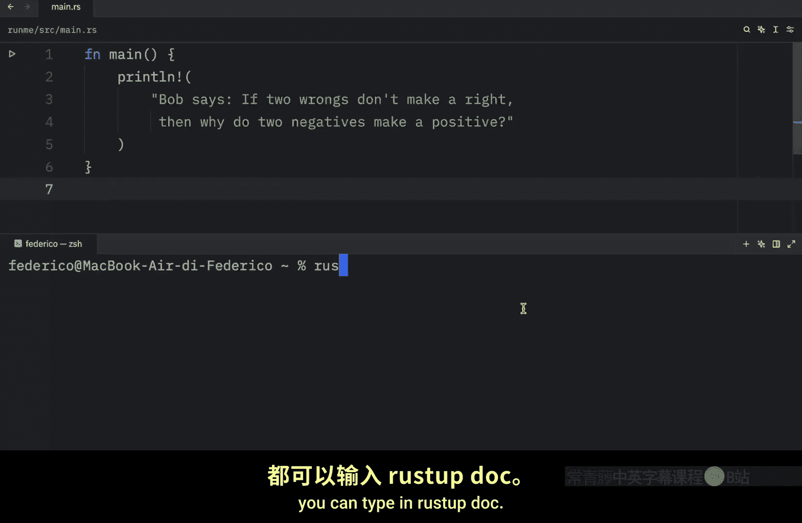
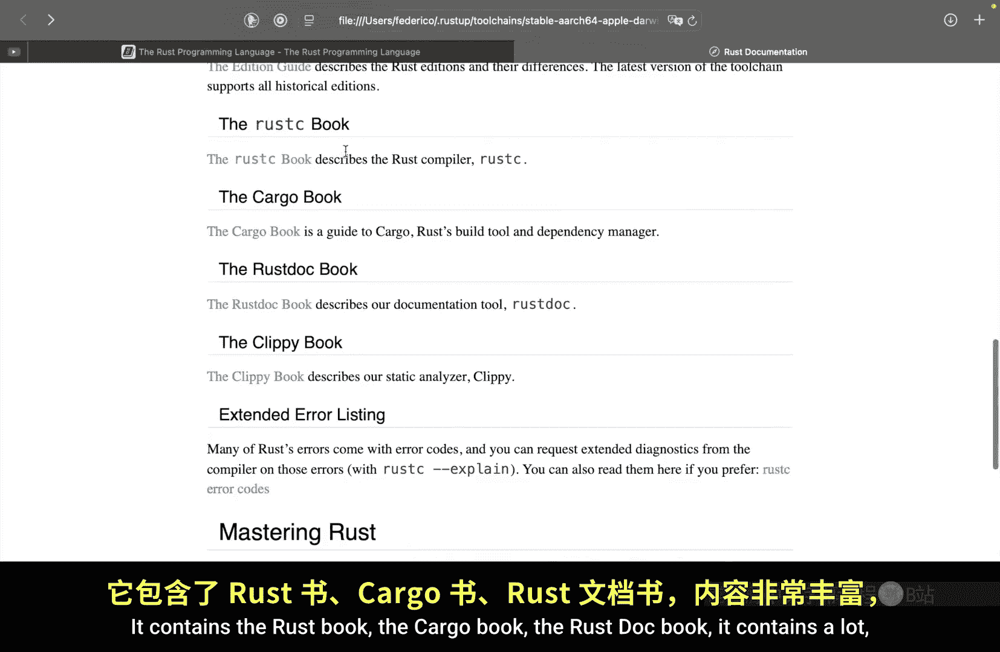
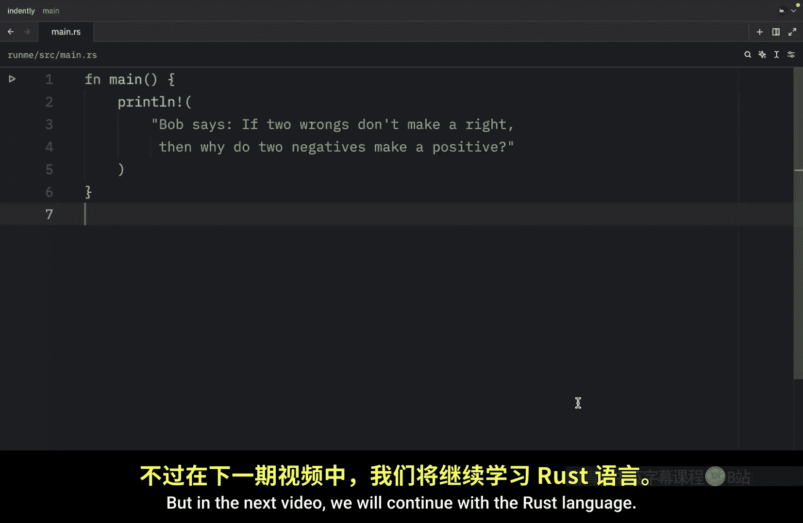

# 019：无需网络学习Rust 📚

在本节课中，我们将学习一个非常实用的技巧：如何在没有互联网连接的情况下学习 Rust。Rust 语言的一个出色特性是，其官方文档被内置到了工具链中，这意味着你可以随时随地查阅。

## 访问离线文档

上一节我们介绍了 Rust 的各种基础概念，本节中我们来看看如何利用内置工具进行离线学习。

在任何终端中，你都可以输入以下命令来打开本地的 Rust 文档：

```bash
rustup doc
```



执行这个命令后，你的默认浏览器将会打开一个本地版本的 Rust 文档网站。这个文档的内容与在线版本完全一致，但不需要任何网络连接。


## 文档内容概览

这个离线文档包含了 Rust 学习的核心资源。对于初学者，你可以直接跟随其中的“Rust 编程语言”一书（The Rust Book）进行学习，这也是本视频教程所依据的官方教材。

*   **在线版本地址**：`https://doc.rust-lang.org/book/title-page.html`
*   **离线版本位置**：如截图所示，文档被托管在你本地计算机的特定文件夹中。

## 安装与更新离线文档

以下是确保你拥有最新离线文档的步骤。


如果你因为任何原因发现该命令无效或文档缺失，你可以使用以下命令来安装或更新 Rust 文档组件：

```bash
rustup component add rust-docs
```

执行此命令后：
1.  如果你尚未安装文档，它会自动下载。
2.  如果你已安装，它会检查并确保所有文档都是最新版本。


## 离线文档的实用价值

了解这个功能在多种场景下都非常有用。

*   当你身处没有网络的环境时（例如在飞机上、偏远地区），可以继续学习。
*   当网络速度很慢时，访问本地文档会比等待网页加载快得多。
*   它包含了极其丰富的内容，是探索 Rust 的绝佳资料库。

离线文档集包含的主要资源有：
*   **The Rust Book**： Rust 官方入门教程。
*   **The Cargo Book**： 关于 Rust 包管理器和构建工具的详细指南。
*   **The Rustdoc Book**： 学习如何为你自己的代码生成文档。
*   **The Reference**： Rust 语言的参考手册。





## 总结


本节课中我们一起学习了一个简单但强大的 Rust 特性：离线文档访问。我们了解了如何使用 `rustup doc` 命令打开本地文档，以及如何通过 `rustup component add rust-docs` 来安装或更新它。掌握这个方法，能确保你在任何条件下都能持续学习和查阅 Rust，这对于深入掌握这门语言至关重要。


在接下来的视频中，我们将回归 Rust 语言本身，继续学习新的核心概念——**循环**。