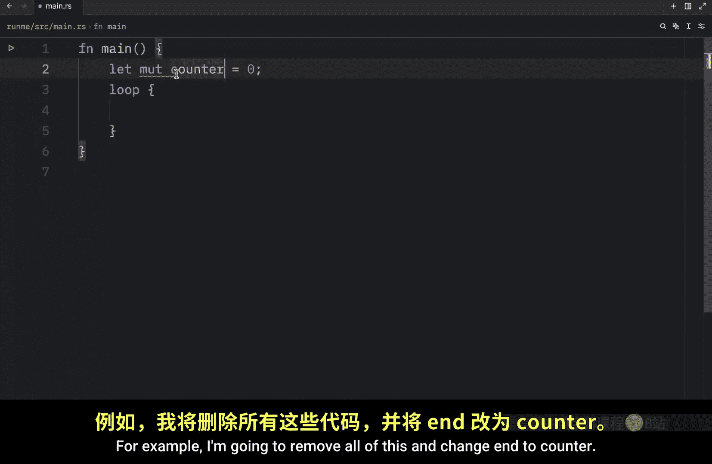
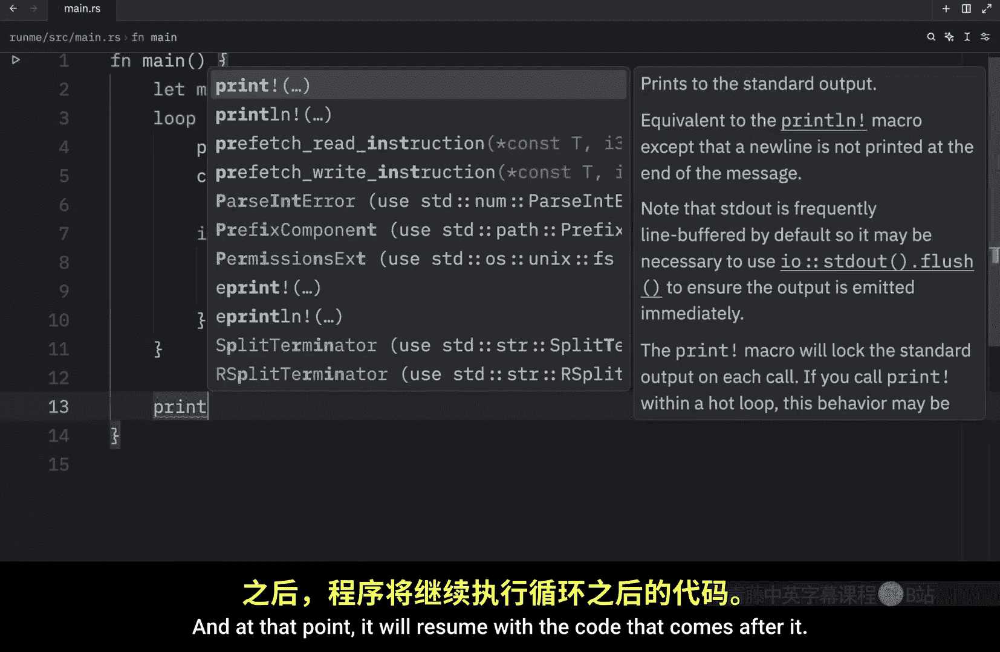
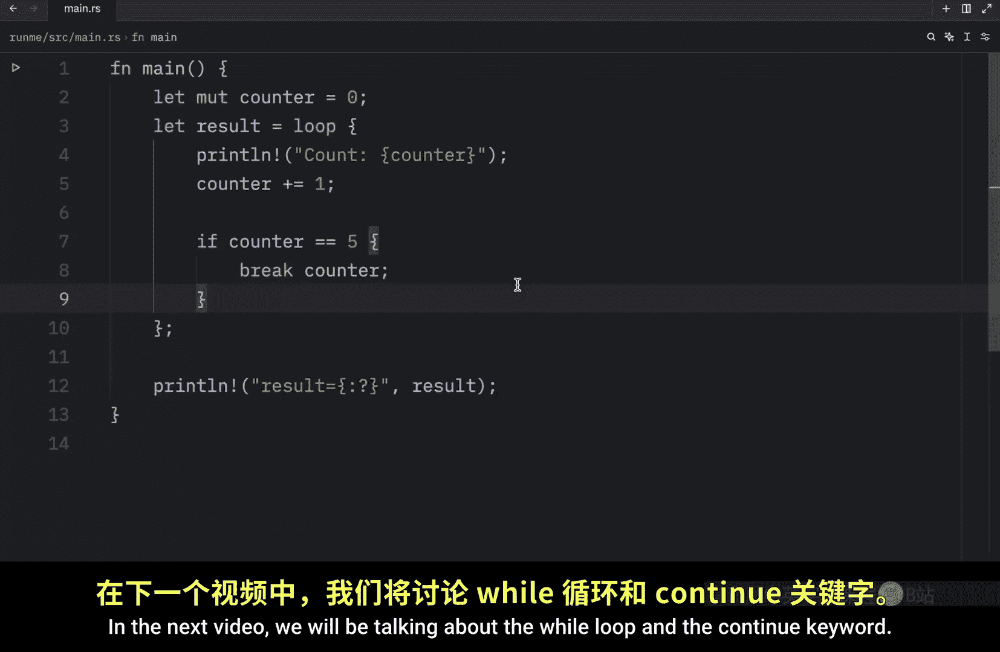

# 020：Rust 中的 loop 循环 🔄

在本节课中，我们将要学习 Rust 编程语言中的循环概念。循环是几乎所有编程语言中都存在的基础概念，它允许我们重复执行一段代码。我们将从最基础的 `loop` 循环开始，了解如何创建无限循环，以及如何使用 `break` 关键字来控制循环的退出。

---

## 循环简介

上一节我们介绍了如何使用 `if else` 来运行满足特定条件的代码。本节中，我们来看看循环。在 Rust 中，有三种主要的循环类型：`loop`、`while` 循环和 `for` 循环。在接下来的几节课中，我们将逐一介绍它们。首先，让我们深入了解最基本的 `loop` 循环。

`loop` 关键字允许我们创建一个无限循环，代码会一直重复执行，直到我们明确告诉它停止。


## 创建 loop 循环

要创建一个 `loop` 循环，我们使用 `loop` 关键字，然后跟上一对花括号 `{}`。所有放在花括号内的代码都将被无限循环执行。

```rust
loop {
    // 这里的代码将无限循环
}
```

使用此功能时需要小心，因为如果我们在循环内打印一些内容，例如：

```rust
loop {
    println!("Hello Bob");
}
```



运行此程序，你会在控制台看到 “Hello Bob” 被无限打印。停止程序的唯一方法是按住 `Ctrl + C` 来强制终止程序。

## 观察循环过程

为了更直观地观察循环过程，我们可以引入一个计数器变量。

以下是具体步骤：
1.  创建一个名为 `n` 的可变变量，初始值设为 `0`。
2.  在每次循环迭代中，将 `n` 的值增加 `1`。
3.  使用 `println!` 宏打印当前的 `n` 值。


```rust
let mut n = 0;
loop {
    n += 1;
    println!("{}", n);
}
```

运行这段代码，你会看到数字从 `1` 开始持续增长，循环将无限进行下去。同样，你可以使用 `Ctrl + C` 随时停止它。

## 使用 break 退出循环

接下来，我们讨论一个非常关键的关键字：`break`。它允许我们在遇到它时立即退出循环。

例如，我们创建一个倒计数的循环：
1.  将变量名改为 `counter`，并从 `5` 开始。
2.  每次迭代打印当前计数，并将计数器减 `1`。
3.  当计数器等于 `0` 时，打印信息并使用 `break` 退出循环。

```rust
let mut counter = 5;
loop {
    println!("Count is: {}", counter);
    counter -= 1;
    if counter == 0 {
        println!("We reached 0!");
        break;
    }
}
println!("Code after the loop.");
```

运行此代码，你会看到计数从 `5` 递减到 `0`。当 `counter` 为 `0` 时，条件判断为真，执行 `break`，循环终止，程序继续执行循环之后的代码。如果没有 `break` 条件，循环后的代码将永远无法执行。




## 从循环中返回值

`loop` 循环还有一个强大的功能：它可以返回一个值。这是通过 `break` 关键字后跟一个值来实现的。


让我们看一个递增计数的例子，并从循环中返回最终值：
1.  将 `counter` 初始值设为 `0`。
2.  每次循环递增计数器。
3.  当计数器达到 `5` 时，使用 `break` 退出循环并返回一个值（例如字符串 “success” 或计数器本身的值）。
4.  将这个循环的返回值赋给一个变量。


```rust
let mut counter = 0;
let result = loop {
    counter += 1;
    if counter == 5 {
        break "success"; // 或者 break counter;
    }
};
println!("Result: {:?}", result);
```

运行这段代码，当计数器递增到 `5` 时，循环会中断，并将 `break` 后面的值（“success” 或数字 `5`）赋给变量 `result`，然后打印出来。

---



本节课中我们一起学习了 Rust 中 `loop` 循环的基础用法。我们了解了如何创建无限循环，如何使用 `break` 关键字在满足条件时退出循环，以及如何从循环中返回一个值。这些是控制程序流程的重要工具。在下一节视频中，我们将探讨 `while` 循环和 `continue` 关键字。