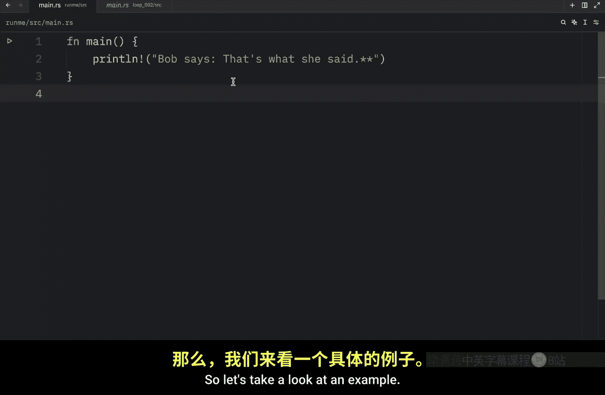
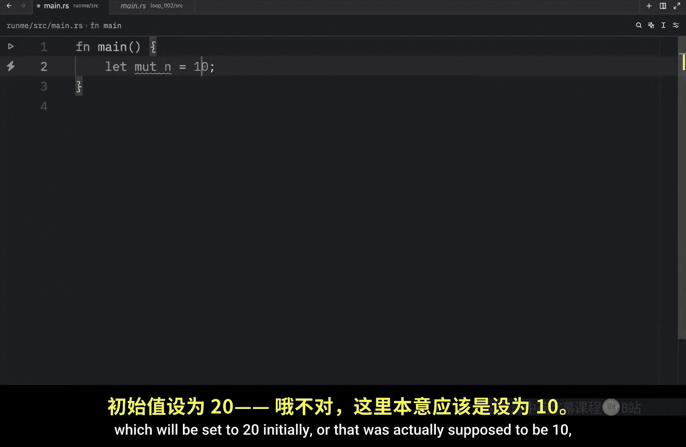
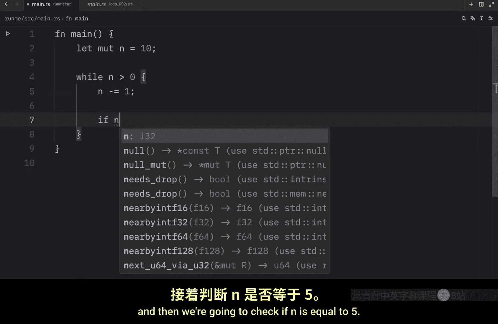
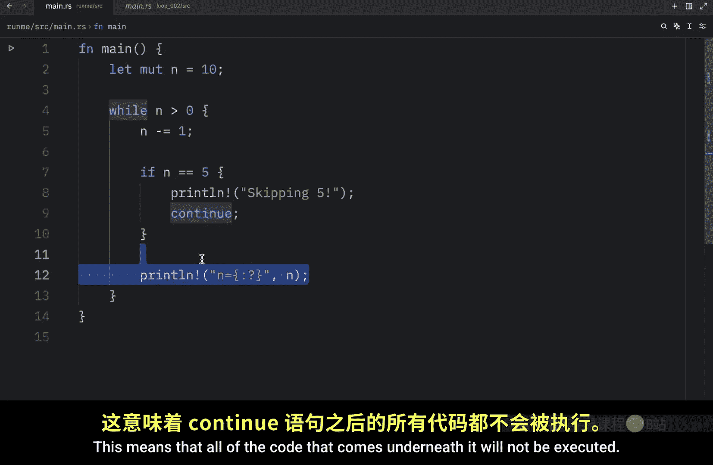
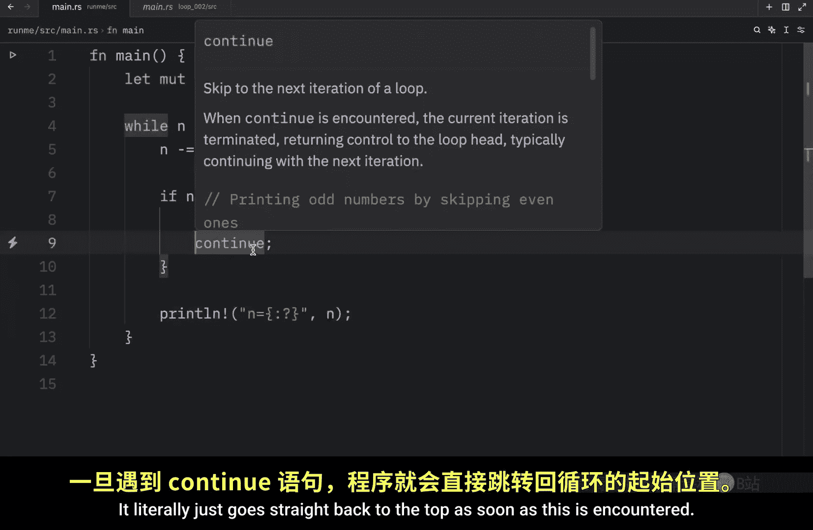
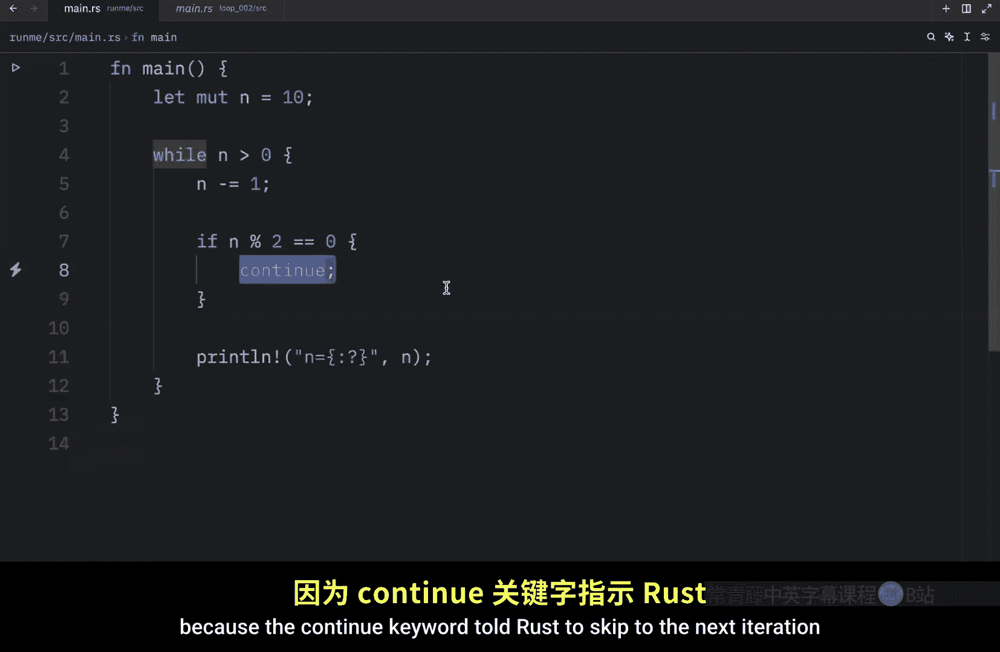

# 021：while 循环 🌀

在本节课中，我们将要学习 Rust 中的 `while` 循环，了解它的工作原理，并探索如何使用 `continue` 关键字来控制循环流程。

上一节我们介绍了使用 `loop` 关键字创建无条件循环。本节中我们来看看 `while` 循环，它的行为略有不同。`while` 循环需要一个条件表达式，每次迭代前都会检查该条件。只有当条件评估为 `true` 时，循环才会继续执行。一旦条件变为 `false`，循环就会退出。

## while 循环的基本用法

让我们来看一个例子。首先，我们创建一个名为 `number` 的变量，并赋值为 `5`。

```rust
let mut number = 5;
```

我们希望当 `number` 大于 `0` 时，循环继续执行。




```rust
while number > 0 {
    println!("{}", number);
    number -= 1;
}
```

如果我们只打印数字而不减少它的值，程序将陷入无限循环，因为条件 `number > 0` 永远不会变为 `false`。因此，在循环体内修改条件变量至关重要。在上面的代码中，我们使用 `number -= 1` 在每次迭代后将数字减 1。

运行程序，你会看到它从 5 倒数到 1。当 `number` 变为 0 时，条件 `number > 0` 评估为 `false`，循环退出，程序继续执行后续代码。

为了演示这一点，我们可以在循环后添加一行代码：

```rust
println!("循环结束");
```

再次运行程序，你会看到倒数完成后打印出“循环结束”。

`while` 循环的条件可以是任何能评估为布尔值（`true` 或 `false`）的表达式。例如，`while true` 会创建一个无限循环。

## 使用 continue 关键字

接下来，我们通过另一个例子来介绍 `continue` 关键字。`continue` 用于跳过当前迭代中剩余的代码，直接开始下一次循环迭代。


我们创建一个新的可变变量 `n`，初始值设为 10。






```rust
let mut n = 10;
while n > 0 {
    n -= 1; // 递减 n，避免无限循环
    if n == 5 {
        println!("正在跳过 5");
        continue;
    }
    println!("当前值: {}", n);
}
```

以下是这段代码的执行步骤：
1.  循环开始，`n` 初始为 10。
2.  每次迭代，先将 `n` 减 1。
3.  检查 `n` 是否等于 5。
4.  如果等于 5，则打印“正在跳过 5”，然后执行 `continue`，跳过本次迭代中后面的 `println!` 语句，直接开始下一次迭代。
5.  如果不等于 5，则正常打印 `n` 的当前值。

运行程序，输出将从 9 开始，递减到 6，然后跳过数字 5 的打印，接着打印 4、3、2、1、0。你会发现控制台没有输出“当前值: 5”。

## continue 的更多应用

我们可以利用 `continue` 来实现更复杂的逻辑，例如只打印奇数。

通过稍微修改实现细节，我们可以只打印奇数。思路是：当 `n` 是偶数时，使用 `continue` 跳过打印。

```rust
let mut n = 10;
while n > 0 {
    n -= 1;
    if n % 2 == 0 { // 检查 n 是否为偶数
        continue; // 如果是偶数，跳过本次迭代的剩余部分
    }
    println!("奇数: {}", n);
}
```





在这段代码中：
*   `n % 2 == 0` 是一个条件表达式，使用取模运算符 `%` 来计算 `n` 除以 2 的余数。
*   如果余数为 0，说明 `n` 是偶数，则执行 `continue`，跳过 `println!`。
*   只有余数不为 0（即 `n` 是奇数）时，才会执行打印语句。

运行此程序，输出将只包含 9、7、5、3、1 这些奇数。

---



本节课中我们一起学习了 Rust 的 `while` 循环。我们了解到 `while` 循环是一个条件循环，它在每次迭代前检查一个布尔条件。我们还学习了如何使用 `continue` 关键字来跳过当前迭代的剩余代码，直接进入下一次循环，这为控制循环流程提供了灵活性。记住，确保循环条件最终能变为 `false` 是避免无限循环的关键。