# 022：for 循环 🚀

在本节课中，我们将要学习 Rust 中的 `for` 循环。这是一种非常方便地遍历可迭代集合（如数组）的方式。我们将通过具体示例来理解其语法和优势，并与之前学过的循环进行对比。

上一节我们介绍了 `while` 循环。本节中，我们来看看另一种循环类型——`for` 循环，它能让我们以更便捷的方式遍历可迭代对象。

## 基础 `for` 循环示例

让我们立即开始，首先创建一个名为 `names` 的数组。

```rust
let names = ["Bob", "Ben", "Betty"];
```

接下来，我们将遍历每个名字，并在每次迭代中使用其值。

```rust
for name in names {
    println!("{} says hi", name);
}
```

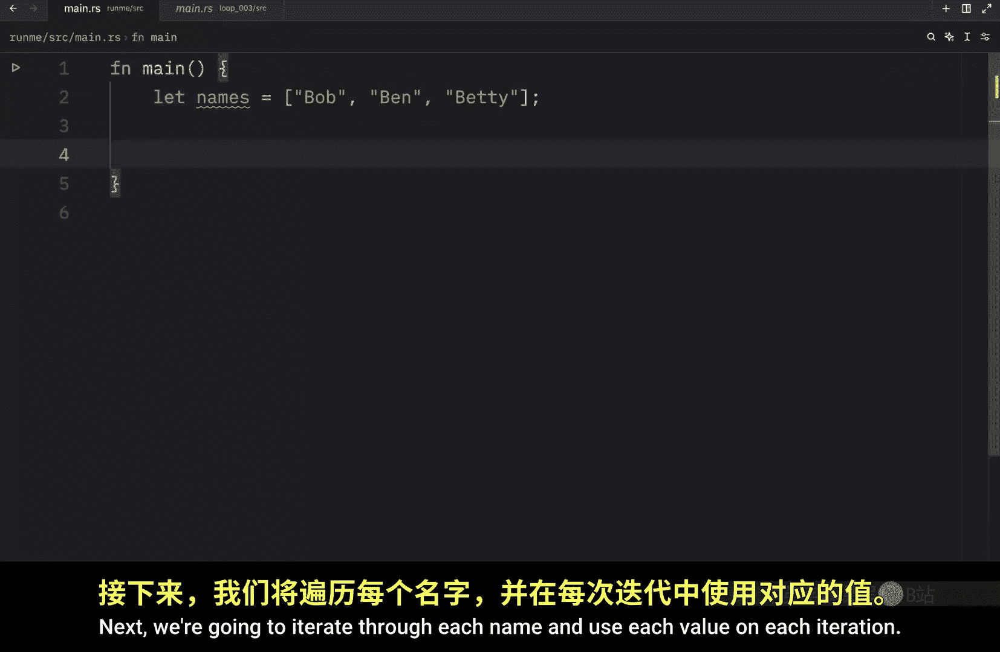

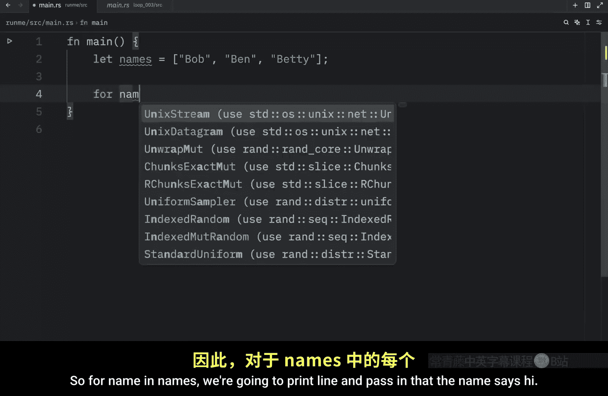


这里，我们遍历这个 `names` 数组。`name` 是每次迭代中使用的临时变量名，你可以随意命名它，比如 `n` 或 `person`。

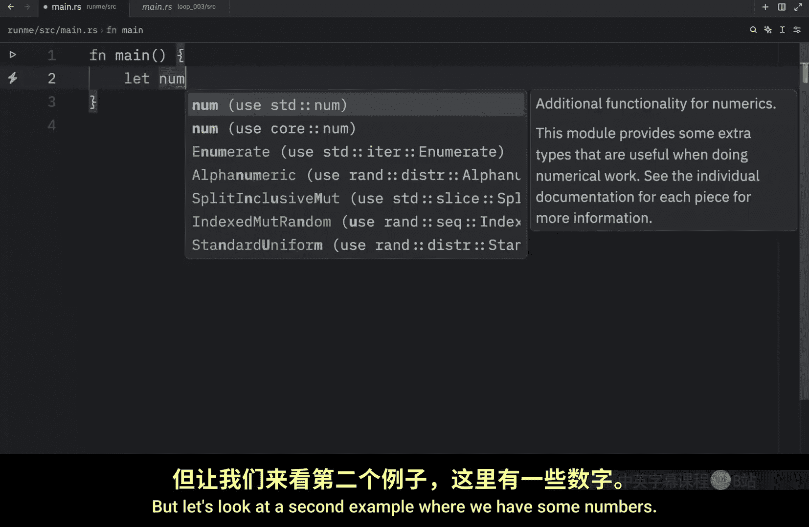


在第一次迭代中，`name` 等于 `"Bob"`，然后是 `"Ben"`，最后是 `"Betty"`。运行此代码，我们将得到：


```
Bob says hi
Ben says hi
Betty says hi
```


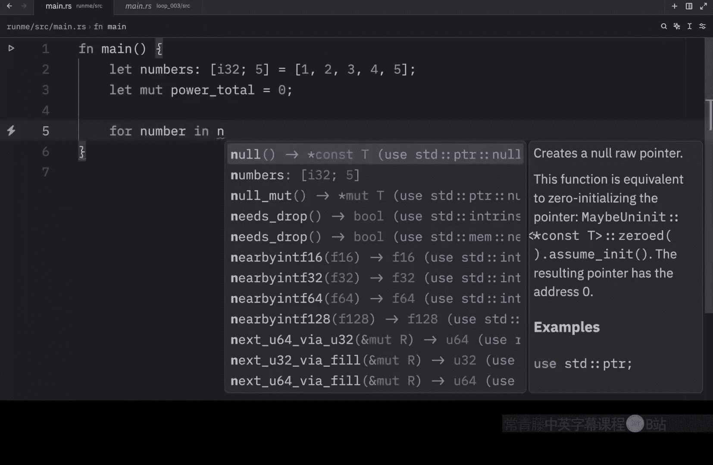

## 使用 `for` 循环进行数值计算

让我们看第二个例子，其中包含一些数字。

```rust
let numbers: [i32; 5] = [1, 2, 3, 4, 5];
```

接下来，我们创建一个名为 `power_total` 的可变变量，初始值为 0。

```rust
let mut power_total = 0;
```

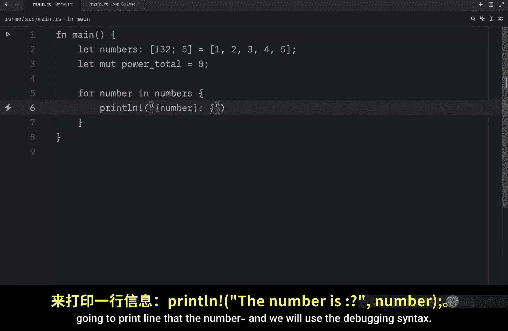

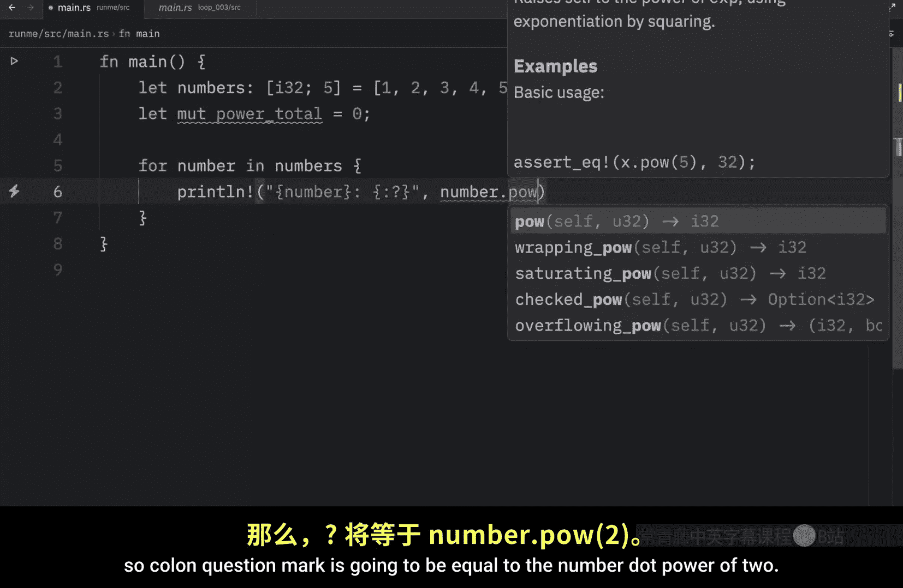

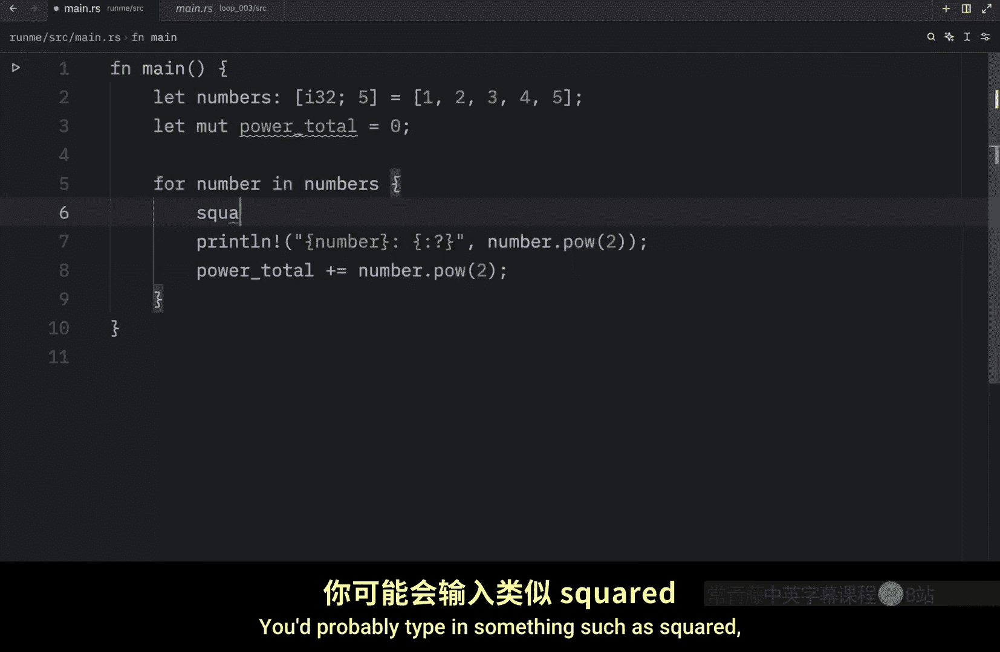

我们的目标是计算每个数字的平方（二次幂），并将其加到总和里。


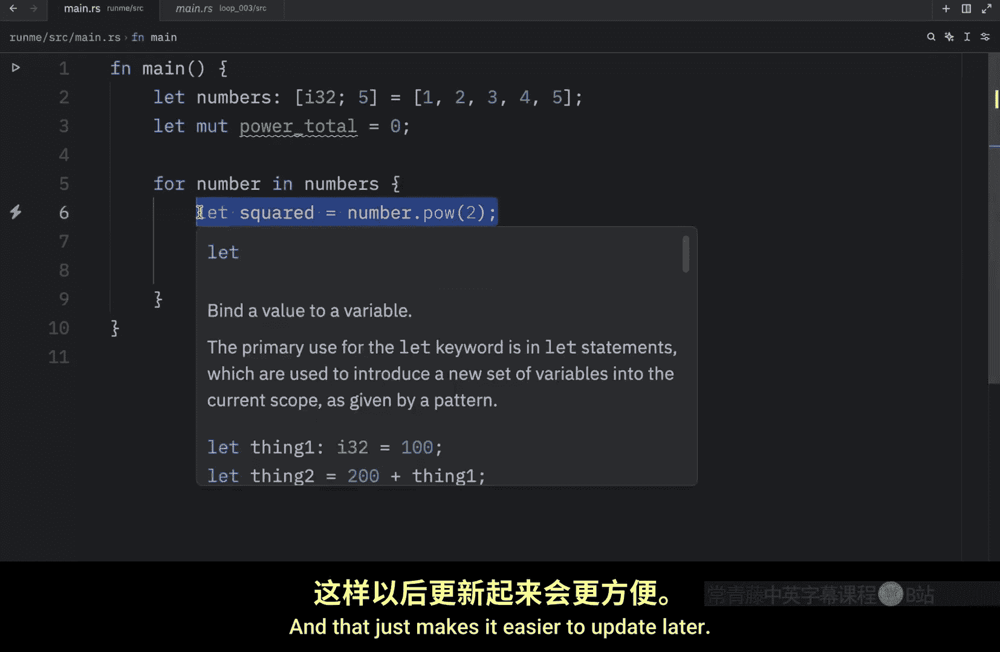

以下是遍历数字并计算平方和的代码：

```rust
for number in numbers {
    let squared = number.pow(2);
    println!("{}^2 = {:?}", number, squared);
    power_total += squared;
}
println!("Total sum of squares: {}", power_total);
```

在循环内部：
1.  我们使用 `number.pow(2)` 方法计算当前数字的平方。如果你想计算立方，可以使用 `pow(3)`。
2.  我们打印出数字及其平方值。
3.  我们将平方值累加到 `power_total` 中。

最后，在循环外部打印总和。运行此代码，我们将得到：

```
1^2 = 1
2^2 = 4
3^2 = 9
4^2 = 16
5^2 = 25
Total sum of squares: 55
```

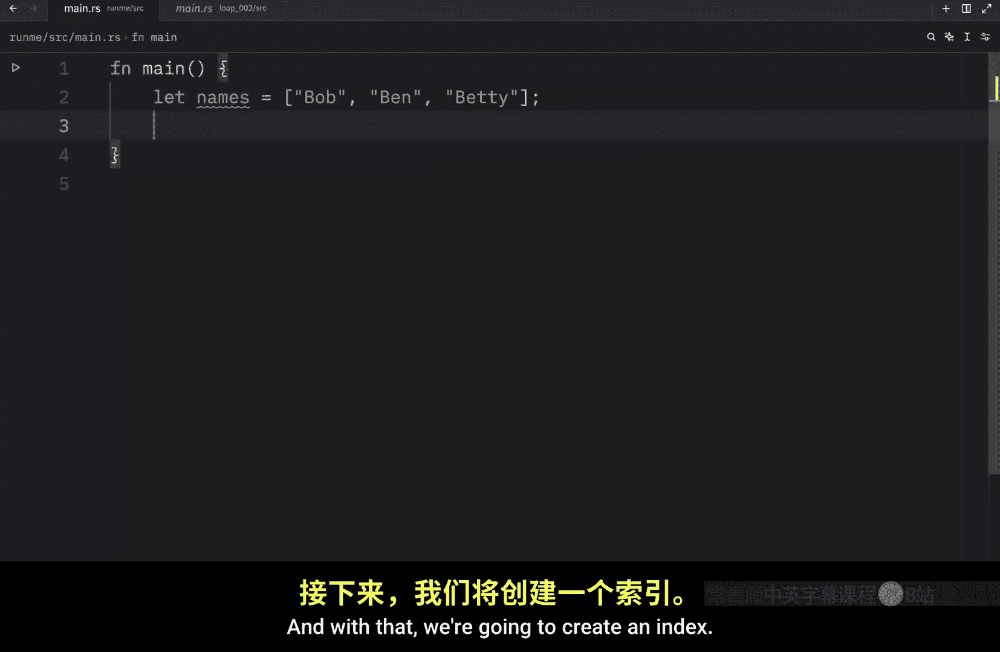

如你所见，使用 `for` 循环非常方便。

## 为何优先选择 `for` 循环

虽然你可以使用 `loop` 或 `while` 循环来实现相同的遍历功能，但这通常被视为不良实践，因为它需要更多代码来实现一个简单的操作，从而更容易导致错误。

为了演示这一点，我们使用 `while` 循环来遍历之前的名字数组。

```rust
let names = ["Bob", "Ben", "Betty"];
let mut index = 0;
while index < names.len() {
    println!("{:?}", names[index]);
    index += 1; // 递增索引
}
```


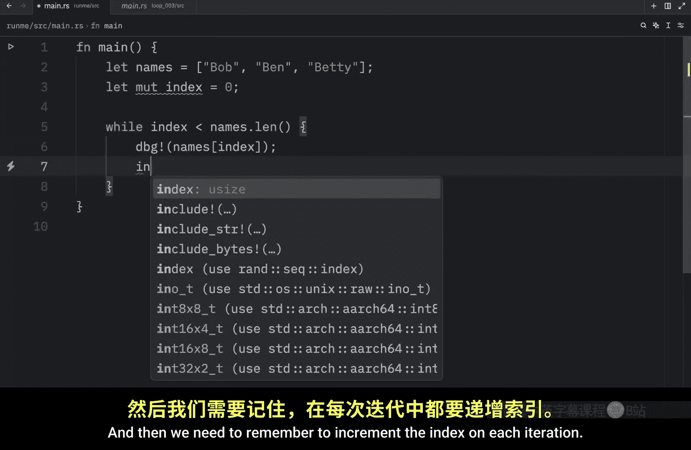

这段代码可以正常工作，输出三个名字。但它需要手动管理索引 (`index`) 和循环条件，代码量更多且稍难阅读。

更重要的是，它容易引入逻辑错误。例如，如果不小心将索引递增语句 `index += 1` 放错了位置：

```rust
while index < names.len() {
    index += 1; // 错误地在打印前递增
    println!("{:?}", names[index]); // 可能导致索引越界！
}
```

这可能导致程序恐慌（panic），因为索引可能超出数组边界。而使用 `for` 循环，则可以安全、简洁地完成同样的事情：

```rust
for name in names {
    println!("{:?}", name);
}
```

## 总结


本节课中我们一起学习了 Rust 的 `for` 循环。我们了解到：
*   `for` 循环的语法是 `for item in iterable { ... }`，用于便捷地遍历集合。
*   它避免了手动管理索引的麻烦，使代码更简洁、更安全，减少了出错的可能性。
*   在处理需要遍历数组、向量等可迭代集合的任务时，应优先考虑使用 `for` 循环，即所谓“使用合适的工具做合适的事”。

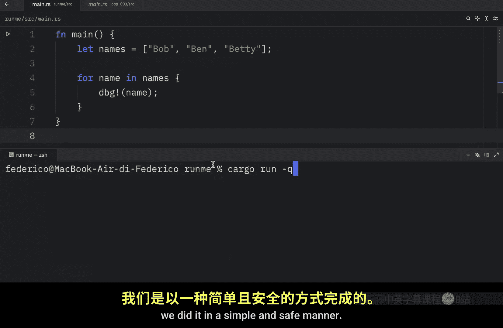

记住这个核心原则，它将为你节省时间、避免麻烦。