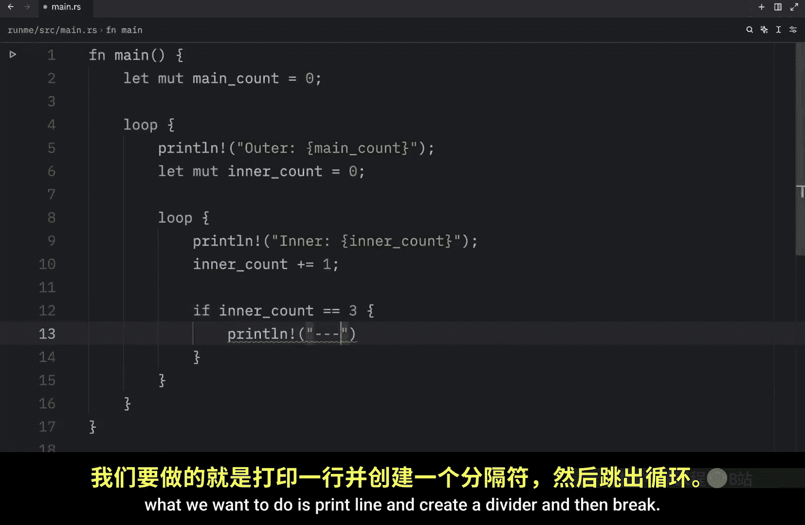
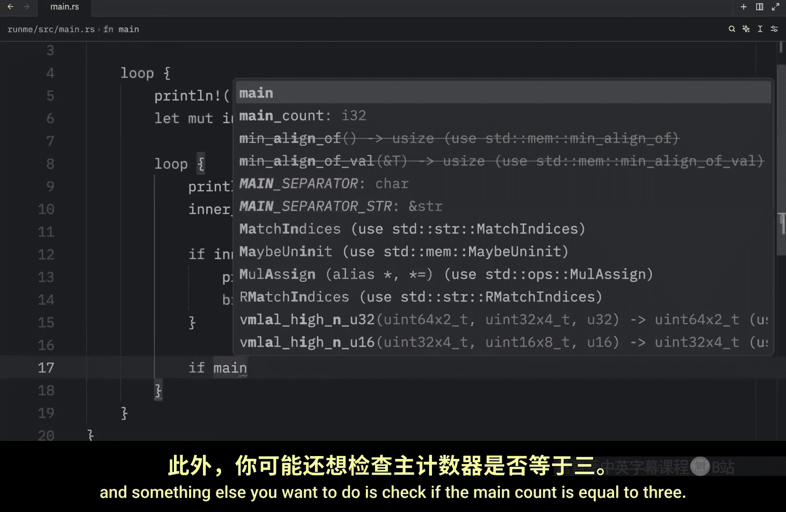
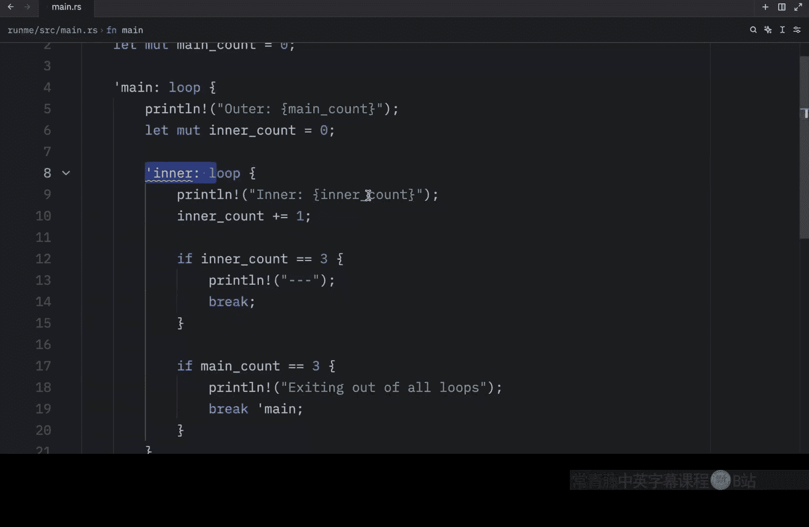
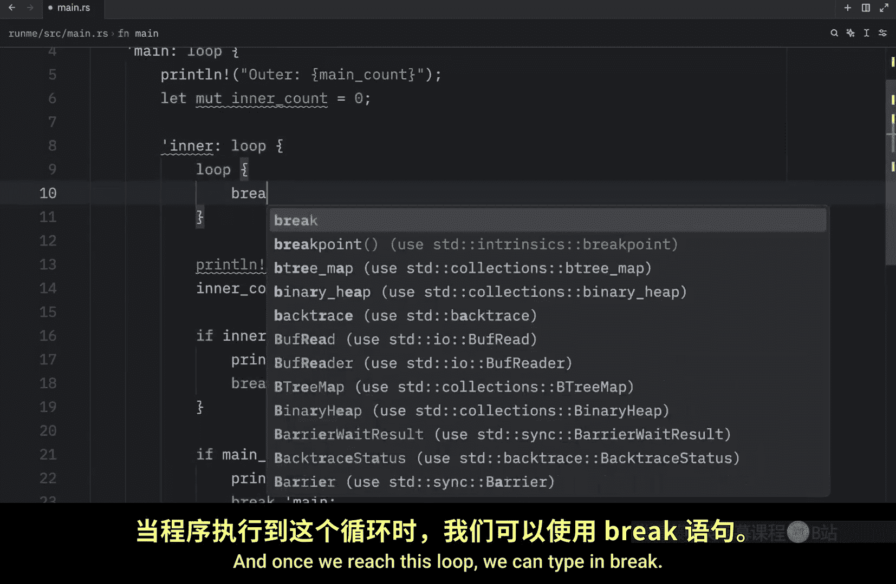
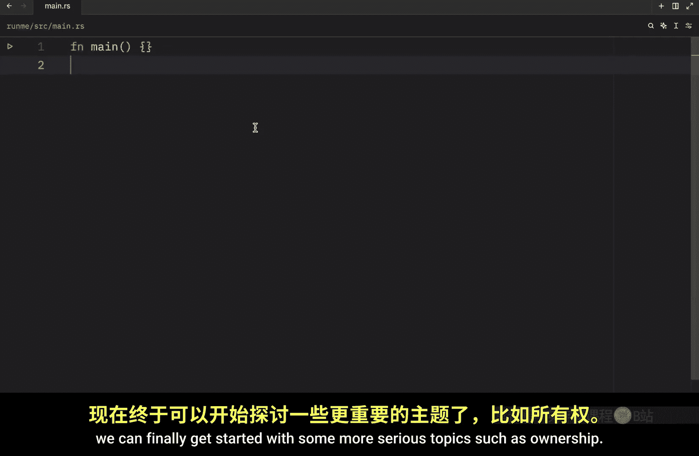

# 023：循环标签

在本节课中，我们将要学习 Rust 中关于循环的最后一个重要概念：**标签**。标签主要用于处理嵌套循环，它允许你在使用 `break` 或 `continue` 时，精确地指定要中断或继续的是哪一个循环。

## 为什么需要循环标签？

上一节我们介绍了 Rust 中的所有循环类型。本节中我们来看看一个在嵌套循环中可能遇到的问题。

当使用嵌套循环时，内层循环中的 `break` 语句默认只会跳出离它最近的那一层循环。如果你需要从内层循环直接跳出到外层循环，就需要使用**循环标签**来指定目标。

## 创建和使用循环标签

以下是创建和使用循环标签的步骤。


首先，我们创建一个示例程序来演示问题。我们声明两个计数器变量，并构建一个嵌套循环结构。





```rust
fn main() {
    let mut main_count = 0; // 外层循环计数器
    'main: loop { // 为外层循环定义标签 'main
        println!("外层循环: {}", main_count);
        let mut inner_count = 0;

        loop { // 内层循环
            println!("  内层循环: {}", inner_count);
            inner_count += 1;

            if inner_count == 3 {
                println!("  --- 内层循环结束 ---");
                break; // 这个 break 只会跳出内层循环
            }

            if main_count == 3 {
                println!("退出所有循环");
                break 'main; // 使用标签 'main 来跳出外层循环
            }
        }
        main_count += 1; // 外层循环计数器递增
    }
}
```

代码解析：
1.  `'main: loop`：这为外层循环定义了一个名为 `'main` 的标签。标签以单引号 `'` 开头，后跟标签名和冒号 `:`。
2.  `break;`：在内层循环中，这个 `break` 没有指定标签，因此它只会跳出当前的内层循环。
3.  `break 'main;`：这个 `break` 指定了标签 `'main`，因此它会直接跳出到标签所标记的外层循环，从而终止整个嵌套循环结构。

运行这段代码，输出将清晰地展示控制流的跳转过程。

## 循环标签的核心要点

以下是关于循环标签需要记住的几个关键点。

*   **语法**：标签以单引号 `'` 开头，例如 `'outer_loop`。
*   **作用范围**：标签定义在循环关键字（`loop`、`while`、`for`）之前。
*   **与 `continue` 共用**：`continue` 语句也可以使用标签，例如 `continue 'outer_loop;`，这将直接跳到指定标签循环的下一次迭代。
*   **多层嵌套**：你可以为任意多层嵌套的循环定义标签，从而精确控制程序流。

## 总结






本节课中我们一起学习了 Rust 的**循环标签**。我们了解到，在处理复杂的嵌套循环时，可以使用标签来精确控制 `break` 和 `continue` 语句的作用对象。虽然嵌套循环可能使逻辑变得复杂，但标签提供了一种清晰的方式来管理这种复杂性。



现在，我们已经完成了 Rust 中所有关于循环的学习。接下来，我们将开始接触 Rust 更核心、更强大的主题：**所有权**。