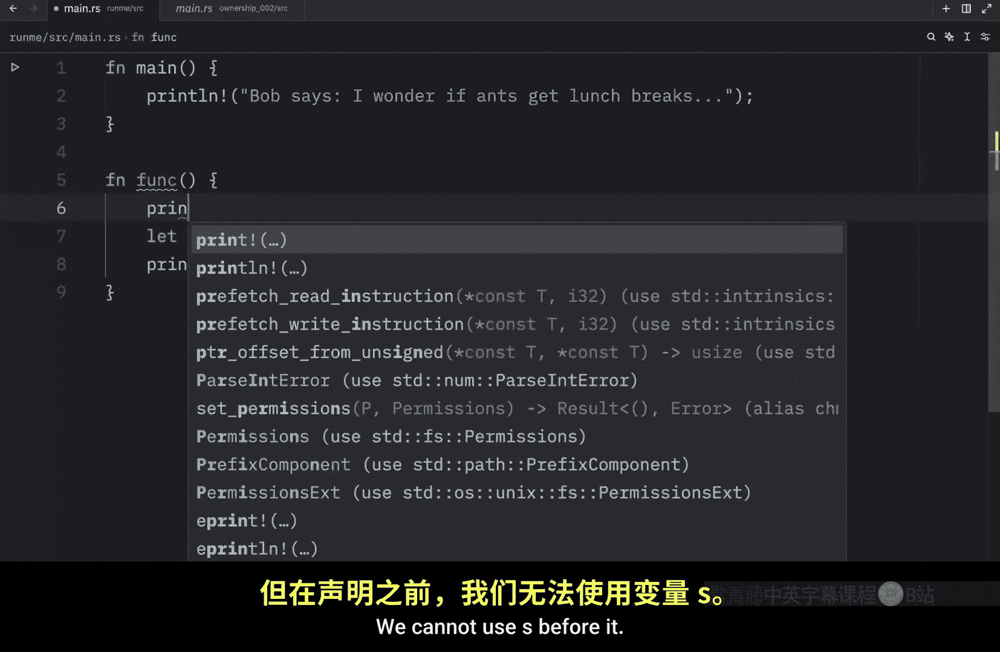
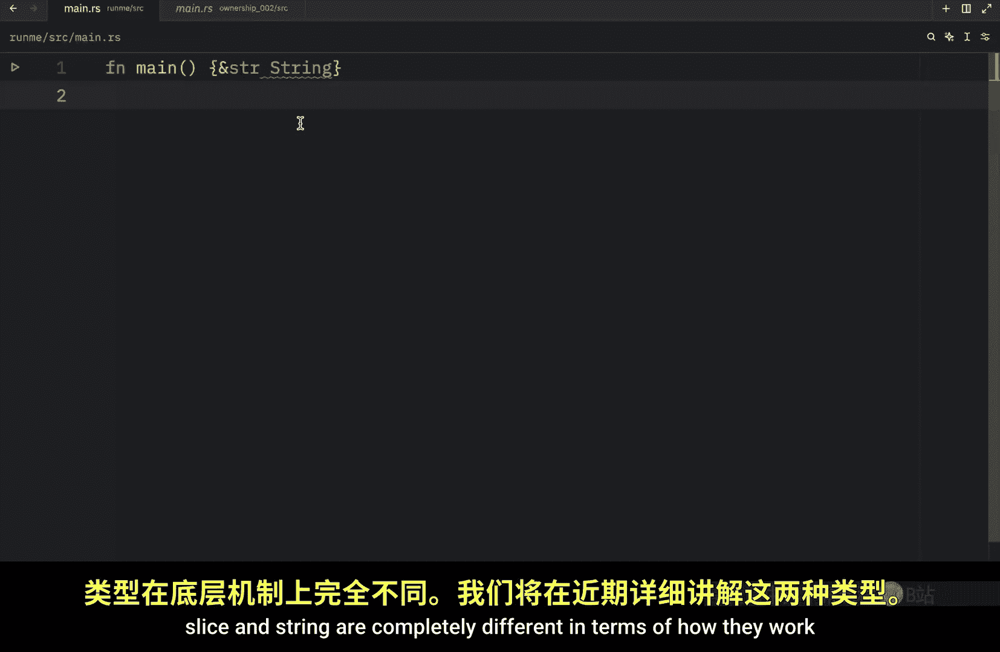
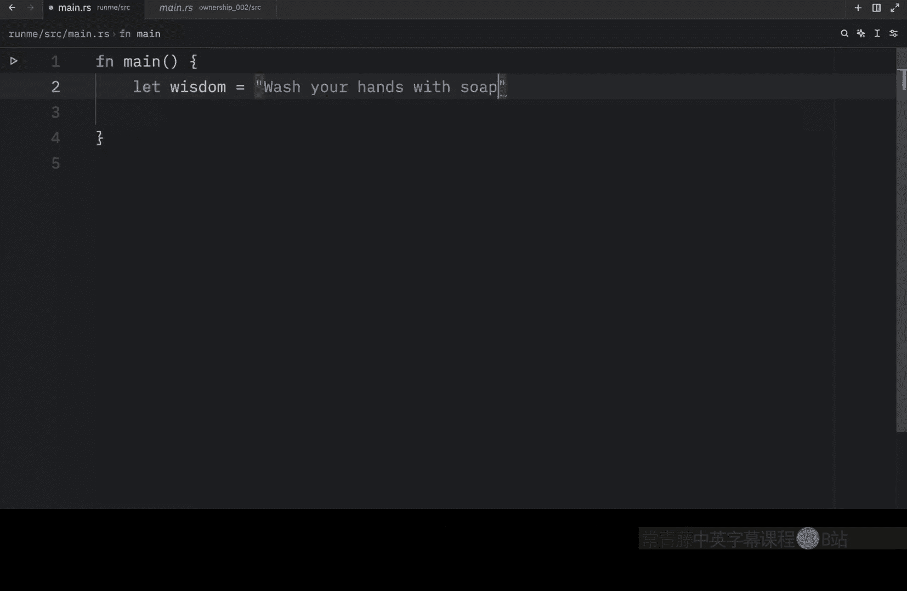
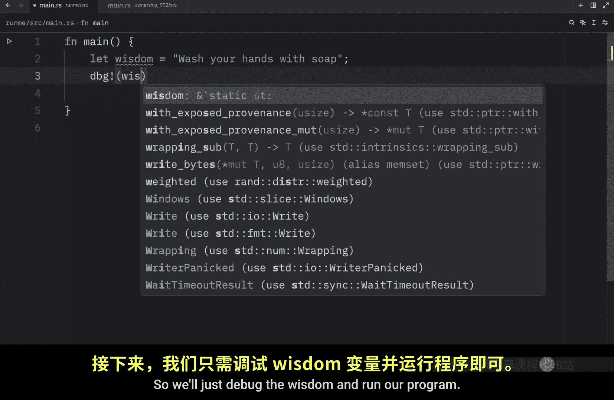
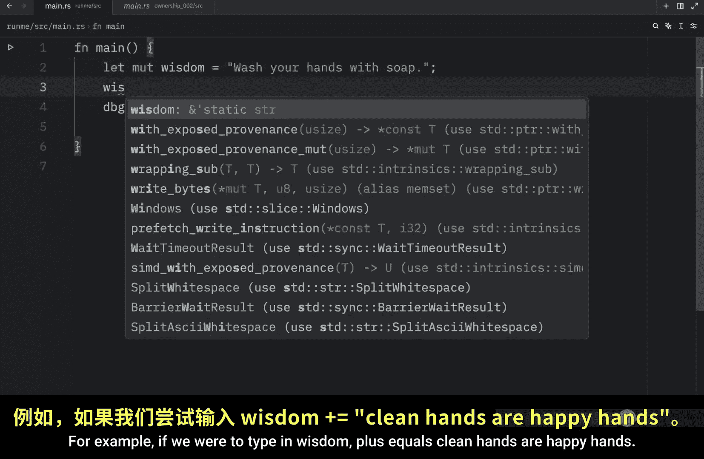
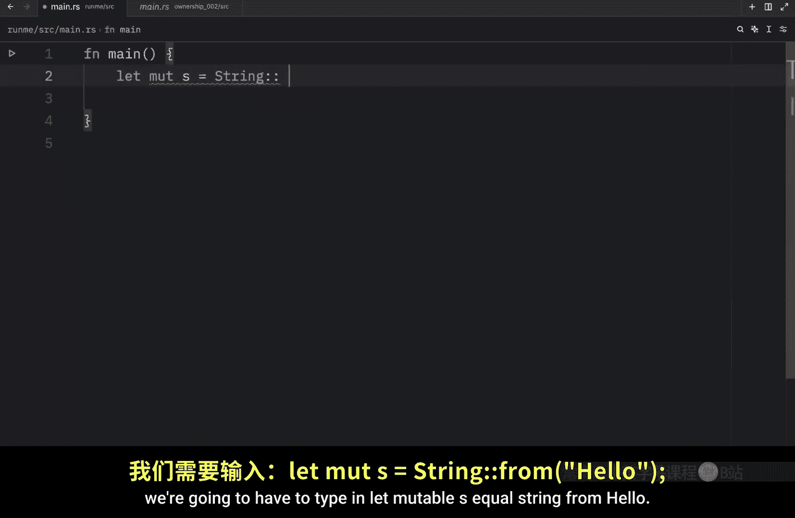
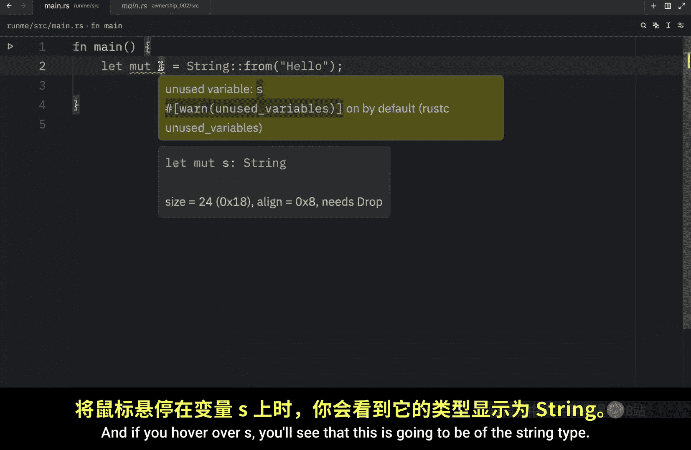
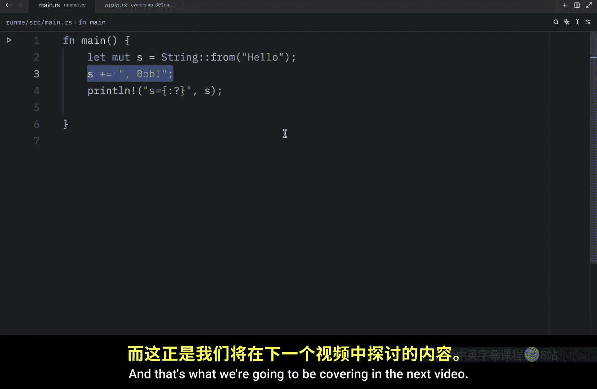

# 025：String 与 &str 初探 🧵

在本节课中，我们将继续学习 Rust 中的所有权概念。首先，我们需要了解一些核心规则，然后通过变量作用域和两种字符串类型的对比，来理解所有权如何在实际代码中运作。

## 所有权核心规则 📜

在 Rust 中处理所有权时，必须牢记以下三条核心规则：
1.  Rust 中的每一个值都有一个所有者。
2.  同一时间只能有一个所有者。
3.  当所有者离开作用域时，这个值将被丢弃。

## 变量作用域 🎯

上一节我们介绍了所有权的规则，本节中我们来看看变量作用域。作用域是一个程序中项目的有效范围。

例如，当我们创建一个函数时，就创建了一个属于该函数的作用域。花括号 `{}` 内的所有内容都被视为该函数的作用域。




```rust
fn function() {
    // 这是函数的作用域
    let s = "hello world";
    println!("{:?}", s); // 可以在这里使用 s
}
```

在函数内部声明变量 `s` 后，我们可以在声明之后使用它。但在声明之前，我们不能使用它。因为 Rust 在编译时还不知道这个变量。变量 `s` 的有效期持续到其作用域结束。一旦离开这个函数的作用域，我们就无法再使用 `s`。

## 字符串类型：&str 与 String 🧩

在之前的课程中，你可能注意到我将字符串切片和字符串类型都称为“字符串”。在 Rust 学习的初期，这没有问题。但现在我们开始接触核心概念，必须明确指出：**字符串切片 (`&str`)** 和 **字符串 (`String`)** 在底层工作机制上完全不同。

### 字符串字面量 (&str)






到目前为止，我们使用以下语法创建字符串字面量：
```rust
let wisdom = "wash your hands with soap";
```

这是一个字符串字面量，我们可以使用 `println!("{:?}", wisdom);` 来显示它。运行程序后，输出将是 `"wash your hands with soap"`。

字符串字面量是不可变的。这意味着我们无法编辑它。即使添加 `mut` 关键字，也无法向这个字符串字面量添加更多文本。例如，以下代码将无法工作：
```rust
let mut wisdom = "wash your hands with soap";
wisdom += " clean hands are happy hands"; // 错误：无法修改字符串字面量
```

字符串字面量非常方便易用，但并不适用于所有场景。例如，我们创建的字符串是不可变的。但如果我们想编辑字符串内容，该怎么办？

### String 类型

Rust 提供了第二种字符串类型 `String`，它允许我们进行修改。由于这种类型管理堆上的数据，它能够存储编译时未知大小的文本。








以下是创建 `String` 的方法：
```rust
let mut s = String::from("Hello");
```

如果你将鼠标悬停在 `s` 上，会发现它的类型是 `String`，而不再是字符串切片 `&str`。这是一个可以修改的类型，因为它存储在堆上。

代码中的两个冒号 `::` 被称为路径分隔符，它允许我们访问类型的关联函数或模块中的项目。在这个例子中，我们调用了定义在 `String` 类型上的关联函数 `from`。我们将在未来的课程中了解更多相关内容。

现在，只需知道我们正在处理一个可变的字符串。接下来，我们可以尝试修改它：
```rust
s += ", Bob";
println!("{:?}", s);
```



运行程序后，我们将得到输出：`"Hello, Bob"`。我们成功地修改了原始字符串。

## 总结 📝



本节课中我们一起学习了 Rust 所有权的三条核心规则，并通过变量作用域理解了值的生命周期。我们重点比较了两种字符串类型：不可变的字符串字面量 `&str` 和可变的、存储在堆上的 `String` 类型。关键区别在于它们处理内存的方式不同，而这正是我们下一节课要深入探讨的内容。