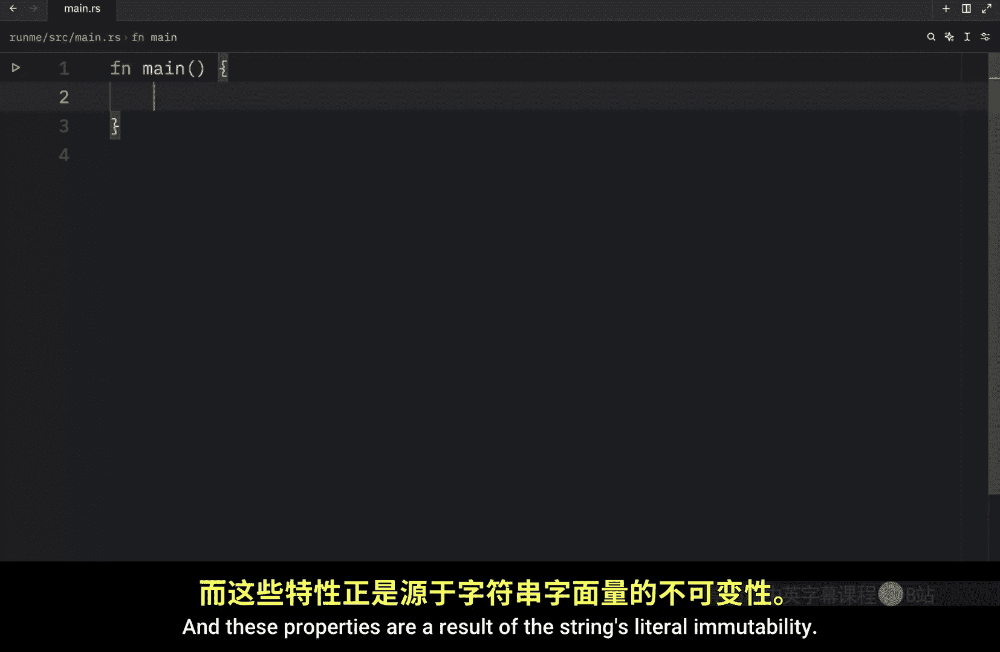
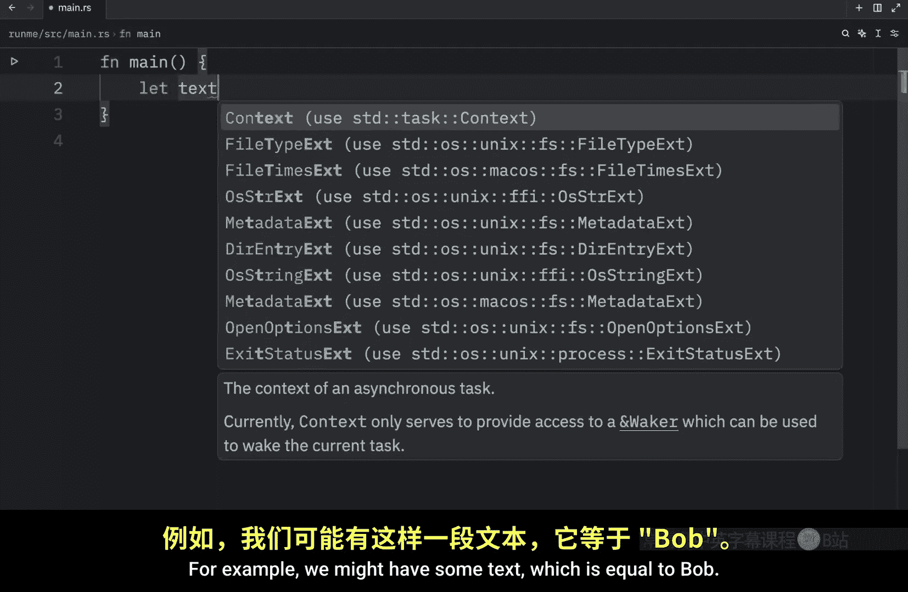
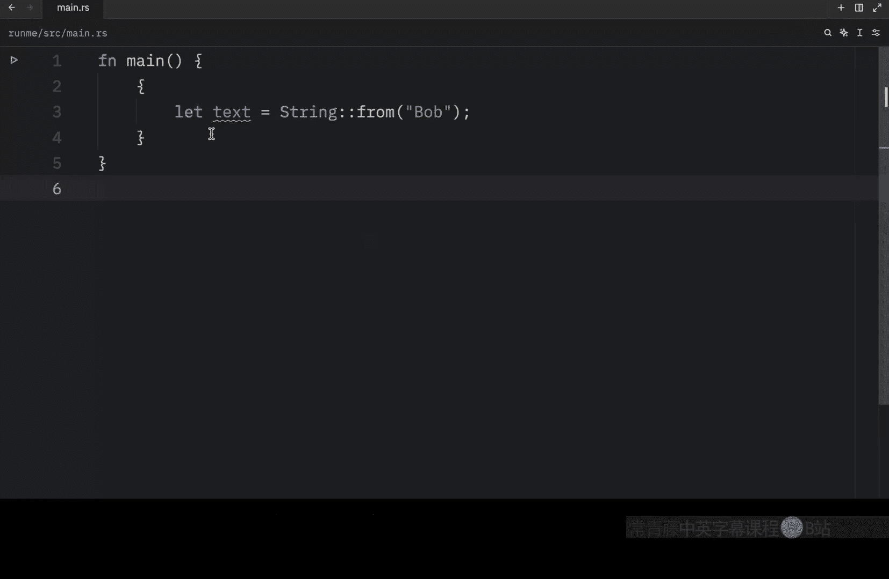
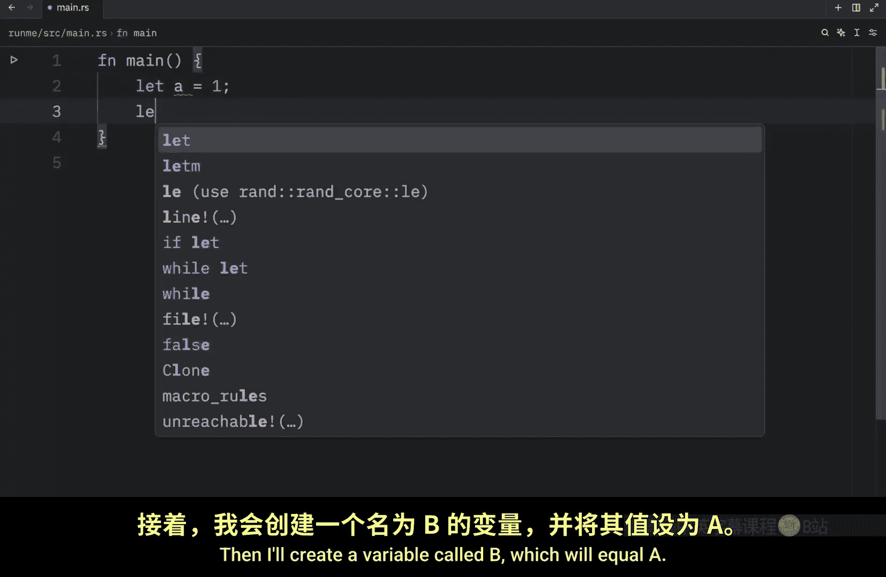
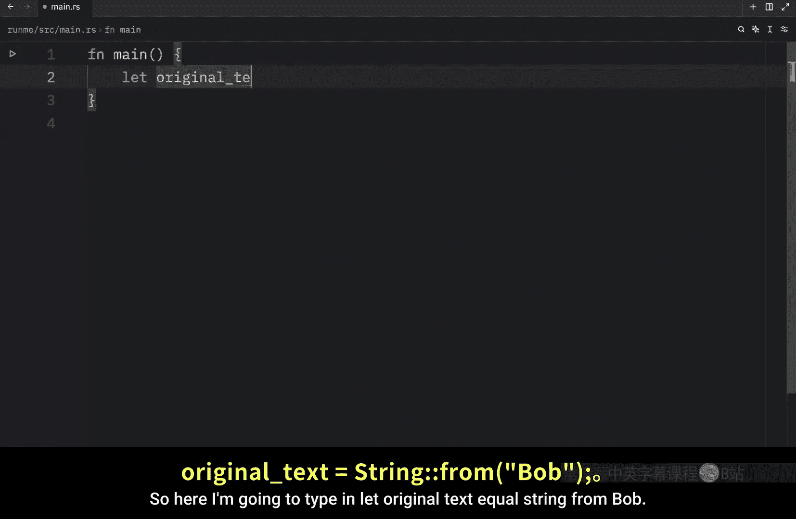
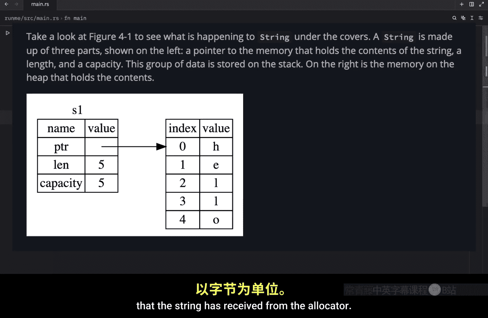

# 026：所有权与字符串

## 概述
在本节课中，我们将学习 Rust 中字符串可变与不可变的原因，以及这两种类型在内存处理上的差异。我们将探讨字符串字面量和 `String` 类型在编译时与运行时的行为，并深入理解 Rust 所有权的核心概念，特别是“移动”语义。

---

## 字符串字面量与 `String` 类型

上一节我们介绍了所有权的基本概念，本节中我们来看看它在字符串上的具体体现。

字符串字面量在编译时其内容就已确定。Rust 编译器会将这些文本硬编码到最终的可执行文件中。

**代码示例：**
```rust
let s = "Bob"; // 字符串字面量
```





这种处理方式使得字符串字面量非常快速和高效，而这些特性正是源于其**不可变性**。例如，文本 `"Bob"` 在编译时就被确认为三个字符，且不会改变。与任何可能改变的数据相比，这具有极高的效率，因为可变数据需要更多的处理过程。

---

## 可变字符串与堆内存分配

要创建一个可变的字符串，我们需要在堆上分配一块内存，而这块内存的大小在编译时是未知的。

这意味着计算机需要执行两个操作：
1.  在运行时通过内存分配器请求内存。
2.  在我们使用完该字符串后，将内存返还给分配器。

第一部分由我们通过代码触发。例如，使用 `String::from` 方法：

**代码示例：**
```rust
let mut s = String::from("Bob"); // 在堆上分配内存
```


第二部分则由 Rust 自动完成。一旦变量离开其作用域，Rust 就会自动回收内存。我们可以创建一个简单的作用域来演示：


**代码示例：**
```rust
{
    let text = String::from("Bob");
    // 在此作用域内可以使用 text
} // 离开此作用域时，`text` 被丢弃，内存被释放
// 此处无法再使用 `text`
```

一旦离开该作用域，`text` 变量就不再有效。如果尝试在作用域外使用它，Rust 编译器会报错，提示找不到该值，因为变量在离开作用域时已被“丢弃”。

---

## `drop` 函数与内存释放

当一个变量离开作用域时，Rust 会为我们调用一个特殊的函数——`drop`。`String` 类型的作者可以在这个函数中编写释放内存的代码。

Rust 会在右花括号 `}` 处自动调用 `drop`。这个模式极大地影响了 Rust 代码的编写方式。尽管看似简单，但在更复杂的情况下，当多个变量使用堆上分配的同一份数据时，代码行为可能会出乎意料。

接下来，让我们探讨一些这类情况。







---

## 简单值的复制

首先，我们看一个简单值的例子。创建一个变量 `a` 并赋值为 `1`，然后创建变量 `b` 并赋值为 `a`。

**代码示例：**
```rust
let a = 1;
let b = a; // 复制值并绑定到 b
println!("a: {}, b: {}", a, b);
```

由于整数是已知固定大小的简单值，它们可以轻松地被推入栈中，不会带来意外。这意味着我们可以同时打印 `a` 和 `b`，运行代码会得到预期的输出。

---

## `String` 的“移动”语义

现在，让我们看一个使用 `String` 的例子。




**代码示例：**
```rust
let original_text = String::from("Bob");
let text_copy = original_text; // 注意：这里发生的是移动，而非复制
println!("{}", text_copy);
// println!("{}", original_text); // 此行会导致编译错误！
```

如果我们尝试运行上述包含 `println!("{}", original_text);` 的代码，将会得到一个错误。这是因为在此上下文中，Rust 并没有进行复制。

根据官方文档，一个 `String` 由三部分组成：
1.  一个指向存放字符串内容内存的**指针**。
2.  一个**长度**（当前内容使用的字节数）。
3.  一个**容量**（从分配器获得的总字节数）。

这组数据存储在**栈**上。当我们执行 `let text_copy = original_text;` 时，我们复制的不是堆上的实际字符串数据，而是栈上的这组数据（即指针、长度和容量）。

之前我们提到，变量离开作用域时，Rust 会自动调用 `drop` 来清理其堆内存。如果 `original_text` 和 `text_copy` 都指向堆上的同一块内存，那么在作用域结束时就会产生严重问题：Rust 会尝试释放同一块内存两次，这被称为**双重释放**错误。这会导致内存损坏，并可能引发安全漏洞。

为了确保内存安全，当新变量复制了旧变量的栈数据（指针、长度、容量）时，Rust 会自动使旧变量失效。因此，上面代码中 `original_text` 在赋值后便不再有效。

这个过程在 Rust 中被称为**移动**——我们将数据的所有权从一个变量**移动**到了另一个变量，并废除了第一个变量。

因此，第二个变量更合适的名字应该是任何不暗示它是“副本”的名称，例如 `name`：

**代码示例：**
```rust
let original_text = String::from("Bob");
let name = original_text; // 所有权从 original_text 移动到 name
println!("{}", name); // 正确
// original_text 在此处已不可用
```

---

## 深度复制

需要了解的是，Rust 默认**永远不会**创建数据的**深度复制**。深度复制是指创建一个变量的完全独立副本，这通常开销很大，因为它需要复制变量内部的每一个数据。

因此，在 Rust 中，任何复制操作（对于实现了 `Copy` trait 的类型，如整数）或移动操作（对于 `String` 等类型），你都可以认为其在运行时性能上是低开销的，因为它不执行深度复制。

---

## 总结

本节课我们一起学习了：
1.  **字符串字面量**因其内容在编译时已知且不可变，所以高效，直接嵌入可执行文件。
2.  **`String` 类型**需要在堆上分配运行时才知道大小的内存，因此是可变的。
3.  Rust 通过**作用域**和 **`drop` 函数**自动管理堆内存的释放。
4.  对于 `String` 这样的类型，赋值操作（如 `let b = a;`）触发的是**移动**语义，而非复制。所有权转移后，原变量失效，这避免了双重释放错误，保证了内存安全。
5.  Rust 默认进行的是浅层复制（移动栈数据）或简单值复制，而非开销大的深度复制。


所有权是 Rust 最独特的特性之一，虽然初看起来概念较多，但随着实践深入，你会逐渐习惯并欣赏它带来的安全保证。在下一课中，我们将继续探讨所有权的其他方面。