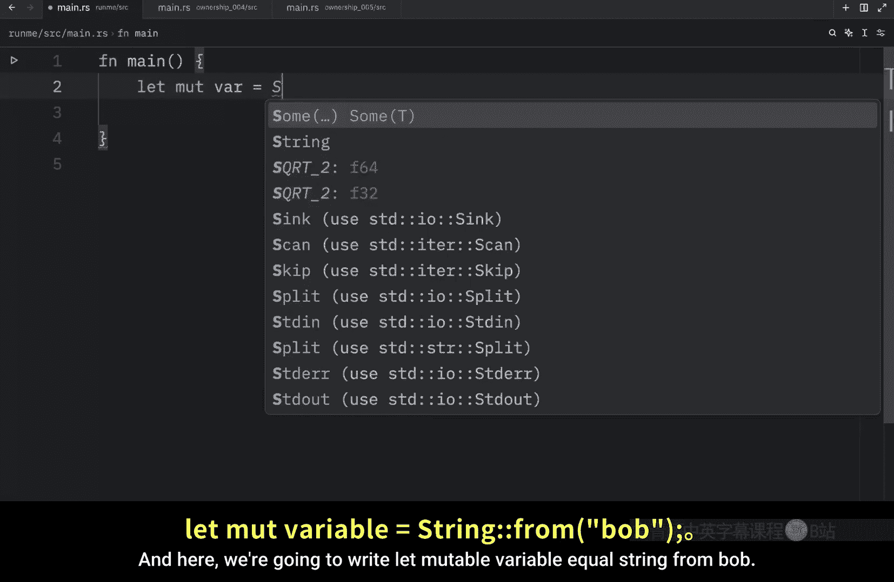
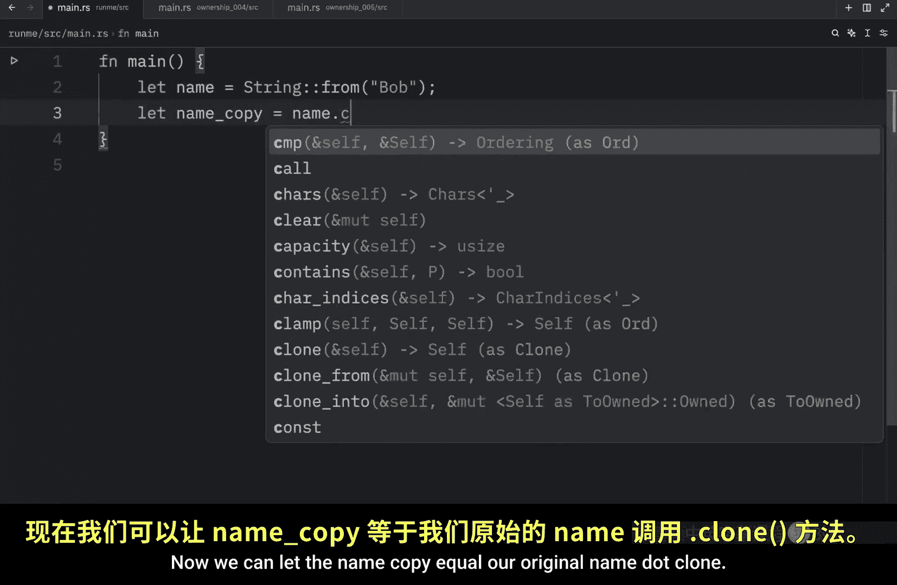
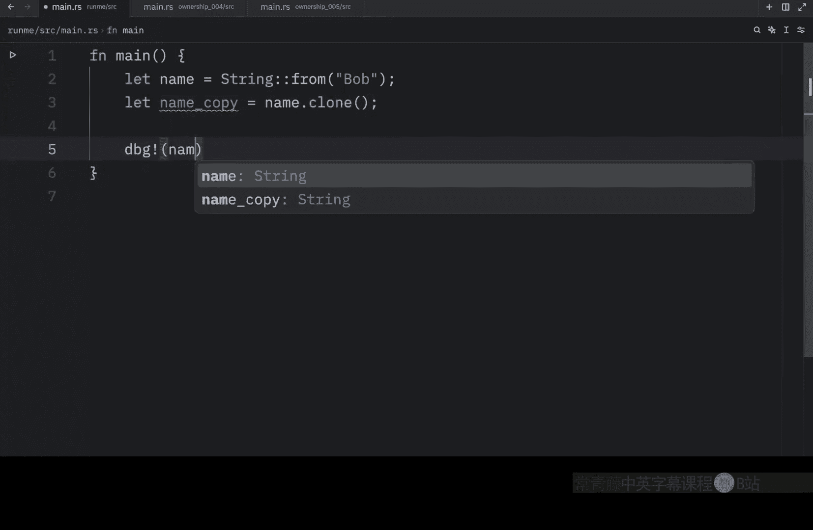
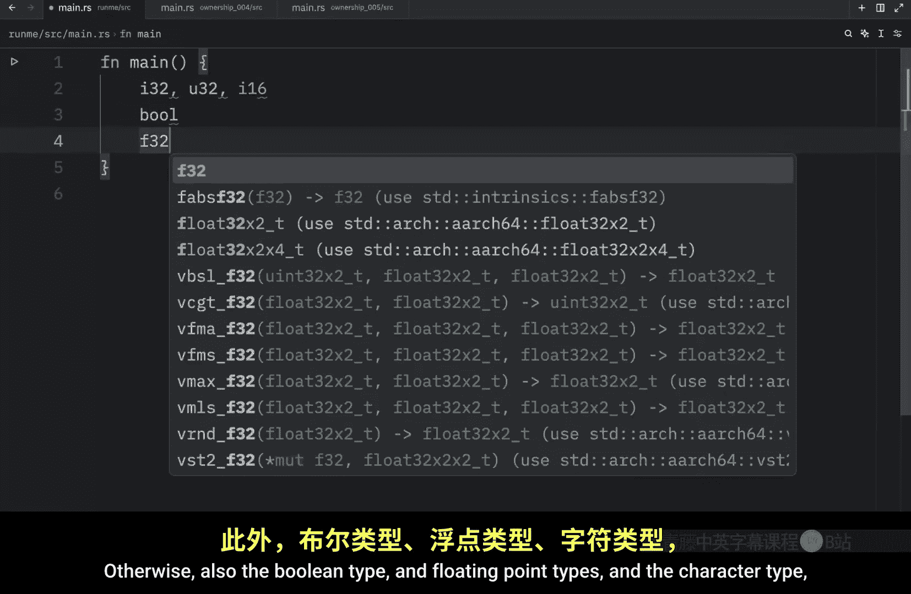
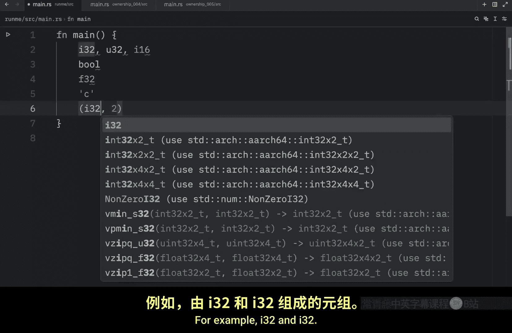
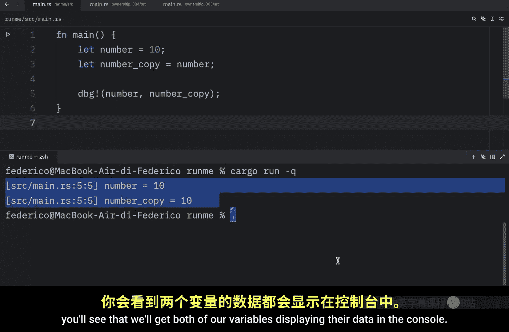
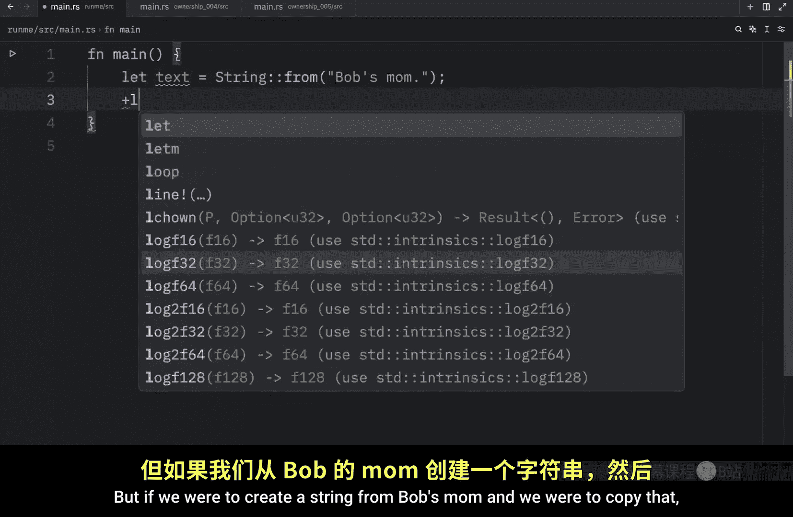
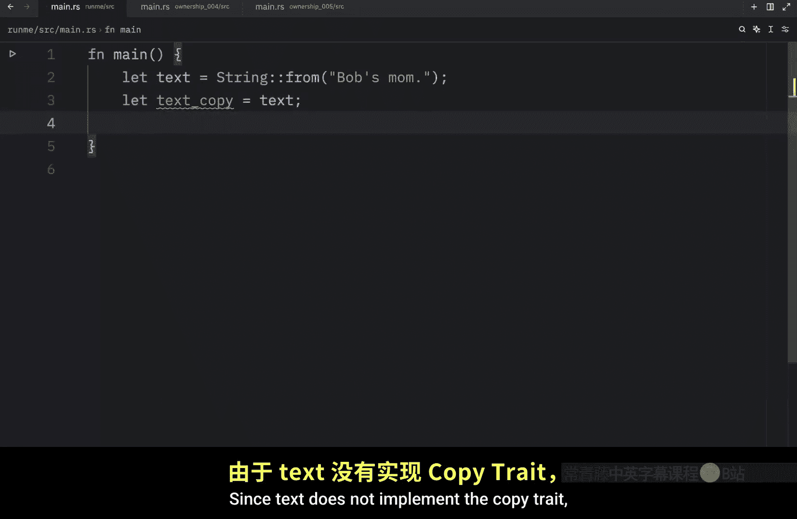
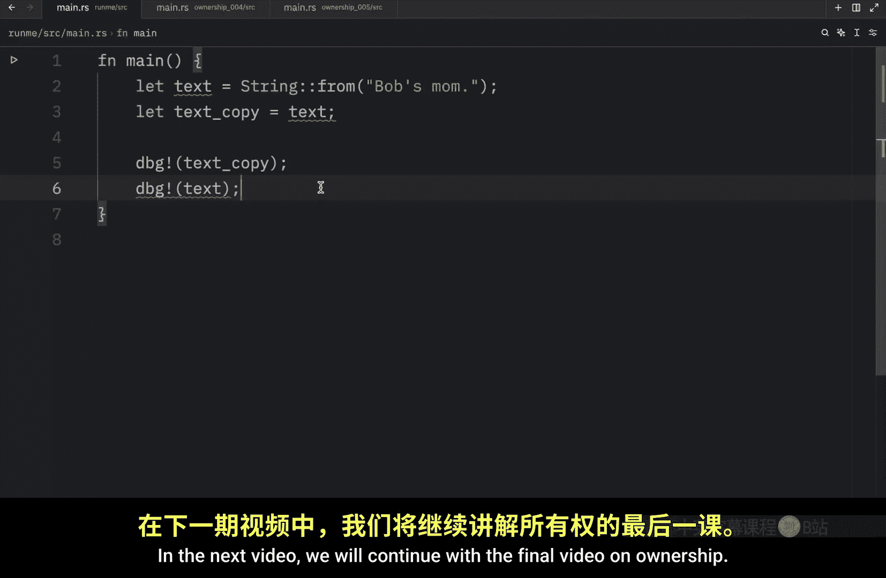

# 027：Rust 中的克隆与复制 📋

在本节课中，我们将继续学习 Rust 的所有权概念，重点探讨如何复制数据。我们将了解 `clone` 方法、`Copy` 特型，以及 Rust 如何根据数据类型决定是移动还是复制数据。

---

## 变量重新赋值与内存释放

上一节我们介绍了所有权的基本规则。本节中我们来看看一个简单的变量重新赋值场景。

以下代码演示了变量值的更新：




```rust
let mut variable = String::from("Bob");
variable = String::from("Ben");
println!("Hello {}", variable);
```

运行此代码将输出 `Hello Ben`。最初创建的字符串 `"Bob"` 在变量被重新赋值为 `"Ben"` 后，由于没有任何引用指向它，会立即离开作用域并被释放。Rust 的内存管理机制会自动处理这些不再使用的数据，无需手动干预。

---

## 移动与克隆

在之前的课程中，我们了解到将一个 `String` 赋值给新变量会导致数据移动，而非复制。

以下是移动的示例：

```rust
let name = String::from("Bob");
let name_copy = name; // 数据从 `name` 移动到 `name_copy`
// println!("{}", name); // 错误！`name` 在此处不再有效
println!("{}", name_copy); // 正确，输出 "Bob"
```

如果我们希望保留原始变量的使用权，就需要进行显式的克隆操作。

以下是使用 `clone` 方法进行深拷贝的示例：

```rust
let name = String::from("Bob");
let name_copy = name.clone(); // 显式克隆数据
println!("Original: {}, Copy: {}", name, name_copy); // 两者皆可使用
```


`clone()` 方法会创建数据的完整副本，允许两个变量独立使用各自的数据。但需要注意，克隆操作（尤其是对于大型数据）可能带来性能开销。






---


## Copy 特型与栈上数据

你可能会问，为什么之前对整数的赋值操作可以正常工作？

以下是整数赋值的示例：

```rust
let n1 = 100;
let n2 = n1; // 这是复制，而非移动
println!("n1: {}, n2: {}", n1, n2); // 两者皆可正常使用
```

这是因为像整数这样的简单标量类型实现了 `Copy` 特型。`Copy` 特型是一个编译器标记，用于那些**大小已知且存储在栈上**的类型。对于实现了 `Copy` 的类型，赋值操作会自动进行**按位复制**，原始变量在赋值后依然有效。

**核心概念**：如果一个类型实现了 `Copy` 特型，那么它的变量在赋值时会被**复制**，而不是**移动**。

---

## 哪些类型实现了 Copy？

以下是通常实现 `Copy` 特型的类型列表：

*   **所有整数类型**：例如 `i32`、`u64`、`i16` 等。
*   **布尔类型**：`bool`。
*   **浮点数类型**：`f32`、`f64`。
*   **字符类型**：`char`。
*   **元组**：仅当其包含的所有元素类型也都实现 `Copy` 时。例如，`(i32, f64)` 实现 `Copy`，但 `(i32, String)` 不实现。


任何需要堆分配或持有某种资源的类型（如 `String`、`Vec<T>`）都不会实现 `Copy` 特型。




---



## 对比示例


让我们通过一个对比来巩固理解：

**示例 1：实现 `Copy` 的类型（整数）**
```rust
let number = 42;
let number_copy = number; // 复制发生
println!("Number: {}, Copy: {}", number, number_copy); // 两者皆有效
```

**示例 2：未实现 `Copy` 的类型（String）**
```rust
let text = String::from("Hello");
let text_copy = text; // 移动发生，`text` 的所有权转移
// println!("Original: {}", text); // 错误！`text` 已无效
println!("Copy: {}", text_copy); // 正确
```

---








## 总结

本节课中我们一起学习了 Rust 中数据复制的机制：
1.  对于 `String` 等复杂类型，赋值默认是**移动**，使用 `clone()` 方法可以进行显式的**深拷贝**。
2.  对于整数等简单类型，由于实现了 `Copy` 特型，赋值是**自动复制**，原始变量保持有效。
3.  `Copy` 特型适用于大小固定、存储在栈上的类型，它是 Rust 高效内存管理的重要组成部分。



理解移动与复制的区别，是掌握 Rust 所有权系统的关键一步。下一节，我们将完成所有权部分的最终讲解。