# 028：函数与所有权 🔄

在本节课中，我们将要学习 Rust 中所有权机制如何与函数交互。具体来说，我们会探讨将值传递给函数时发生的所有权转移或复制行为，以及如何通过返回值和元组来管理所有权。

---

## 概述

将值传递给函数的机制与将值赋给变量非常相似。这意味着，将变量传递给函数会移动或复制它，就像赋值操作一样。


## 函数参数的所有权转移

以下是一个示例函数 `greet`，它接收一个 `String` 类型的参数。

```rust
fn greet(name: String) {
    println!("Hello {}", name);
}

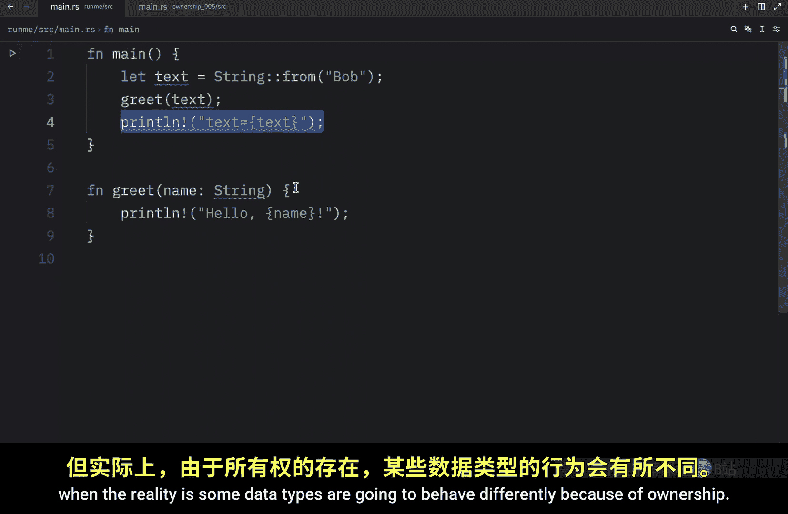

fn main() {
    let text = String::from("Bob");
    greet(text);
}
```

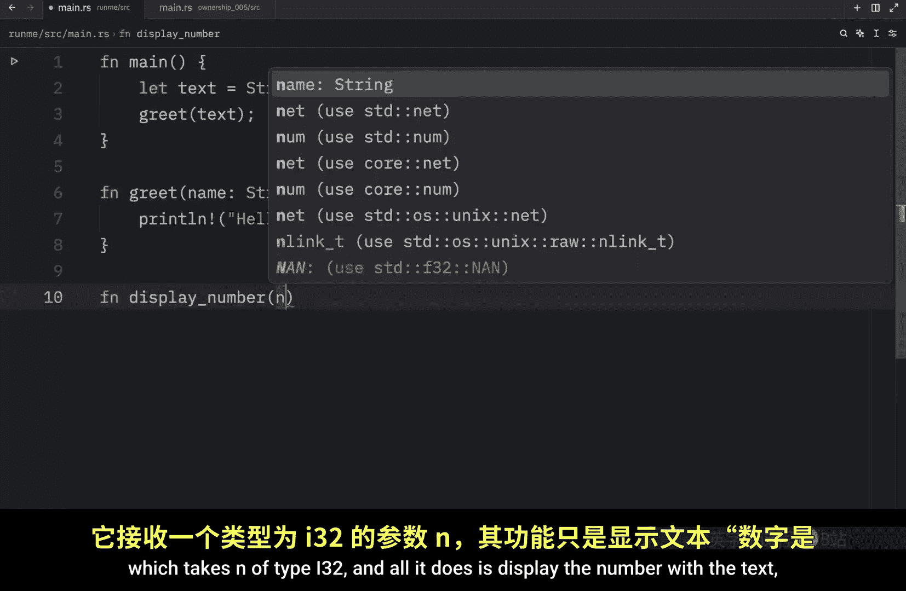


运行此代码会输出 “Hello Bob”。然而，一个关键点是：**函数 `greet` 取得了 `text` 的所有权**。这意味着在调用 `greet(text)` 之后，变量 `text` 不再有效。

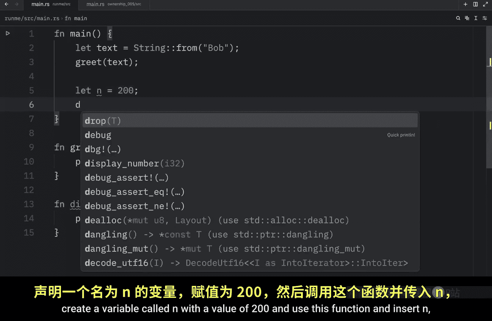

如果尝试在函数调用后再次使用 `text`，例如 `println!("{}", text);`，Rust 编译器会报错，提示 `text` 的值已被移动。这是因为 `String` 类型没有实现 `Copy` trait。

## 实现 Copy Trait 的类型

上一节我们介绍了所有权如何因函数调用而转移，本节中我们来看看当类型实现 `Copy` trait 时的情况。

对于实现了 `Copy` trait 的类型（如 `i32`），将值传递给函数时会发生复制，原始变量在函数调用后仍然可用。

```rust
fn display_number(n: i32) {
    println!("The number is {}", n);
}

fn main() {
    let n = 200;
    display_number(n);
    // n 仍然有效，因为 i32 实现了 Copy
    println!("Second attempt: {}", n);
}
```

此代码可以成功编译并运行，因为 `i32` 类型在传递时被复制。

## 返回值的所有权转移

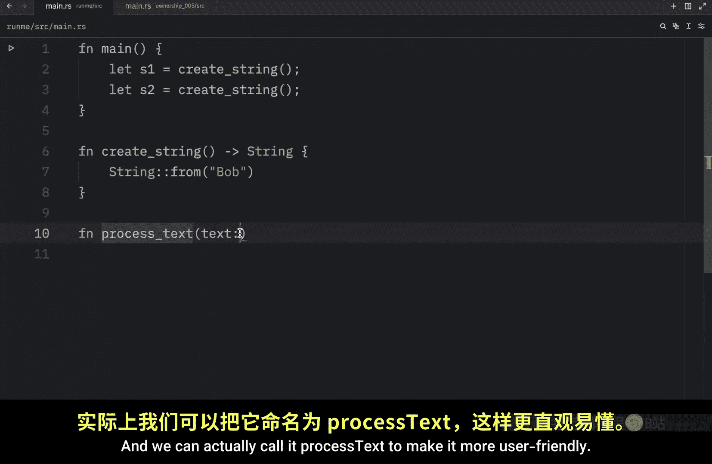

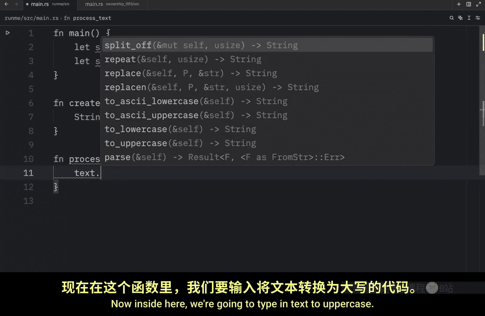

函数不仅可以通过参数取得所有权，也可以通过返回值转移所有权。

以下是一个创建并返回 `String` 的函数示例。

```rust
fn create_string() -> String {
    String::from("Bob")
}

fn main() {
    let s1 = create_string(); // 返回值所有权转移给 s1
    let s2 = create_string(); // 返回值所有权转移给 s2
    println!("{:?}, {:?}", s1, s2);
}
```

需要注意的是，`println!` 宏也会取得其参数的所有权。对于未实现 `Copy` 的类型，在使用 `println!` 后便无法再次使用该变量。

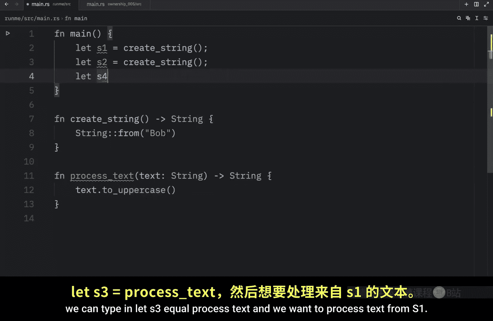

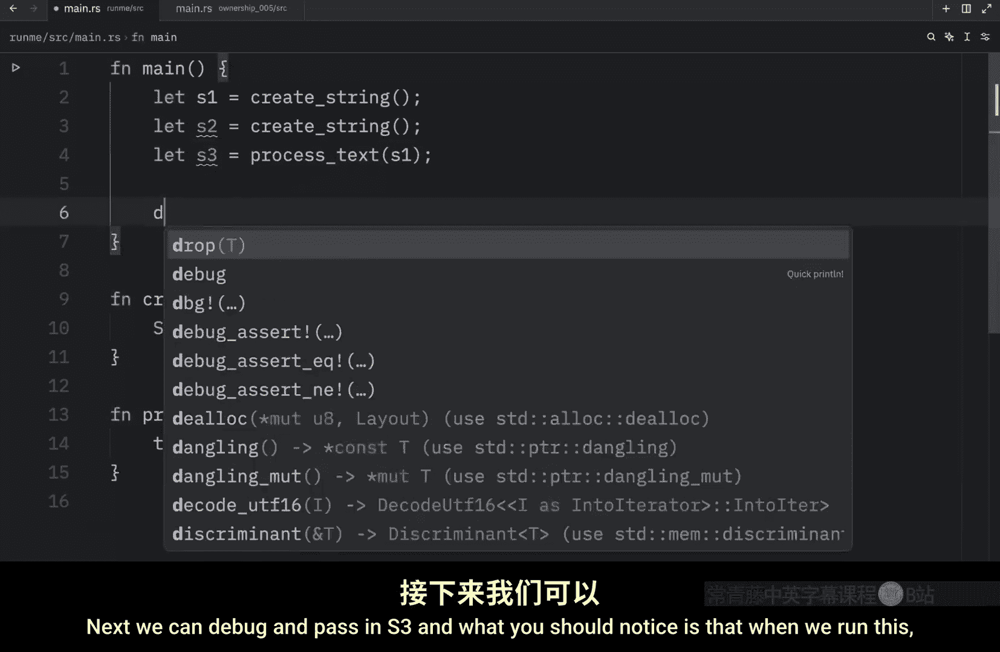

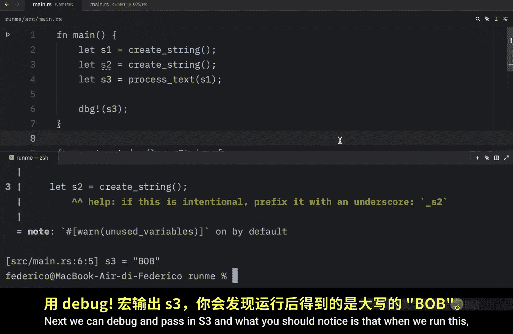

## 取得并返回所有权

有时我们希望函数处理一个值，但之后还能继续使用它。这可以通过让函数取得所有权并再返回它来实现。

以下是处理字符串并返回的函数示例。

```rust
fn process_text(text: String) -> String {
    text.to_uppercase() // 返回新的 String，所有权转移回调用者
}

fn main() {
    let s1 = String::from("Bob");
    let s3 = process_text(s1); // s1 的所有权被移动
    // s1 在此之后不再有效
    println!("{}", s3); // 输出 "BOB"
}
```

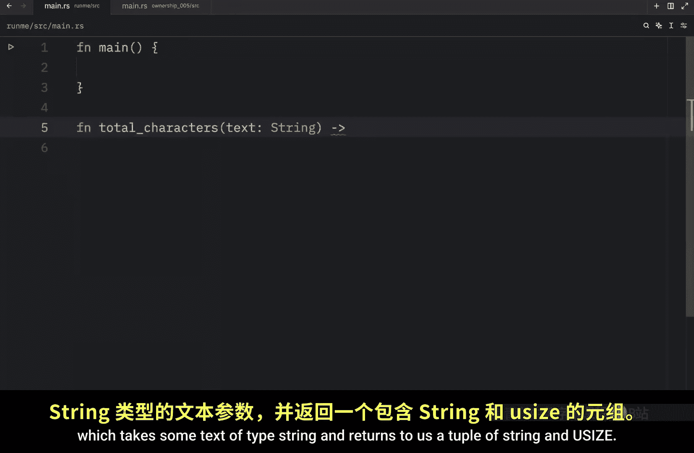

在这个例子中，`s1` 的所有权被移动到 `process_text` 函数中。函数处理完后，通过返回值将所有权转移给了新变量 `s3`。原始的 `s1` 在移动后失效。

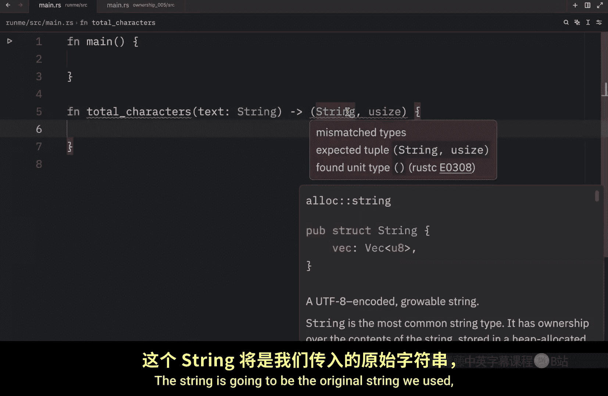

## 使用元组返回多个值

如果想让函数使用一个值但不取得其所有权，同时还想返回关于该值的其他信息，一种方法是使用元组返回多个值。

以下是计算字符串长度并返回原始字符串和长度的函数示例。

```rust
fn total_characters(text: String) -> (String, usize) {
    let length = text.chars().count(); // 计算字符数
    (text, length) // 以元组形式返回原始字符串和长度
}


fn main() {
    let text = String::from("Bob");
    let (text, length) = total_characters(text); // 接收返回的元组
    println!("The text '{}' has a total length of {}.", text, length);
}
```


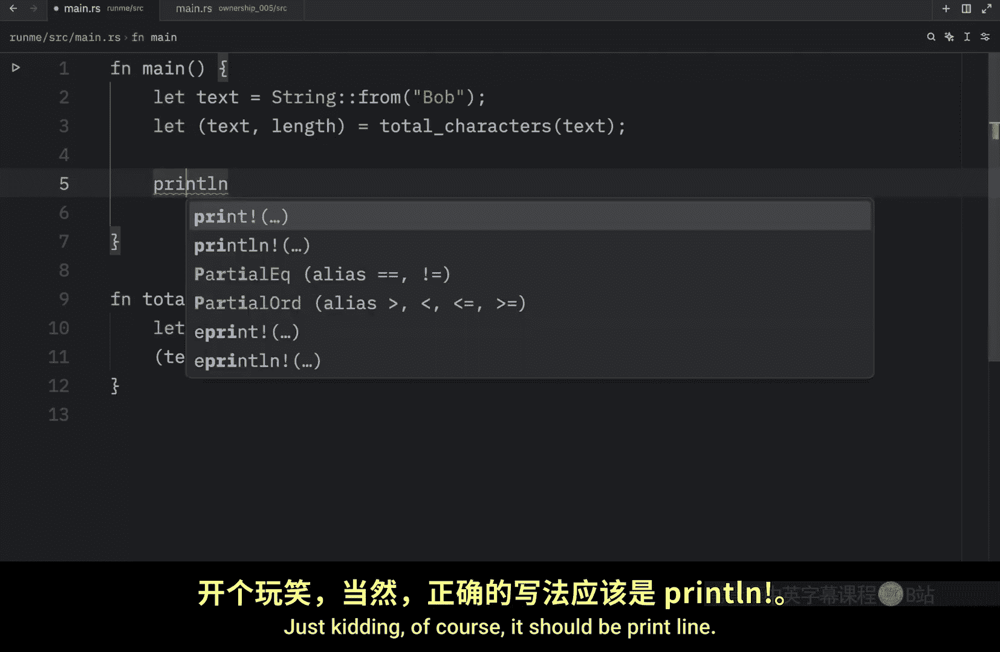

通过这种方式，我们成功地将所有权“往返”传递，使得在函数调用后仍能使用原始数据。但这对于简单的操作来说仍然显得繁琐。

---

## 总结

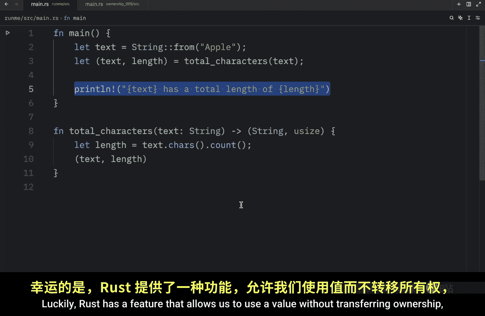

本节课中我们一起学习了 Rust 中函数与所有权的交互：
1.  将变量传递给函数会移动或复制它，取决于该类型是否实现 `Copy` trait。
2.  函数可以通过返回值转移所有权。
3.  可以使用元组从函数返回多个值，从而在操作后保留对原始数据的所有权。
4.  管理所有权的这些模式虽然强大，但有时会带来不便。幸运的是，Rust 提供了**引用**这一特性，它允许我们使用值而无需取得所有权，这将是我们下节课要探讨的内容。