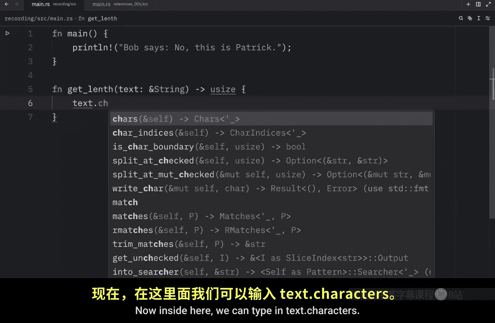
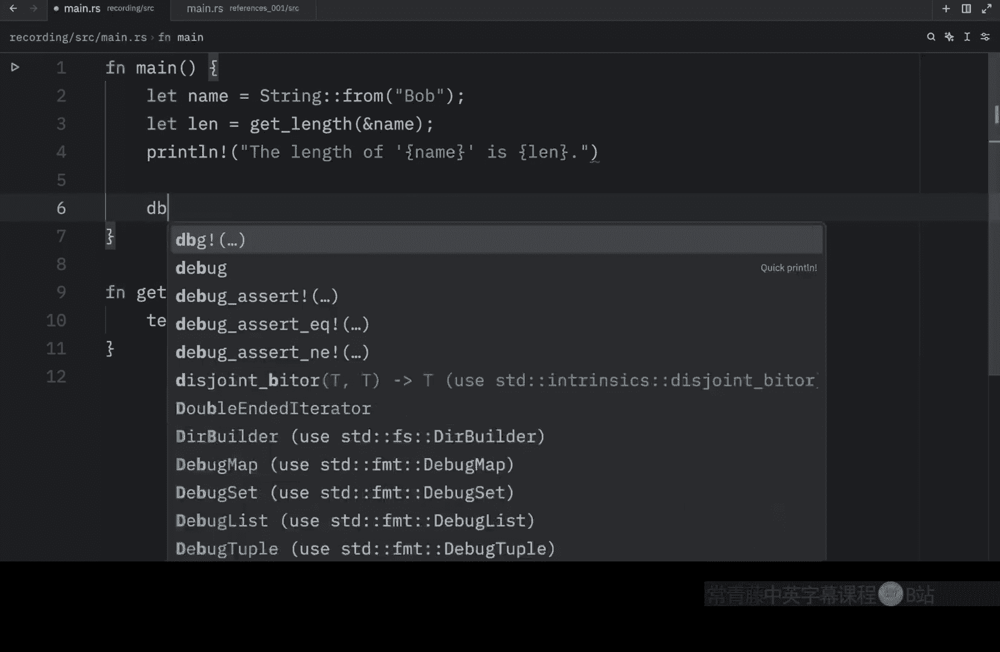

# 029：理解引用

## 概述
在本节课中，我们将要学习 Rust 中的一个核心概念：**引用**。我们将了解什么是引用，它如何帮助我们避免所有权转移带来的复杂问题，以及如何使用引用来“借用”数据而不获取其所有权。

上一节我们介绍了所有权，最后探讨了如何通过返回元组来保持所有权，以便能继续使用变量。返回元组本身没有问题，但在我们之前的例子中，为了实现目标，这种方法显得过于复杂。一个更好的方法是提供对字符串值的**引用**。

引用类似于指针，它是一个地址，我们可以通过这个地址访问由另一个变量拥有的、存储在该地址的数据。但与指针不同，引用在其生命周期内保证指向特定类型的有效值。

## 创建使用引用的函数

这次，我们将创建一个与上节视频中相同的函数，但会使用引用，这将帮助我们避免返回元组。

以下是函数定义步骤：

1.  我们输入 `get_length` 作为函数名。
2.  在参数中，我们创建 `text`。请注意，我将在数据类型前使用 `&` 符号。这个 `&` 用于表示一个引用。因此，`text` 现在必须是一个引用。
3.  这个函数将返回 `usize` 类型。
4.  在函数体内，我们可以输入 `text.chars().count()` 来计算长度。




对应的代码如下：
```rust
fn get_length(text: &String) -> usize {
    text.chars().count()
}
```

## 在 `main` 函数中调用

接下来，我们进入 `main` 函数。

以下是具体操作步骤：


1.  创建一个名为 `name` 的变量，其值为字符串 `"George"`。
2.  然后，我们让变量 `length` 等于 `get_length(&name)`。这里我们需要传入一些文本，所以我们再次使用 `&` 符号传入 `name`。
3.  再次使用 `&` 允许我们引用一个值而不获取其所有权。由于这是一个引用，它所指向的值在我们使用完毕后不会被丢弃。
4.  接下来，我们执行 `println!`，打印名字的长度。

对应的代码如下：
```rust
fn main() {
    let name = String::from("George");
    let length = get_length(&name);
    println!("The length of '{}' is {}.", name, length);
}
```

如果我们以安静模式运行此代码，会注意到 `George` 的长度是 6。我们也可以将其改为 `Bob`，这会返回 3。这样做最大的好处是我们的变量仍然有效，因为我们没有获取所有权，这意味着我们以后仍然可以使用它们。




所以在这里，我们可以传入 `name` 和 `length`，只要我在 `println!` 语句后加上分号，这就能正常工作。运行后，我们会在控制台看到名字和长度都被打印出来。

## 理解借用

我们称创建引用的动作为**借用**。就像现实生活中一样，如果你从别人那里借了东西，你可以使用它，但你不拥有它，最终必须归还。

如果我们尝试修改一个借用的变量会发生什么？在下一个示例中，我将创建一个名为 `modify` 的新函数。

以下是函数定义：

1.  函数 `modify` 接受一个参数 `text`。
2.  该参数将是这种引用类型 `&String`。
3.  在函数体内，我们输入 `text.push_str("!")`，为文本追加一个感叹号。


对应的代码如下：
```rust
fn modify(text: &String) {
    text.push_str("!");
}
```

现在我们可以回到 `main` 函数，输入 `modify(&name)`，传入一个引用。这满足了第一部分的要求，因为这是一个 `String` 类型的引用。

但是，Rust 再次不会编译这段代码，因为我们试图修改一个不可变的变量。**引用在默认情况下是不可变的**。

不过，这并非世界末日，因为在下一节视频中，我将教你如何创建和使用可变引用。


## 总结
本节课中我们一起学习了 Rust 中的**引用**。我们了解到引用是一种允许你访问数据而不获取其所有权的机制，这通过 `&` 符号实现。我们创建了一个使用引用的函数来计算字符串长度，从而避免了所有权转移和返回元组的复杂性。我们还了解到，默认情况下引用是不可变的，尝试通过它们修改变量会导致编译错误。在下一节中，我们将探讨如何通过可变引用来修改借用的数据。