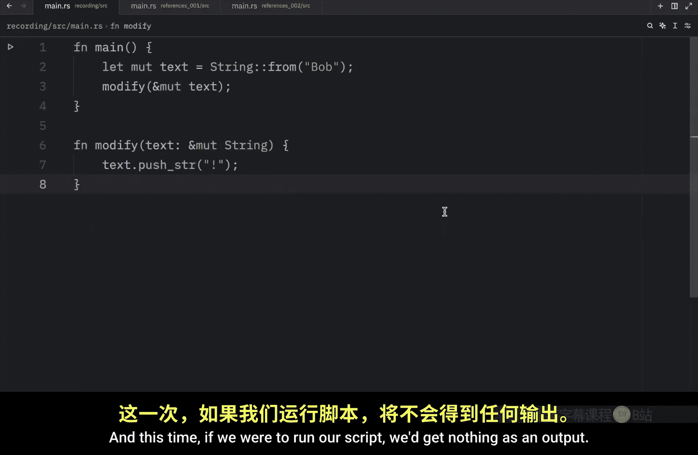
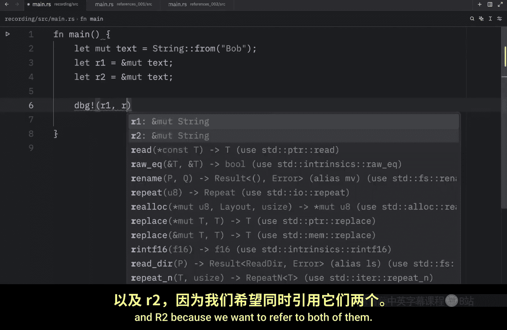
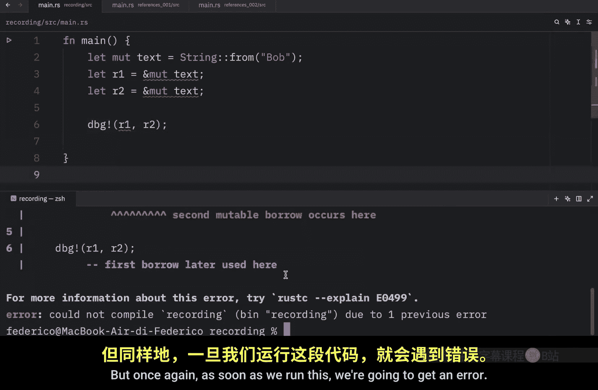
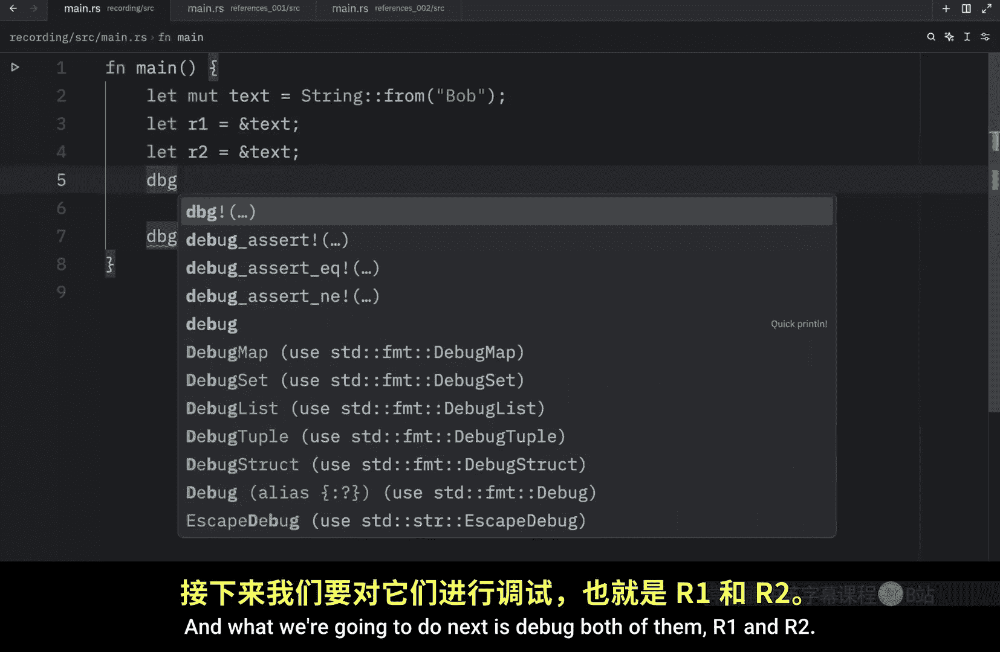

# 030：可变引用详解 🧩

在本节课中，我们将学习 Rust 中一个核心且强大的概念：**可变引用**。我们将了解如何通过可变引用来修改数据，同时避免所有权转移，并深入探讨其背后的规则与限制。

---

## 概述

上一节我们了解到，Rust 中的引用默认是不可变的。本节中，我们来看看如何创建和使用**可变引用**，从而在保留所有权的同时修改数据。我们还将学习可变引用的关键规则，这些规则是 Rust 保证内存安全、防止数据竞争的基石。

---

## 创建可变引用

之前我们尝试修改一个通过引用传递的字符串，但失败了，因为默认的引用是不可变的。

为了修复代码，我们需要明确告诉 Rust 我们想要一个**可变引用**。这可以通过在类型前添加 `mut` 关键字来实现。

以下是修复后的代码示例：

```rust
fn modify_text(text: &mut String) {
    text.push_str("!");
}

fn main() {
    let mut text = String::from("Bob");
    modify_text(&mut text);
    println!("The text is: {}", text); // 输出：The text is: Bob!
}
```




在这个例子中：
*   我们在函数签名 `&mut String` 和调用处 `&mut text` 都使用了 `mut` 关键字。
*   这次我们成功地修改了字符串，而没有转移其所有权，这一切都是通过**可变引用**完成的。

---

## 可变引用的核心限制

可变引用有一个重要的限制：**在特定作用域内，对同一块数据只能有一个活跃的可变引用**。

以下代码将导致编译错误：

```rust
let mut text = String::from("Bob");
let r1 = &mut text;
let r2 = &mut text; // 错误！不能同时借用 `text` 为可变多次
println!("{}, {}", r1, r2);
```

这个限制是 Rust 在编译时防止**数据竞争**的关键机制。数据竞争发生在以下三种行为同时出现时：
1.  两个或更多指针同时访问同一数据。
2.  至少有一个指针被用来写入数据。
3.  没有同步机制来管理对这些数据的访问。


数据竞争会导致未定义行为，在运行时难以追踪和修复。





---

## 通过作用域使用多个可变引用

虽然不能同时使用多个可变引用，但可以通过创建不同的作用域来使用它们。关键在于引用不能**同时**活跃。

以下代码可以正常工作：

```rust
let mut text = String::from("Bob");
{
    let r1 = &mut text;
    println!("r1: {}", r1);
} // r1 的作用域在此结束，它不再活跃
let r2 = &mut text; // 现在可以创建新的可变引用
println!("r2: {}", r2);
```

因为 `r1` 和 `r2` 活跃于不同的作用域，它们没有同时引用同一数据。


---


## 可变引用与不可变引用的组合规则

关于引用组合，Rust 有明确的规则：

*   **允许同时存在多个不可变引用**，因为它们都是只读的，不会引发数据竞争。
    ```rust
    let text = String::from("Bob");
    let r1 = &text;
    let r2 = &text; // 允许
    println!("{}, {}", r1, r2);
    ```


*   **不允许可变引用与不可变引用同时存在**。
    ```rust
    let mut text = String::from("Bob");
    let r1 = &text;      // 不可变引用
    let r2 = &mut text;  // 错误！不能同时借用为不可变和可变
    ```
    这是因为不可变引用的使用者理应能信赖数据不会被改变。如果同时存在可变引用，这种信赖就被破坏了。

---

## 引用作用域的结束时机

一个引用的作用域从它被引入的地方开始，到它**最后一次被使用**的地方结束，而非其所在代码块的末尾。理解这一点有助于编写合法的代码。

观察以下能成功编译的代码：

```rust
let mut text = String::from("Bob");
let r1 = &text;
let r2 = &text;
println!("{} and {}", r1, r2); // r1 和 r2 的最后一次使用
// 自此之后，r1 和 r2 不再被使用，它们的借用结束
let r3 = &mut text; // 现在创建可变引用是允许的
println!("{}", r3);
```


因为不可变引用 `r1` 和 `r2` 在 `println!` 之后就不再被使用，它们的借用在那时就已经结束，因此后面可以安全地创建可变引用 `r3`。




---

## 活跃引用期间修改原变量

当对一个变量存在活跃的**可变引用**时，在引用作用域结束前，你不能直接修改原变量。

以下代码无法编译：

```rust
let mut x = 10;
let y = &mut x;
x = x + 3; // 错误！不能修改 `x`，因为存在对它的活跃可变借用 `y`
println!("{}", y);
```

要解决这个问题，必须确保可变引用 `y` 在修改原变量 `x` 之前离开作用域（即不再被使用）。

```rust
let mut x = 10;
let y = &mut x;
println!("y: {}", y); // y 在此被最后一次使用，借用结束
x = x + 3; // 现在可以修改 x
println!("x: {}", x);
```


---

## 总结

本节课中我们一起学习了 Rust 的**可变引用**。我们掌握了：
1.  如何使用 `&mut` 创建可变引用来修改数据。
2.  可变引用的核心限制：**同一时间、同一作用域内，对同一数据只能有一个可变引用**。
3.  可变引用与不可变引用不能共存。
4.  引用的作用域持续到其最后一次被使用为止。
5.  在存在活跃可变引用时，不能直接修改原变量。


这些严格的规则是 Rust 无需垃圾回收就能保证内存安全和并发安全的关键。理解并遵守它们，是编写健壮 Rust 代码的基础。