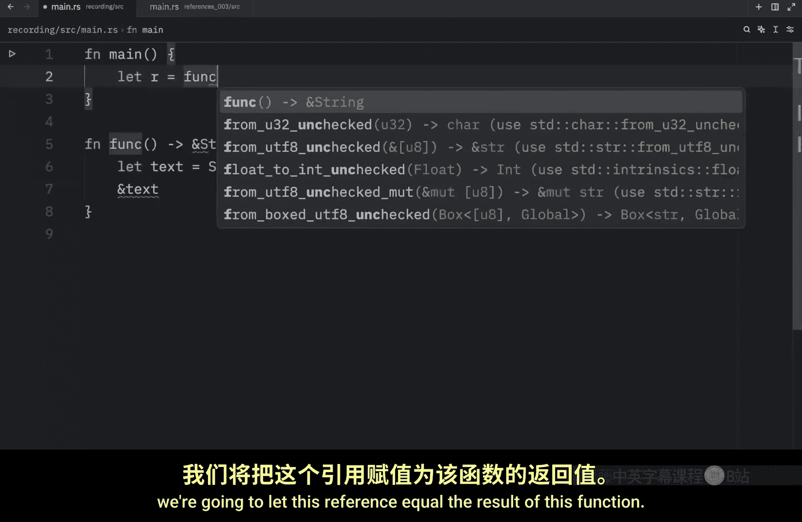
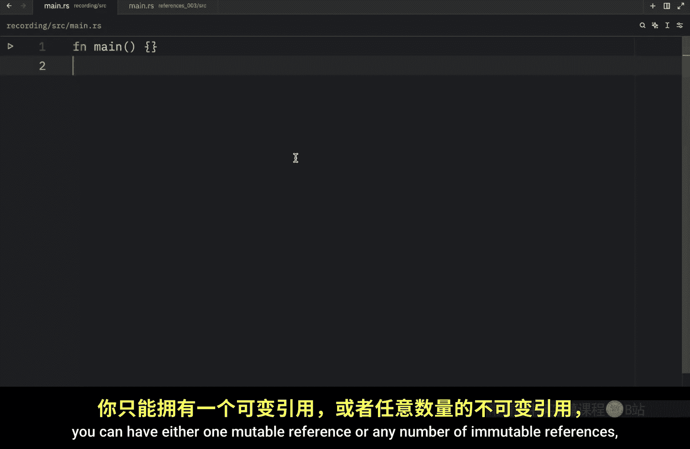

# 031：悬垂引用与编译器保障 🛡️

在本节课中，我们将要学习 Rust 中的一个核心安全特性：悬垂引用。我们将了解什么是悬垂引用，为什么它们危险，以及 Rust 编译器如何确保你的代码永远不会产生悬垂引用。

## 什么是悬垂引用？

在拥有指针概念的语言中，很容易错误地创建一个悬垂指针。这种情况通常发生在释放了某块内存，却保留了指向该内存的指针时。一个**悬垂指针**是指向一块可能已经被重新分配或释放的内存的指针。

幸运的是，Rust 的编译器保证引用永远不会是悬垂的。如果你拥有某个数据的引用，编译器会确保该数据在引用被使用之前不会离开其作用域。

## 一个悬垂引用的尝试示例

为了将上述概念置于具体情境中，我们来创建一个示例。我们将创建一个名为 `function` 的函数，它试图返回一个引用类型。

```rust
fn function() -> &str {
    let text = String::from("Bob");
    &text
}
```


在 `main` 函数中，我们将尝试获取这个函数的返回结果：


```rust
fn main() {
    let r = function();
}
```



我们在这里试图创建一个悬垂引用。或者说，我们**试图**这样做，因为 Rust 不允许我们创建悬垂引用。

## 编译器如何阻止我们

如果我们尝试编译这段代码，将会导致一个错误。错误信息大致是：“此函数的返回类型包含一个借用值，但没有可供借用的值”。

我们指定了想要返回一个引用 `&str`，然后在函数内部创建了一个新的 `String` 并试图返回对它的引用。然而，当函数执行到右花括号 `}` 时，变量 `text` 离开了作用域并被丢弃，其内存被释放。但我们却告诉 Rust 我们想返回一个指向 `text` 的引用。这意味着我们的引用将指向一个已不存在的数据。

Rust 编译器会阻止我们运行这种有问题的代码。我们不应该被允许引用已不存在的数据，否则会在代码中引发大量问题。

## 解决方案：正确使用所有权

接下来，我们看看这个问题的解决方案。本质上，解决方案就是确保在正确的地方使用引用。在上面的例子中，我们本不需要使用引用类型，使用它反而破坏了程序。

我们只需要返回一个普通的 `String` 即可：

```rust
fn function() -> String {
    let text = String::from("Bob");
    text
}
```

这样修改后，我们的程序就没有错误了。我们可以在终端中运行程序来验证，得到的输出将是 `r` 等于 `"Bob"`。

## 引用规则回顾

作为对本节及之前内容的回顾，以下是 Rust 中关于引用的核心规则：
*   在任意给定时间，对于特定数据，你**只能拥有以下两者之一**：
    *   一个可变引用 (`&mut T`)。
    *   任意数量的不可变引用 (`&T`)。
*   引用必须始终是有效的（即永不悬垂）。

---



本节课中，我们一起学习了悬垂引用的概念及其危险性。我们看到了 Rust 编译器如何通过所有权和作用域规则，在编译期就杜绝了产生悬垂引用的可能性，这是 Rust 内存安全的核心保障之一。我们还通过一个错误示例及其修正，理解了何时应该返回值本身而非引用。记住，引用必须始终指向有效的数据。