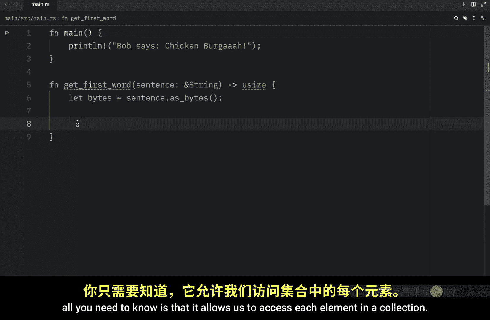
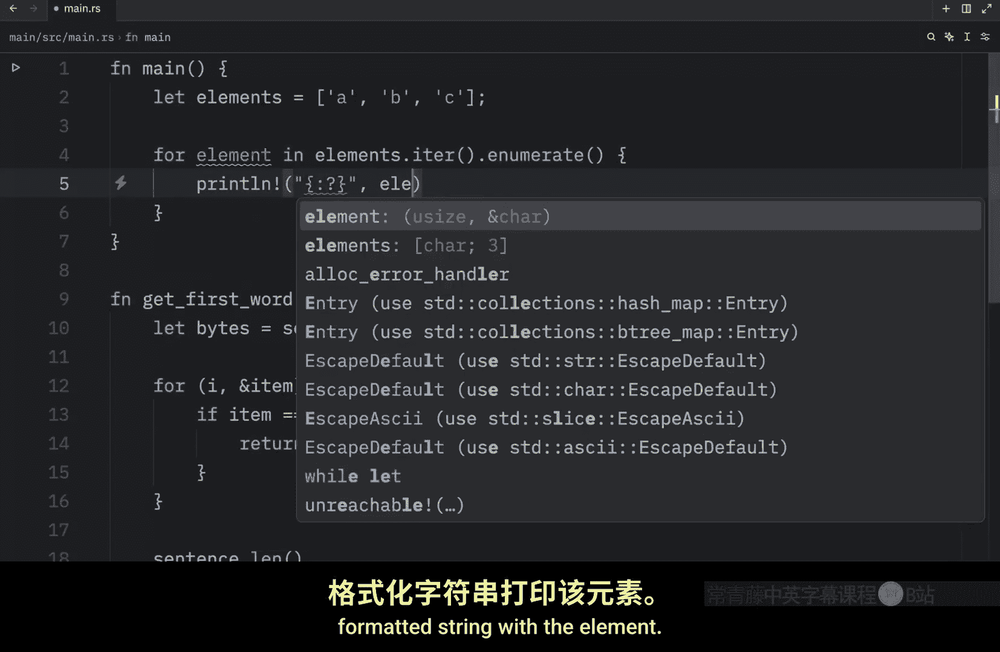
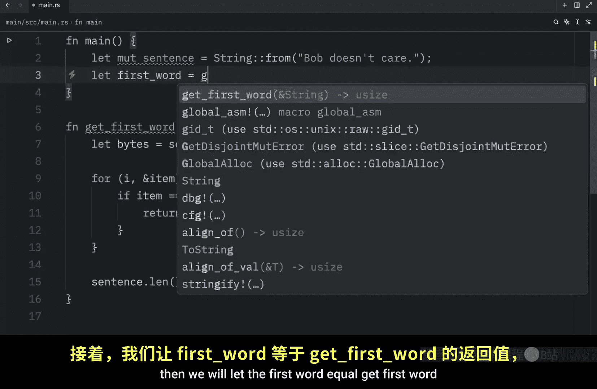
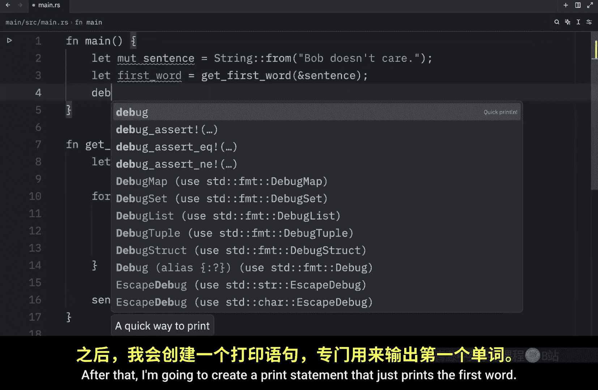

# 032：字符串切片入门 🧩

在本节课中，我们将开始学习 Rust 中的切片类型。切片允许你引用集合中一段连续的元素序列，而不是整个集合。我们将通过解决《Rust 官方教程》中的一个具体问题来理解切片的概念和必要性。

## 切片简介

切片是一种引用，因此它不拥有数据的所有权。这个概念直接来自 Rust 官方文档。为了开始学习切片，我们将分析一个具体问题：编写一个函数，接收一个由空格分隔的单词字符串，并返回找到的第一个单词。如果字符串只有一个单词，则返回整个字符串。

## 问题：获取第一个单词的索引

首先，我们创建一个名为 `get_first_word` 的函数。该函数接收一个 `String` 类型的句子引用，因为我们不需要所有权，并返回一个无符号整数。这个整数将是分隔第一个单词最后一个字符和第二个单词的空格的索引。

以下是函数实现的步骤：




1.  将字符串转换为字节数组，以便逐个元素遍历。
2.  创建一个迭代器来遍历字节数组。
3.  使用 `enumerate` 方法同时获取索引和元素。
4.  检查每个元素是否为空格字符的字节表示。
5.  如果找到空格，返回其索引；否则，返回整个字符串的长度。

以下是 `get_first_word` 函数的代码实现：

```rust
fn get_first_word(sentence: &String) -> usize {
    let bytes = sentence.as_bytes();
    for (i, &item) in bytes.iter().enumerate() {
        if item == b' ' {
            return i;
        }
    }
    sentence.len()
}
```


## 理解 `enumerate` 方法


`enumerate` 方法将迭代器中的元素包装成元组，元组包含索引和元素的引用。这让我们能同时访问索引和值。



以下是一个简单的例子，展示 `enumerate` 的用法：

```rust
fn main() {
    let elements = ['A', 'B', 'C'];
    for (i, &element) in elements.iter().enumerate() {
        println!("Index: {}, Element: {}", i, element);
    }
}
```

运行上述代码将输出：
```
Index: 0, Element: A
Index: 1, Element: B
Index: 2, Element: C
```

## 测试函数并发现问题


现在，我们在 `main` 函数中测试 `get_first_word`。






```rust
fn main() {
    let mut sentence = String::from("Bob doesn't care");
    let first_word = get_first_word(&sentence);
    println!("The first word ends at index: {}", first_word);
    sentence.clear();
    println!("Sentence after clear: '{}'", sentence);
}
```

运行这段代码，`first_word` 的值是 3，因为函数在索引 3 处遇到了空格。程序编译正常，但 `first_word` 这个索引值与 `sentence` 的状态是分离的。在我们调用 `sentence.clear()` 清空字符串后，`first_word` 所指向的索引值（3）就变得毫无意义了。

这种方法存在一个主要问题：我们必须时刻担心 `first_word` 的索引是否与 `sentence` 的实际数据保持同步。这种同步是繁琐且容易出错的。如果我们想找到句子的第一个和最后一个单词，就需要跟踪两个独立的变量，并确保它们始终同步，这会使程序变得更加复杂。

## 本节总结

本节课中，我们一起学习了如何通过索引来定位字符串中的第一个单词。我们创建了 `get_first_word` 函数，并理解了 `enumerate` 方法的作用。然而，我们也发现了这种方法的核心缺陷：返回的索引与原始数据是分离的，数据变化后索引可能失效，导致程序逻辑错误。


Rust 为这个问题提供了一个优雅的解决方案：**字符串切片**。在下一节课中，我们将看看如何使用字符串切片来解决这个数据同步的问题，使代码更安全、更简洁。