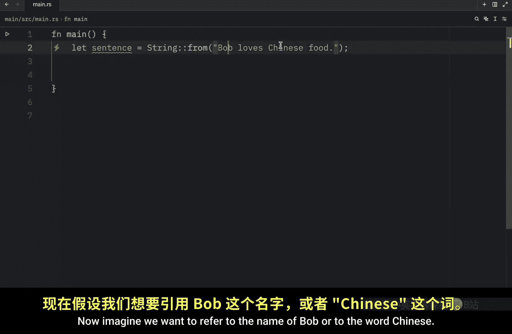
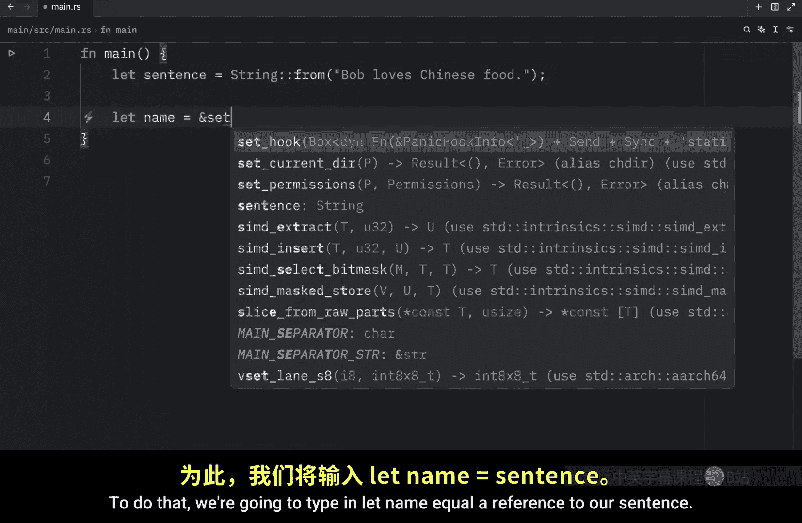
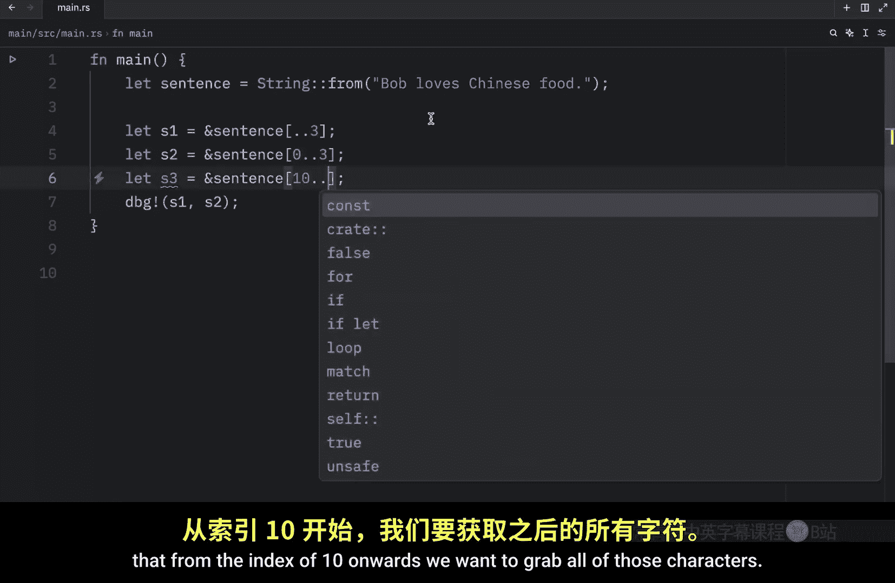
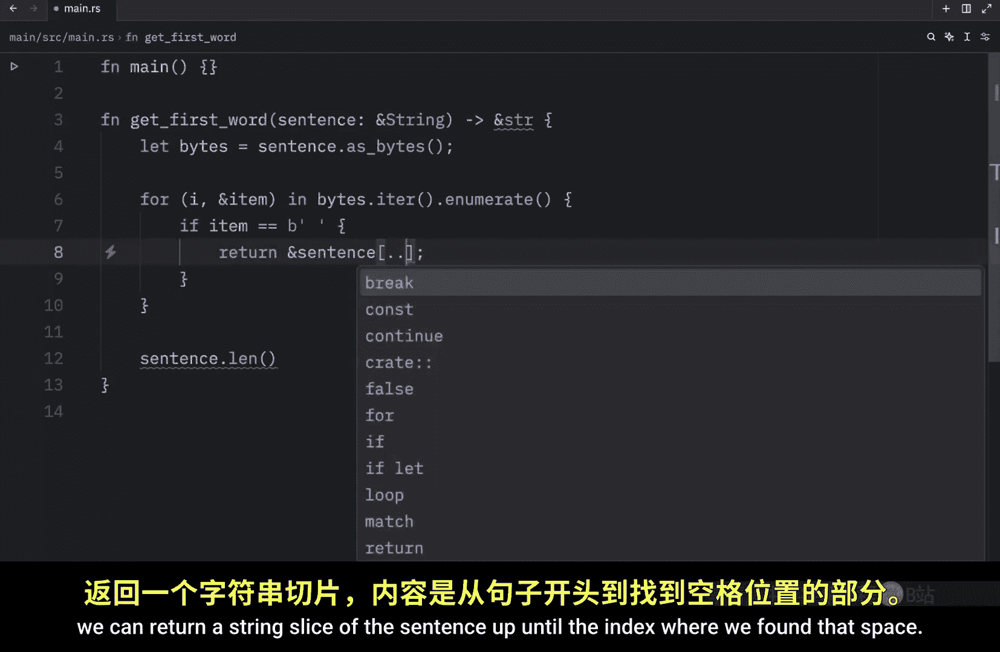
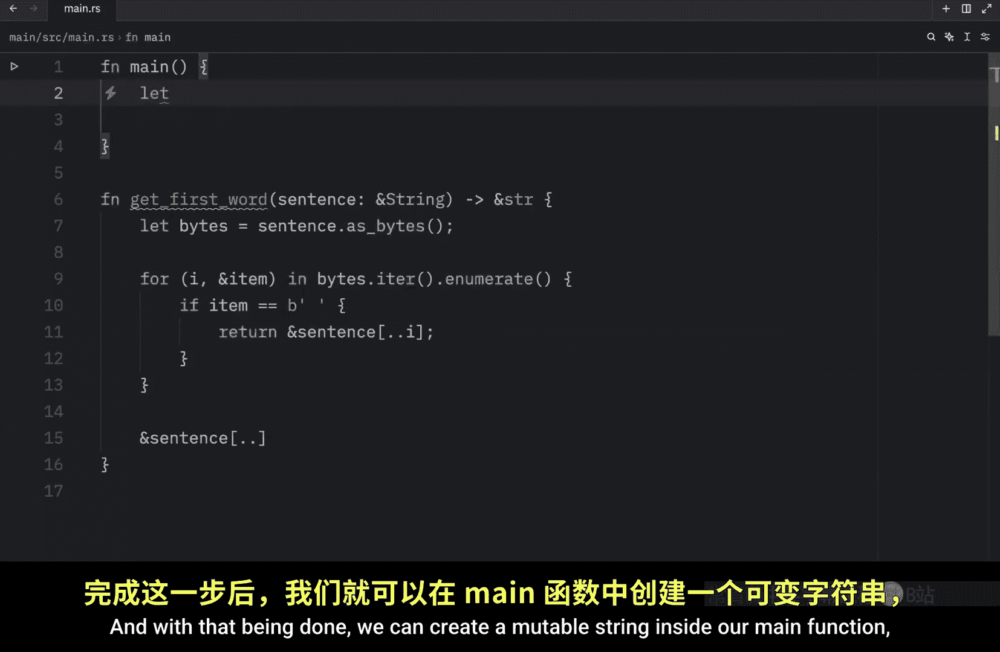
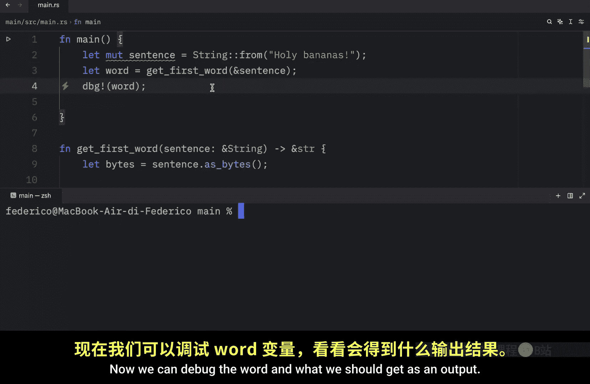
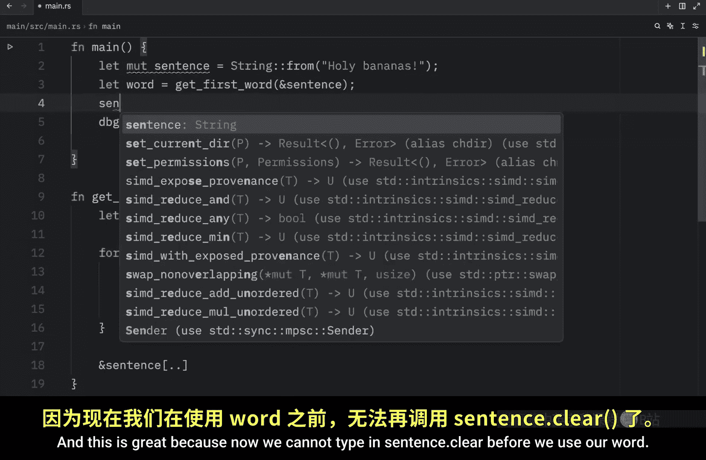
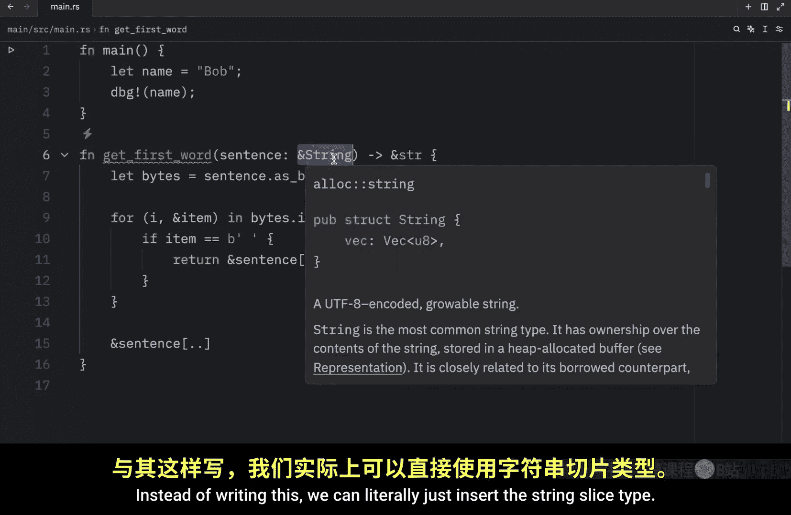

# 033：字符串切片实战 🧩

在本节课中，我们将继续学习 Rust 中的字符串切片。上一节我们介绍了字符串切片的基本概念，本节中我们来看看一些具体的实战例子。



字符串切片是对字符串某一部分的引用，其形式如下（这里指的不是 `println!` 语句）：



```rust
&str
```

为了开始学习，我们再次创建一个句子：

```rust
let sentence = String::from("Bob loves Chinese food");
```

现在，假设我们想引用名字“Bob”或者单词“Chinese”。我们可以这样做：

```rust
let name = &sentence[0..3];
let food = &sentence[10..17];
```

这里，`name` 引用了从索引 0 到 3（不包括 3）的字符。`food` 引用了从索引 10 到 17（不包括 17）的字符。因为 17 是不包含在内的，所以我们需要指定为 17 才能完整地获取“Chinese”。Rust 也有语法（`..=`）可以包含结束索引，但这超出了本节的范围。

运行调试后，我们将得到 `name` 包含字符串切片“Bob”，`food` 包含字符串切片“Chinese”。

我们所做的是创建了对字符串一部分的引用，并通过切片符号选择了该部分。在内部，切片数据结构存储了起始位置和切片的长度。以 `food` 为例，它将是一个指向索引 10 处字节的指针，并带有一个长度为 7 的值。




在继续之前，了解用于切片的不同范围语法会非常有用。

以下是几种切片范围语法的示例：

*   **显式指定起始和结束索引**：`&sentence[0..3]`
*   **从索引 0 开始可以省略起始索引**：`&sentence[..3]`
*   **从某个索引开始直到结尾**：`&sentence[10..]`
*   **引用整个字符串**：`&sentence[..]`

你可以通过调试来验证这些切片是否按预期工作。


此外，创建切片时有一个极其重要的细节需要注意：**切片必须在有效的字节边界处结束，否则程序会崩溃**。

例如，如果有一个包含多字节字符（如“Brün”）的名字，尝试在不完整的字节处切片会导致程序恐慌。你必须确保切片范围完整地包含多字节字符的所有字节。

现在，让我们修复上一节视频中创建的函数。原来的函数返回一个 `usize` 索引。我们将修改它，使其返回一个字符串切片。

修改后的函数如下：




```rust
fn get_first_word(s: &String) -> &str {
    let bytes = s.as_bytes();
    for (i, &item) in bytes.iter().enumerate() {
        if item == b' ' {
            return &s[..i];
        }
    }
    &s[..]
}
```



这个函数现在返回从句子开头到第一个空格处的切片，如果没有空格，则返回整个句子的切片。




在主函数中，我们可以这样使用它：

```rust
let mut sentence = String::from("Holy Bananas");
let word = get_first_word(&sentence);
println!("The first word is: {}", word);
// sentence.clear(); // 如果在这里清空句子，会导致编译错误，因为word仍持有不可变引用
```

现在，我们不再需要担心 `word` 引用的数据被意外改变，因为借用检查器会确保在 `word` 的有效期内，`sentence` 不会被可变地修改。

接下来，我们谈谈字符串字面量作为切片。当我们写下 `let name = "Bob";` 时，`name` 的类型就是 `&str`，它是一个指向程序二进制文件中特定位置的字符串切片。这也是字符串字面量不可变的原因——字符串切片本身就是不可变引用。



了解到可以对字面量和 `String` 值进行切片，这引出了对我们之前函数的一个便利改进：参数类型。

我们可以将函数签名改为接受 `&str` 类型，而不是 `&String`：




```rust
fn get_first_word(s: &str) -> &str {
    // ... 函数体不变
}
```

这样做的好处是，我们的函数现在可以接受更多类型的字符串：

*   `String` 的切片：`get_first_word(&sentence[..])`
*   `String` 的引用：`get_first_word(&sentence)`
*   字符串字面量：`get_first_word("Bob says hi")`

这非常方便，因为它提高了函数的通用性。如果我们坚持使用 `&String` 类型，那么传递一个字符串切片（`&str`）就会导致类型不匹配的错误。

最后需要提及的是，Rust 中除了字符串切片，还有其他类型的切片。字符串切片是专门用于字符串的。但还有更通用的切片类型，例如数组切片。


我们可以这样创建一个数组切片：

```rust
let array = [1, 2, 3, 4, 5];
let slice = &array[2..];
println!("The slice is: {:?}", slice);
```

运行后，我们将得到数组 `[3, 4, 5]` 的切片。`slice` 变量的类型将是 `&[i32]`。它的工作原理与字符串切片类似，存储对第一个元素的引用和长度。随着 Rust 学习的深入，我们会了解更多关于其他切片类型的知识。


本节课中我们一起学习了 Rust 字符串切片的实战应用，包括如何创建切片、不同的范围语法、处理多字节字符的注意事项，以及如何利用 `&str` 类型使函数更通用。我们还简单了解了数组切片的存在。掌握字符串切片是理解 Rust 所有权和借用系统的关键一步。