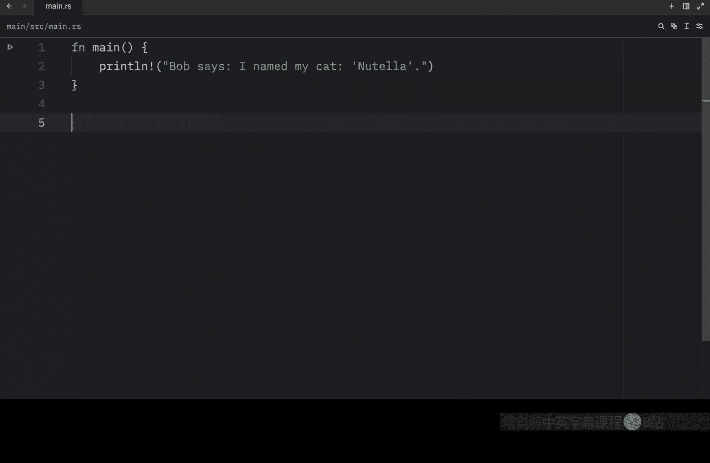
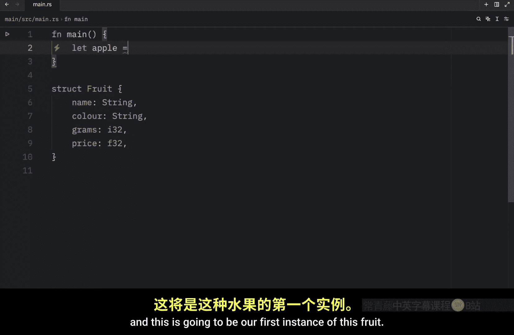
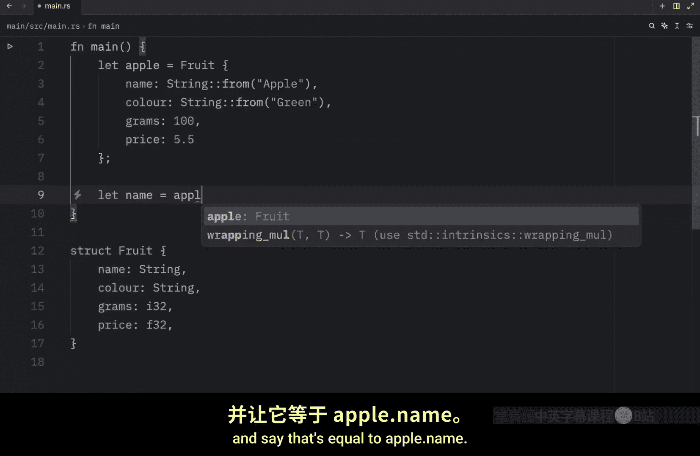
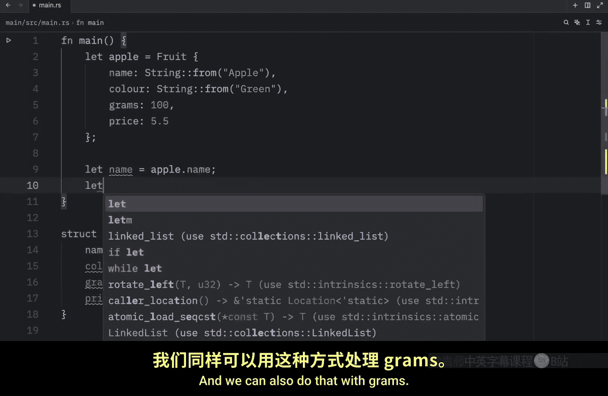
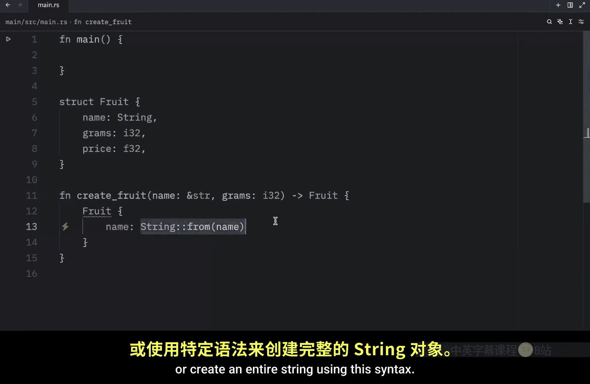
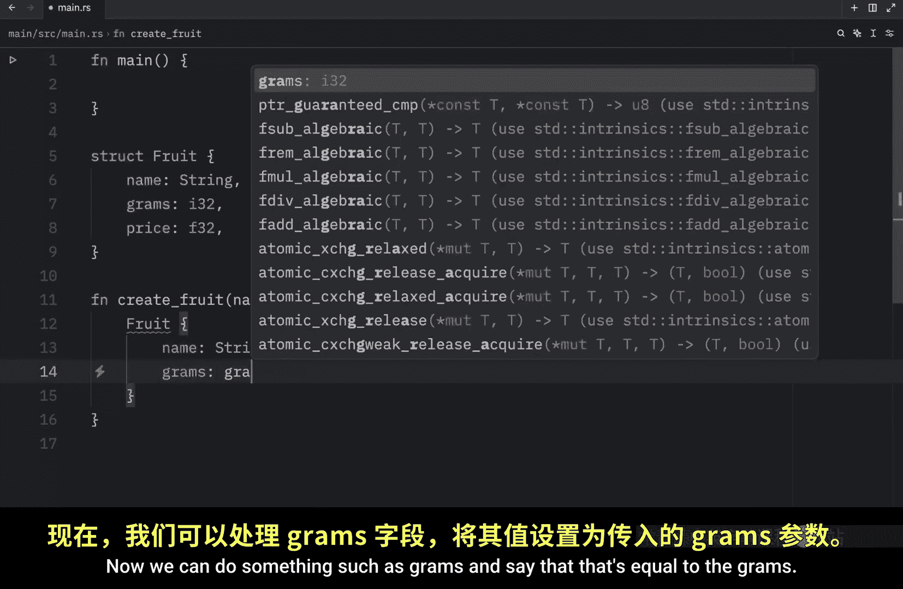
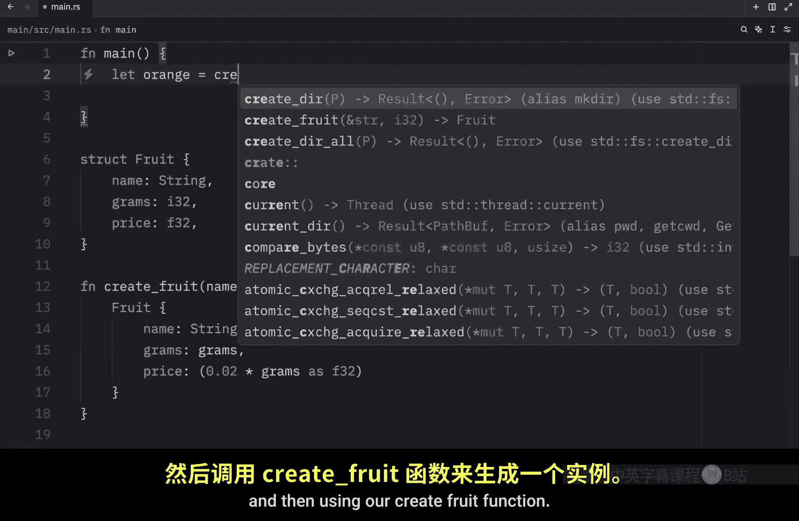
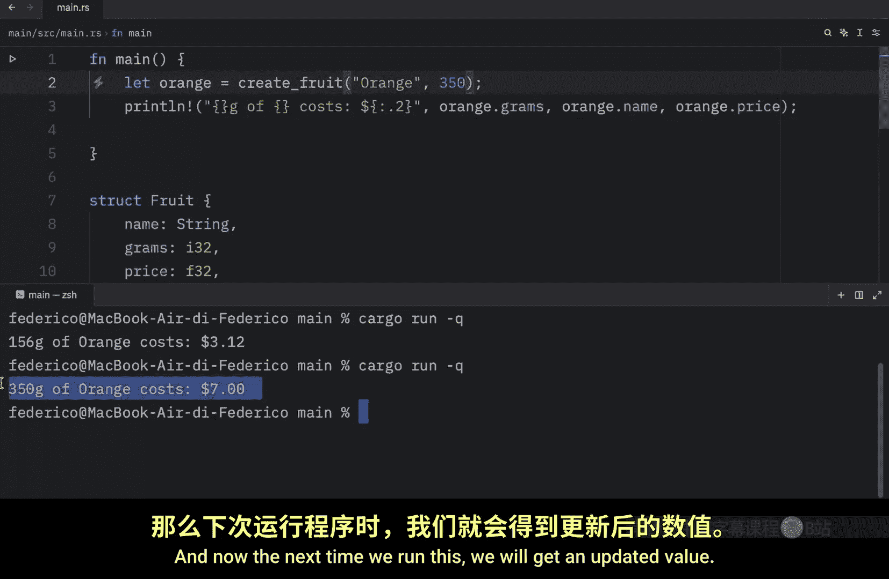
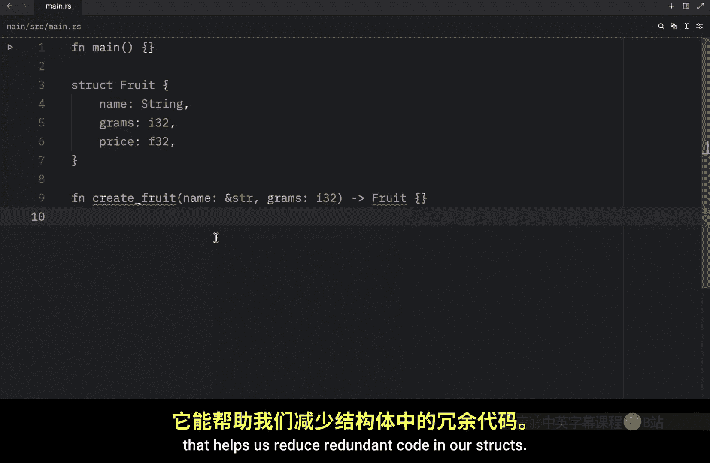
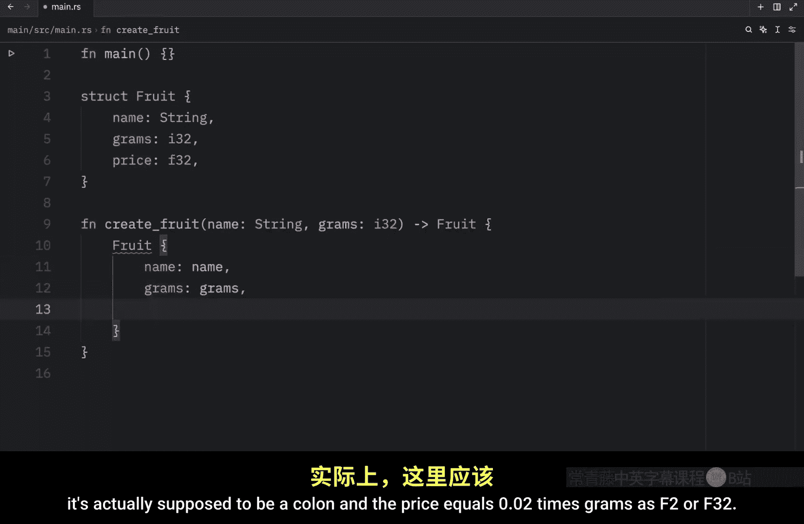

# 034：结构体详解 🏗️

在本节课中，我们将要学习 Rust 中的结构体。结构体是一种自定义数据类型，它允许你将多个相关的值打包并命名，从而构成一个有意义的组合。我们将从定义结构体开始，逐步学习如何创建实例、访问和修改字段，以及使用函数简化创建过程。

## 结构体的定义




结构体与元组类似，都用于保存相关值。但结构体更具结构性，因为你可以为每个数据片段命名，这使得代码更易读和使用。


要定义一个结构体，需要使用 `struct` 关键字。结构体的名称应与其包含的数据相关。例如，我们可以定义一个名为 `Fruit` 的结构体。在大括号内，我们定义数据片段的名称和类型，这些也称为字段。

以下是定义 `Fruit` 结构体的示例代码：

```rust
struct Fruit {
    name: String,
    color: String,
    grams: i32,
    price: f32,
}
```



在这个例子中，`Fruit` 结构体有四个字段：`name`（字符串类型）、`color`（字符串类型）、`grams`（32位整数类型）和 `price`（32位浮点数类型）。理论上，`grams` 也可以是浮点类型，但这里我们假设只关心整数克数。

## 创建结构体实例


上一节我们介绍了如何定义结构体，本节中我们来看看如何创建和使用它的实例。要使用结构体，首先必须通过为每个字段指定值来创建它的一个实例。

以下是创建 `Fruit` 实例的示例：

```rust
let apple = Fruit {
    name: String::from("Apple"),
    color: String::from("Green"),
    grams: 100,
    price: 5.5,
};
```

这个 `apple` 实例重 100 克，价格为 5.5 美元。在实际程序中，字段名可能更具体，如 `price_per_kilo`。需要注意的是，指定字段值的顺序不必与结构体定义中的顺序一致，只要提供所有必需信息即可。



## 访问和修改字段




创建实例后，可以使用点号来访问其字段值。例如，要获取名称，可以这样写：

```rust
let name = apple.name;
let grams = apple.grams;
println!("{} weighs {} grams", name, grams);
```

运行上述代码将输出：`Apple weighs 100 grams`。


如果要修改字段的值，需要将实例声明为可变的。一旦实例可变，其所有字段都将可变，不能单独指定某个字段可变。

以下是修改字段的示例：

```rust
let mut apple = Fruit {
    name: String::from("Apple"),
    color: String::from("Green"),
    grams: 100,
    price: 5.5,
};
println!("Before: {} grams", apple.grams);
apple.grams = 200;
println!("After: {} grams", apple.grams);
```

运行后，输出将显示 `grams` 从 100 变为 200。

## 使用函数简化创建





如果觉得每次创建结构体实例都写很多代码，可以创建返回结构体的函数来简化过程。

以下是创建 `create_fruit` 函数的示例：




```rust
fn create_fruit(name: &str, grams: i32) -> Fruit {
    Fruit {
        name: String::from(name),
        grams,
        price: 0.02 * grams as f32,
    }
}
```

这个函数接收名称（字符串切片）和克数（整数），返回一个 `Fruit` 实例。注意，我们省略了 `color` 字段，并直接使用参数计算价格。使用函数后，创建水果实例变得非常简单：


```rust
let orange = create_fruit("Orange", 156);
println!("{} grams of {} costs ${:.2}", orange.grams, orange.name, orange.price);
```

运行后将输出：`156 grams of Orange costs $3.12`。可以轻松更改参数来创建不同的水果实例。

## 字段初始化简写语法





Rust 提供了一个名为“字段初始化简写语法”的特性，可以帮助减少结构体代码中的冗余。




当函数参数名与结构体字段名完全相同时，可以省略重复的赋值。以下是使用简写语法的示例：


```rust
fn create_fruit_simple(name: String, grams: i32) -> Fruit {
    Fruit {
        name,   // 字段名与参数名相同，使用简写
        grams,  // 字段名与参数名相同，使用简写
        price: 0.02 * grams as f32,
    }
}
```

在这个例子中，参数 `name` 和 `grams` 与结构体字段名一致，因此可以直接写入，无需写成 `name: name`。这使代码更加简洁。

## 总结


本节课中我们一起学习了 Rust 结构体的核心概念。我们首先了解了如何定义结构体，然后学习了如何创建实例、使用点号访问和修改字段。接着，我们探索了通过函数来简化结构体创建过程的方法。最后，我们介绍了字段初始化简写语法，这是一种减少代码冗余的有效技巧。结构体是 Rust 中组织和管理相关数据的重要工具，掌握它们对编写清晰、高效的代码至关重要。