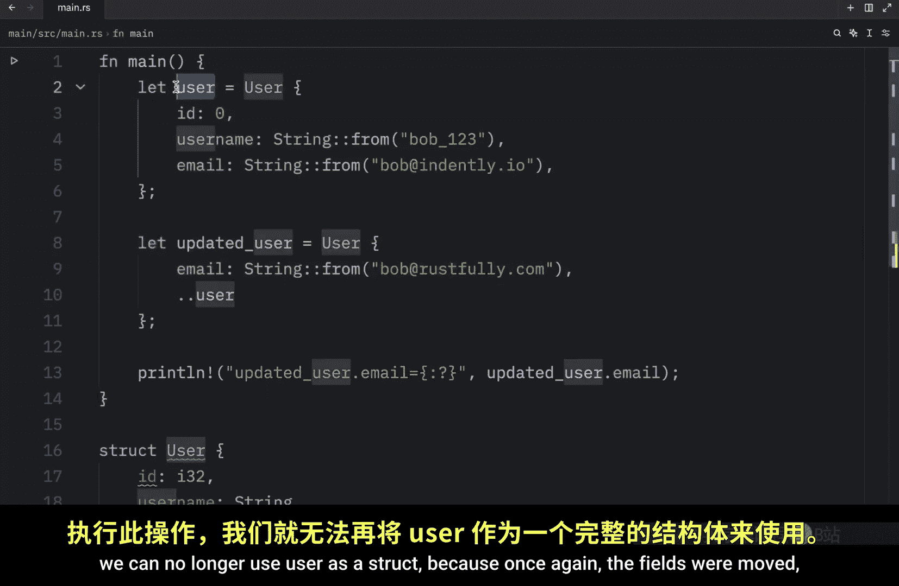
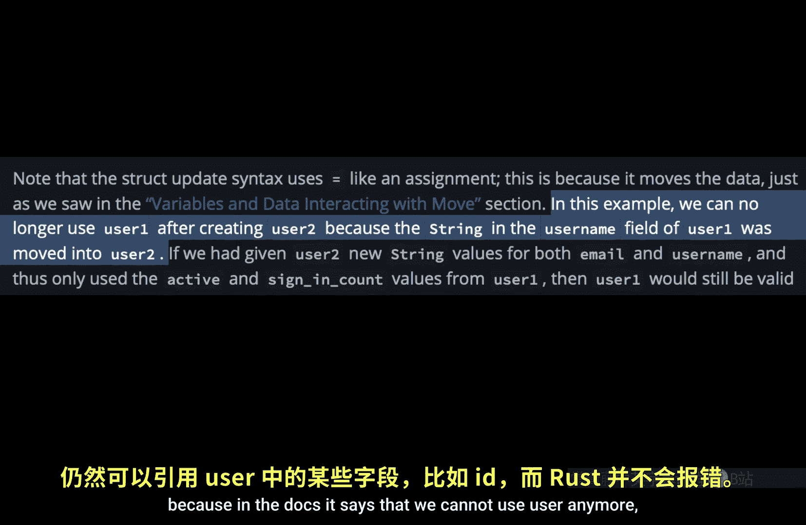

# 035：结构体更新语法与数据移动

在本节课中，我们将学习如何使用一个现有结构体实例的值来创建新的实例，这个功能被称为“结构体更新语法”。我们还将探讨与之相关的数据“移动”概念，这对于理解 Rust 的所有权系统至关重要。

## 定义用户结构体

首先，我们定义一个名为 `User` 的结构体，它包含三个字段：用户ID、用户名和电子邮件地址。

```rust
struct User {
    id: i32,
    username: String,
    email: String,
}
```

## 创建初始实例

接下来，我们创建这个 `User` 结构体的第一个实例。

```rust
let user = User {
    id: 0,
    username: String::from("Bob123"),
    email: String::from("Bob@indently.io"),
};
```

## 低效的更新方式

假设我们需要创建一个新的用户实例，它的大部分信息与 `user` 相同，但电子邮件地址需要更新。一种直观但低效的方法是手动复制所有字段。

```rust
let updated_user = User {
    id: user.id,
    username: user.username,
    email: String::from("Bob@rustfully.com"),
};
```

这种方法的问题在于，即使我们只想更改一个字段（如 `email`），也必须显式列出所有其他字段。当结构体有很多字段时，这会变得非常冗长。

## 使用结构体更新语法

Rust 提供了一种更简洁的语法来解决这个问题，即结构体更新语法。它使用 `..` 符号来指定剩余字段应从另一个实例中获取。

以下是使用更新语法的正确方式：

```rust
let updated_user = User {
    email: String::from("Bob@rustfully.com"),
    ..user
};
```

**关键规则**：`..user` 必须放在最后。不能将它放在其他字段之前，否则代码将无法编译。

使用这个语法后，`updated_user` 将拥有新的电子邮件地址，而 `id` 和 `username` 字段的值则来自原始的 `user` 实例。

## 理解数据移动

上一节我们介绍了如何使用更新语法，本节中我们来看看这个操作背后一个非常重要的概念：**数据移动**。

结构体更新语法使用 `=` 进行赋值，这会导致数据的移动。具体来说，在表达式 `..user` 中，`user` 的字段（除了在更新语句中显式提供新值的字段）会被移动到新的 `updated_user` 实例中。





这意味着，一旦执行了移动操作，原始的 `user` 实例**作为一个完整的结构体**就不再有效。然而，这里存在一个初学者容易困惑的细节：**部分移动**。

## 部分移动的细节

文档中提到移动后不能使用 `user`，但这可能被误解。实际情况是：

*   被移动的字段（在本例中是 `username`，因为它是 `String` 类型且未被新值覆盖）将不再有效。
*   未被移动的字段（在本例中是 `id`，因为它实现了 `Copy` 特征；以及 `email`，因为我们为 `updated_user` 创建了一个全新的 `String`）仍然有效。

因此，以下操作是允许的：
```rust
println!("Original user ID: {}", user.id); // 有效，因为 i32 实现了 Copy
println!("Original email: {}", user.email); // 有效，因为新实例使用了全新的 String
```

但以下操作会导致编译错误：
```rust
println!("Original username: {}", user.username); // 错误！username 已被移动
```

编译器会提示：`borrow of moved value: \`user.username\``。

简单来说，原始结构体实例不再是一个“完整且有效”的结构体，因为它的部分数据已被移走，但未被移动的数据仍然可以访问。

## 总结

本节课中我们一起学习了 Rust 中两个紧密相关的核心概念：
1.  **结构体更新语法**：使用 `..instance` 语法可以基于现有实例快速创建新实例，只需指定需要更改的字段。这极大地提升了代码的简洁性。
2.  **数据移动与部分移动**：更新语法会导致数据从旧实例移动到新实例。理解哪些字段被移动（通常是未实现 `Copy` 特征且未被覆盖的字段）至关重要。移动后，旧实例作为整体已失效，但其未被移动的部分数据仍可单独使用。


掌握这些知识是深入理解 Rust 所有权和借用系统的重要一步。在后续课程中，我们将更详细地探讨所有权、借用和生命周期。