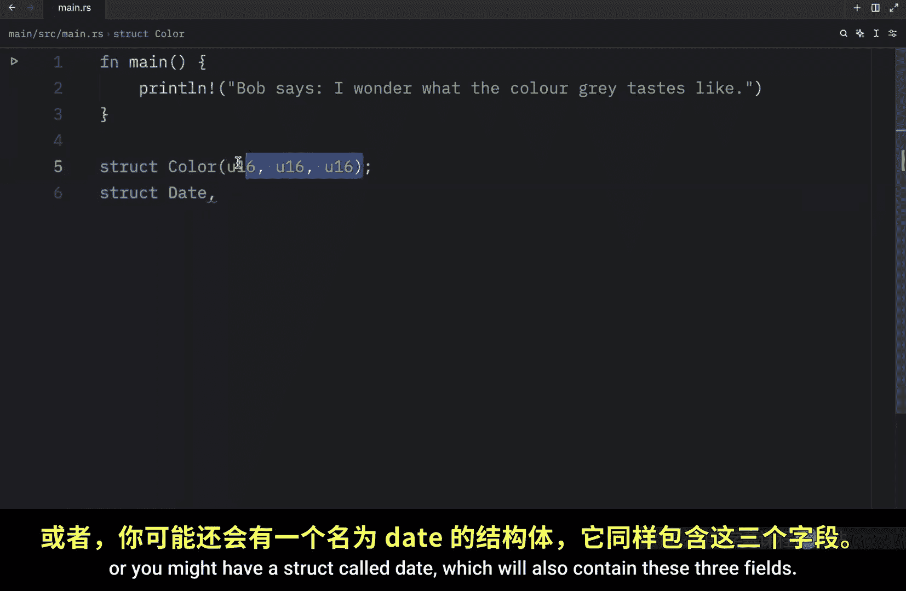
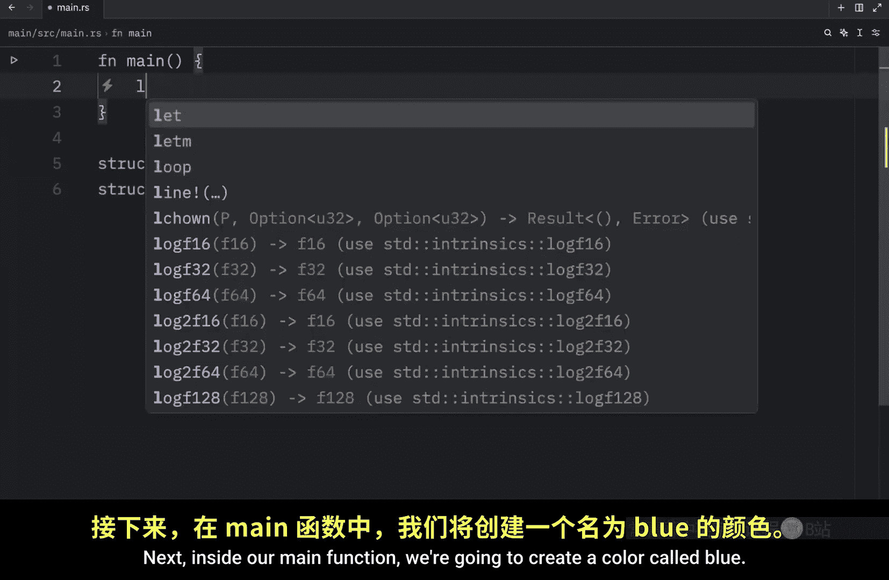
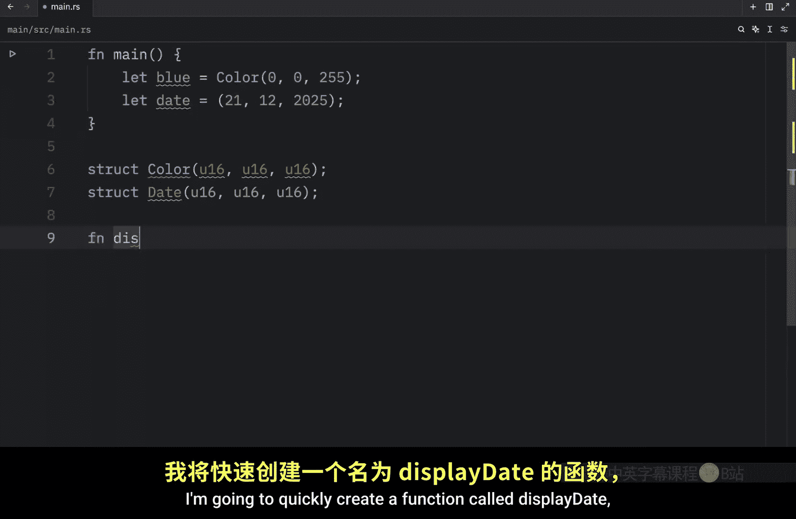
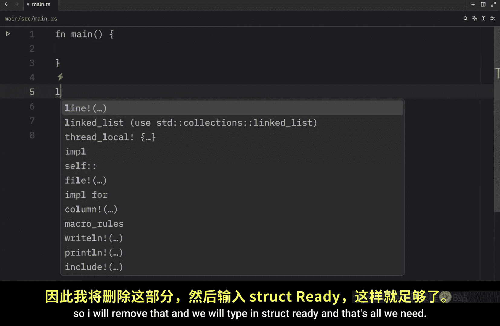
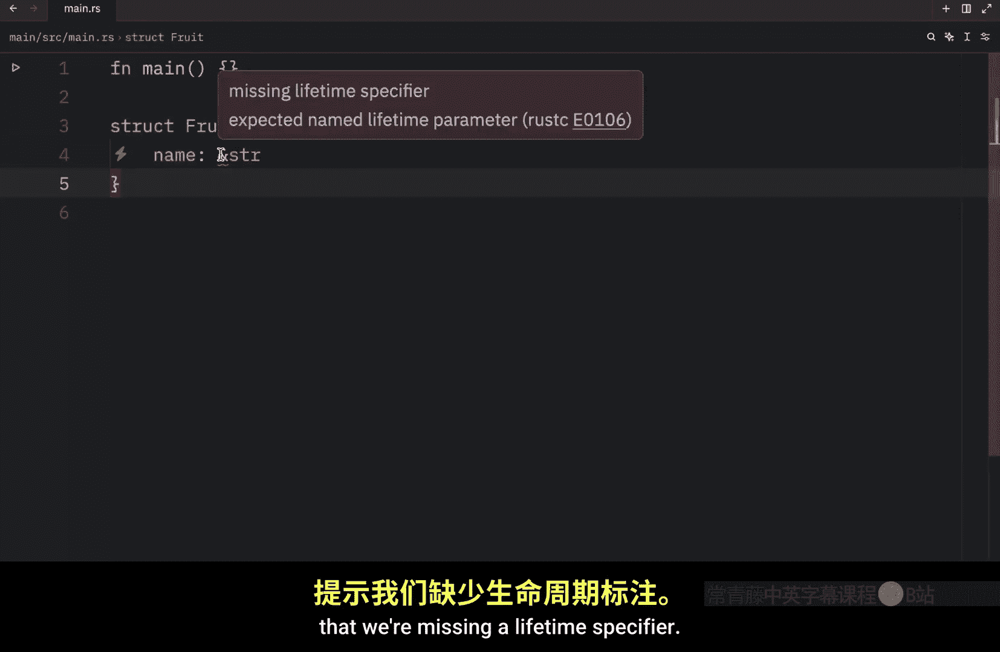

# 036：元组结构体与结构体数据所有权 📚

在本节课中，我们将要学习 Rust 中一种特殊且实用的结构体类型——元组结构体。我们还将探讨结构体数据的所有权问题，了解结构体如何拥有其数据，以及使用引用时需要注意的事项。

## 元组结构体介绍 🧱



上一节我们介绍了常规的结构体，本节中我们来看看元组结构体。元组结构体本质上是**带有名称的元组**。在某些场景下，它们能提高代码的可读性。当你希望为整个元组命名，并使其与其他元组成为不同的类型时，元组结构体就非常有用。此外，如果你觉得为常规结构体的每个字段命名显得冗长或多余，元组结构体也是一个好选择。



以下是定义元组结构体的语法示例：
```rust
struct Color(u8, u8, u8);
struct Date(u16, u8, u8);
```
例如，我们可以定义一个名为 `Color` 的结构体，它包含三个 `u8` 类型的字段。或者定义一个名为 `Date` 的结构体，它也包含三个字段。

## 创建与使用元组结构体实例 🛠️



接下来，我们在 `main` 函数中创建一个名为 `blue` 的 `Color` 实例，其值为 `(0, 0, 255)`。在其下方，我们创建一个 `Date` 实例，表示 2025 年 12 月 21 日。


以下是创建实例的代码：
```rust
let blue = Color(0, 0, 255);
let date = Date(2025, 12, 21);
```


现在，在这两个结构体定义下方，我们快速创建一个名为 `display_date` 的函数。该函数接收一个 `Date` 类型的引用作为参数。我们使用 `println!` 宏来打印日期，格式为“日/月/年”。我们需要传入 `date.0`、`date.1` 和 `date.2` 来访问元组结构体的字段。

函数定义如下：
```rust
fn display_date(date: &Date) {
    println!("Date is {}/{}/{}", date.0, date.1, date.2);
}
```

最后，我们回到 `main` 函数，调用 `display_date` 函数并传入 `date` 的引用。程序运行后，会正确显示日期“21/12/2025”。


## 元组结构体的类型安全性 🔒

我们不能将 `blue` 这个 `Color` 实例传递给 `display_date` 函数，因为 `blue` 不是 `Date` 类型，即使它包含相同的数据类型。这就是使用元组结构体优于普通元组的地方，因为它能区分不同的类型。

如果我们修改函数签名，使其接受一个普通的元组 `(u16, u8, u8)`，那么任何符合此签名的三元组都能工作，包括 `blue`。但这会导致函数过于通用，可能接收不相关的数据。

因此，元组结构体是使你的数据更具体、类型更安全的好方法。实际上，元组结构体就是一个前面带有名称的元组，使其成为独立的数据类型。

## 解构元组结构体 🧩

有一点需要注意，如果你想解构一个元组或元组结构体，必须使用其类型名。


以下是解构的正确方式：
```rust
let Date(day, month, year) = date;
println!("{:?} {:?} {:?}", day, month, year);
```
我们不能使用普通元组的模式来直接解构元组结构体的数据，必须使用该元组结构体的类型名进行解构。运行上述代码，我们将得到在调试宏中提供的每个信息片段。

## 单元结构体 ⚙️


接下来，我想展示也可以定义没有任何字段的结构体，这被称为“单元结构体”。我们不需要为下一个示例保留之前的代码，所以将其删除。



我们输入：
```rust
struct Ready;
```
这就是我们需要的全部。在 `main` 函数中，我们可以创建一个名为 `status` 的变量，并将其设置为 `Ready`。将来，我们可以将其用作一个标志，通知程序某些事情已准备就绪，可以继续执行。单元结构体还有更多用例，我们将在未来的课程中讨论。

## 结构体数据的所有权 📦

接下来，我想讨论结构体数据的所有权。我再次创建一个 `User` 结构体，它包含一个 `i32` 类型的 `id`，一个 `String` 类型的 `username`，以及一个 `String` 类型的 `email`。这里我们使用了拥有所有权的 `String` 类型，而不是字符串切片 `&str`。

这是有意为之，因为我们希望每个实例拥有其全部数据，并且只要整个结构体有效，这些数据就有效。但是，结构体也可以存储由其他东西拥有的数据的引用，这需要使用称为“生命周期”的功能，我们将在未来的课程中讨论。

我只是想指出这是可能的。我们不在本课中涵盖它，因为它并不简单。我们不能仅仅在结构体字段中键入一个引用类型（比如字符串切片 `&str`）而不做其他处理，Rust 编译器会报错，提示我们缺少生命周期说明符。所以，我只是想让你知道我们将在未来的课程中学习它。

---



本节课中我们一起学习了 Rust 的元组结构体，它是一种带有类型名称的元组，能提高代码的类型安全性和表达力。我们还了解了如何创建和使用元组结构体实例、其类型安全性、解构方法，以及简单的单元结构体。最后，我们探讨了结构体对其数据的所有权，并引出了未来将学习的生命周期概念。掌握这些基础是理解 Rust 更高级数据管理的关键。