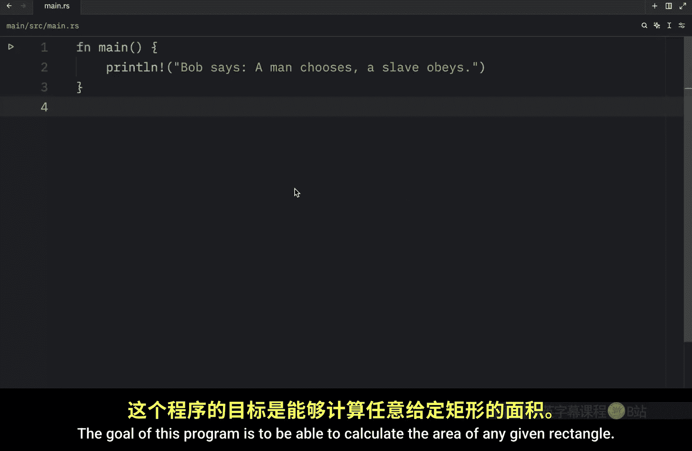
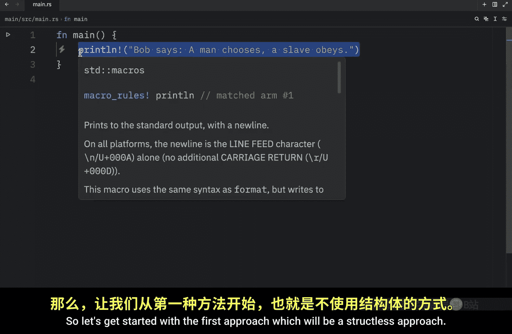
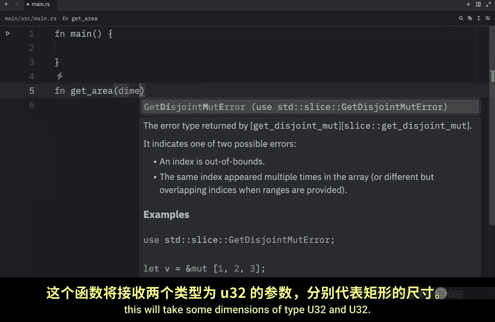
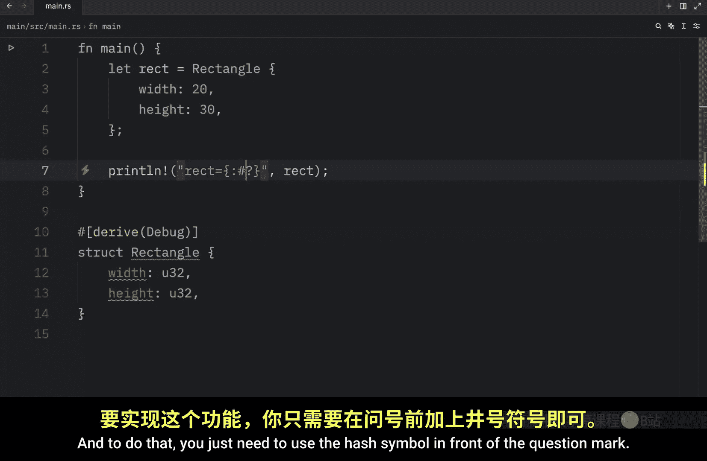
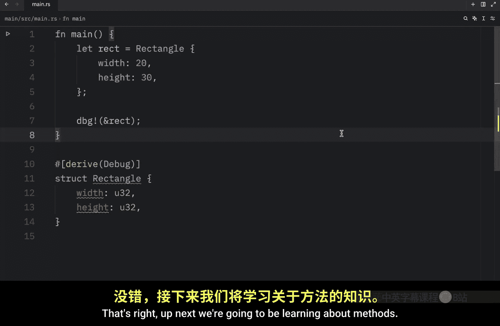

# 037：结构体提供清晰性 🧱

在本节课中，我们将通过一个官方 Rust 书中使用的示例程序，继续学习结构体。我们将首先创建一个不使用结构体的程序，然后修改代码以使用结构体，以便更好地理解结构体的实用性。

该程序的目标是能够计算任意给定矩形的面积。







## 不使用结构体的方法


首先，我们采用不使用结构体的方法。我们将创建一个名为 `get_area` 的函数，它接收两个 `u32` 类型的参数作为矩形的尺寸，并返回一个 `u32` 类型的面积值。

以下是 `get_area` 函数的定义：
```rust
fn get_area(dimensions: (u32, u32)) -> u32 {
    dimensions.0 * dimensions.1
}
```

在 `main` 函数中，我们创建一个表示矩形的元组，并调用 `get_area` 函数。

以下是 `main` 函数的内容：
```rust
fn main() {
    let rectangle = (20, 30);
    println!("矩形的面积是 {} 平方像素。", get_area(rectangle));
}
```

运行此程序，输出结果为“矩形的面积是 600 平方像素。”，程序功能正常。

对于计算面积这个例子，使用元组是可行的，因为乘法运算满足交换律，`20 * 30` 与 `30 * 20` 的结果相同。

然而，如果我们的目标是在屏幕上绘制这个矩形，那么尺寸的顺序就至关重要了。`(20, 30)` 表示一个宽20、高30的矩形，而 `(30, 20)` 则表示一个宽30、高20的矩形，两者形状完全不同。使用元组无法清晰地表达这种顺序的重要性。

## 使用结构体的方法

为了解决上述问题，并使代码意图更清晰，我们将引入结构体。

首先，我们定义一个名为 `Rectangle` 的结构体：
```rust
struct Rectangle {
    width: u32,
    height: u32,
}
```

接下来，我们修改 `get_area` 函数，使其接收一个 `Rectangle` 结构体的引用作为参数：
```rust
fn get_area(rectangle: &Rectangle) -> u32 {
    rectangle.width * rectangle.height
}
```

现在，在 `main` 函数中，我们创建一个 `Rectangle` 实例并调用函数：
```rust
fn main() {
    let rect = Rectangle { width: 20, height: 30 };
    println!("矩形的面积是 {} 平方像素。", get_area(&rect));
}
```

再次运行程序，结果依然是 600 平方像素。但这次，我们的代码通过命名字段（`width` 和 `height`）清晰地表达了数据的含义，使得代码更易读、更易维护。如果未来矩形需要包含更多数据（如颜色、位置），结构体也能轻松扩展。


## 调试结构体

上一节我们介绍了如何使用结构体组织数据。本节中，我们来看看如何打印或调试结构体的内容。如果你尝试使用 `println!` 宏直接打印结构体实例，Rust 编译器会报错。

例如，以下代码无法编译：
```rust
println!("{:?}", rect); // 错误：`Rectangle` 未实现 `Debug`
```

`println!` 宏默认使用 `Display` 格式化特性来输出内容，该特性主要用于面向用户的友好显示。许多基本类型（如整数）都自动实现了 `Display`。但对于自定义的结构体，Rust 不知道该如何显示它。

为了调试目的，我们可以使用 `Debug` 格式化特性。要让我们的结构体支持 `Debug`，只需在结构体定义上方添加 `#[derive(Debug)]` 属性。

修改 `Rectangle` 结构体如下：
```rust
#[derive(Debug)]
struct Rectangle {
    width: u32,
    height: u32,
}
```

现在，我们可以使用 `{:?}` 占位符来打印结构体的调试信息：
```rust
println!("调试输出: {:?}", rect);
```
输出类似：`调试输出: Rectangle { width: 20, height: 30 }`

对于包含多个字段的复杂结构体，还可以使用 `{:#?}` 进行“美化打印”，使输出更具可读性：
```rust
println!("美化调试输出: {:#?}", rect);
```
输出格式会更加清晰，每个字段单独占一行。

通过实现 `Debug` 特性，我们能够方便地检查结构体在程序运行时的状态，这对开发和调试非常有帮助。




## 总结

本节课中我们一起学习了结构体如何为代码带来清晰性。我们通过计算矩形面积的例子，对比了使用元组和使用结构体的两种方法。结构体通过命名字段，使数据的含义一目了然，极大地提升了代码的可读性和可维护性。此外，我们还学习了如何通过 `#[derive(Debug)]` 属性让自定义结构体支持调试输出。



使用结构体将相关的数据分组，远比让一堆类型模糊的元组散落在代码中要方便和清晰得多。关于结构体，我们还有一个重要主题需要讨论，那就是**方法**，这将把我们的矩形代码提升到一个新的水平。我们将在下一节课中学习它。