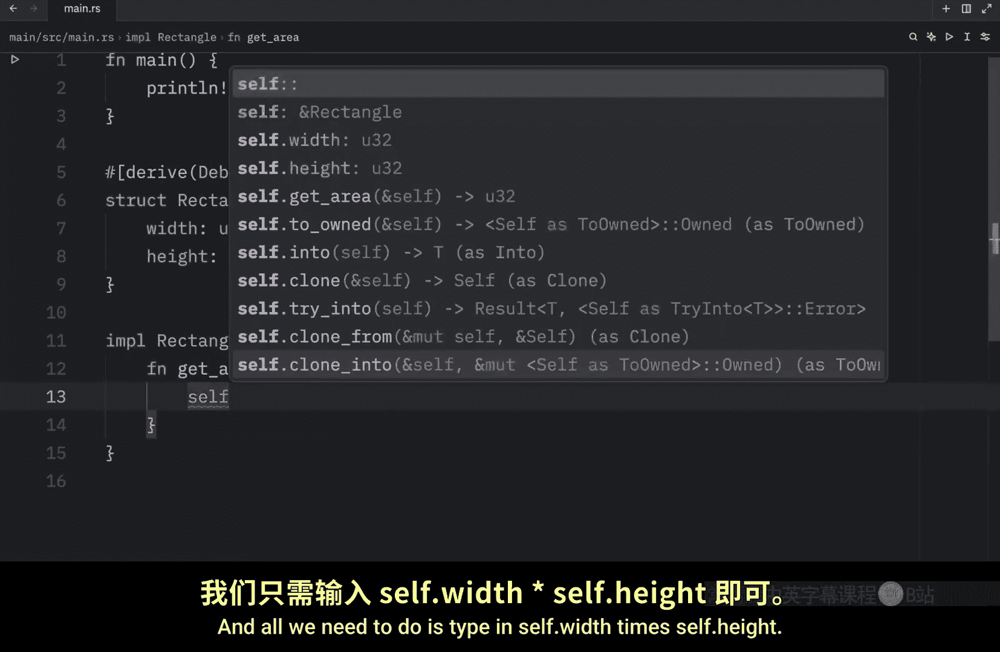
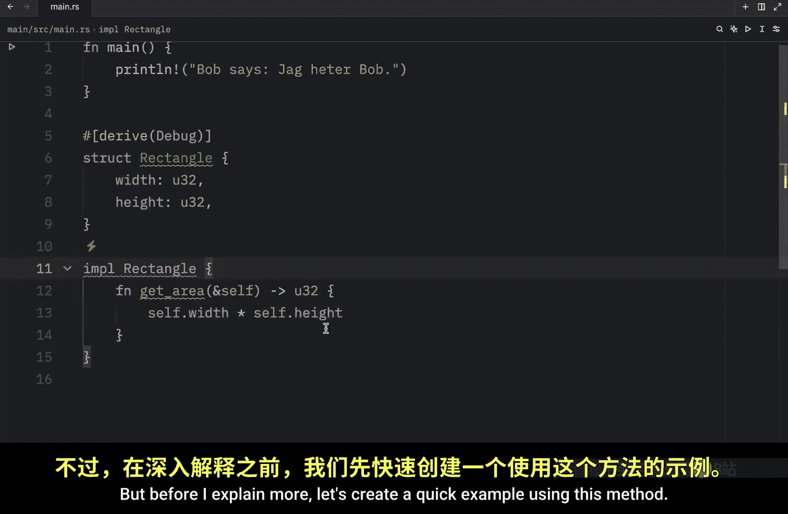
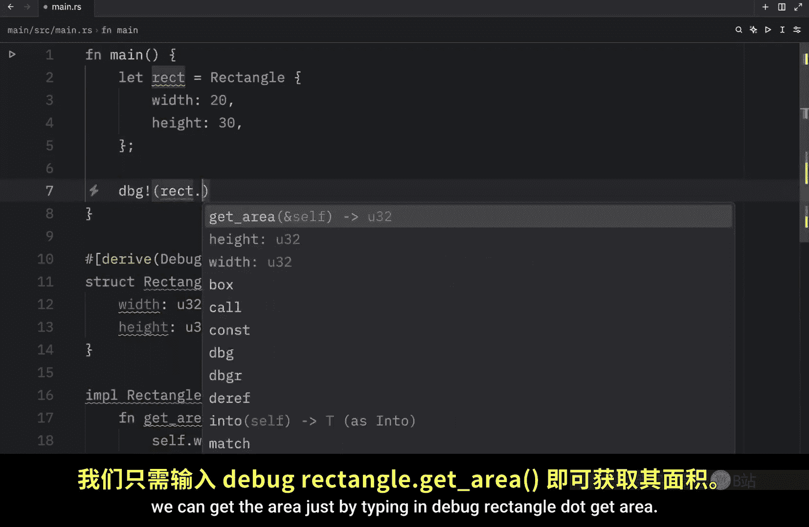
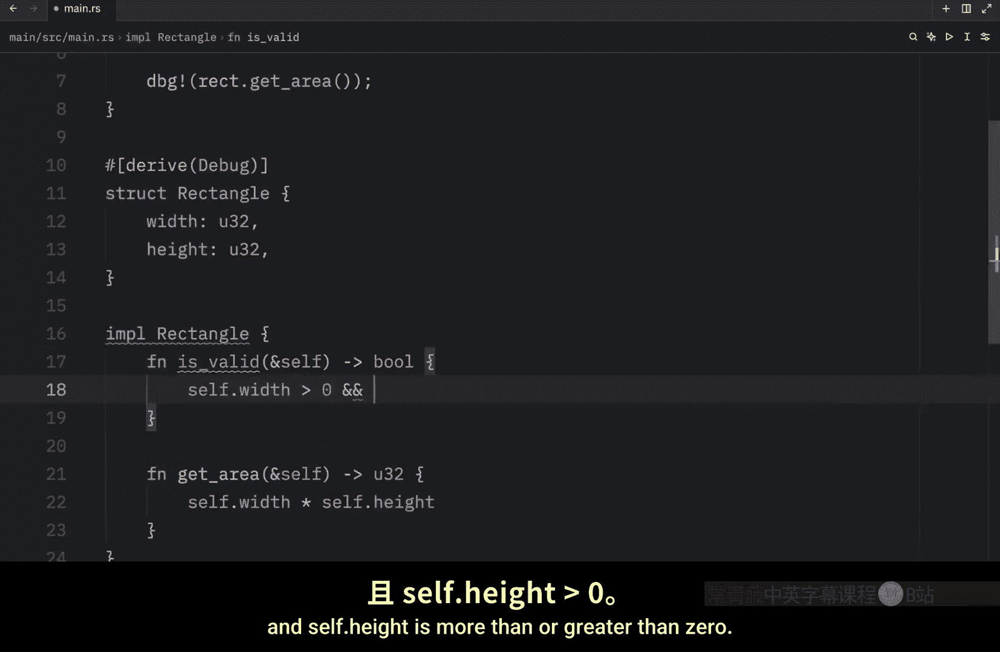
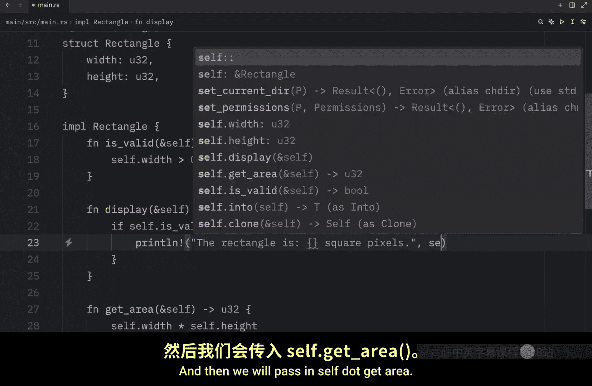
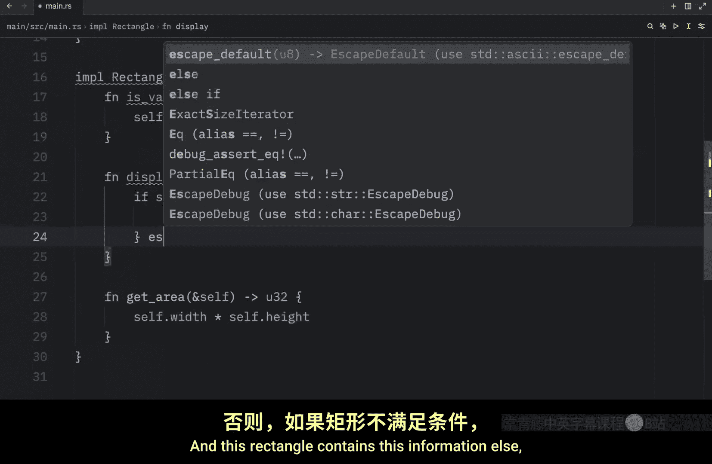
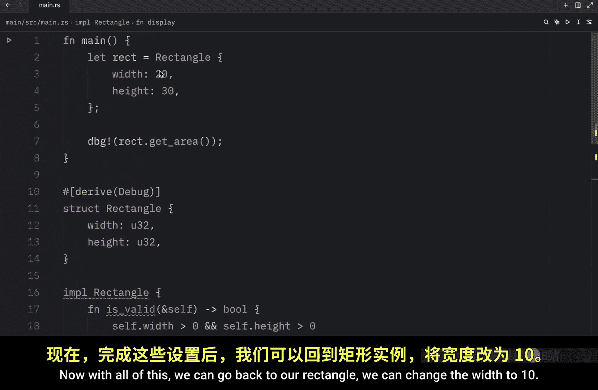
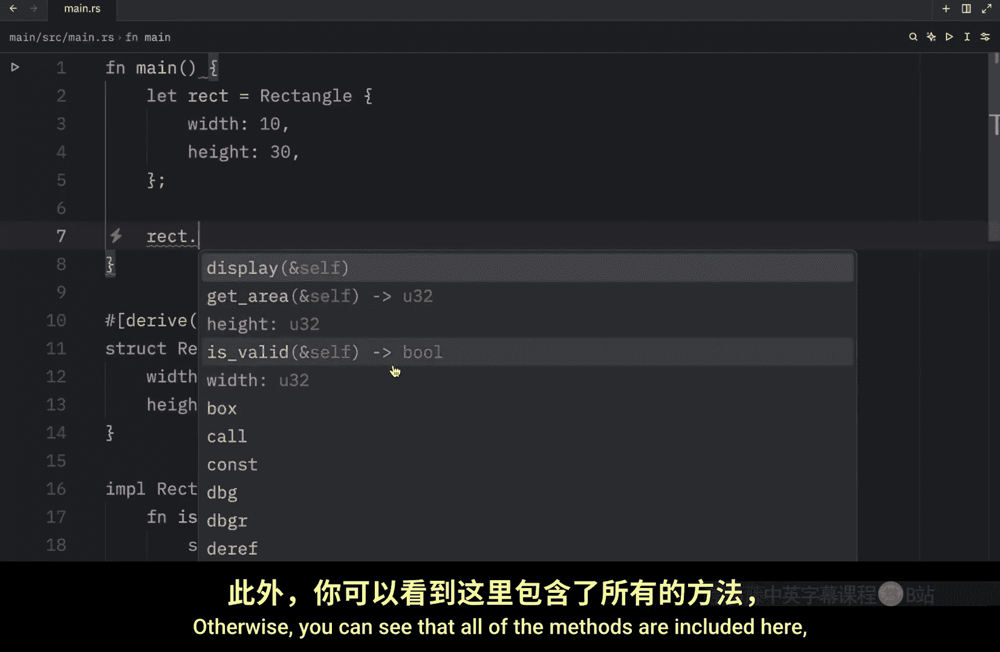

# 038：Rust 中的方法 🧩

在本节课中，我们将要学习 Rust 中的方法。方法是与特定结构体（`struct`）关联的函数，它们为结构体实例提供了可操作的行为。我们将通过一个具体的例子，学习如何定义和使用方法。

## 什么是方法？

方法本质上是定义在结构体上下文中的函数。它们的第一个参数总是 `self`，代表调用该方法的当前结构体实例。这允许方法直接访问和操作实例内部的数据。

上一节我们介绍了结构体的基本概念，本节中我们来看看如何为结构体添加方法。


## 定义方法：实现块

要为结构体定义方法，我们需要使用 `impl`（implementation 的缩写）块。在 `impl` 块内部定义的函数就是该结构体的方法。



以下是定义一个 `Rectangle` 结构体及其方法的步骤：




1.  首先，我们有一个 `Rectangle` 结构体。
    ```rust
    struct Rectangle {
        width: u32,
        height: u32,
    }
    ```

2.  接着，我们使用 `impl` 关键字为 `Rectangle` 创建实现块。
    ```rust
    impl Rectangle {
        // 方法将在这里定义
    }
    ```




## 创建第一个方法：计算面积

让我们在 `impl Rectangle` 块中创建第一个方法 `get_area`。这个方法将返回矩形的面积。


```rust
impl Rectangle {
    fn get_area(&self) -> u32 {
        self.width * self.height
    }
}
```


*   `&self`：这是方法的第一个参数，表示我们**不可变地借用**了当前的 `Rectangle` 实例。通过 `self`，我们可以访问实例的字段，如 `self.width` 和 `self.height`。
*   `-> u32`：指定该方法返回一个 `u32` 类型的值。
*   `self.width * self.height`：方法体，计算并返回面积。

**关键点**：`self` 是对当前实例的引用。Rust 允许我们使用 `&self` 这种简写形式，它等价于 `self: &Self`。使用 `&` 表示该方法借用实例，而不会获取其所有权。方法也可以可变地借用（`&mut self`）或获取所有权（`self`），这与其他函数参数的行为一致。

## 使用方法

定义了方法后，我们可以创建结构体实例并使用点号（`.`）语法来调用方法。

```rust
fn main() {
    let rect = Rectangle { width: 20, height: 30 };
    println!("The area is: {}", rect.get_area()); // 输出: The area is: 600
}
```




运行此程序，输出结果为 `The area is: 600`。`rect.get_area()` 调用会自动将 `rect` 实例的引用传递给 `get_area` 方法中的 `&self` 参数。


## 组织更多功能



使用方法的一个主要好处是可以将相关功能组织在一起，使代码结构更清晰。我们可以在同一个 `impl` 块中添加更多方法。




以下是新增方法的示例：

```rust
impl Rectangle {
    fn get_area(&self) -> u32 {
        self.width * self.height
    }

    // 检查矩形是否有效（宽高均大于0）
    fn is_valid(&self) -> bool {
        self.width > 0 && self.height > 0
    }

    // 根据有效性显示不同信息
    fn display(&self) {
        if self.is_valid() {
            println!("The rectangle is {} square pixels.", self.get_area());
        } else {
            println!("The rectangle is invisible.");
        }
    }
}
```

现在，我们可以这样使用：

```rust
fn main() {
    let rect1 = Rectangle { width: 10, height: 30 };
    rect1.display(); // 输出: The rectangle is 300 square pixels.

    let rect2 = Rectangle { width: 0, height: 50 };
    rect2.display(); // 输出: The rectangle is invisible.
}
```

## 自动引用与解引用





在调用方法时，Rust 提供了一项名为“自动引用与解引用”的便利功能。你不需要手动匹配方法签名中 `self` 的类型（如 `&self`、`&mut self`），Rust 编译器会自动处理。

考虑以下两个方法：

```rust
impl Rectangle {
    fn sample1(&self) {
        println!("Immutable borrow");
    }

    fn sample2(&mut self) {
        println!("Mutable borrow");
    }
}
```

调用时，你可以直接写：

```rust
fn main() {
    let rect1 = Rectangle { width: 5, height: 5 };
    rect1.sample1(); // 正确，自动添加 `&`

    let mut rect2 = Rectangle { width: 5, height: 5 }; // rect2 必须是可变的
    rect2.sample2(); // 正确，自动添加 `&mut`
}
```

你无需写成 `(&rect1).sample1()` 或 `(&mut rect2).sample2()`，Rust 会自动为你添加必要的引用符号，使代码更简洁。

---


本节课中我们一起学习了 Rust 中方法的核心概念。我们了解到方法是结构体的关联函数，其第一个参数为 `self`。我们学会了使用 `impl` 块来定义方法，并通过点号语法调用它们。我们还探讨了如何使用方法来组织代码，以及 Rust 的自动引用与解引用特性如何让方法调用更加方便。方法是构建面向对象风格 Rust 代码的重要基石。