# 039：关联函数与方法进阶 🧩

在本节课中，我们将继续学习 Rust 中结构体的方法。我们将重点探讨如何定义带多个参数的方法，以及关联函数的概念与用法。

---


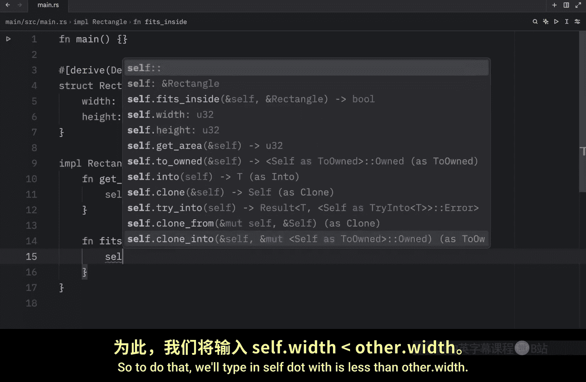

## 带多个参数的方法

上一节我们介绍了如何为结构体定义基本方法。本节中我们来看看如何创建接收额外参数的方法。


以下是一个名为 `fits_inside` 的方法，它接收另一个 `Rectangle` 实例作为参数，用于判断当前矩形是否能放入另一个矩形中。

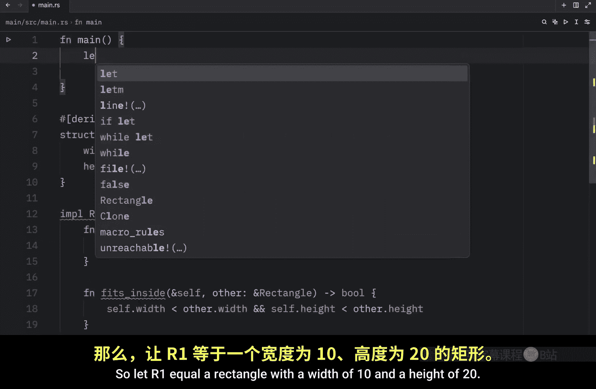


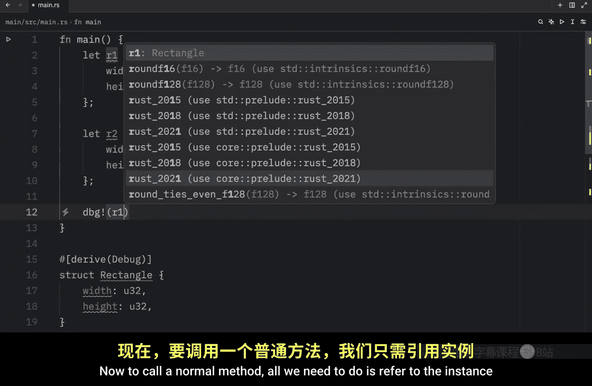

```rust
impl Rectangle {
    // 判断当前矩形是否能放入另一个矩形中
    fn fits_inside(&self, other: &Rectangle) -> bool {
        self.width < other.width && self.height < other.height
    }
}
```
该方法的核心逻辑是：**当前矩形的宽和高都必须小于另一个矩形的宽和高**。

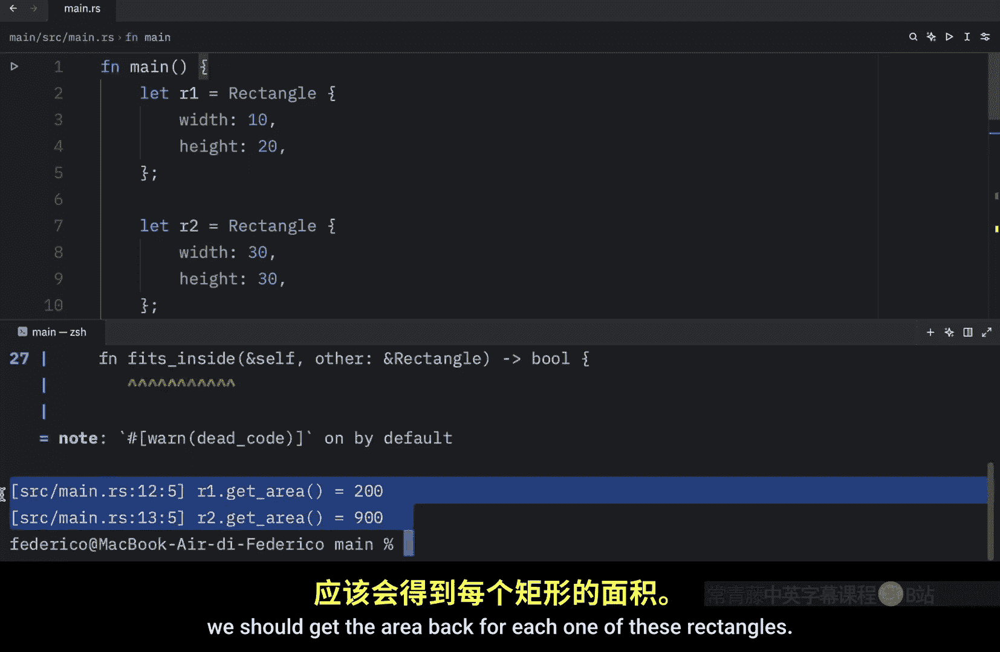


接下来，我们在 `main` 函数中创建两个矩形并调用这个方法。

```rust
fn main() {
    let r1 = Rectangle { width: 10, height: 20 };
    let r2 = Rectangle { width: 30, height: 30 };

    // 调用带参数的方法
    println!("r1 fits inside r2: {}", r1.fits_inside(&r2));
    println!("r2 fits inside r1: {}", r2.fits_inside(&r1));
}
```
运行程序，输出结果符合预期：`r1 fits inside r2: true`，而 `r2 fits inside r1: false`。

---

## 多个实现块

Rust 允许为同一个结构体定义多个 `impl` 块。以下是定义多个实现块的示例：

```rust
impl Rectangle {
    fn area(&self) -> u32 {
        self.width * self.height
    }
}

// 另一个独立的实现块
impl Rectangle {
    fn describe(&self) {
        println!("Rectangle has width {} and height {}", self.width, self.height);
    }
}
```
虽然语法上允许，但在大多数情况下，将所有方法放在一个 `impl` 块中更清晰。我们将在后续课程中看到多个实现块的实际应用场景。


---

## 关联函数

所有定义在 `impl` 块中的函数都被称为**关联函数**，因为它们与 `impl` 关键字后的类型相关联。

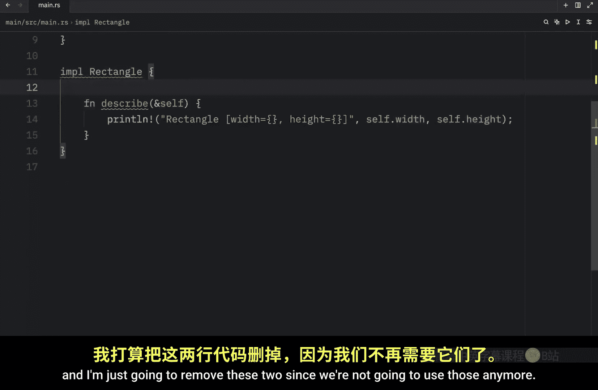

关联函数中，不以 `self` 作为第一个参数的函数，被称为**非方法关联函数**。它们不需要结构体实例即可调用，通常用作返回新实例的构造函数。

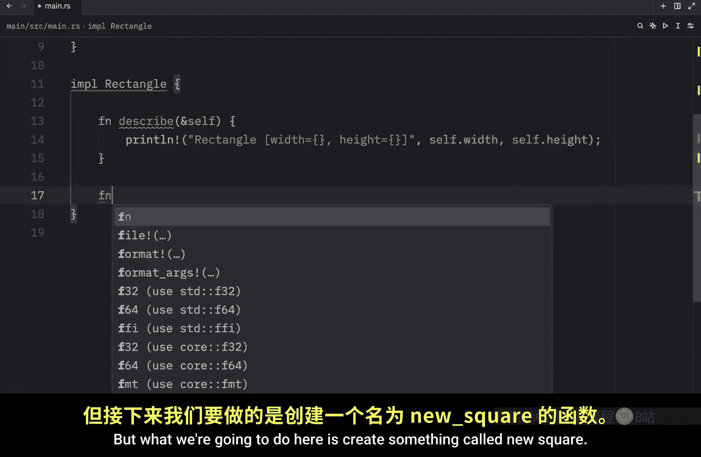

我们之前已经见过一个关联函数：`String::from("Bob")`。这里的 `from` 就是 `String` 类型的一个关联函数。

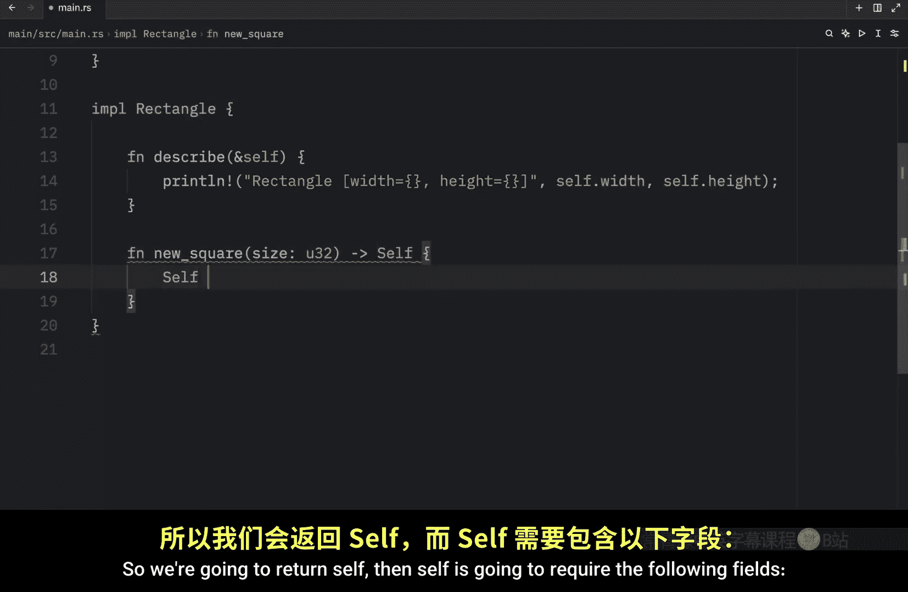

现在，让我们为 `Rectangle` 定义一个关联函数 `new_square`，用于快速创建一个正方形：

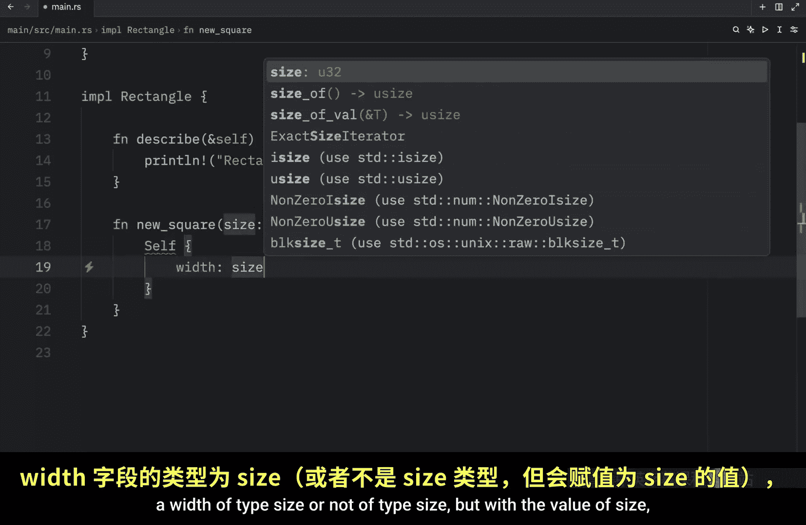

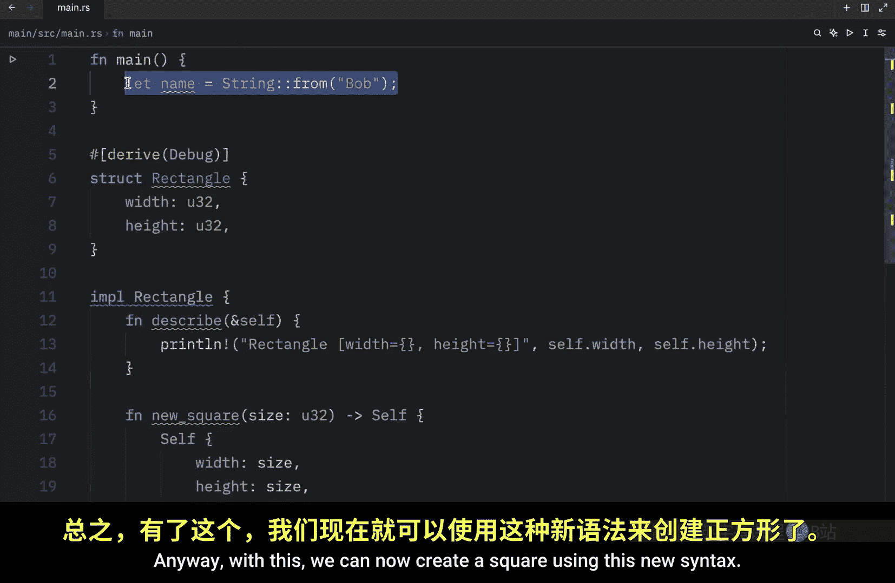

```rust
impl Rectangle {
    // 关联函数：创建一个正方形
    fn new_square(size: u32) -> Self {
        Self {
            width: size,
            height: size,
        }
    }
}
```
在 `main` 函数中，我们可以这样使用它：

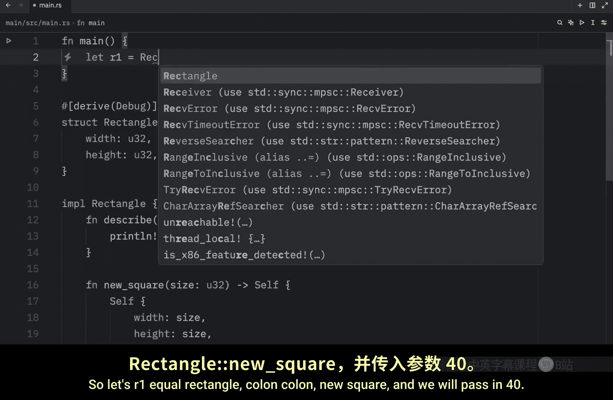


```rust
fn main() {
    // 使用关联函数创建正方形
    let square = Rectangle::new_square(40);
    square.describe(); // 输出：Rectangle has width 40 and height 40
}
```
注意，所有关联功能都可以通过双冒号 `::` 语法调用，但对于需要实例的方法（如 `describe`），直接使用实例的 `.` 语法调用更为简洁直观。

---

## 总结

本节课中我们一起学习了：
1.  **带参数的方法**：可以接收除 `self` 外的其他参数，扩展了方法的功能。
2.  **多个实现块**：Rust 允许为同一类型拆分定义多个 `impl` 块。
3.  **关联函数**：定义在 `impl` 块中的所有函数。不以 `self` 为参数的关联函数常用于实现构造函数（如 `new_square`）。

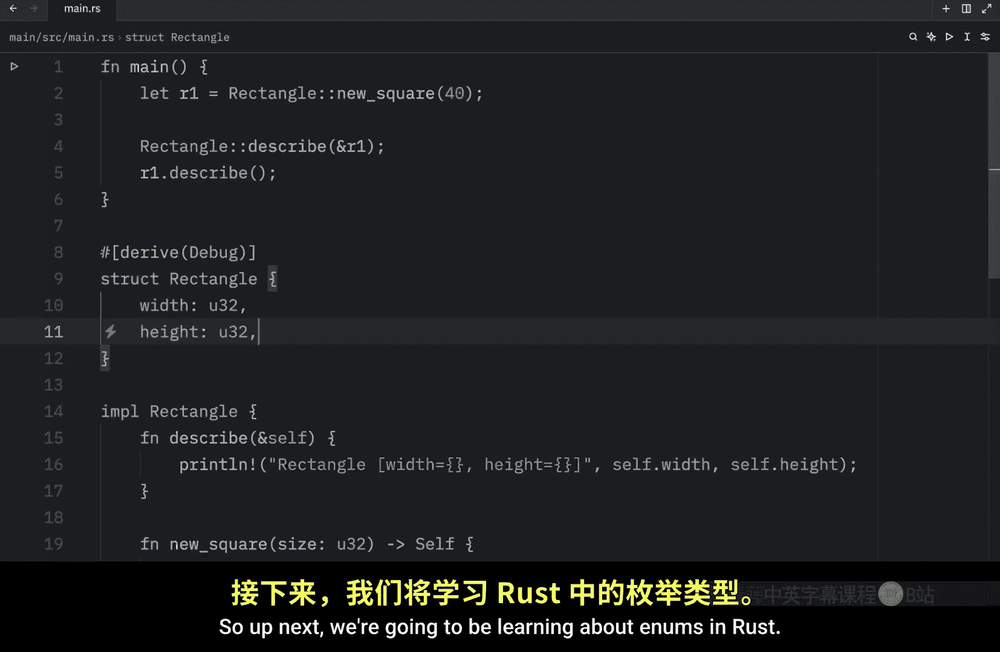

结构体让我们能将相关联的数据组织在一起，而实现块则让我们能为这些数据定义相关的行为，这极大地提升了代码的组织性和清晰度。然而，结构体并非 Rust 中定义自定义类型的唯一方式。在接下来的课程中，我们将学习另一种强大的自定义类型工具：**枚举（Enums）**。