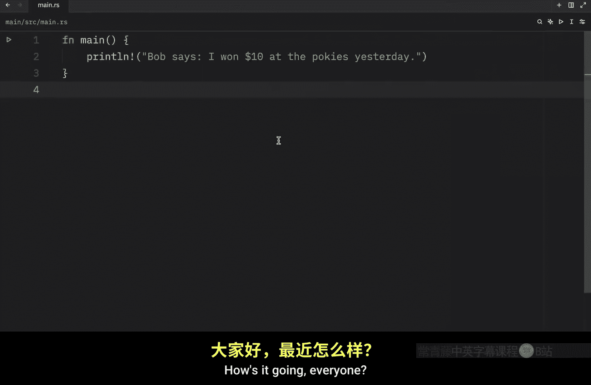

Rust 初学者教程：P40：枚举（Enums）📚

在本节课中，我们将要学习 Rust 中的枚举（`enum`）。枚举允许我们定义一组固定的可能值，这对于表示像开关状态、IP地址版本或消息类型这样的数据非常有用。我们将学习如何定义枚举、创建其实例、将数据与枚举变体关联，以及为枚举定义方法。

---

我们刚刚介绍了结构体（`struct``），它为我们提供了一种将相关字段和数据分组在一起的方法。接下来，我们将学习枚举，它允许我们创建一组固定的值。

例如，如果你有一盏灯，它可能只有两种状态：开和关。这组值非常适合用枚举来表示，因为这就是灯仅有的两个选项。

让我们创建第一个枚举，并列举出那盏灯所有可能的状态。

我们将输入 `enum`（代表 enumerate），然后提供一个名称，例如 `State`。你可以随意命名，但它应该代表其持有的数据，比如灯的状态。在这里，我们可以插入 `On` 和 `Off`。

```rust
enum State {
    On,
    Off,
}
```

现在，`State` 是一个我们可以在代码中任何地方使用的自定义数据类型。

我们将创建几个实例。一个叫做 `on`，我们输入 `State::On`。我们可以为 `off` 做同样的事情。

```rust
let on = State::On;
let off = State::Off;
```

由于这两个值都是 `State` 类型，我们现在可以定义一个接受它们的函数。例如，我们可以创建一个跟踪状态并根据当前状态在关和开之间切换的函数。

```rust
fn toggle(current_state: State) {
    // 切换逻辑...
}
```

此时功能并不重要，重要的是我们可以通过传入一个 `State`（要么是 `On`，要么是 `Off`）来调用这个函数。

```rust
toggle(State::On); // 正常工作
toggle(State::Off); // 也正常工作
```

另一个例子是关于 IP 地址的。我将删除所有这些，创建一个名为 `Ip` 的新枚举。这里我们将有 IPv4 和 IPv6 两个版本。

```rust
enum Ip {
    V4,
    V6,
}
```

有了这个，我们现在可以在结构体或任何我们喜欢的地方将其用作数据类型。

我们将输入 `struct`，然后输入 `IpAddress`。在里面，我们可以添加一个类型为 `Ip` 的 `kind` 字段，和一个类型为 `String` 的 `address` 字段。

```rust
struct IpAddress {
    kind: Ip,
    address: String,
}
```

有了这两个，我们现在可以创建我们的 IP 地址。

让我们的 `home_ip` 等于一个 `IpAddress`，数据如下：`kind` 设置为 `Ip::V4`，`address` 设置为字符串 `"127.0.0.1"`。

```rust
let home_ip = IpAddress {
    kind: Ip::V4,
    address: String::from("127.0.0.1"),
};
```

否则，我们也可以有一个 `loopback` 地址，它也将等于一个 `IpAddress`，但这次我们使用版本 6。

```rust
let loopback = IpAddress {
    kind: Ip::V6,
    address: String::from("::1"),
};
```

这是我们使用枚举的另一种方式。

如果我们愿意，我们还可以将一些数据附加到枚举的每个变体上。例如，`V4` 可以接受一个字符串，然后我们可以对 `V6` 做同样的事情。

```rust
enum Ip {
    V4(String),
    V6(String),
}
```

得益于这种方法，我们可以简化这里的代码。我们将输入 `let home = Ip::V4(String::from("127.0.0.1"))`。这有点像使用构造函数。

```rust
let home = Ip::V4(String::from("127.0.0.1"));
let loopback = Ip::V6(String::from("::1"));
```

这可以被视为一种更好的方法，因为它更简洁，并且在使用时不需要我们创建一个全新的结构体。除此之外，我们定义的每个枚举变体的名称也成为一个构造枚举实例的函数。

但使用枚举而不是结构体的另一个优点是，每个变体可以具有不同类型和数量的关联数据。

例如，回到我们的 `Ip` 枚举，我们可以输入类似 `V4(u8, u8, u8, u8)` 的内容，因为 IPv4 地址总是有四个部分。这意味着我们现在可以输入 `(127, 0, 0, 1)`。

```rust
enum Ip {
    V4(u8, u8, u8, u8),
    V6(String),
}

let home = Ip::V4(127, 0, 0, 1);
let loopback = Ip::V6(String::from("::1"));
```

版本 6 可以继续是一个自定义字符串。你真的可以在枚举中包含任何类型的数据，包括其他枚举。

---

接下来，让我们看另一个枚举的例子。首先，我将删除所有这些，并将这个枚举改为 `Message`。

这个 `Message` 将有四种不同的可能操作：一个是当我们退出消息时发生什么（`Quit`），一个是当我们移动消息时发生什么（`Move`，这将接受一些 `i32` 坐标），一个是当我们创建消息时发生什么（`Create`，这将接受一个 `String`），以及当我们改变消息颜色时发生什么（`ChangeColor`，这将是 `i32, i32, i32`）。

```rust
enum Message {
    Quit,
    Move { x: i32, y: i32 },
    Create(String),
    ChangeColor(i32, i32, i32),
}
```

使用枚举使这很容易创建。如果我们必须使用结构体来做这件事，它看起来会像这样：我们必须为这些操作中的每一个创建一个单独的结构体，那将非常麻烦。除此之外，每个结构体现在都是它自己的类型，使得在我们的程序中将它们全部作为单一类型接受变得更加困难。

例如，如果我们有一个名为 `function` 的函数，它接受一个类型为 `Message` 的消息，那么它将适用于这些操作中的每一个。

```rust
fn function(msg: Message) {
    // 处理消息...
}

// 我们可以传入任何变体
function(Message::Quit);
function(Message::Move { x: 10, y: 20 });
function(Message::Create(String::from("Hello")));
function(Message::ChangeColor(255, 0, 0));
```

如果我们使用结构体方法，这会变得困难得多，因为现在我们只能接受 `Quit` 消息、`Move` 消息等等。我们必须找到一种方法来使用每一个，这又将非常麻烦。

---

在我们进入枚举的下一部分之前，还有最后一件事要介绍，那就是我们也可以使用相同的 `impl` 关键字为它们定义方法。

例如，对于这个 `Message`，我们可以输入 `impl Message`，然后创建一个名为 `call` 的函数，它接受当前实例，然后你可以对该实例做任何你想做的事情。它的工作方式与你在结构体中创建常规方法完全相同。

```rust
impl Message {
    fn call(&self) {
        // 在这里处理消息实例
        println!("Calling method on Message.");
    }
}
```

现在，在 `main` 函数中，我们可以让 `message` 等于 `Message::Create(String::from("Hello, Bob"))`。然后，我们可以引用这个实例并调用这个方法。这本质上与我们用结构体学到的概念完全相同。

```rust
let msg = Message::Create(String::from("Hello, Bob"));
msg.call(); // 输出：Calling method on Message.
```


---



本节课中我们一起学习了 Rust 枚举的核心概念。我们了解了如何定义枚举来表示一组固定的值，如何创建枚举实例，以及如何将数据与变体关联。我们还看到了枚举相比结构体在灵活性和简洁性上的优势，例如允许变体持有不同类型和数量的数据。最后，我们学习了如何为枚举定义方法，使其具备与结构体相似的行为。枚举是 Rust 中构建清晰、安全数据模型的重要工具。