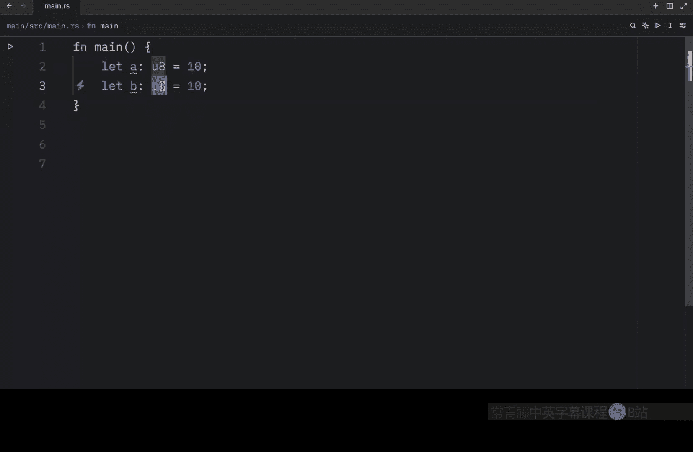
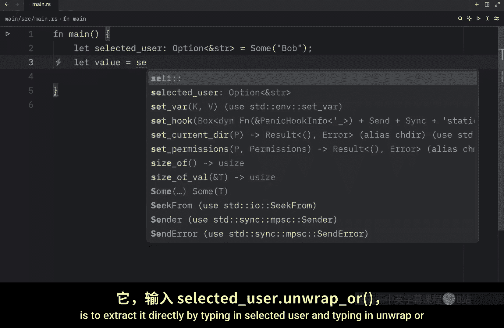
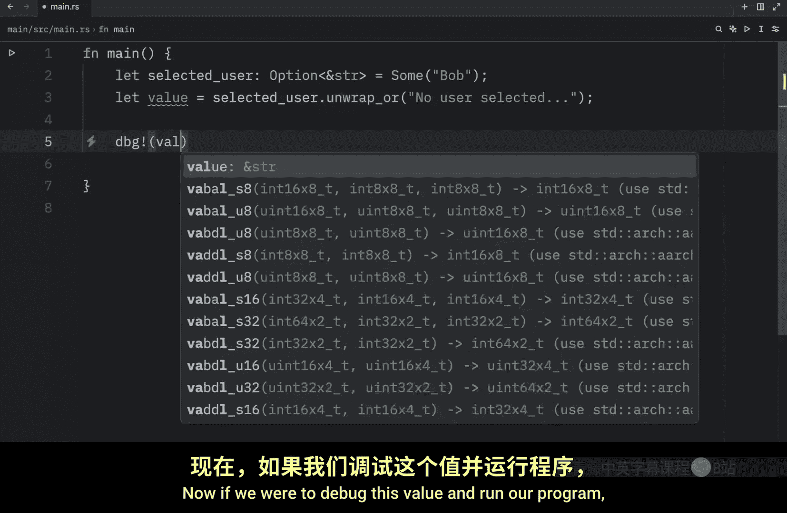
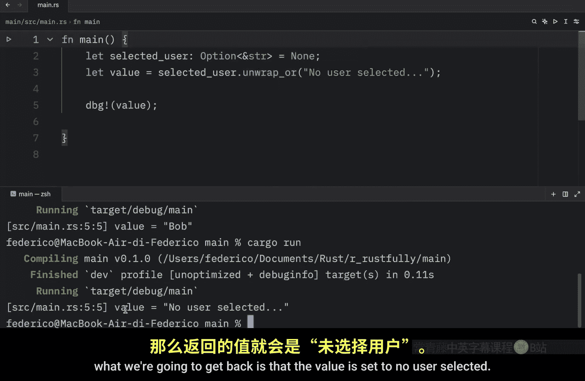
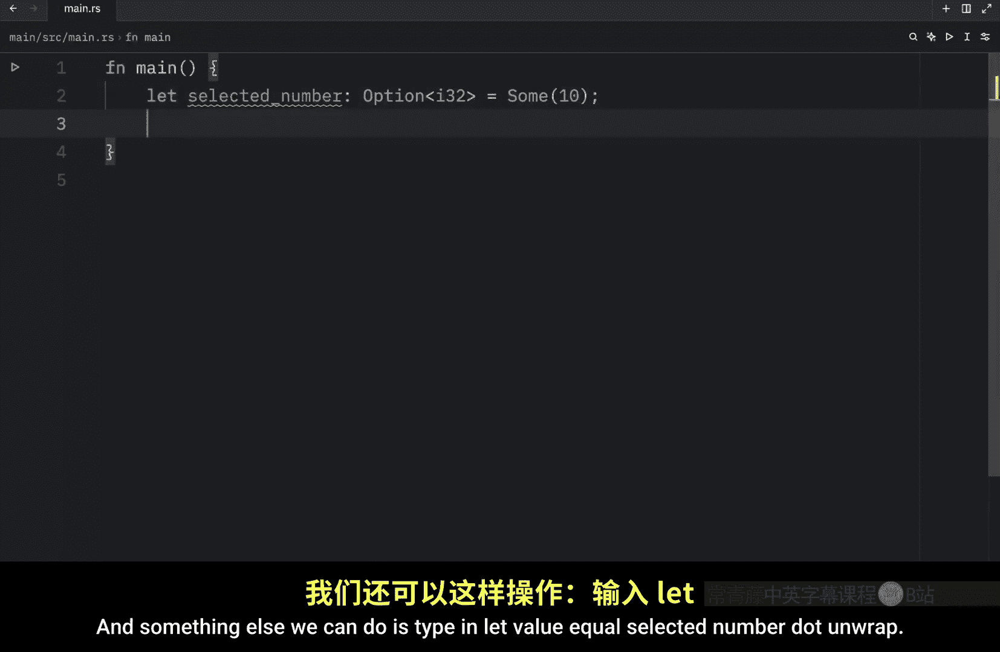

# 041：Option 枚举与空值处理 🧩

在本节课中，我们将学习 Rust 中的 `Option` 枚举，并了解它相比传统空值（null）的优势。

许多编程语言使用 `null` 来表示“没有值”。然而，Rust 没有内置的 `null` 类型。相反，它使用标准库中定义的 `Option` 枚举来表示一个可选值，即一个值可能存在，也可能不存在。这种设计旨在避免因使用空值而引发的常见错误。

## `Option` 枚举的定义

`Option` 枚举的定义如下：

```rust
enum Option<T> {
    Some(T),
    None,
}
```

这里的 `T` 是一个泛型类型参数，意味着 `Option` 可以包装任何类型的值。`Some(T)` 变体表示存在一个类型为 `T` 的值，而 `None` 变体则表示没有值。

由于 `Option` 被包含在 Rust 的预导入模块中，我们可以直接使用 `Some` 和 `None`，而无需显式导入。

## 使用 `Option`

我们可以像这样创建 `Option` 值：

```rust
let some_number: Option<i32> = Some(10);
let no_number: Option<i32> = None;

let some_name: Option<&str> = Some("Bob");
let no_name: Option<&str> = None;
```

一个变量被声明为 `Option<T>` 类型，意味着它要么包含一个 `Some` 值，要么是 `None`。这强制我们在使用值之前，必须考虑它可能不存在的情况。


## 为什么 `Option` 优于 `null`


上一节我们介绍了 `Option` 的基本形式，本节中我们来看看它如何避免空值错误。




核心优势在于类型系统。`Option<T>` 和 `T` 是两种不同的类型。例如，`Option<&str>` 不是一个字符串切片（`&str`）。这意味着你不能意外地将一个可能为空的 `Option` 值当作一个确定存在的值来使用。

请看以下示例：

```rust
let a: u8 = 10;
let b: Option<u8> = Some(20);
// let sum = a + b; // 这行代码会导致编译错误！
```

尝试将 `u8` 与 `Option<u8>` 相加会导致编译失败。Rust 编译器不允许这种操作，因为它无法保证 `b` 中一定包含一个有效的 `u8` 值。你必须先处理 `b` 可能为 `None` 的情况。

这种设计帮助开发者避免了所谓的“十亿美元错误”——在其他语言中，尝试像使用有效值一样使用空值，常常导致程序崩溃或产生难以追踪的 Bug。

## 从 `Option` 中提取值

既然不能直接使用 `Option` 值，我们该如何安全地获取其中可能包含的值呢？以下是几种基本方法。


### 使用 `unwrap_or`


`unwrap_or` 方法提供了一种安全提取值的方式：如果 `Option` 是 `Some`，则返回内部的值；如果是 `None`，则返回你提供的默认值。


```rust
let selected_user: Option<&str> = Some("Bob");
let user_name = selected_user.unwrap_or("No user selected");
println!("{:?}", user_name); // 输出: "Bob"




let no_user: Option<&str> = None;
let user_name2 = no_user.unwrap_or("No user selected");
println!("{:?}", user_name2); // 输出: "No user selected"
```



### 使用 `unwrap`（需谨慎）



`unwrap` 方法更直接：如果 `Option` 是 `Some`，则返回值；如果是 `None`，则会导致程序恐慌（panic）并崩溃。


```rust
let selected_number: Option<i32> = Some(10);
let value = selected_number.unwrap();
println!("{:?}", value); // 输出: 10




let no_number: Option<i32> = None;
// let value2 = no_number.unwrap(); // 运行此行代码会导致程序崩溃！
```

由于 `unwrap` 在值为 `None` 时会引发程序崩溃，因此在生产代码中应尽量避免使用，除非你能百分之百确定 `Option` 不会是 `None`。

处理 `Option` 的推荐方式是显式地处理 `Some` 和 `None` 两种情况。一种非常方便的工具是 `match` 表达式，我们将在下一节课中详细介绍。

## 总结


本节课中我们一起学习了 Rust 中处理空值的核心机制——`Option` 枚举。我们了解到 Rust 没有 `null`，而是使用 `Some(T)` 和 `None` 来明确表达值的“存在”与“缺失”。通过类型系统的强制检查，`Option` 要求我们在编译期就必须处理值可能不存在的情况，从而有效避免了运行时因空值引发的错误。我们还初步掌握了使用 `unwrap_or` 和 `unwrap` 从 `Option` 中提取值的方法。记住，安全地处理 `Option` 是编写健壮 Rust 代码的关键。