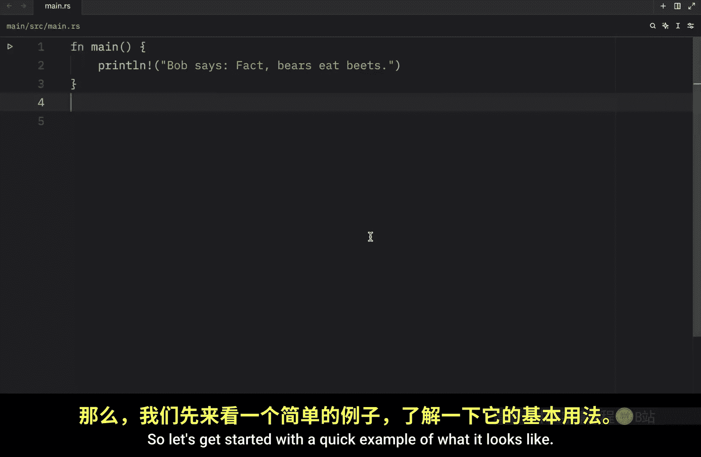
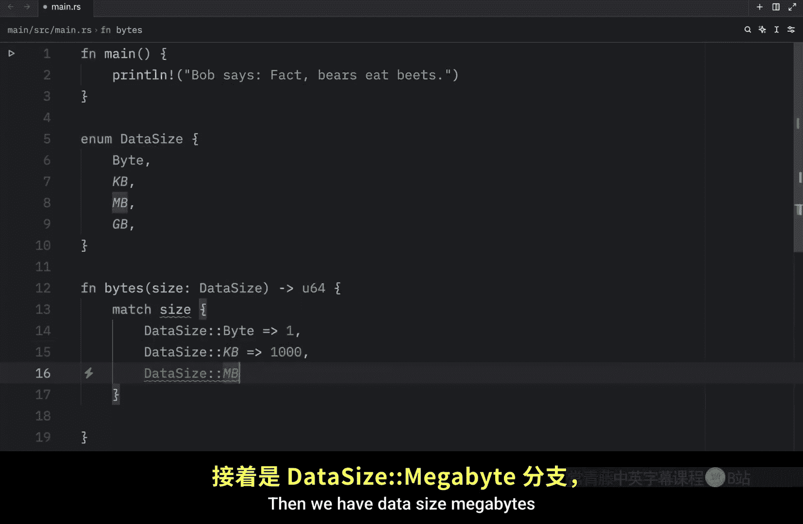
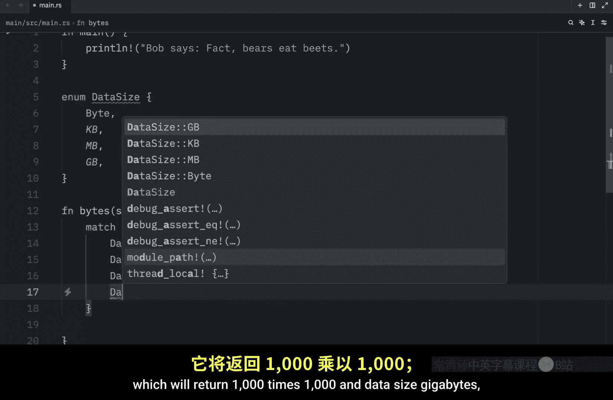
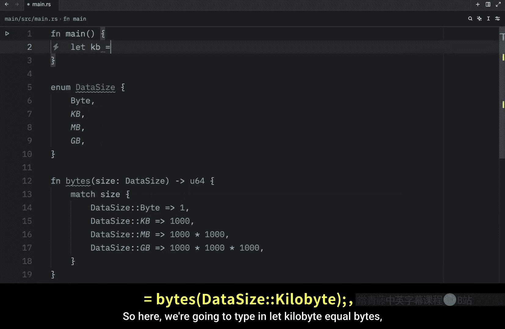
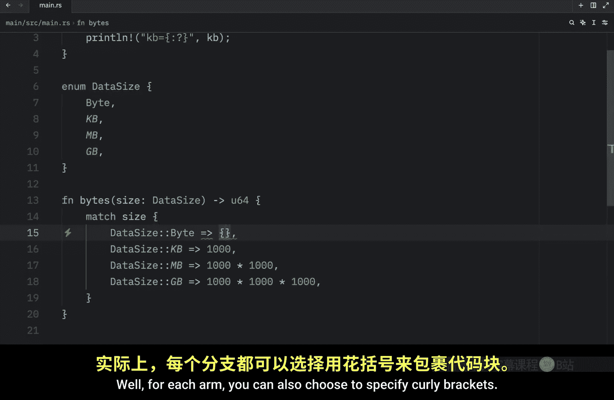
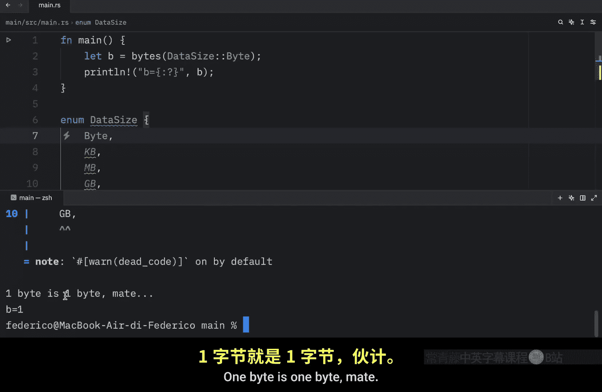
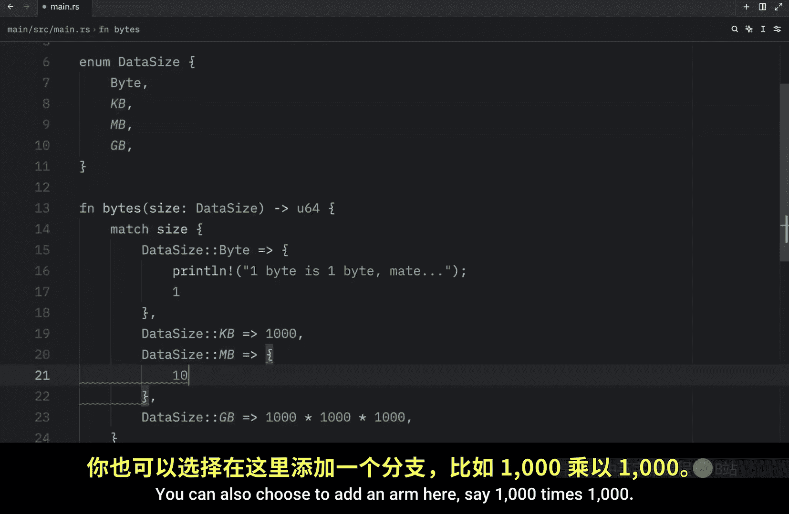
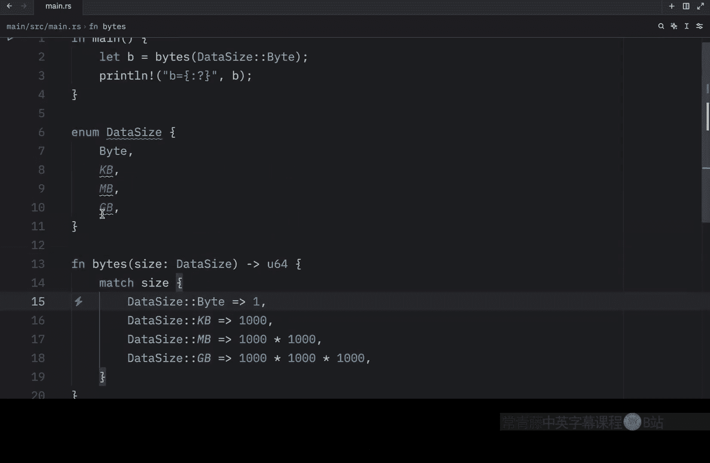
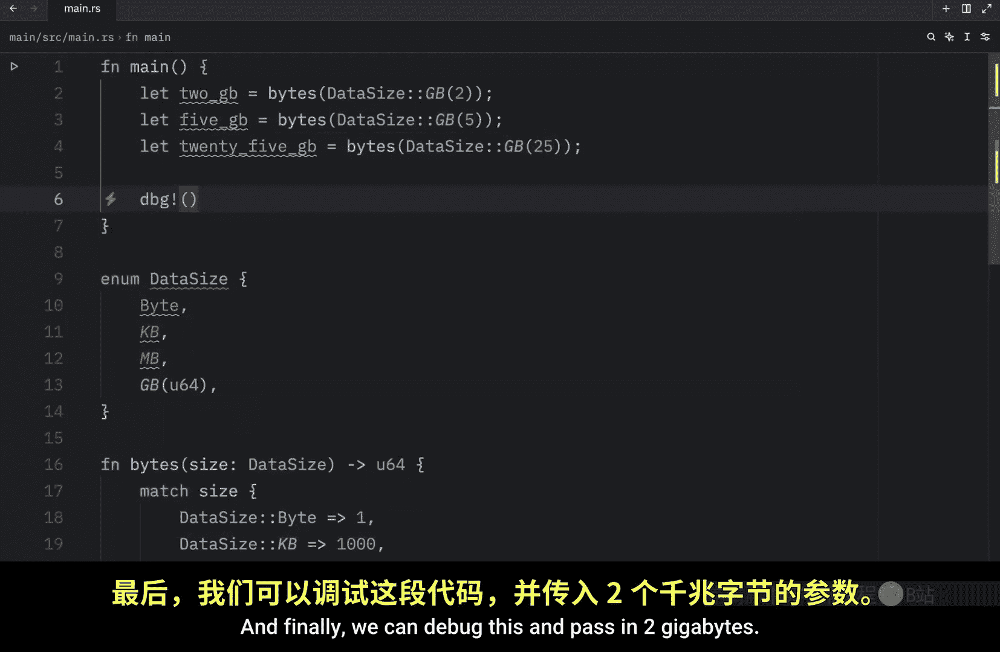

# 042：match 控制流结构

在本节课中，我们将要学习 Rust 中的 `match` 控制流结构。`match` 允许我们将一个值与一系列模式进行比较，然后根据匹配到的模式执行相应的代码。这是一个非常强大且常用的特性。



## 概述


`match` 表达式是 Rust 中处理条件分支的核心工具之一。它类似于其他语言中的 `switch` 语句，但功能更加强大和灵活。通过 `match`，我们可以清晰地处理枚举的不同变体、解构复杂数据类型，并确保所有可能的情况都得到处理。


## 一个简单的 match 示例


为了更好地理解 `match`，让我们从一个具体的例子开始。首先，我们需要创建一个枚举来表示不同的数据大小单位。

```rust
enum DataSize {
    Byte,
    Kilobyte,
    Megabyte,
    Gigabyte,
}
```

接下来，我们创建一个函数 `bytes`，用于将选定的 `DataSize` 转换为字节数。

```rust
fn bytes(size: DataSize) -> u64 {
    // match 表达式将在这里使用
}
```





## 使用 match 关键字

现在，我们来使用 `match` 关键字。`match` 后面跟着我们想要匹配的表达式，在这个例子中就是参数 `size`。

```rust
fn bytes(size: DataSize) -> u64 {
    match size {
        // 匹配臂（arms）将在这里定义
    }
}
```




当 `match` 表达式执行时，它会将结果值与每个“臂”（arm）中的模式进行比较。每个“臂”由模式和要执行的代码组成，两者之间用 `=>` 符号分隔。

以下是 `bytes` 函数的完整实现：

```rust
fn bytes(size: DataSize) -> u64 {
    match size {
        DataSize::Byte => 1,
        DataSize::Kilobyte => 1000,
        DataSize::Megabyte => 1000 * 1000,
        DataSize::Gigabyte => 1000 * 1000 * 1000,
    }
}
```


这个 `match` 表达式有四个臂。每个臂对应 `DataSize` 枚举的一个变体，并返回相应的字节转换值。



现在，让我们在 `main` 函数中使用它：


```rust
fn main() {
    let kilobyte = bytes(DataSize::Kilobyte);
    println!("1 kilobyte is equal to {} bytes", kilobyte);
}
```

运行这段代码，输出将是 `1 kilobyte is equal to 1000 bytes`。这要归功于 `match` 表达式：我们传入了 `DataSize::Kilobyte`，`match` 找到了对应的臂，并返回了结果 `1000`。



## 在匹配臂中执行多行代码




在上面的例子中，每个臂只返回一个简单的值。但如果你想执行多行代码并基于这些代码返回另一个值，该怎么办呢？

对于每个臂，你也可以选择使用花括号 `{}` 来定义一个代码块。这允许我们添加多行代码。

例如，我们可以修改第一个臂：

```rust
DataSize::Byte => {
    println!("One byte is one byte, mate.");
    1 // 这是该代码块的返回值
}
```

现在，如果我们回到 `main` 函数，将调用改为 `DataSize::Byte`，运行代码将会先打印信息，然后变量 `b` 的值将是 `1`。



你可以为任何一个臂添加这样的代码块，它们的顺序可以任意排列。在使用这种语法时，末尾的分号是可选的，代码的运行方式完全相同。


## 绑定值的模式

`match` 更强大的功能之一是模式可以绑定值。让我们通过修改枚举来演示这一点。

我们将修改 `Gigabyte` 变体，让它携带一个 `u64` 类型的值，表示千兆字节的数量。

```rust
enum DataSize {
    Byte,
    Kilobyte,
    Megabyte,
    Gigabyte(u64), // 现在 Gigabyte 携带一个 u64 值
}
```


现在，我们需要更新 `match` 表达式来处理这个带数据的变体。在匹配 `DataSize::Gigabyte` 的臂中，我们可以指定一个变量名（例如 `amount`）来“吸收”这个值，并允许我们在该臂的代码块中使用它。

```rust
DataSize::Gigabyte(amount) => {
    let total = 1000 * 1000 * 1000 * amount;
    let billions = total / 1_000_000_000;
    println!("{} gigabytes is {} billion bytes", amount, billions);
    total // 返回总字节数
}
```

在这个臂中，`amount` 变量捕获了传入 `DataSize::Gigabyte` 的具体数值。然后我们用它来计算总字节数，并打印一个更易读的信息。

现在，我们可以在 `main` 函数中测试它：




```rust
fn main() {
    let two_gigabytes = bytes(DataSize::Gigabyte(2));
    let five_gigabytes = bytes(DataSize::Gigabyte(5));
    let twenty_five_gigabytes = bytes(DataSize::Gigabyte(25));

    println!("{:?}", two_gigabytes);
    println!("{:?}", five_gigabytes);
    println!("{:?}", twenty_five_gigabytes);
}
```

运行代码，你会看到针对每个调用打印的易读信息以及最终的计算结果。这展示了我们如何从 `match` 的模式中提取值并在代码中使用它。

## 总结


本节课中，我们一起学习了 Rust 的 `match` 控制流结构。我们了解了它的基本语法，如何用它来匹配枚举变体，如何在单个臂中执行多行代码，以及如何使用模式来绑定和解构值。`match` 是编写清晰、安全且无遗漏条件逻辑的基石，在后续学习 Option 和 Result 等枚举时尤为重要。