# 043：使用 match 处理 Option 与模式匹配进阶 🧩

在本节课中，我们将学习如何利用 Rust 中的 `match` 表达式来优雅地处理 `Option` 类型，并深入探讨 `match` 的两个关键特性：穷尽性检查和默认分支。

## 使用 match 处理 Option 类型


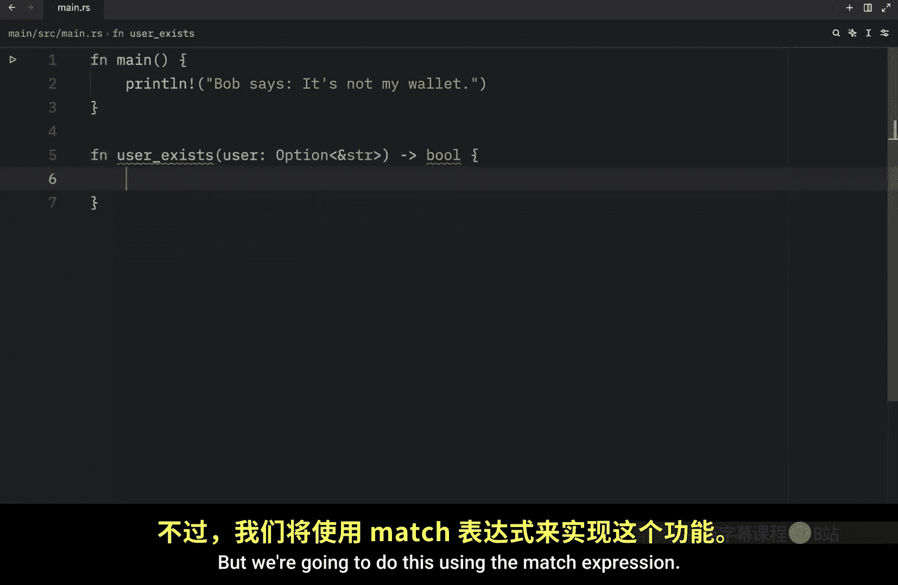


不久前，我们开始学习 Rust 中的 `Option` 类型。现在，让我们快速回顾一下，并学习如何使用新的 `match` 表达式来处理 Rust 中的可选值。

首先，我们将创建一个函数。这个函数接收一个 `Option<&str>` 类型的参数，并使用 `match` 表达式相应地处理该值。该函数将检查用户数据库中是否存在某个用户。


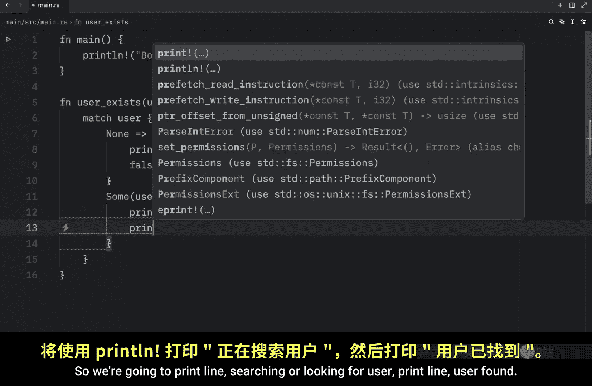

以下是函数定义：
```rust
fn user_exists(user: Option<&str>) -> bool {
    match user {
        None => {
            println!("请插入一个用户名进行搜索。");
            false
        }
        Some(username) => {
            println!("正在为用户 \"{}\" 进行搜索...", username);
            true
        }
    }
}
```
函数 `user_exists` 接收一个 `Option<&str>` 类型的 `user` 参数，并返回一个布尔值。如果用户存在，则返回 `true`，否则返回 `false`。我们使用 `match` 表达式来实现这个逻辑。

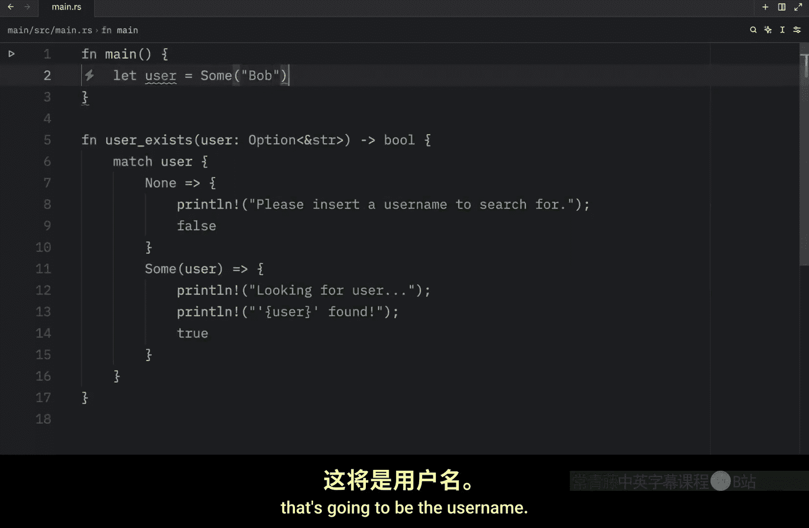

以下是 `match` 表达式的两个分支：
*   **`None` 分支**：当 `user` 为 `None` 时，打印提示信息并返回 `false`，因为显然没有提供用于搜索的用户名。
*   **`Some(username)` 分支**：当 `user` 为 `Some` 时，我们模拟找到了该用户，打印搜索信息并返回 `true`。

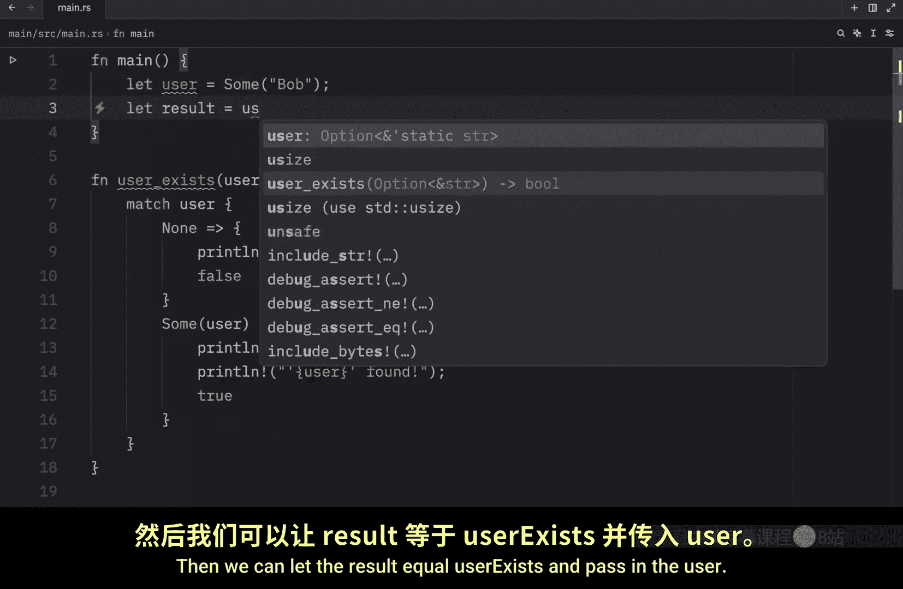

现在，我们可以在 `main` 函数中使用这个函数：
```rust
fn main() {
    let user = Some("Bob");
    let result = user_exists(user);
    println!("用户存在吗？ {}", result);
}
```
如果我们运行程序，输出将显示函数搜索了用户 “Bob” 并返回了 `true`。如果将 `user` 设置为 `None`，程序会提示插入用户名并返回 `false`。

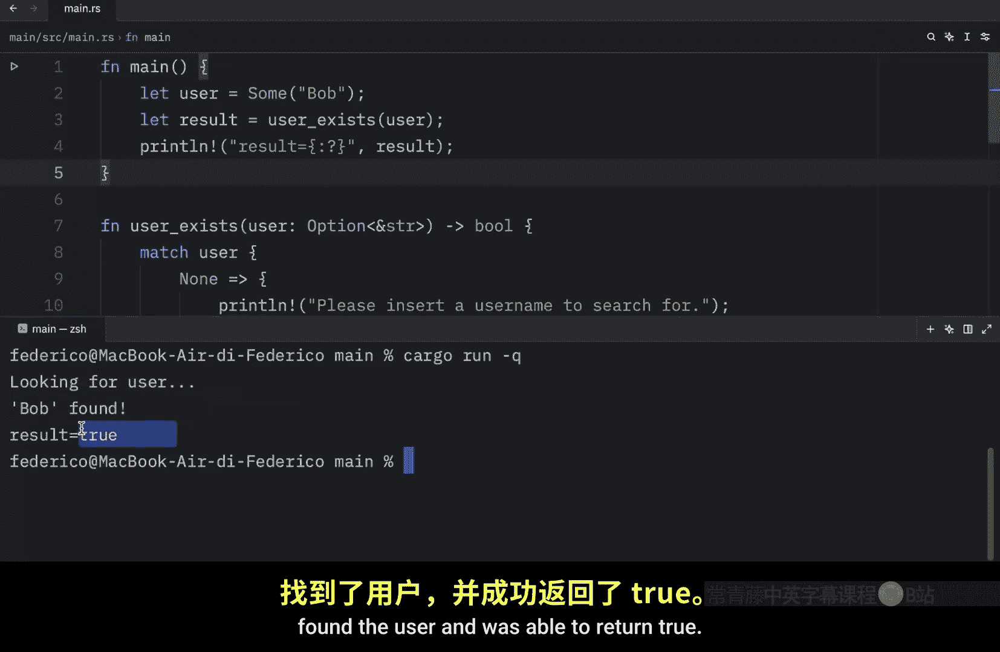

## match 的穷尽性

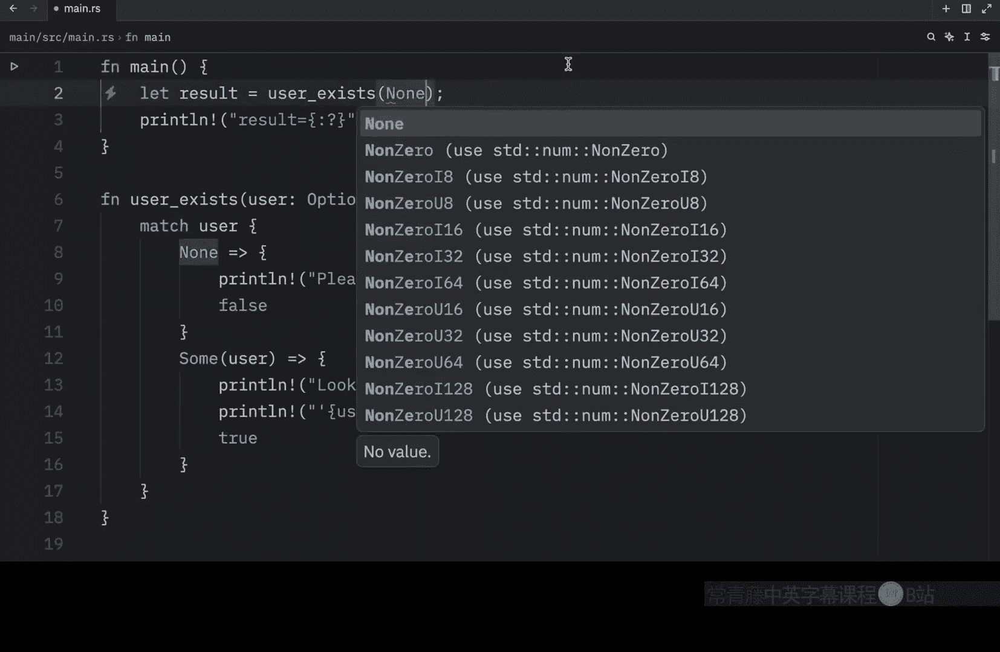


上一节我们介绍了如何使用 `match` 处理 `Option`。本节中我们来看看 `match` 的一个重要特性：**穷尽性**。这意味着当我们尝试匹配某个值时，必须覆盖所有可能的模式，否则代码将无法编译。


为了说明这一点，我们创建一个新示例。假设我们有一些成绩等级 A、B、C，我们想将它们转换为分数。


我们创建一个函数 `grade_to_score`：
```rust
fn grade_to_score(grade: char) -> u8 {
    match grade {
        'A' => 100,
        // 这里缺少了 'B' 和 'C' 的分支
    }
}
```
我们不能只留下 `‘A’` 这一个分支。我们会看到语法高亮提示我们缺少了分支（arms）。我们必须覆盖所有情况，否则程序将无法编译。运行上述代码会导致编译错误，因为我们缺少了处理 `‘B’` 和 `‘C’` 的分支。

为了修复这个问题，我们需要定义所有分支：
```rust
fn grade_to_score(grade: char) -> u8 {
    match grade {
        'A' => 100,
        'B' => 80,
        'C' => 60,
    }
}
```
现在，`match` 表达式覆盖了 `grade` 所有可能的值（在这个上下文中），程序可以正常编译。

## 使用默认分支（Catch-All Arm）


最后，还有一个重要的特性可以帮助我们充分利用 Rust 中的 `match`：**默认值处理**，也称为“全捕获”分支。

对于下一个函数，我们将创建一个虚拟棋盘游戏。函数 `board_event` 接收一个骰子点数。
```rust
fn board_event(roll: u8) {
    match roll {
        1 => println!("Bob 进监狱了。"),
        2 => println!("Bob 中了彩票。"),
        other => println!("Bob 前进了 {} 格。", other),
    }
}
```
考虑到我们将 `roll` 定义为 `u8` 类型，为每一个可能的 `u8` 值（0-255）都写一个分支是不现实的。我们只关心点数 1 到 6，但为了处理其他所有情况，我们可以定义一个默认分支。这就是 `other` 分支，它会捕获所有未被前面分支匹配的值。


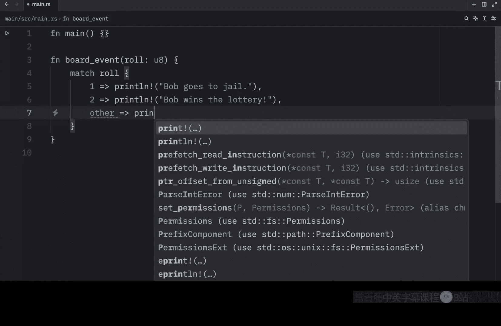

**重要提示**：默认分支必须放在最后，因为 `match` 的分支是按顺序求值的。

当然，我们可以创建功能来确保骰子只有 6 面，但在这个例子中，即使你神奇地投出了一个有 500 面的骰子，这个分支也会处理它，Bob 会前进 500 格。

为了让程序更真实，我们再创建一个掷骰子的函数。这需要用到 `rand` crate。
```rust
use rand::Rng;

fn roll_dice() -> u8 {
    let mut rng = rand::thread_rng();
    let roll = rng.gen_range(1..=6);
    println!("Bob 掷出了 {}.", roll);
    roll
}
```
首先，通过 `cargo add rand` 命令将 `rand` crate 添加到项目中。`roll_dice` 函数生成一个 1 到 6（包含）的随机数，打印结果并返回。

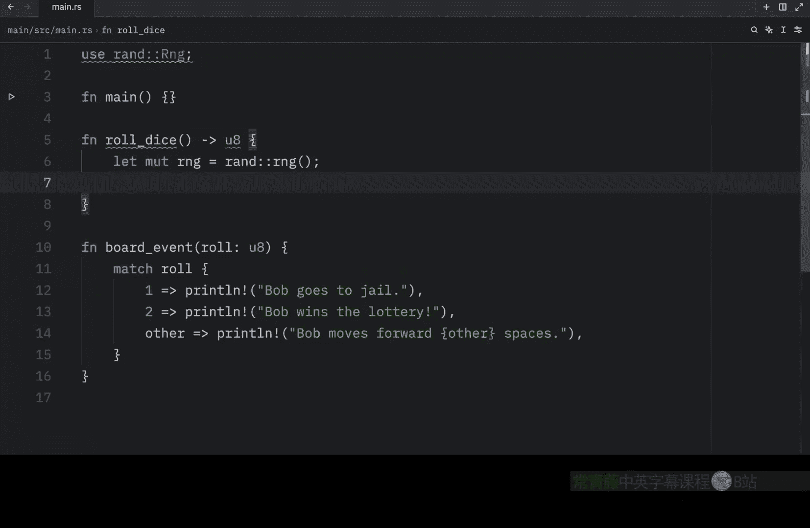


现在，在 `main` 函数中使用它：
```rust
fn main() {
    let roll = roll_dice();
    board_event(roll);
    // 也可以直接测试特定值
    board_event(1); // 输出：Bob 进监狱了。
    board_event(2); // 输出：Bob 中了彩票。
}
```
运行程序，根据掷出的点数，会触发不同的事件。如果点数是 1 或 2，触发特定事件；否则，触发默认分支，并且 `other` 变量的值会被用在打印语句中。

## 忽略默认分支的值

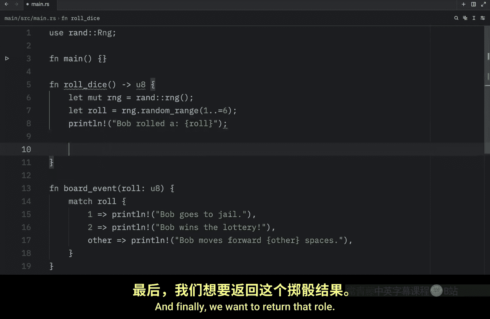

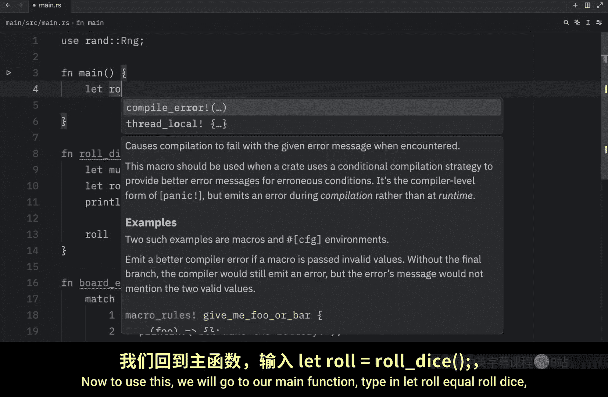

现在，假设你并不关心捕获到的具体值。我们并不必须为默认分支指定一个变量名。

我们可以使用下划线 `_` 来忽略这个值：
```rust
fn board_event(roll: u8) {
    match roll {
        1 => println!("Bob 进监狱了。"),
        2 => println!("Bob 中了彩票。"),
        _ => println!("Bob 什么也没做。"),
    }
}
```
现在，对于任何其他值，都会触发 “Bob 什么也没做” 的事件。这样我们就可以在不关心具体值的情况下捕获所有其他情况。

最后，如果你甚至不想在默认分支中执行任何代码，可以传入**单元类型** `()`：
```rust
fn board_event(roll: u8) {
    match roll {
        1 => println!("Bob 进监狱了。"),
        2 => println!("Bob 中了彩票。"),
        _ => (),
    }
}
```
这明确地告诉 Rust，当我们触发默认分支时，我们什么都不想做。现在如果运行代码，当触发默认分支时，将不会有任何输出。

## 总结

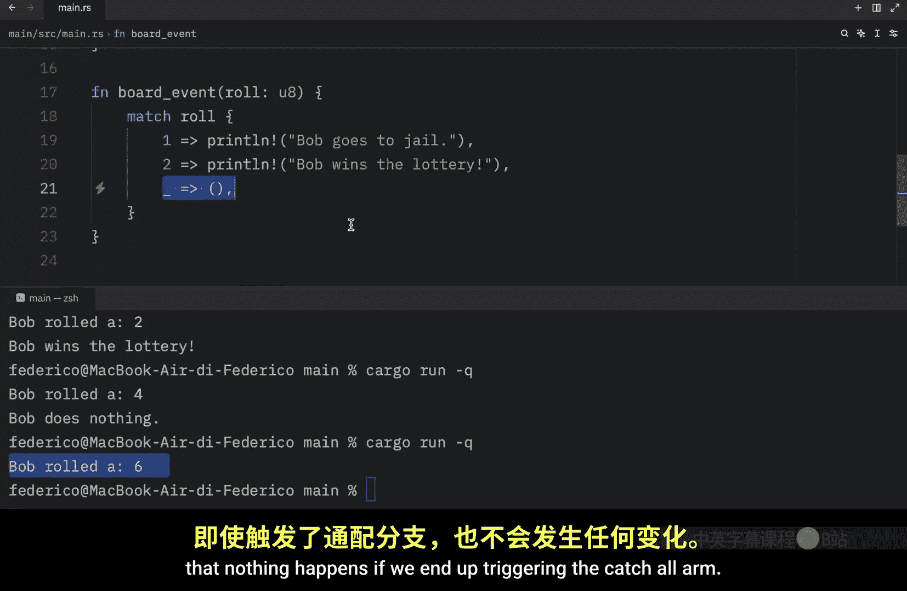

本节课中我们一起学习了 `match` 表达式在 Rust 中的强大应用。我们首先用它来安全地处理 `Option` 类型的 `Some` 和 `None` 变体。接着，我们了解了 `match` 的**穷尽性**原则，即必须覆盖所有可能的情况。最后，我们探索了如何使用**默认分支**（`other` 或 `_`）来简洁地处理未明确列出的所有其他值，甚至可以使用 `()` 来明确表示不执行任何操作。掌握这些技巧将使你能够更清晰、更安全地编写 Rust 代码。