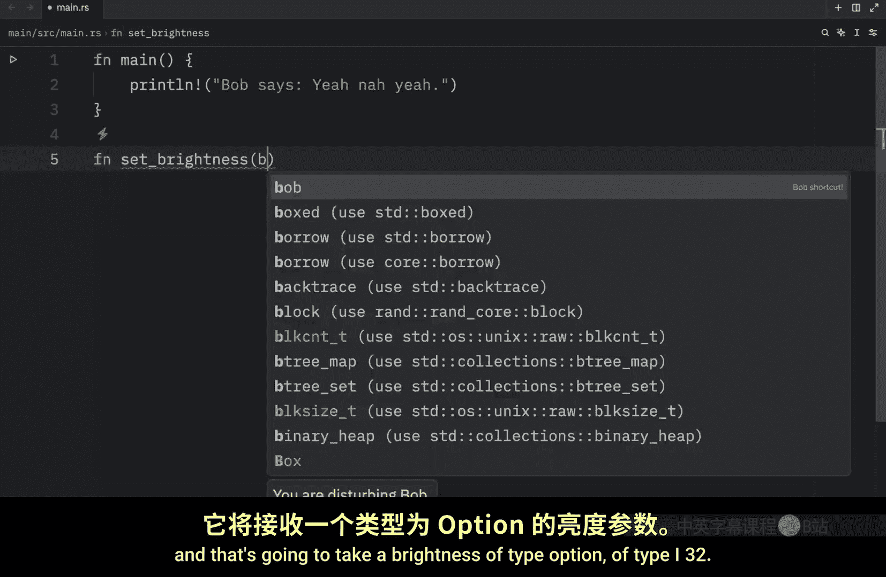
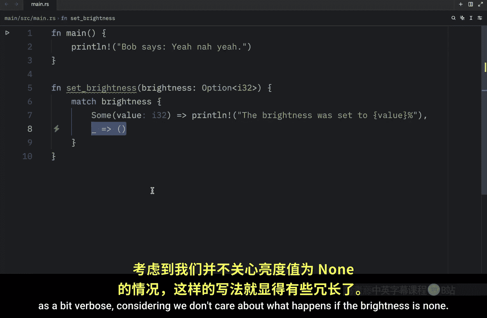
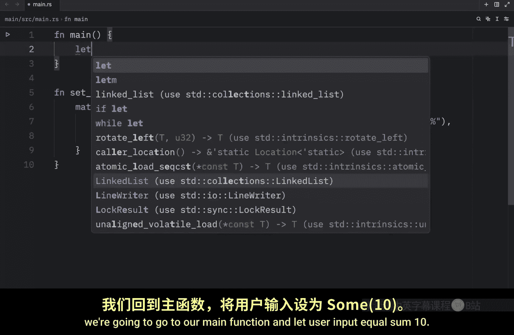
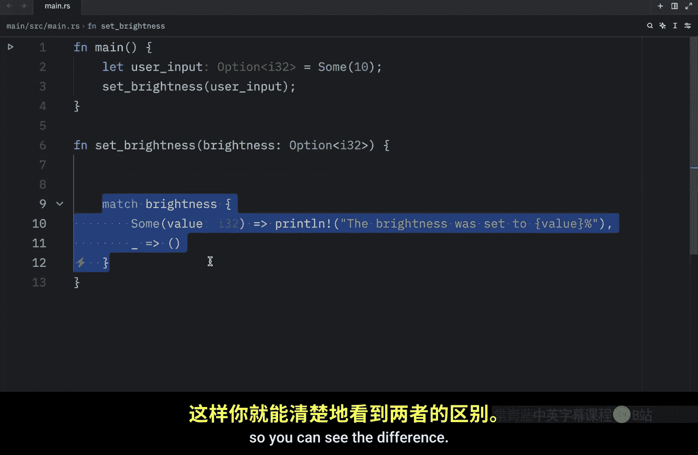
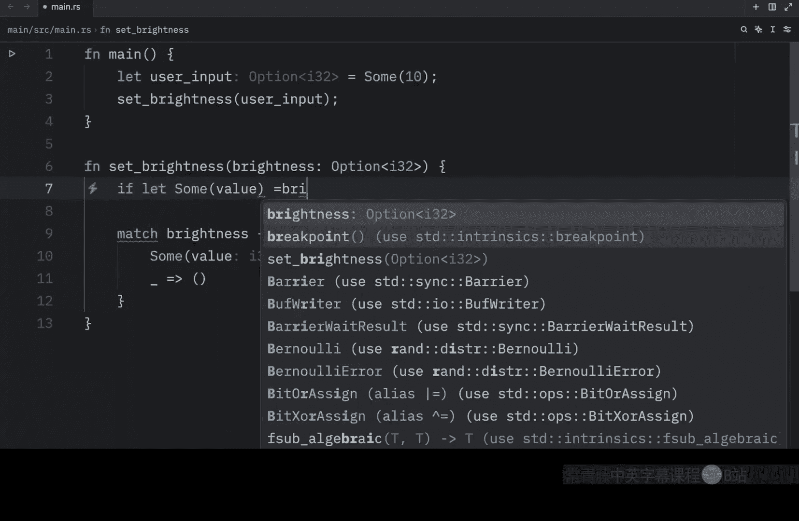
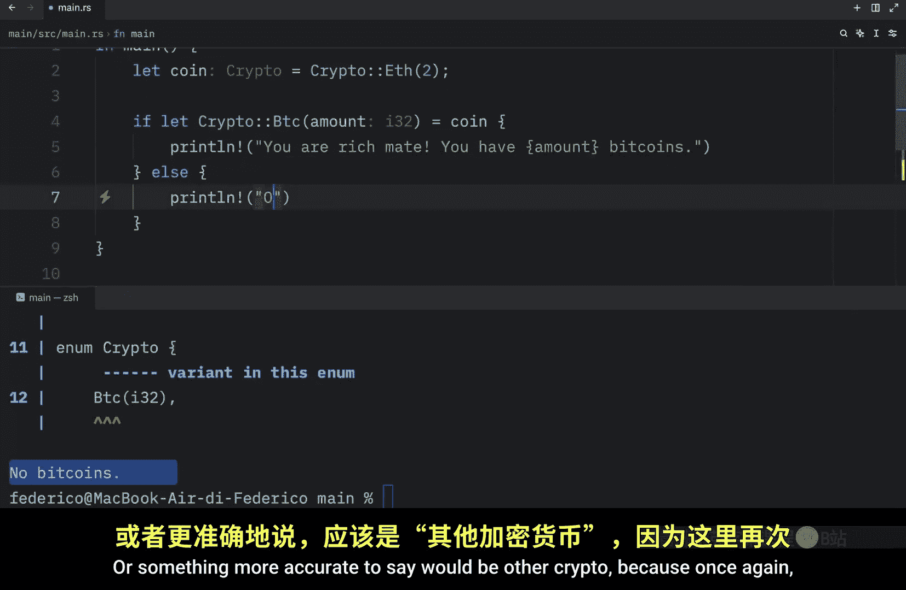
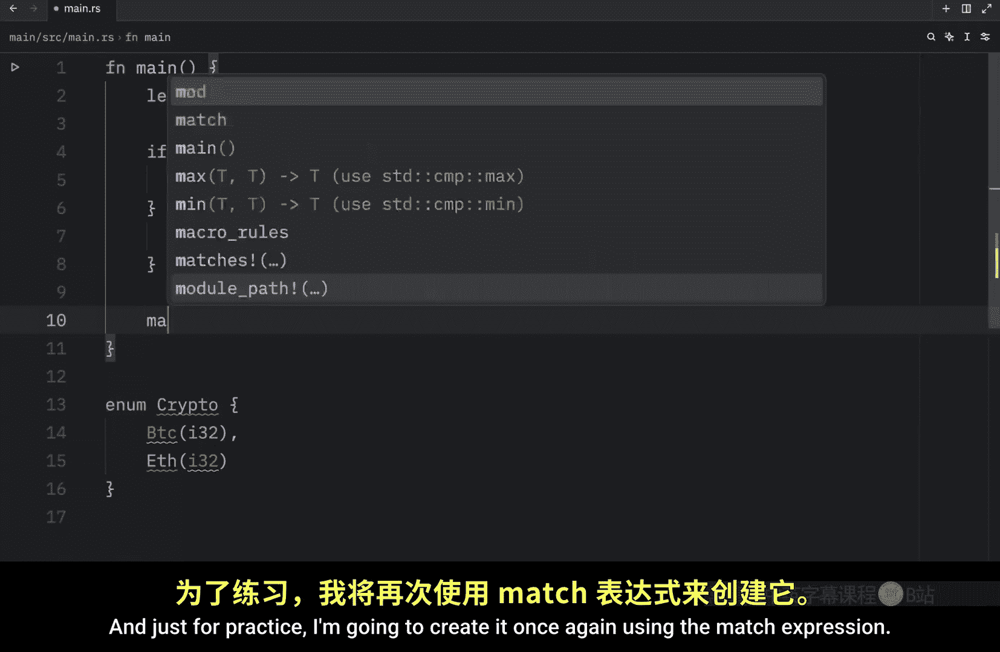
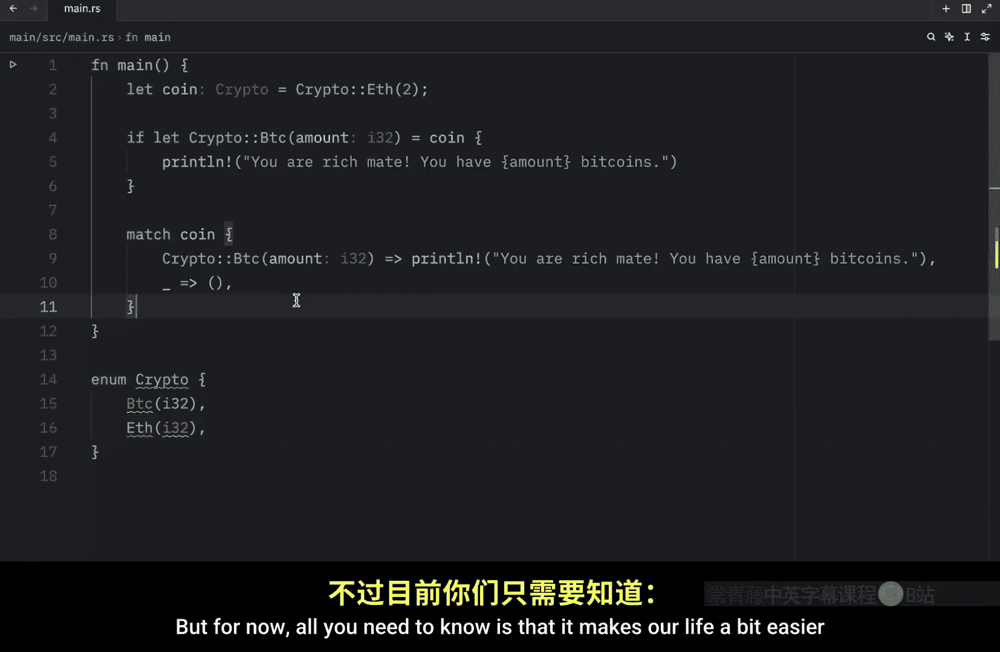

# 044：`if let` 语法糖 🍬

在本节课中，我们将要学习 Rust 中的 `if let` 语法。这是一种更简洁的方式来处理只匹配一个特定模式，而忽略所有其他情况的值。

## 概述

`if let` 是 Rust 提供的一种语法糖，它允许你在只关心一个匹配模式时，避免编写冗长的 `match` 表达式。它特别适用于处理 `Option` 或 `Result` 等枚举类型，当你只对其中一种变体（如 `Some`）感兴趣，而对其他所有情况（如 `None`）不做任何处理或进行统一处理时。

## 从 `match` 表达式开始

为了更好地理解 `if let`，我们先来看一个使用传统 `match` 表达式的例子。

假设我们有一个设置电脑屏幕亮度的函数。该函数接收一个 `Option<i32>` 类型的参数，表示亮度值（`Some(i32)`）或没有设置（`None`）。




以下是使用 `match` 的实现：

```rust
fn set_brightness(brightness: Option<i32>) {
    match brightness {
        Some(value) => println!("亮度被设置为 {}%", value),
        _ => (),
    }
}
```

在上面的代码中，`match` 表达式有两个分支：
*   `Some(value)`：当 `brightness` 是 `Some` 时，打印设置的值。
*   `_`：这是一个通配符模式，匹配所有其他情况（在这里就是 `None`），并且使用空元组 `()` 表示不执行任何操作。

在 `main` 函数中调用它：





```rust
fn main() {
    let user_input = Some(10); // 假设用户输入了 10
    set_brightness(user_input);
}
```

运行代码，输出为：`亮度被设置为 10%`。如果传入 `None`，则不会有任何输出。

虽然 `match` 表达式功能强大且清晰，但在这个场景中，我们只关心 `Some` 的情况，对 `None` 不做任何处理。此时，`match` 的写法就显得有些冗余。

## 引入 `if let` 语法

`if let` 提供了一种更简洁的方式来处理上述情况。它本质上是一个只关心单一模式的 `match` 表达式。

现在，我们用 `if let` 重写 `set_brightness` 函数：

```rust
fn set_brightness(brightness: Option<i32>) {
    if let Some(value) = brightness {
        println!("亮度被设置为 {}%", value);
    }
}
```


这段代码与之前的 `match` 表达式完全等效。它的含义是：**如果** `brightness` 能够匹配 `Some(value)` 这个模式，**那么**就执行后面的代码块。如果匹配失败（即 `brightness` 是 `None`），则跳过整个代码块。





运行修改后的代码，结果与之前完全相同。

## 使用 `else` 块

与 `if` 语句类似，`if let` 也可以搭配 `else` 块使用，用于处理模式匹配失败的情况。

这相当于 `match` 表达式中通配符 `_` 分支的作用。

让我们为函数添加一个 `else` 分支：

```rust
fn set_brightness(brightness: Option<i32>) {
    if let Some(value) = brightness {
        println!("亮度被设置为 {}%", value);
    } else {
        println!("未设置亮度。");
    }
}
```


现在，如果调用 `set_brightness(None)`，将会输出：`未设置亮度。`


## 另一个例子：枚举匹配

`if let` 不仅适用于 `Option`，也适用于任何枚举。让我们看一个自定义枚举的例子。

首先，定义一个表示加密货币的枚举：


```rust
enum Crypto {
    Btc(i32),      // 比特币，附带数量
    Ethereum(i32), // 以太坊，附带数量
}
```

接下来，在 `main` 函数中，我们使用 `if let` 来检查一个 `Crypto` 值是否是比特币：

```rust
fn main() {
    let coin = Crypto::Btc(2); // 持有 2 个比特币

    if let Crypto::Btc(amount) = coin {
        println!("你真富有！你有 {} 个比特币。", amount);
    } else {
        println!("没有比特币。");
    }
}
```

如果 `coin` 是 `Crypto::Btc` 变体，它会将内部的值绑定到变量 `amount` 上，然后执行第一个代码块。
如果 `coin` 是其他变体（如 `Crypto::Ethereum`），则会执行 `else` 块。

运行代码，输出为：`你真富有！你有 2 个比特币。`
如果将 `coin` 改为 `Crypto::Ethereum(5)`，输出则为：`没有比特币。`

为了对比，以下是使用 `match` 表达式实现的相同逻辑：

```rust
match coin {
    Crypto::Btc(amount) => println!("你真富有！你有 {} 个比特币。", amount),
    _ => println!("其他加密货币。"),
}
```




在这个具体的例子中，由于我们需要明确处理“其他所有情况”并给出提示，使用 `match` 表达式可能看起来更清晰、意图更明确。



## `if let` 的使用时机

`if let` 是一个语法糖，目的是在特定场景下让代码更简洁。关于何时使用它，有以下几点需要注意：

1.  **首选场景**：当你只关心**一个**匹配模式，并且对其他所有模式要么不做任何处理，要么进行统一的简单处理（使用 `else`）时，`if let` 通常更简洁。
2.  **权衡选择**：你不应该强迫自己使用 `if let`。如果 `match` 表达式能让你的代码逻辑更清晰、更易读，尤其是在需要处理多个不同模式时，就应该坚持使用 `match`。
3.  **未来应用**：随着深入学习 Rust（例如处理错误 `Result`、解析复杂数据结构），你会遇到更多 `if let` 能显著简化代码的场景。目前，你只需要掌握它的基本概念。

## 总结

本节课我们一起学习了 Rust 中的 `if let` 语法。

*   我们了解了 `if let` 是 `match` 表达式在只匹配单一模式时的简洁替代写法。
*   我们通过设置亮度的例子，对比了 `match` 和 `if let` 的实现，看到了 `if let` 如何消除冗余代码。
*   我们学习了如何为 `if let` 添加 `else` 分支来处理匹配失败的情况。
*   我们通过一个自定义枚举的例子，巩固了 `if let` 的用法。
*   最后，我们讨论了 `if let` 的最佳使用时机，强调应根据代码清晰度在 `if let` 和 `match` 之间做出选择。



记住，`if let` 是工具箱中的一件便利工具，旨在让代码在特定情况下更优雅，而不是用来完全取代 `match`。