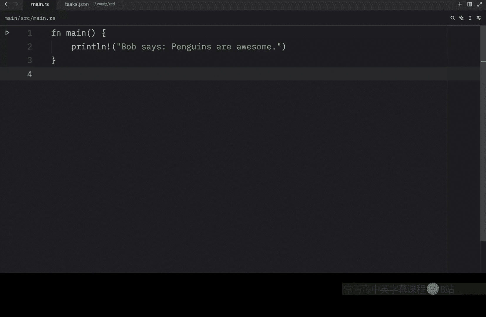
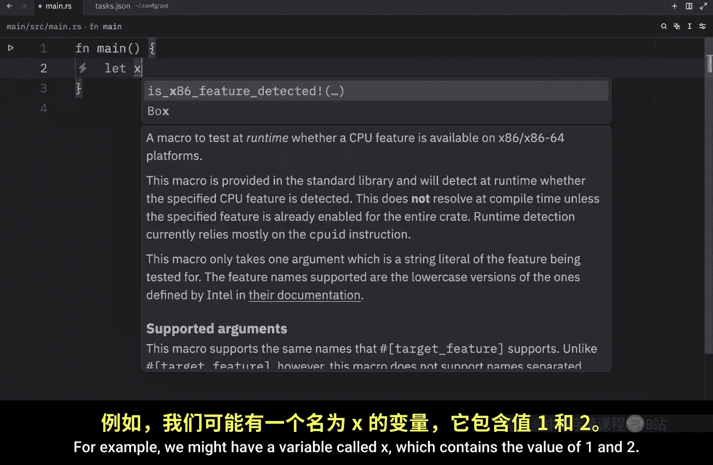
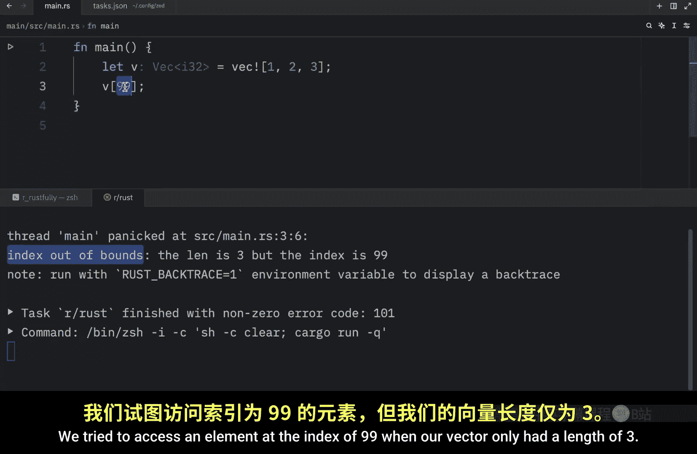
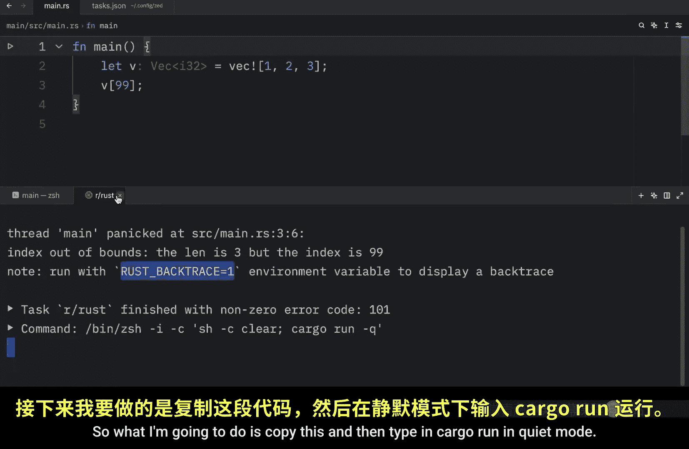
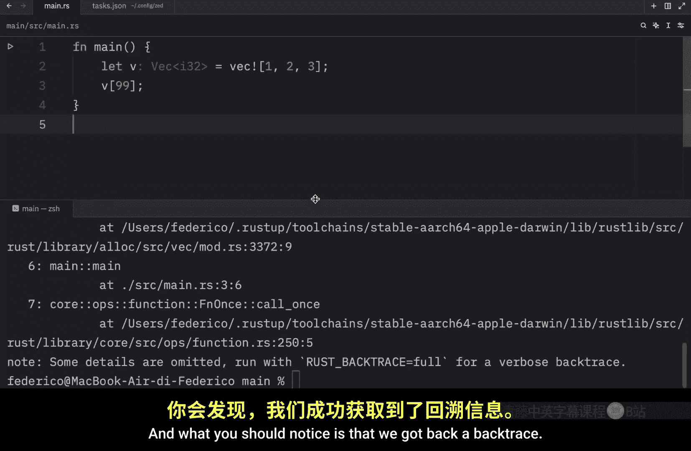

# 045：错误处理 - 是时候 panic 了！😱

在本节课中，我们将要学习 Rust 中的错误处理。理解错误处理是编写健壮程序的关键，它帮助我们区分程序中可能出现的不同问题，并采取相应的措施。

Rust 要求程序员必须承认某些代码可能导致错误。这个要求使得我们的程序更加健壮，因为它迫使我们在尝试编译代码之前，就妥善处理那些可能出错的代码。

Rust 将错误分为两大类：**可恢复错误**和**不可恢复错误**。

*   **可恢复错误**通常指程序运行时出现的问题，但可以在运行时修复。例如，用户尝试打开一个不存在的文件，程序可以提示“文件未找到”错误，并让用户重新输入文件名。
*   **不可恢复错误**则是程序本身的缺陷（bug），无法在运行时修复，表明程序存在需要解决的问题。

大多数语言不严格区分这两种错误，通常使用异常机制统一处理。但 Rust 没有异常机制。它使用 `Result` 类型来处理可恢复错误，使用 `panic!` 宏来处理不可恢复错误。

我们将在接下来的几个视频中介绍这两者。本节中，我们先来看看如何使用 `panic!` 宏处理不可恢复错误。

## 引发 Panic

有时，代码中会发生我们无法处理的糟糕情况。此时，Rust 提供了一个名为 `panic!` 的宏来终止程序。

在实践中，有两种方式会导致 panic。





### 方式一：执行导致 panic 的操作

第一种是通过执行某些操作导致代码 panic，例如访问数组的无效索引。

```rust
let x = [1, 2];
println!("{}", x[3]); // 尝试访问索引为 3 的元素
```

幸运的是，这段代码无法编译，因为我们试图访问一个不存在的元素。即使我们尝试访问索引 `2`，也同样会越界。编译器会提示这个操作将在运行时引发 panic。

### 方式二：显式调用 `panic!` 宏


第二种方式是直接调用 `panic!` 宏。

```rust
panic!("Bob ran away");
```

默认情况下，panic 会打印失败信息、展开调用栈、清理资源，然后退出程序。我们可以通过设置环境变量，让 Rust 在 panic 发生时显示完整的调用栈，以便追踪错误根源。

运行上述代码，你会看到类似下面的输出：

```
thread 'main' panicked at src/main.rs:2:5:
Bob ran away
```

第一行信息显示了 panic 发生的位置：主线程、源文件、行号和字符位置。之后的部分是错误信息。

在这个例子中，panic 很容易追踪，因为它直接发生在当前文件中。但有时，panic 会间接发生，即当前文件中的函数调用了项目其他地方的函数，而那个函数导致了 panic。

## 使用回溯追踪间接 Panic

为了理解这种情况，我们创建一个使用 `Vec`（向量）的例子。向量类似于数组，但它是动态且可增长的，可以在运行时添加或删除元素。

```rust
let v = vec![1, 2, 3];
println!("{}", v[99]); // 尝试访问索引为 99 的元素
```

我们使用向量是因为 Rust 允许编译这段代码，即使它会在运行时立即 panic。运行后，程序会因为索引越界而 panic。

在 C 语言中，尝试读取数据结构末尾之外的数据会导致“未定义行为”，可能读取到不属于该结构的内存数据，这被称为“缓冲区过度读取”，可能引发安全漏洞。为了保护程序免受此类漏洞影响，当 Rust 发现你尝试读取不存在的索引时，它会停止执行并拒绝继续。

再次打开控制台，你会注意到提示告诉我们，可以设置环境变量来获取导致错误发生的完整回溯。回溯是一个列出所有被调用函数以到达当前点的列表。

我们可以通过以下命令在调试模式下运行程序来获取回溯：


```bash
cargo run
```




在调试模式下运行代码会包含调试符号，从而获得详细的回溯信息。而在发布模式下运行：

```bash
cargo run --release
```

则会得到一个更简短的回溯，省略了所有调试符号。





## 总结

本节课中我们一起学习了 Rust 错误处理的基础，特别是关于不可恢复错误和 `panic!` 宏的知识。我们了解到：
1.  Rust 将错误分为可恢复和不可恢复两类。
2.  `panic!` 宏用于处理不可恢复错误，它会终止程序。
3.  引发 panic 有两种方式：执行非法操作（如数组越界访问）或显式调用 `panic!` 宏。
4.  当 panic 间接发生时，可以通过设置环境变量或在调试模式下运行程序来获取函数调用回溯，帮助定位问题根源。


下一节，我们将开始学习如何在 Rust 中处理可恢复错误。