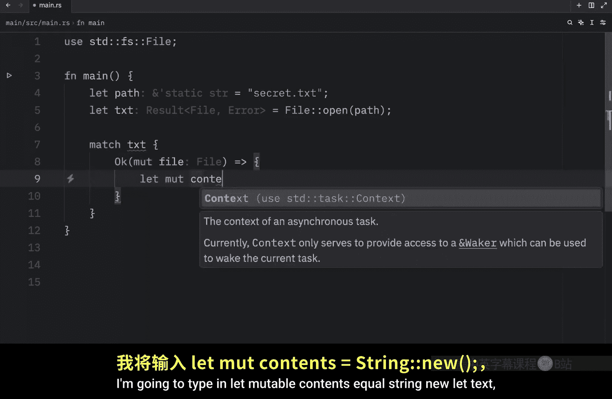
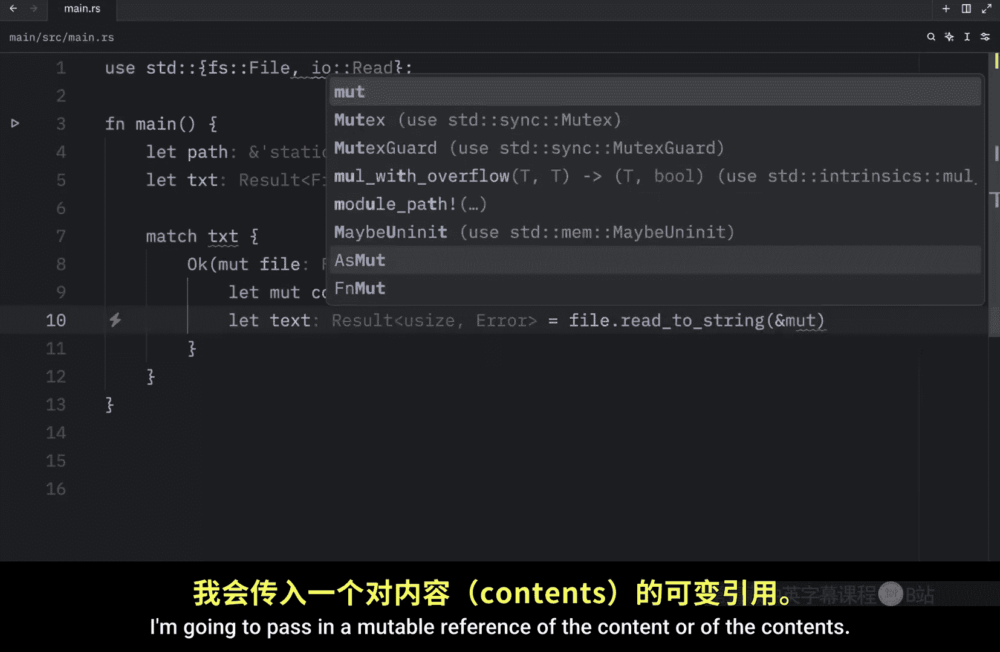
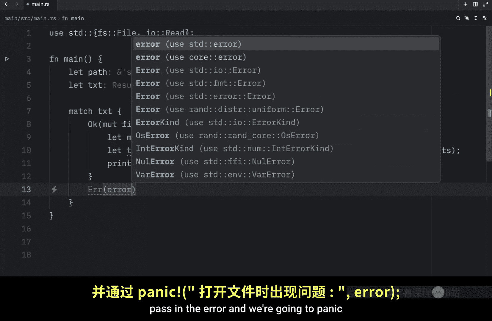
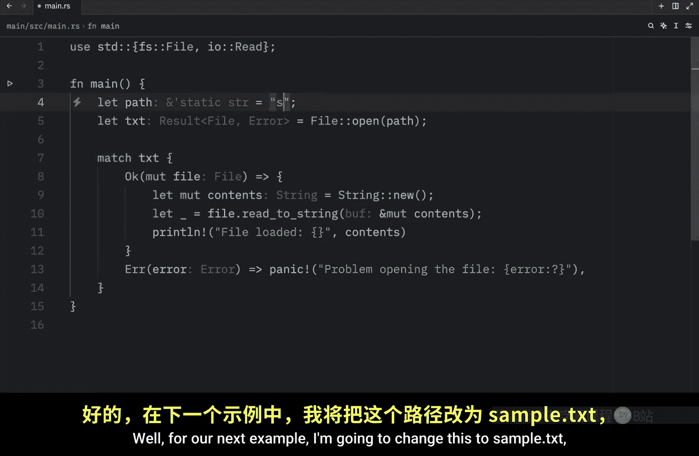
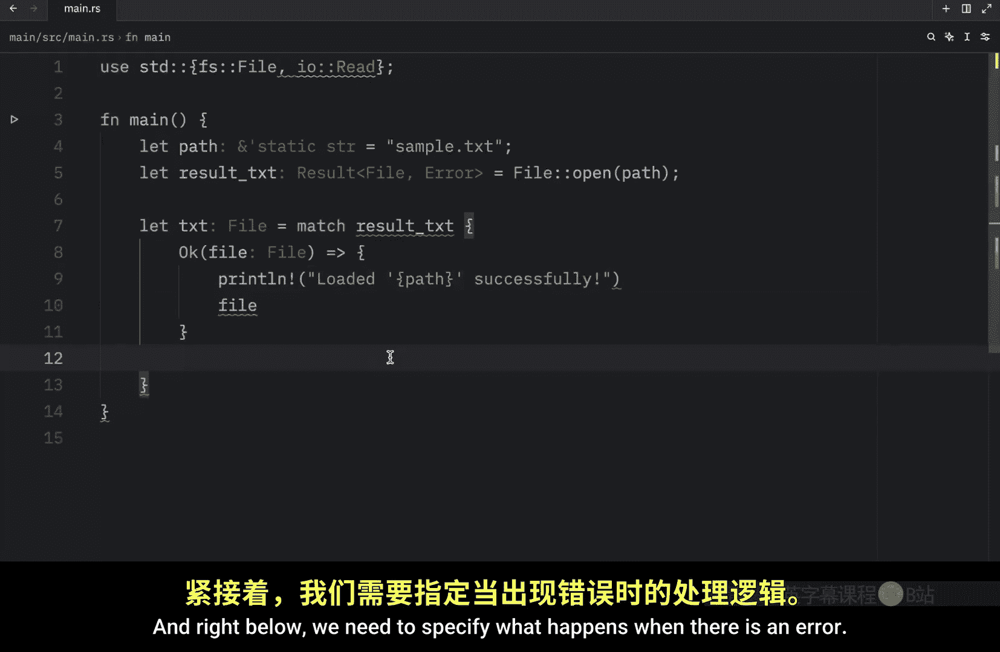
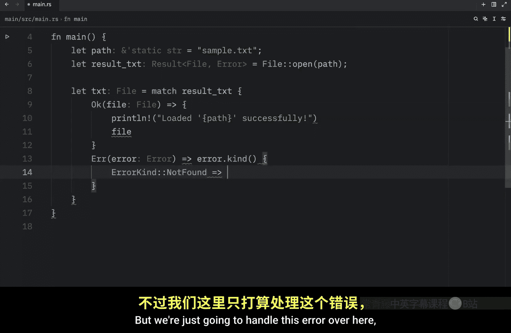
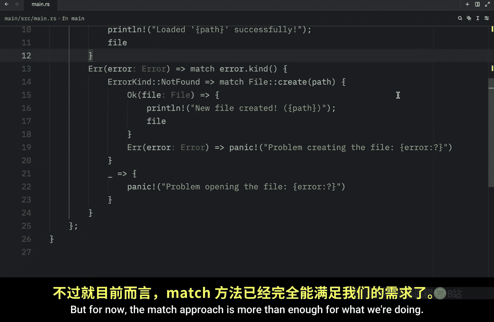

# 046：使用 Result 处理多个错误 🛠️

在本节课中，我们将学习 Rust 中的可恢复错误处理。许多错误并不严重到需要程序完全停止。例如，如果程序提示用户输入一个数字，但用户不小心输入了字母或符号，我们不希望程序因此崩溃。这种情况可以通过提示用户重新输入正确的数字来轻松修复。

## Result 枚举简介

在之前的 Rust 学习中，我们创建了一个猜数字游戏，其中使用了许多 Rust 语法。我们特别使用了 `Result` 枚举，其结构如下：

```rust
enum Result<T, E> {
    Ok(T),
    Err(E),
}
```

这里，`Result` 接受两个泛型参数 `T` 和 `E`。`Ok(T)` 表示操作成功，`T` 是成功时返回的值的类型。`Err(E)` 表示操作失败，`E` 是失败时返回的错误类型。

## 使用 Result 处理文件操作

接下来，我们尝试调用一个使用 `Result` 类型的函数。在 `main` 函数中，我们将创建一个路径并尝试打开一个文件。






```rust
use std::fs::File;
use std::io::Read;




fn main() {
    let path = "secret.txt";
    let txt = File::open(path);
}
```

`File::open` 函数返回一个 `Result<File, std::io::Error>`。这意味着它可能成功返回一个 `File`，也可能失败返回一个 `std::io::Error`。这是合理的，因为打开文件时可能遇到多种问题，例如文件不存在或没有足够的权限访问文件。

`Result` 枚举为我们传递了这些信息，以便后续处理。我们可以像处理 `Option` 类型一样使用 `match` 表达式来处理它。

以下是处理文件打开结果的代码：

```rust
match txt {
    Ok(mut file) => {
        let mut contents = String::new();
        let _text = file.read_to_string(&mut contents);
        println!("File loaded: {}", contents);
    }
    Err(error) => {
        panic!("Problem opening the file: {:?}", error);
    }
}
```

如果文件成功打开，我们将读取其内容并打印。如果失败，程序将 `panic` 并显示错误信息。注意，`read_to_string` 操作本身也返回一个 `Result`，但在这个例子中，我们使用下划线 `_` 忽略了它，因为我们只关心更新 `contents` 变量。




运行此脚本，如果 `secret.txt` 文件存在，我们将看到文件内容被打印出来。如果文件不存在（例如路径改为 `bob.png`），程序将 `panic` 并显示详细的错误信息，如“no such file or directory”。

## 处理多种特定错误




如前所述，尝试打开文件时可能遇到多种错误。我们如何分别处理每种错误呢？

在下一个例子中，我们将尝试打开一个不存在的文件 `sample.txt`，并演示如何根据具体的错误类型进行不同的处理。




```rust
use std::fs::File;
use std::io::ErrorKind;


fn main() {
    let path = "sample.txt";
    let txt = File::open(path);

    let txt = match txt {
        Ok(file) => {
            println!("Loaded the path successfully.");
            file
        }
        Err(error) => match error.kind() {
            ErrorKind::NotFound => match File::create(path) {
                Ok(file) => {
                    println!("A new file was created at the following path.");
                    file
                }
                Err(e) => panic!("Problem creating the file: {:?}", e),
            },
            _ => panic!("Problem opening the file: {:?}", error),
        },
    };
}
```


我们首先尝试打开文件。如果成功，则打印成功信息并返回文件。如果失败，我们使用 `error.kind()` 来匹配具体的错误类型。

*   如果错误类型是 `ErrorKind::NotFound`（即文件未找到），我们尝试创建该文件。
    *   如果文件创建成功，打印信息并返回新创建的文件。
    *   如果文件创建失败，则 `panic`。
*   对于所有其他类型的错误（用下划线 `_` 捕获），我们直接 `panic` 并显示默认的错误信息。

通过这种方式，我们可以针对“文件未找到”这一特定情况采取创建文件的补救措施，而对于其他错误（如权限不足）则统一处理。运行此程序后，如果 `sample.txt` 原本不存在，它将被创建出来。

## 总结



本节课我们一起学习了如何使用 Rust 中的 `Result` 枚举来处理可恢复错误。我们了解了 `Result<T, E>` 的基本结构，并通过文件操作的实例演示了如何使用 `match` 表达式来处理成功和失败的情况。更重要的是，我们学习了如何通过匹配 `ErrorKind` 来区分和处理多种特定的错误，从而使程序能够更优雅地从错误中恢复。目前，`match` 方法足以满足我们处理 `Result` 的需求，在后续的 Rust 学习中，我们还将看到其他提取 `Result` 值的方法。