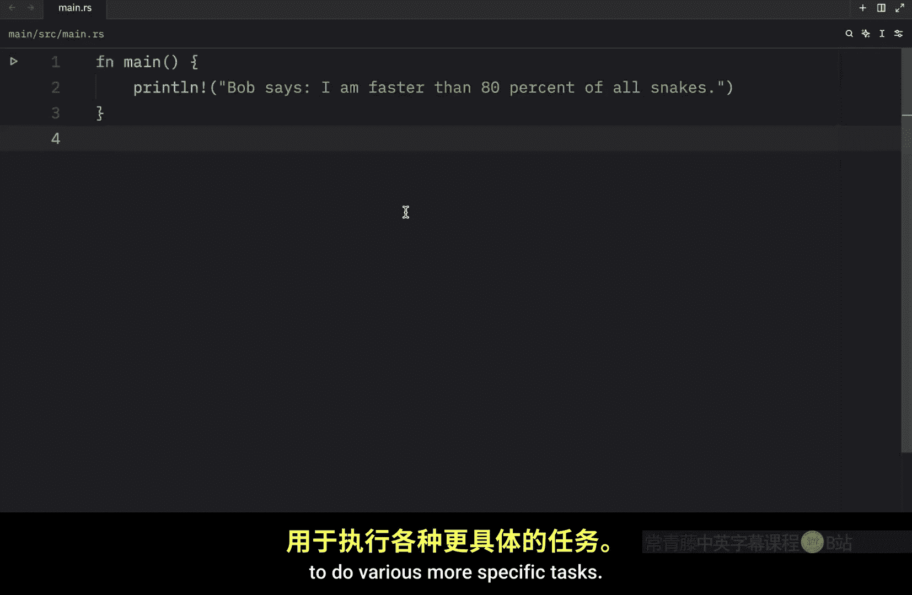
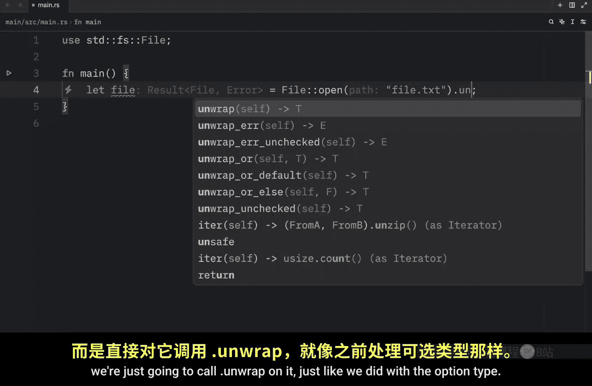
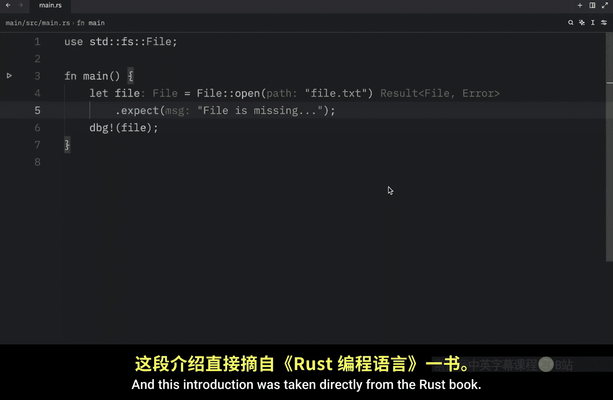
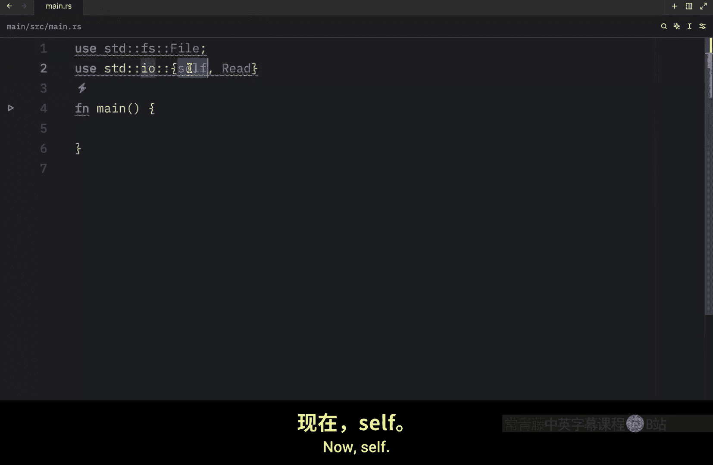
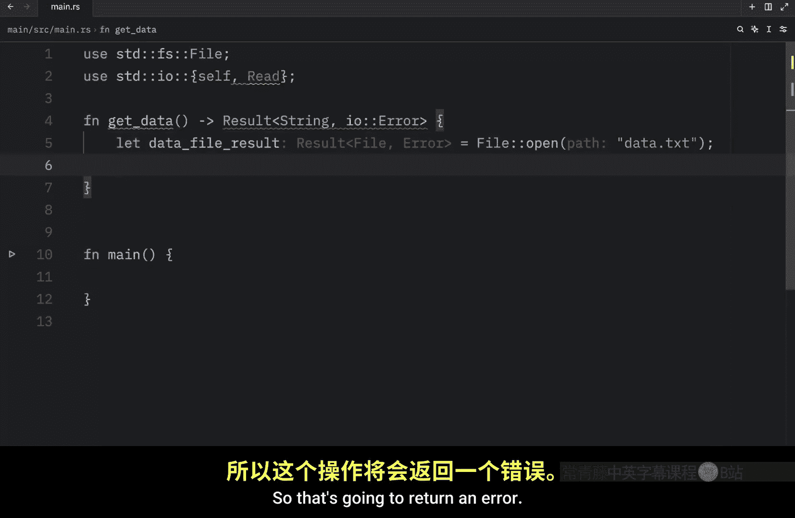
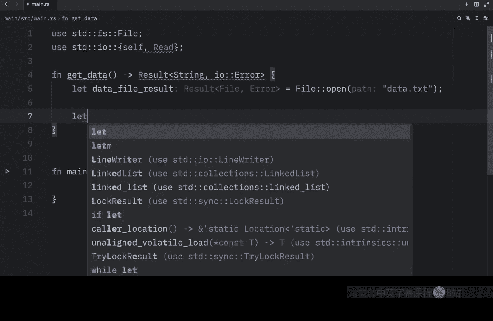
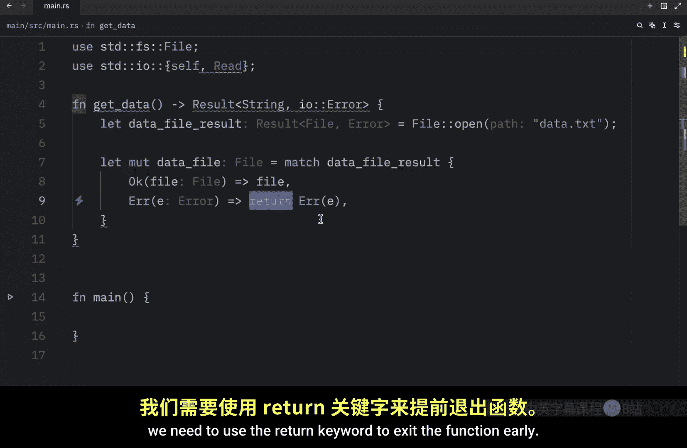
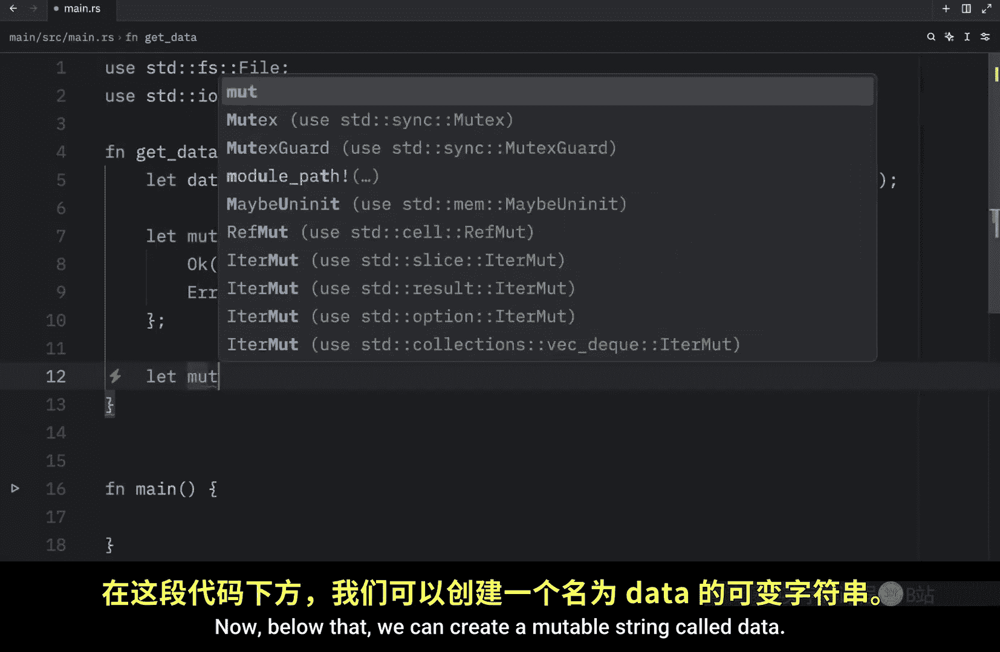
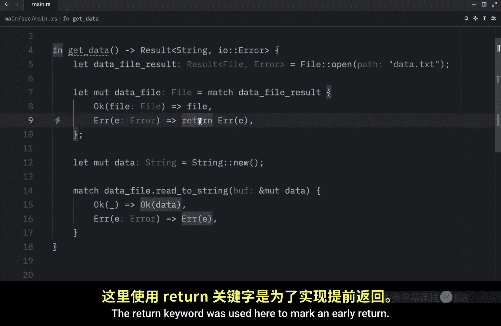

# 047：错误传播 🚀

在本节课中，我们将要学习 Rust 中错误处理的高级概念——错误传播。我们将了解如何不直接在函数内部处理错误，而是将错误返回给调用者，让调用者决定如何处理。

上一节我们介绍了如何使用 `match` 来处理 `Result` 类型。本节中我们来看看 `Result` 类型提供的一些便捷方法，以及如何将错误“传播”出去。

## 使用 `unwrap` 和 `expect` 方法



`Result` 类型定义了许多辅助方法来执行更具体的任务。有时使用 `match` 来处理 `Result` 可能显得过于繁琐。




例如，假设你想打开一个文件。我们会像任何 Rust 开发者一样调用 `File::open`。

```rust
use std::fs::File;

fn main() {
    let file_result = File::open("file.txt");
}
```

这里我们尝试打开一个不存在的文件 `file.txt`。我们不对这个可能成功（返回 `File`）或失败（返回 `Error`）的 `Result` 进行处理，而是像处理 `Option` 类型一样，直接对其调用 `.unwrap()`。

如果存在值，它将返回该值。否则，如果遇到错误，它将为我们调用 `panic!` 宏。

```rust
let file = file_result.unwrap(); // 文件不存在时会 panic
```

如果我们将文件名改为一个实际存在的文件，例如 `secret.txt`，程序将成功运行并返回文件句柄。

我们还可以使用另一个辅助方法 `.expect()`。`.expect()` 方法允许我们指定在出错时用于 `panic` 的消息。

```rust
let file = File::open("file.txt").expect("文件缺失");
```

以下是 `unwrap` 和 `expect` 的主要区别：
*   **`unwrap()`**：快速原型设计的理想选择，因为输入工作量最小。
*   **`expect()`**：允许提供包含更多错误信息的详细自定义消息。

## 什么是错误传播？📤




当函数实现调用了可能失败的操作时，你可以选择不在函数内部处理错误，而是将错误返回给调用代码，让调用者决定如何处理。这被称为**传播错误**。



这给了调用代码更多的控制权，因为调用者可能拥有更多信息或逻辑来决定应如何处理错误，而这些信息在你的函数上下文中可能无法获得。


## 实现错误传播 🛠️

让我们通过一个例子来分解这个概念。我们将创建一个函数，它尝试读取文件内容，并将任何错误传播给调用者。

首先，我们需要从标准库导入一些模块。

```rust
use std::fs::File;
use std::io::{self, Read}; // 使用花括号分组导入
```





接下来，我们创建一个名为 `get_data` 的函数。注意它的返回类型：`Result<String, io::Error>`。这表明函数要么返回一个成功的 `String`，要么返回一个 `io::Error`。

```rust
fn get_data() -> Result<String, io::Error> {
    // 尝试打开文件
    let data_file_result = File::open("data.txt");

    // 使用 match 处理打开文件的结果
    let mut data_file = match data_file_result {
        Ok(file) => file, // 成功，返回文件
        Err(e) => return Err(e), // 失败，提前返回错误
    };

    // 创建一个可变字符串来存储文件内容
    let mut data = String::new();

    // 将文件内容读入字符串
    match data_file.read_to_string(&mut data) {
        Ok(_) => Ok(data), // 读取成功，返回数据
        Err(e) => Err(e),  // 读取失败，返回错误
    }
}
```


在这个函数中：
1.  我们尝试打开 `data.txt` 文件。
2.  如果打开失败，我们使用 `return Err(e)` **提前返回**错误。
3.  如果打开成功，我们继续尝试将文件内容读入一个字符串。
4.  读取操作的结果也通过 `match` 处理，并相应地返回 `Ok(data)` 或 `Err(e)`。

关键点在于，`get_data` 函数本身**不处理**错误。它只是将成功的结果或遇到的错误“传递”出去。





现在，在我们的 `main` 函数中调用它：


```rust
fn main() {
    let data_result = get_data(); // 现在错误处理的责任转移到了 main 函数
}
```

`data_result` 是一个 `Result<String, io::Error>`。如何处理这个结果——是使用 `unwrap`、`expect`、`match`，还是进一步传播——现在完全由 `main` 函数的调用者决定。这就是错误传播的核心：将错误处理的决策权上移。

## 总结 📝

本节课中我们一起学习了 Rust 的错误传播机制。
*   我们回顾了 `Result` 类型的便捷方法 `unwrap` 和 `expect`，它们适用于快速失败或原型设计。
*   我们深入探讨了**错误传播**的概念：即函数将错误返回给调用者，而不是在内部处理。
*   我们通过一个完整的示例，创建了一个返回 `Result` 类型的函数，演示了如何使用 `match` 来提前返回错误或将成功结果传递出去。




通过传播错误，你可以编写更清晰、更模块化的代码，将错误处理的逻辑放在最合适的地方。