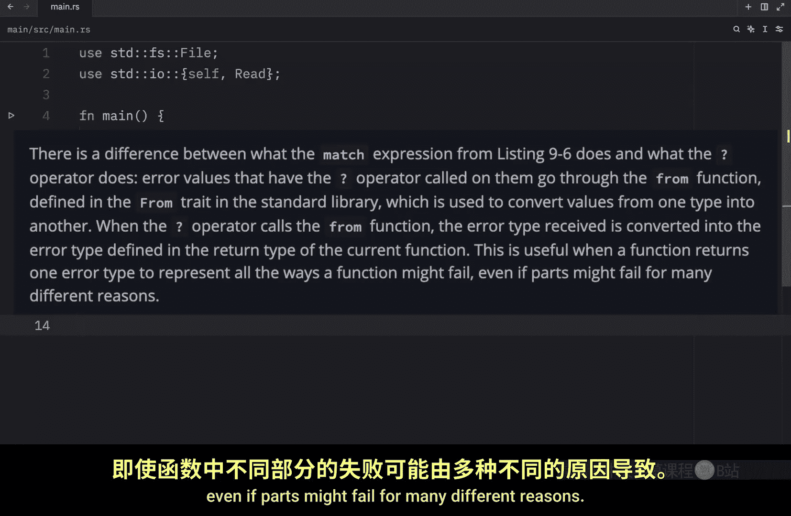
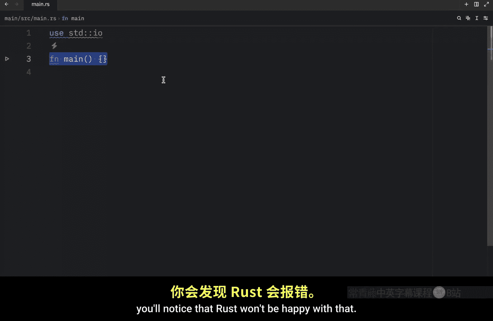
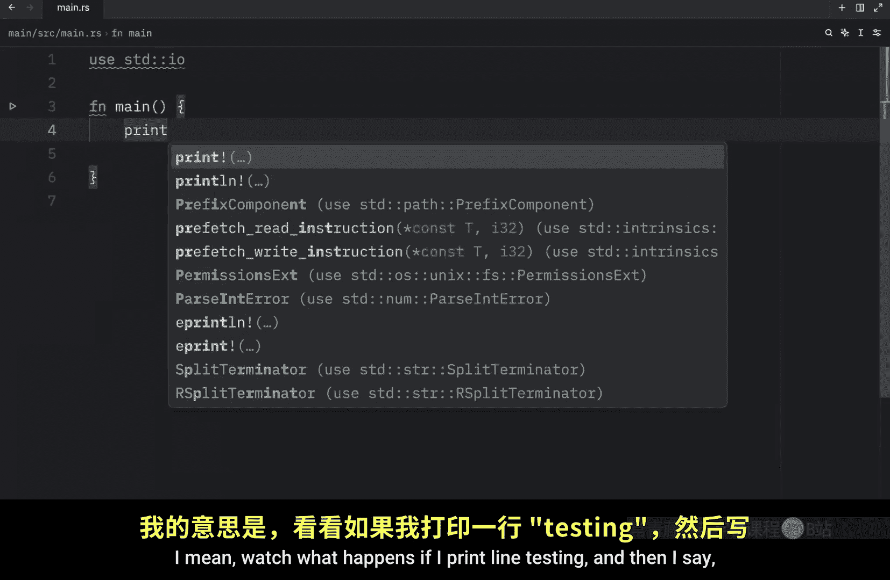
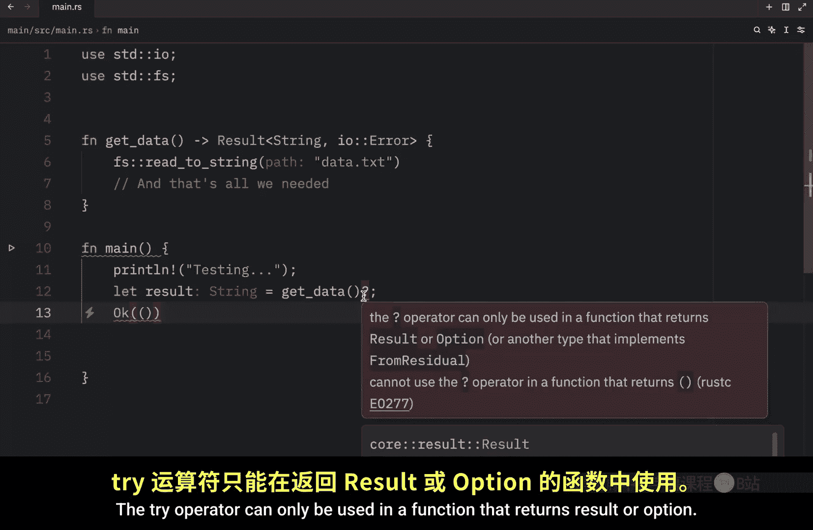
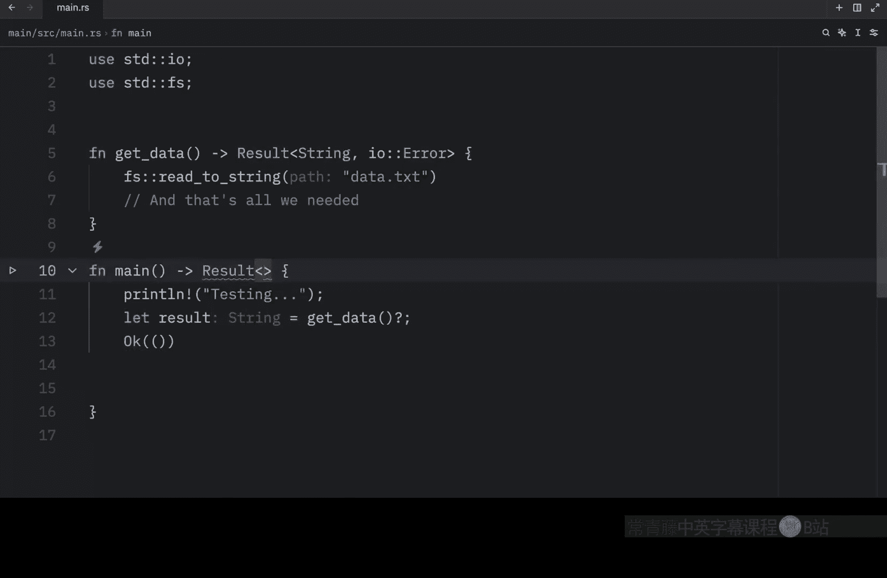
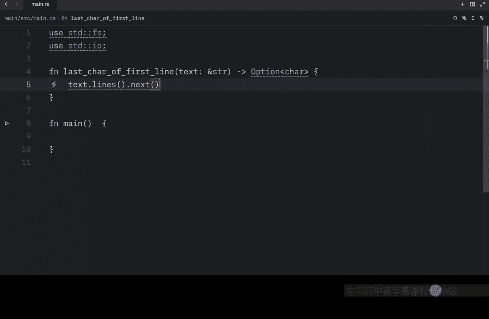
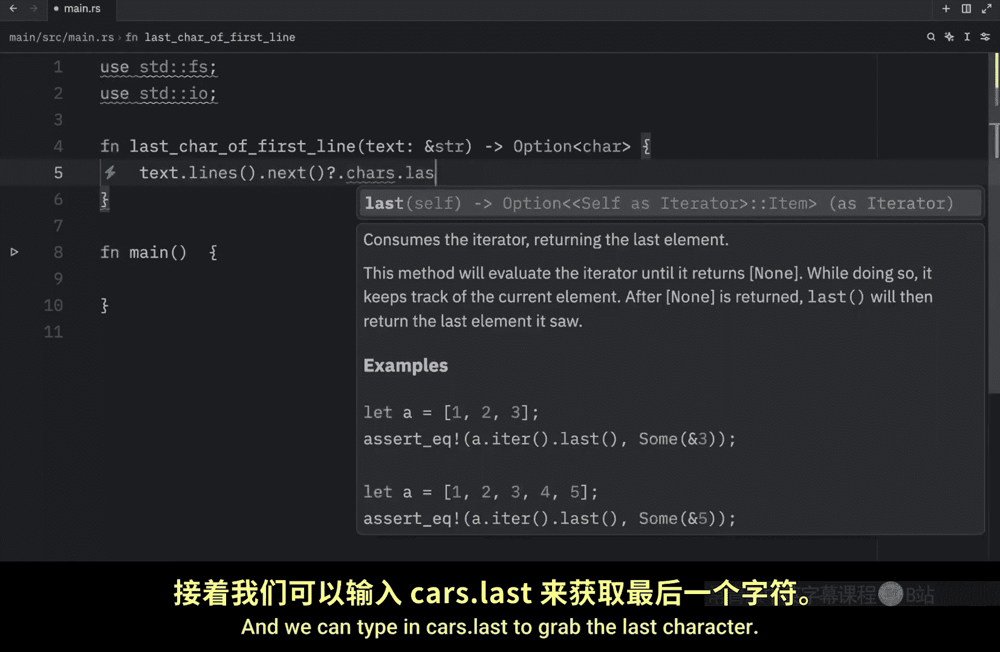
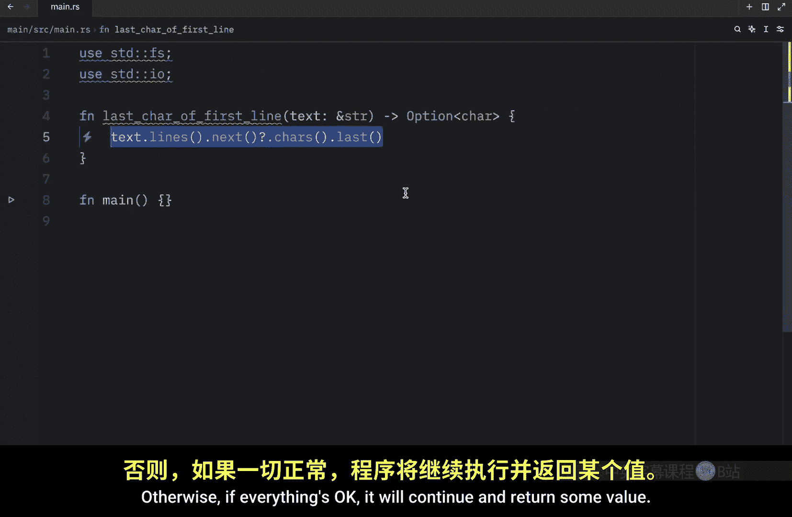
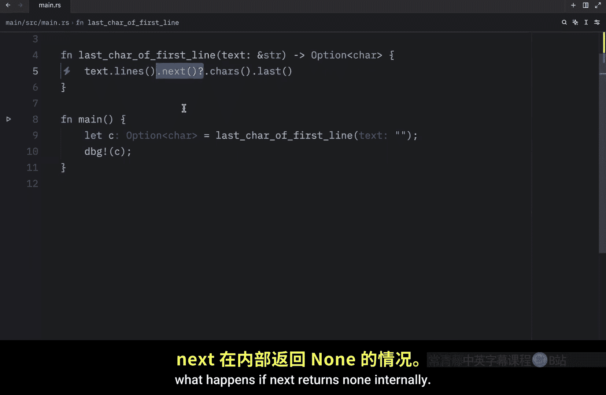

# 048：Try 运算符 `?` 的魔力 ✨

在本节课中，我们将要学习 Rust 中的 Try 运算符 `?`。这个运算符可以极大地简化错误传播的代码，让代码更清晰、更易读。

上一节我们介绍了如何在 Rust 中传播错误。本节中我们来看看如何使用 `?` 运算符来更优雅地实现相同的功能。

## 回顾之前的代码


在之前的代码中，我们创建了一个返回 `Result<String, io::Error>` 的函数。函数内部没有处理错误，而是将所有错误信息都传播给调用者。

```rust
fn read_data() -> Result<String, io::Error> {
    let mut data_file = File::open("data.txt")?; // 注意这里的 `?`
    let mut buffer = String::new();
    data_file.read_to_string(&mut buffer)?; // 以及这里的 `?`
    Ok(buffer)
}
```

这段代码本身没有问题，但我们可以用一种更简洁的方式来重写它。

## 引入 Try 运算符 `?`

现在，我们可以将代码改写得更简洁。以下是改写后的版本：

```rust
fn read_data() -> Result<String, io::Error> {
    let mut data_file = File::open("data.txt")?;
    let mut buffer = String::new();
    data_file.read_to_string(&mut buffer)?;
    Ok(buffer)
}
```

我们只需在返回 `Result` 的表达式末尾添加 `?` 运算符。这个运算符告诉 Rust：如果操作成功（返回 `Ok`），则解包并使用其值；如果操作失败（返回 `Err`），则立即从整个函数中返回该错误，并将错误值传播给调用者。

## `?` 运算符的工作原理


`?` 运算符与我们在 `match` 表达式中编写的代码有一个重要区别：被 `?` 调用的错误值会经过标准库中 `From` trait 定义的 `from` 函数。这个函数用于将值从一种类型转换为另一种类型。

当 `?` 调用 `from` 函数时，接收到的错误类型会被转换为当前函数返回类型中定义的错误类型。这在函数返回一种错误类型以表示所有可能的失败方式时非常有用，即使函数的不同部分可能因多种不同原因而失败。

## 进一步简化代码



我们可以通过链式调用使用 `?` 运算符的方法来进一步缩短代码。例如：

```rust
fn read_data() -> Result<String, io::Error> {
    let mut buffer = String::new();
    File::open("data.txt")?.read_to_string(&mut buffer)?;
    Ok(buffer)
}
```

这样，我们又减少了一行代码，同时保持了可读性。

## 使用标准库的便捷函数

在实际的 Rust 编程中，我们经常会遇到预置的功能来处理这类常见操作。例如，将文件读入字符串是一个相当常见的操作，因此标准库提供了方便的 `fs::read_to_string` 函数。

```rust
use std::fs;

fn read_data() -> Result<String, io::Error> {
    fs::read_to_string("data.txt")
}
```





这个函数会打开文件、创建一个新字符串、读取文件内容、将内容放入该字符串，然后返回。这取代了我们之前编写的所有代码。

## `?` 运算符的使用限制

`?` 运算符只能在返回类型与所使用值兼容的函数中使用。对于 `Result` 类型，你的函数必须返回 `Result`；对于 `Option` 类型，你的函数必须返回 `Option`。

例如，在默认返回单元类型 `()` 的 `main` 函数中使用 `?`，Rust 会报错。



```rust
fn main() {
    let data = fs::read_to_string("data.txt")?; // 错误：`main` 不返回 `Result`
    println!("{}", data);
}
```




要修复这个问题，我们可以让 `main` 函数返回一个 `Result`。

```rust
fn main() -> Result<(), io::Error> {
    let data = fs::read_to_string("data.txt")?;
    println!("{}", data);
    Ok(())
}
```

## `?` 运算符与 `Option` 类型

`?` 运算符同样适用于 `Option` 类型。以下是一个示例函数，它返回给定文本第一行的最后一个字符：



```rust
fn last_char_of_first_line(text: &str) -> Option<char> {
    text.lines().next()?.chars().last()
}
```



在这个函数中，`text.lines().next()` 返回一个 `Option`。如果字符串为空，则返回 `None`；否则返回第一行。`?` 运算符在这里处理了 `None` 的情况，使得代码更简洁。




## 总结

本节课中我们一起学习了 Rust 中的 Try 运算符 `?`。我们了解到：

1.  `?` 运算符可以简化错误传播，减少样板代码。
2.  它适用于返回 `Result` 或 `Option` 类型的函数。
3.  通过 `From` trait 的 `from` 函数，`?` 运算符能够进行错误类型的转换。
4.  我们可以使用标准库提供的便捷函数（如 `fs::read_to_string`）来进一步简化代码。
5.  在 `main` 函数中使用 `?` 需要将其返回类型改为 `Result`。




掌握 `?` 运算符将使你的 Rust 代码更加简洁和易于维护。