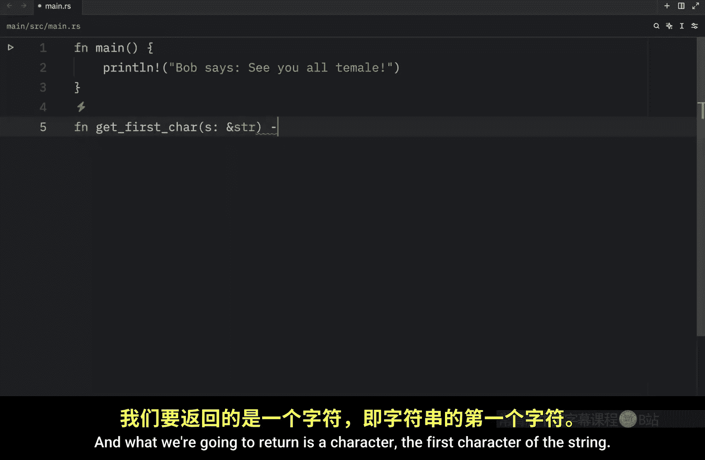
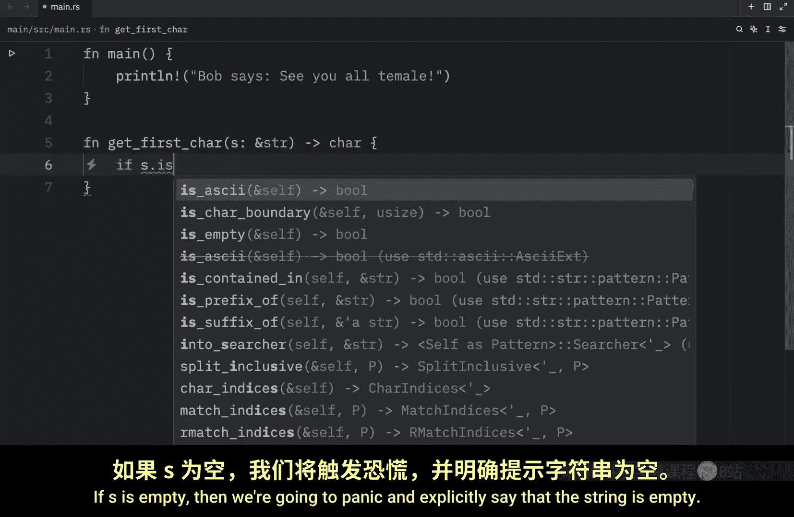
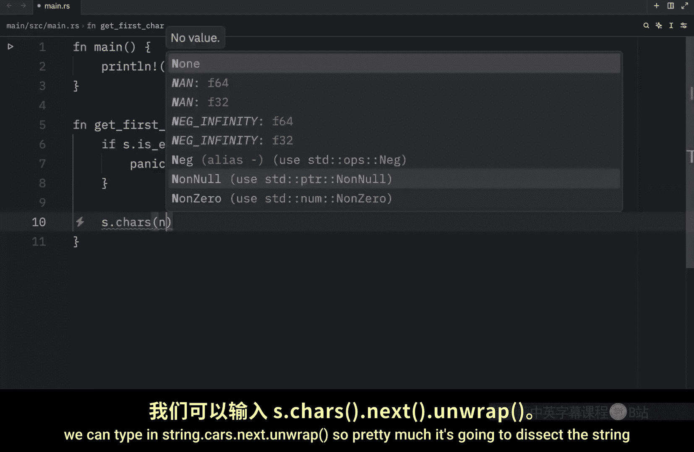
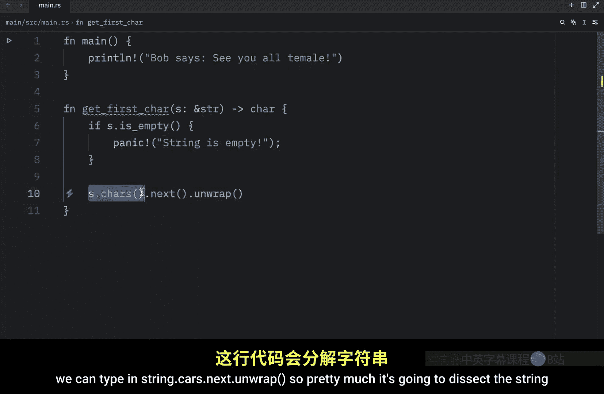
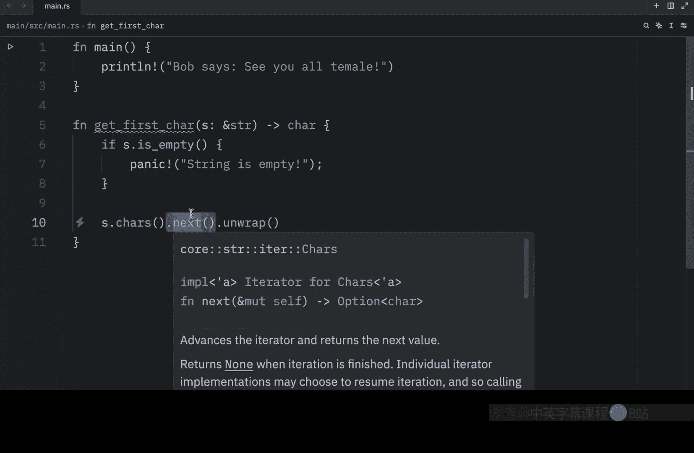
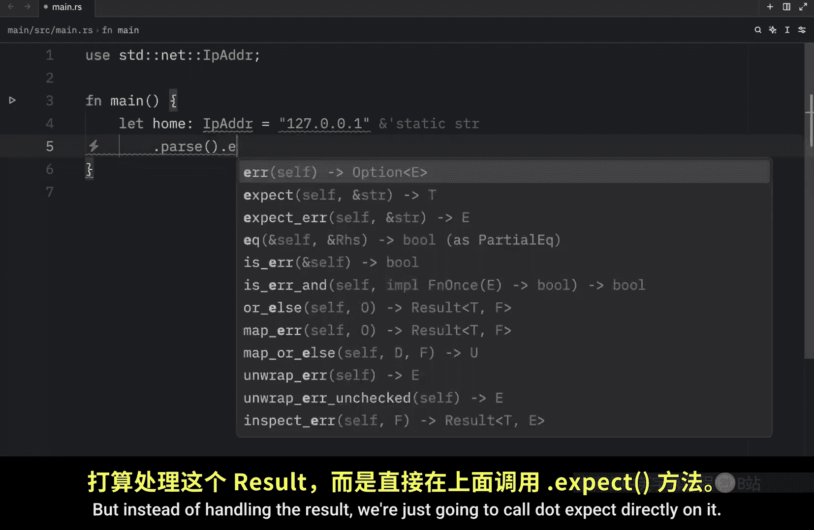
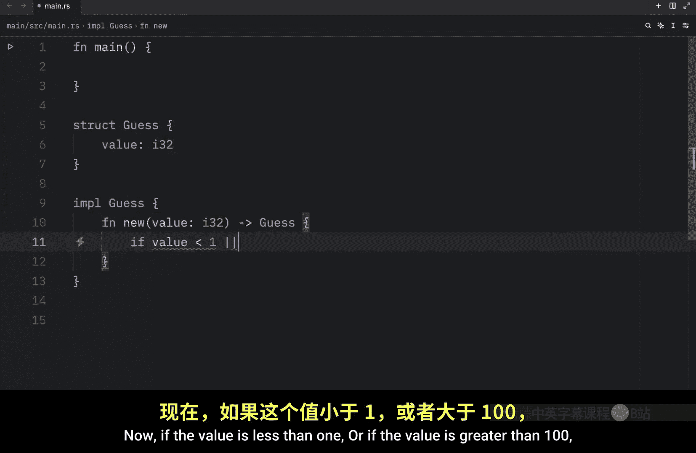
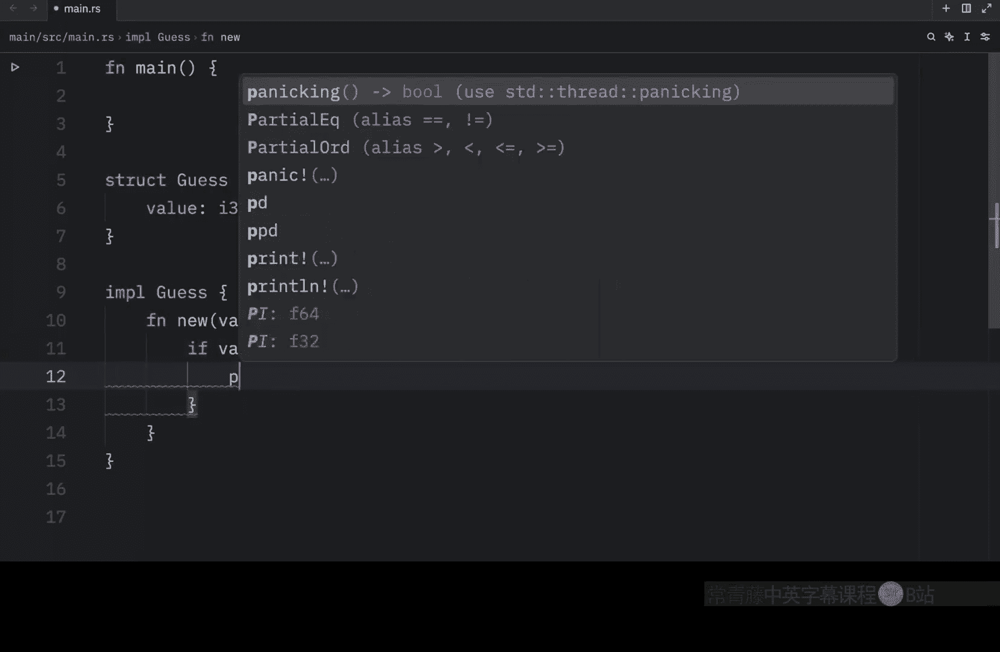

# 049：何时使用 `panic!` 与 `Result`

在本节课中，我们将学习如何在 Rust 中做出关键决策：何时让程序恐慌（`panic!`），何时返回一个 `Result` 来处理错误。理解这两者的适用场景对于编写健壮且安全的 Rust 代码至关重要。

## 概述

上一节我们介绍了 `panic!` 和 `Result` 的基本概念。本节中，我们来看看如何在实际编码中选择使用它们。核心原则是：对于**可恢复的错误**使用 `Result`，对于**不可恢复的、表明程序进入“坏状态”的错误**则使用 `panic!`。

## 使用 `Result` 的场景





当错误是预期内的、可以被修复或妥善处理时，应优先使用 `Result`。








以下是适合使用 `Result` 的典型情况：

*   **用户输入错误**：例如，用户本应输入年龄却输入了名字。程序可以提示用户重新输入，这是一个可恢复的错误。
*   **外部依赖错误**：例如，进行 API 调用时，API 服务器可能达到限制或暂时不可用。这并非程序本身的缺陷，程序可以记录错误、重试或向用户报告。

```rust
fn call_api() -> Result<String, String> {
    // 模拟 API 达到调用上限
    Err("API limit reached".to_string())
}

fn main() {
    match call_api() {
        Ok(response) => println!("API Response: {}", response),
        Err(e) => println!("Error: {}", e), // 优雅地处理错误
    }
}
```

## 使用 `panic!` 的场景

当程序遇到无法或不应继续执行的“坏状态”时，应使用 `panic!`。坏状态通常指程序的假设、契约或不变式被破坏。




以下是适合使用 `panic!` 的典型情况：

*   **可能导致安全漏洞或严重错误的操作**：例如，访问超出数组边界的索引。程序崩溃比允许潜在的内存不安全或数据损坏要好。
*   **原型设计与快速测试**：在验证想法时，使用 `panic!` 或 `unwrap()` 可以更快地编写和测试代码逻辑。
*   **逻辑上不可能失败，但编译器无法证明的情况**：当你确信某个操作永远不会失败，但 Rust 编译器无法推断时，可以使用 `expect()` 来表明这是程序员的断言。

```rust
use std::net::IpAddr;


fn main() {
    // 我们知道 "127.0.0.1" 是有效的 IP 地址，但 `parse` 方法返回 Result。
    // 使用 `expect` 表明我们确信它会成功，如果失败则 panic（意味着我们写错了硬编码值）。
    let home: IpAddr = "127.0.0.1".parse().expect("Hardcoded IP address should be valid");
    println!("Home IP: {:?}", home);
}
```

### 原型设计示例

假设我们想快速测试一个获取字符串首字符的函数：


```rust
fn get_first_char(s: &str) -> char {
    if s.is_empty() {
        panic!("String is empty"); // 快速失败，便于调试
    }
    s.chars().next().unwrap() // 因为前面检查了非空，这里用 unwrap 是安全的
}

fn main() {
    let word = "Hello";
    let first = get_first_char(word);
    println!("The first character is: {}", first); // 输出 H
    // 如果传入空字符串 ""，程序会 panic 并显示清晰信息。
}
```

## Rust 官方指南

根据 Rust 官方书籍的建议，在以下情况发生时，让你的代码 `panic` 是合适的：
1.  程序处于“坏状态”（即某些假设、保证、契约或不变量被破坏，例如传入了无效值、矛盾值或缺失值）。
2.  并且满足以下至少一个条件：
    *   这种坏状态是**出乎意料**的，而非偶尔会发生（如用户输错格式）。
    *   在此点之后的代码**需要依赖不处于这种坏状态**，而不是每一步都检查问题。
    *   没有一种好方法能**将这种信息编码到你所使用的类型中**。

## 创建自定义类型进行验证

一个高级技巧是创建自定义类型来封装验证逻辑，这可以将错误处理提前，并减少后续代码中的重复检查。

例如，在猜数字游戏中，我们可以定义一个 `Guess` 类型，确保其值始终在 1 到 100 之间：

```rust
pub struct Guess {
    value: i32,
}

impl Guess {
    pub fn new(value: i32) -> Guess {
        if value < 1 || value > 100 {
            panic!("Guess value must be between 1 and 100, got {}.", value);
        }
        Guess { value }
    }

    pub fn value(&self) -> i32 {
        self.value
    }
}

fn main() {
    let guess = Guess::new(50); // 有效
    println!("Your guess is: {}", guess.value());

    // let bad_guess = Guess::new(200); // 这会 panic!
}
```






通过使用 `Guess` 类型，我们保证了只要有一个 `Guess` 实例，它的值就一定是有效的。这遵循了“使用类型系统来保证正确性”的 Rust 哲学。

## 总结

本节课中我们一起学习了在 Rust 中如何抉择 `panic!` 与 `Result`：
*   **使用 `Result`**：处理可恢复的、预期内的错误，给予调用者处理错误的灵活性。
*   **使用 `panic!`**：应对不可恢复的、表明程序基础假设失效的“坏状态”，防止错误扩散导致更严重问题。
*   **实践技巧**：在原型设计、逻辑确信成功、以及通过自定义类型封装不变量时，可以审慎地使用 `panic!`、`unwrap()` 或 `expect()`。


掌握错误处理是编写可靠 Rust 程序的核心。接下来，我们将通过构建一些实际项目来巩固这些概念，然后再继续深入学习 Rust 语言的其他特性。