# 051：`todo!` 与 `unimplemented!` 宏 🚧

在本节课中，我们将学习 Rust 中两个非常实用的宏：`todo!` 和 `unimplemented!`。它们能帮助我们在编写程序时，为尚未实现的功能创建占位符，从而让开发过程更加顺畅。

## 概述：为何需要占位符宏？

在上一节中，我们介绍了项目结构。但在实际开发中，我们常常对程序的功能有清晰的想法，而实现这些功能的代码却需要时间编写。有时，为了避免未来出现意外错误，我们可能会在未完成的代码块中直接使用 `panic!`。然而，Rust 提供了两个更合适的宏来标记未完成的功能：`todo!` 和 `unimplemented!`。

这两个宏功能几乎相同，都能使程序在调用时发生恐慌（panic），但它们传达了不同的意图。

## `todo!` 宏：标记待办事项

`todo!` 宏用于标记你**计划在未来实现**的功能。它表明这部分代码是临时的，你打算稍后完成它。

以下是一个使用 `todo!` 宏的例子：

```rust
fn order_food(food: &str) {
    todo!("order_food still has to be coded");
}
```

在这个例子中，我们定义了一个 `order_food` 函数，它接收一个字符串切片作为参数。由于我们尚未想好如何实现订餐功能，我们使用 `todo!` 宏作为占位符。此时，如果我们调用这个函数：


```rust
order_food("banana");
```

程序会运行，但会因遇到 `todo!` 宏而恐慌退出，并输出类似“not yet implemented: order_food still has to be coded”的信息。你可以在宏中添加任何描述性信息。

## `unimplemented!` 宏：标记概念性功能

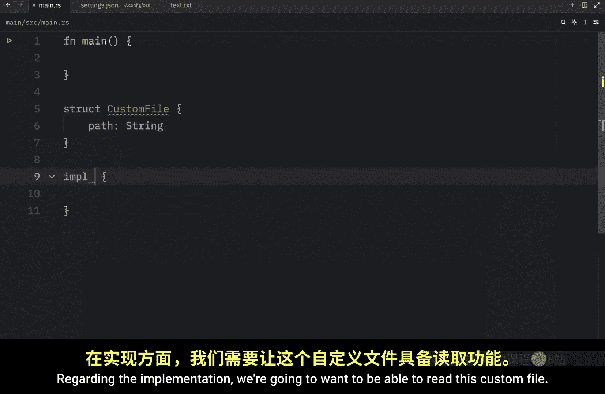

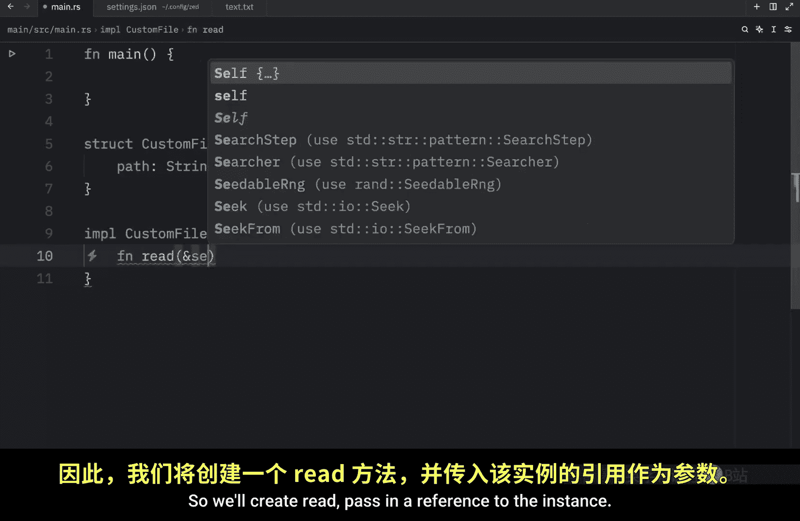

`unimplemented!` 宏的用法与 `todo!` 类似，但它传达的意图不同。它用于标记那些**可能永远不会被实现**的功能，或者仅仅是一个概念、想法。

以下是一个使用 `unimplemented!` 宏的例子：

```rust
fn order_food_fast_mode(food: &str) {
    unimplemented!("Potential concept for faster delivery");
}
```

这里，`order_food_fast_mode` 代表一个“快速订餐模式”的概念。我们使用 `unimplemented!` 是因为这个功能目前只是一个想法，我们不确定未来是否会实现它。调用此函数同样会导致程序恐慌，但输出的信息是“not implemented”。


两者的核心区别在于意图：`todo!` 表示“稍后完成”，`unimplemented!` 表示“仅为概念”。

## 在结构体方法中的应用

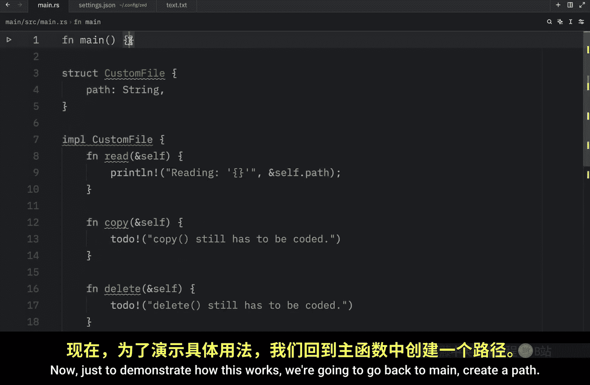


这两个宏在定义结构体的方法时尤其有用。我们可以先搭建出方法的框架，而不必立即实现所有细节。


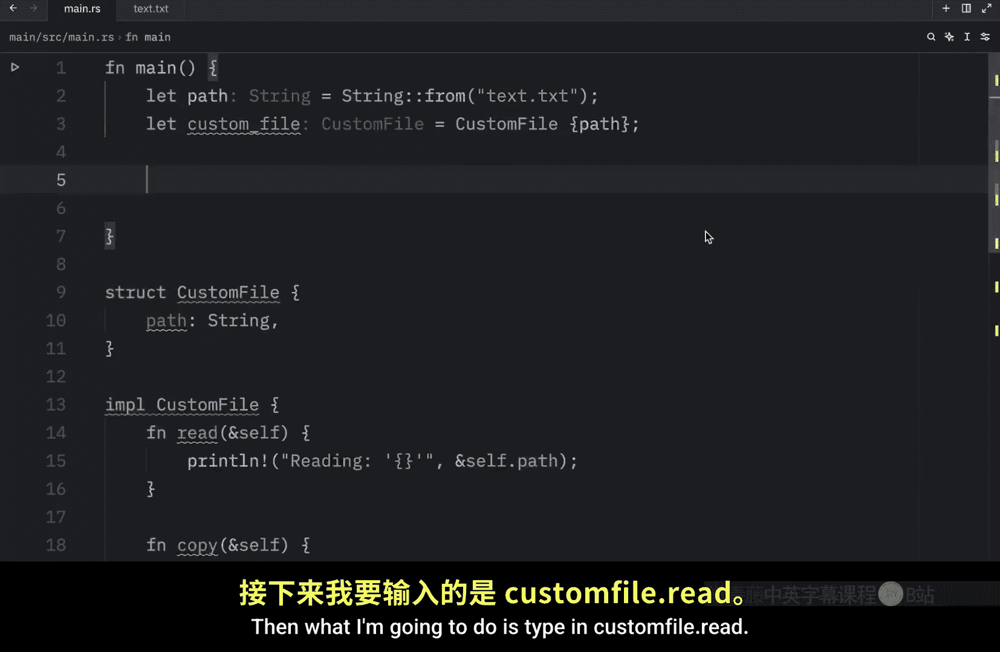

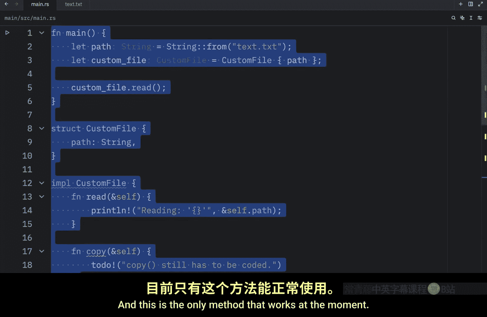

让我们创建一个 `CustomFile` 结构体作为示例：

```rust
struct CustomFile {
    path: String,
}

impl CustomFile {
    fn read(&self) {
        println!("Reading {}", self.path);
    }

    fn copy(&self) {
        todo!("copy still has to be coded");
    }

    fn delete(&self) {
        todo!("delete still has to be coded");
    }

    fn apple_intelligence(&self) {
        unimplemented!("Designed for Apple In");
    }
}
```

在上面的代码中：
*   `read` 方法已经实现。
*   `copy` 和 `delete` 方法使用 `todo!` 宏标记，表示我们计划实现它们。
*   `apple_intelligence` 方法使用 `unimplemented!` 宏标记，表示这只是一个概念性功能。

现在，我们可以在 `main` 函数中使用这个结构体：

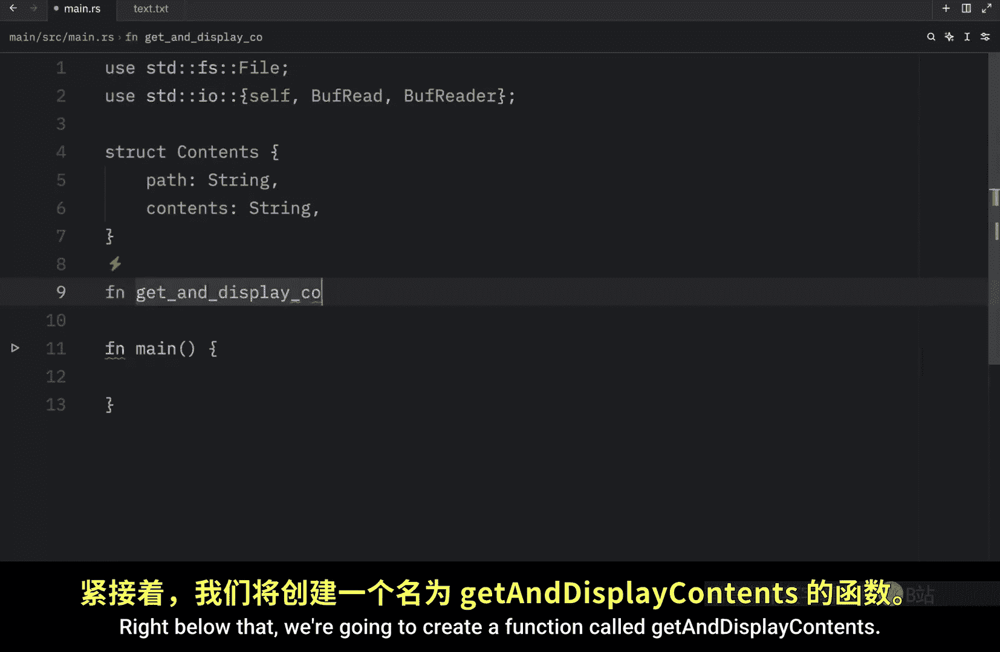


```rust
fn main() {
    let path = String::from("text.txt");
    let custom_file = CustomFile { path };

    custom_file.read(); // 这会正常工作，输出 "Reading text.txt"

    // 以下调用都会导致程序恐慌
    // custom_file.copy();
    // custom_file.delete();
    // custom_file.apple_intelligence();
}
```

## 辅助开发：消除语法高亮干扰

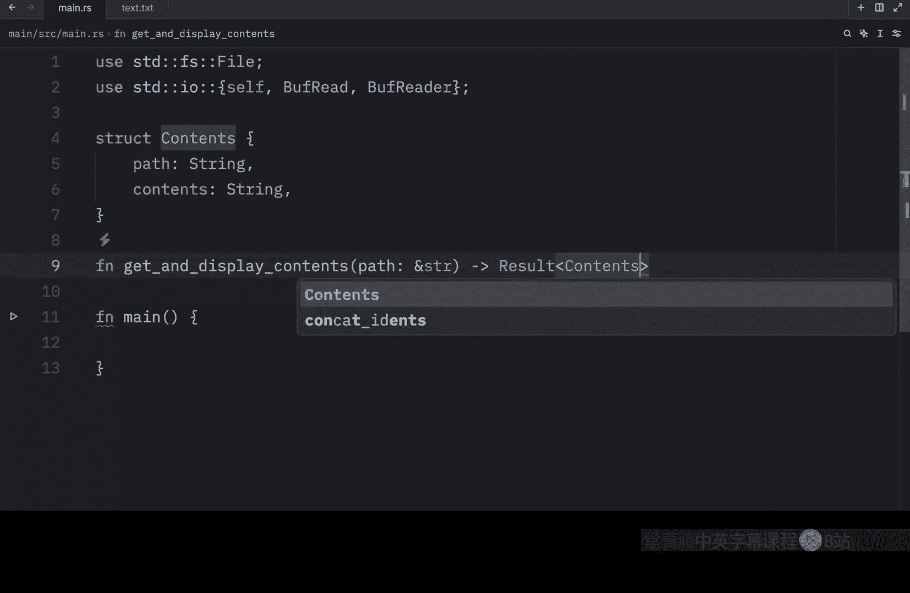

`todo!` 宏还有一个非常实用的场景：在编写复杂函数时，临时消除 Rust 语言服务器（LSP）的语法错误高亮干扰。


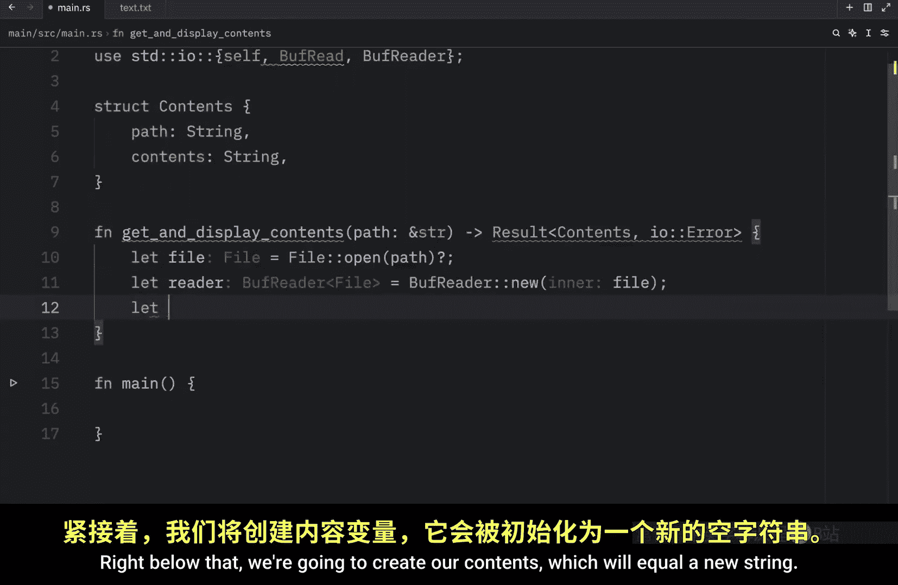

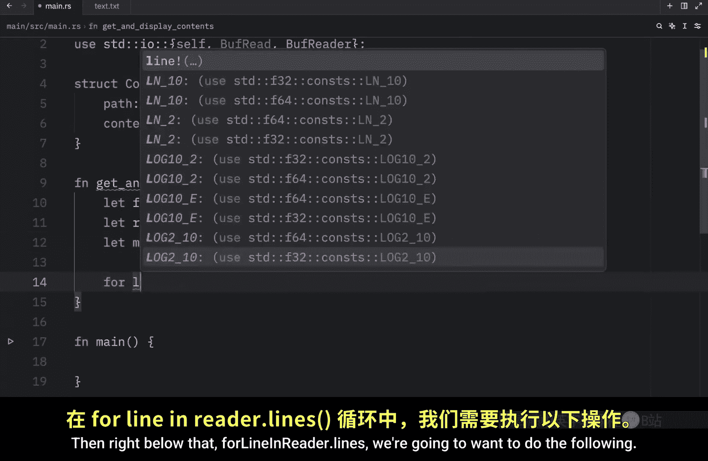

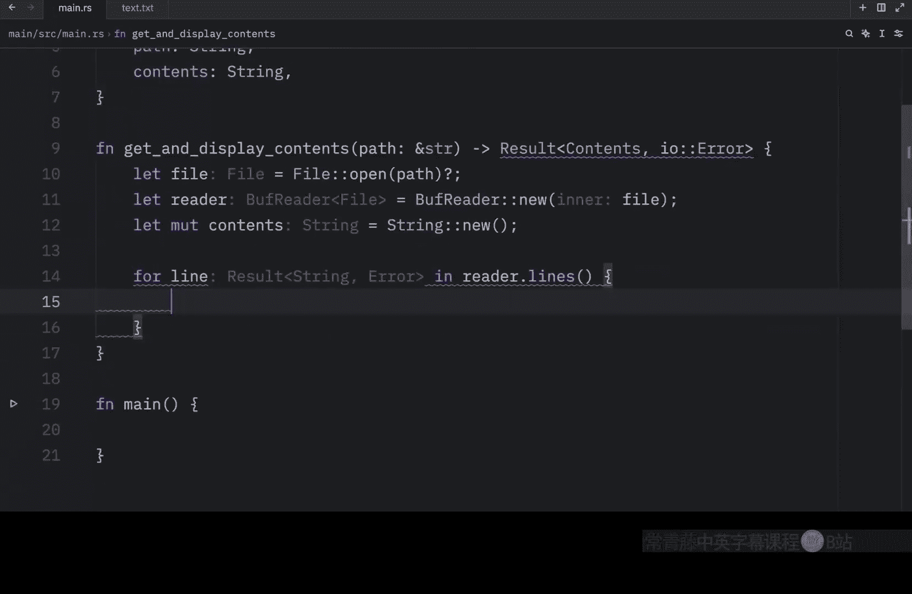

假设我们正在编写一个函数来读取和显示文件内容：

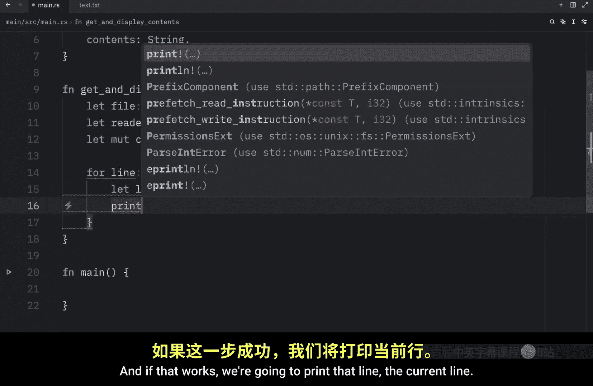


```rust
use std::fs::File;
use std::io::{BufRead, BufReader, Error};

struct Contents {
    path: String,
    contents: String,
}

fn get_and_display_contents(path: &str) -> Result<Contents, Error> {
    let file = File::open(path)?;
    let reader = BufReader::new(file);
    let mut contents = String::new();

    for line in reader.lines() {
        let line = line?;
        println!("{}", line);
        // 我们计划在这里将行内容添加到 `contents` 字符串中，但还没写
    }

    // 在函数完成前，这里会因为没有返回值而显示语法错误
    todo!()
}
```

在编写函数体的过程中，编译器会因为函数缺少确定的返回值而用红色高亮标出错误，这可能会干扰我们的思路。此时，在函数末尾放置一个 `todo!()` 可以“安抚”编译器，让这些高亮暂时消失，使我们能更专注地编写核心逻辑。


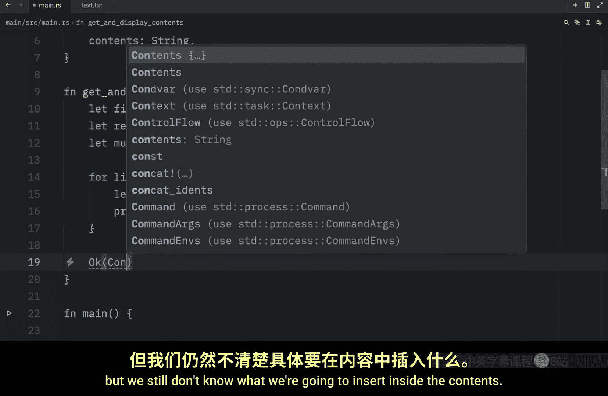


当我们完成函数主体后，再回来替换掉 `todo!()`：

```rust
fn get_and_display_contents(path: &str) -> Result<Contents, Error> {
    let file = File::open(path)?;
    let reader = BufReader::new(file);
    let mut contents = String::new();

    for line in reader.lines() {
        let line = line?;
        println!("{}", line);
        contents.push_str(&line);
        contents.push('\n');
    }

    // 用实际的返回值替换 todo!()
    Ok(Contents {
        path: path.to_string(),
        contents,
    })
}
```

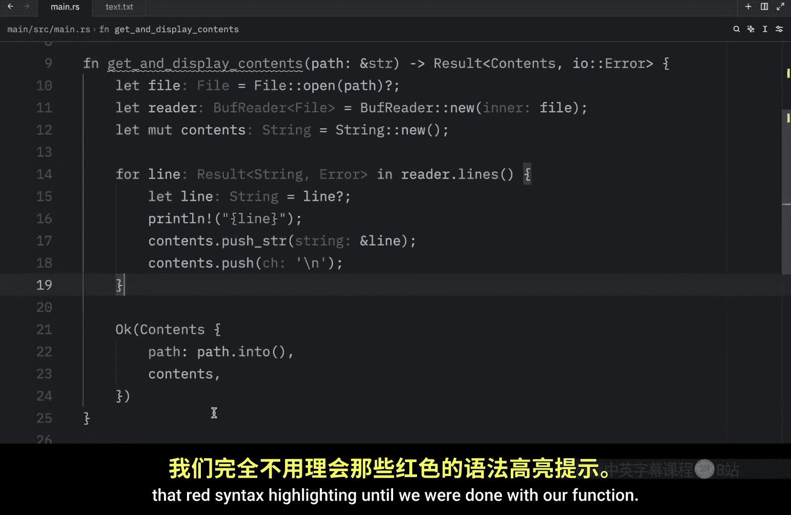

这种方法让开发流程更加顺畅，并且你不用担心会忘记完成函数，因为如果调用包含 `todo!` 的函数，程序会明确地提醒你。


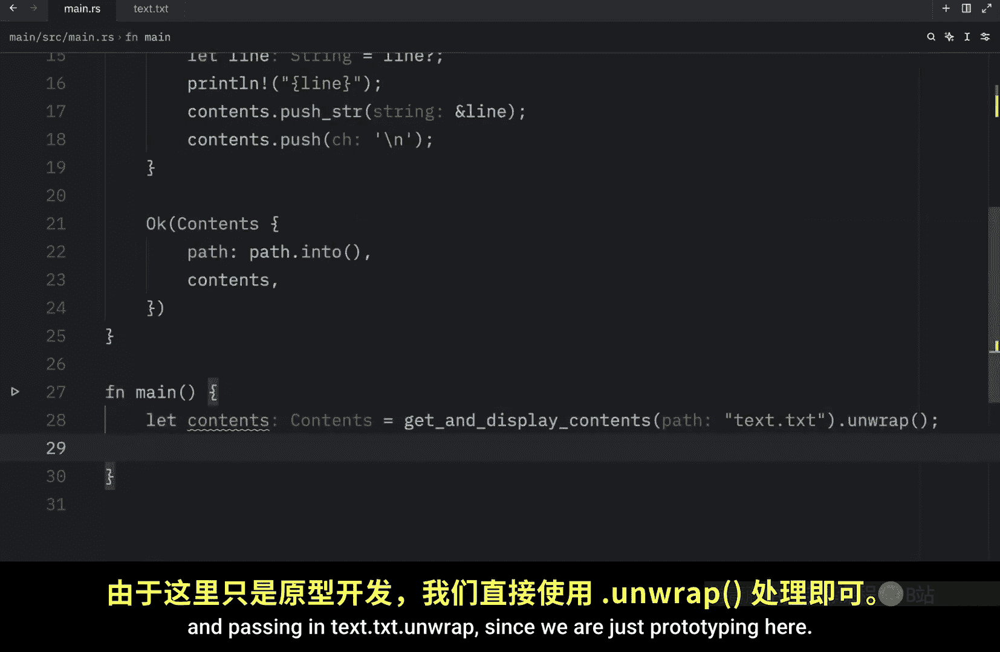


## 总结

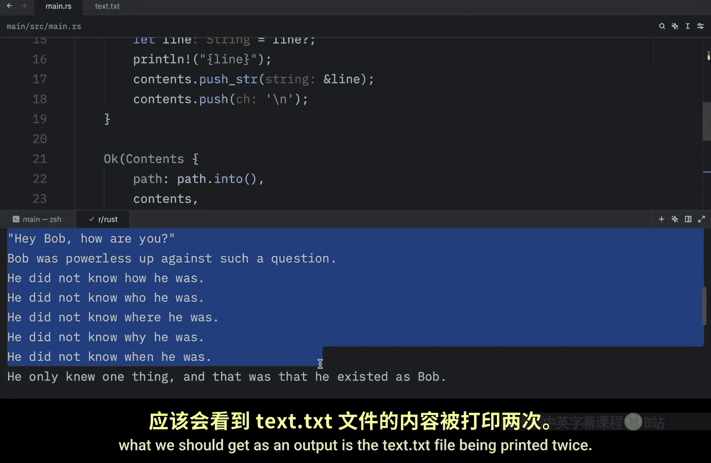

本节课中我们一起学习了 Rust 中的 `todo!` 和 `unimplemented!` 宏。

*   **`todo!` 宏**：用于标记**计划实现**但尚未完成的功能。它传达“稍后完成”的意图，并在被调用时导致程序恐慌，输出“not yet implemented”信息。
*   **`unimplemented!` 宏**：用于标记**概念性**或**可能永不实现**的功能。它传达“仅为想法”的意图，恐慌时输出“not implemented”信息。
*   **共同优点**：它们允许我们为程序搭建清晰的框架和蓝图，而无需一次性实现所有细节。`todo!` 还能在开发过程中临时消除编译器错误提示的干扰。


合理使用这两个宏，可以让你的 Rust 项目开发过程更有条理，并避免留下未完成的 `panic!` 语句。在下一节中，我们将终于开始学习 Rust 中一个非常重要的集合类型：向量（Vectors）。