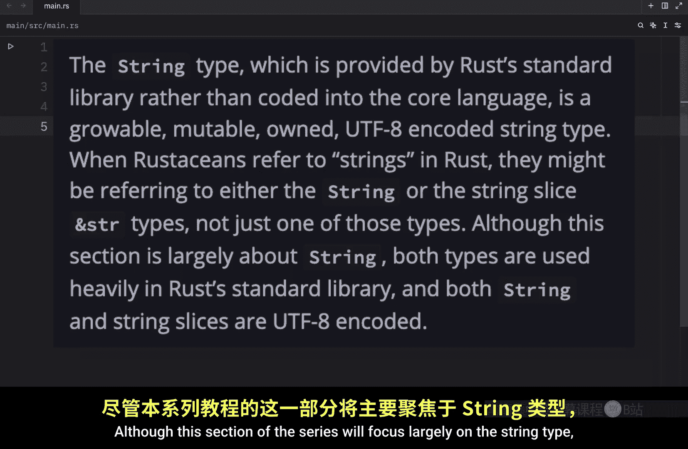
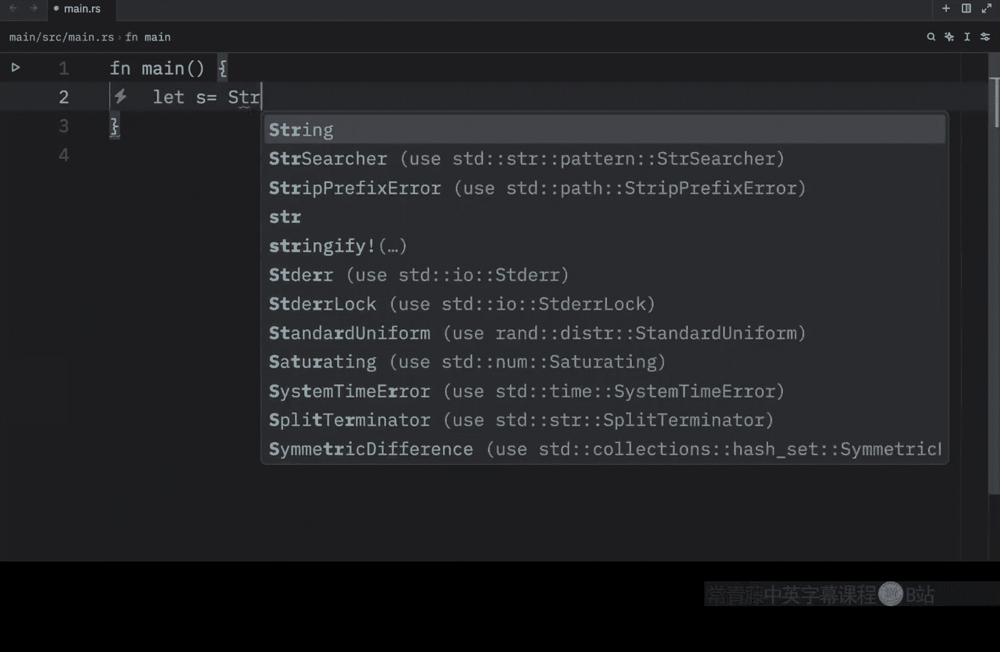
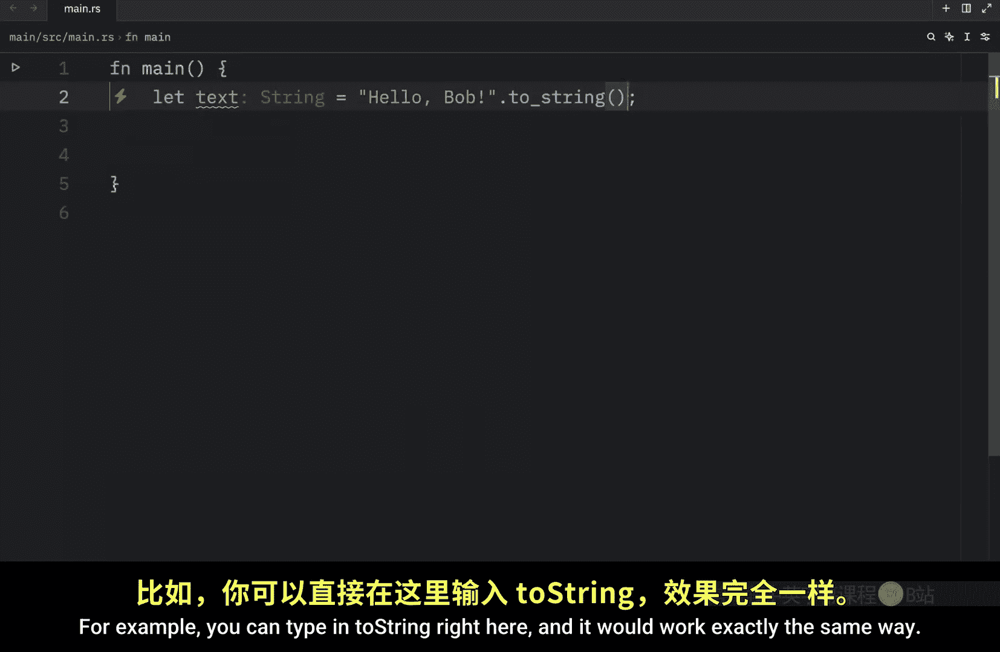
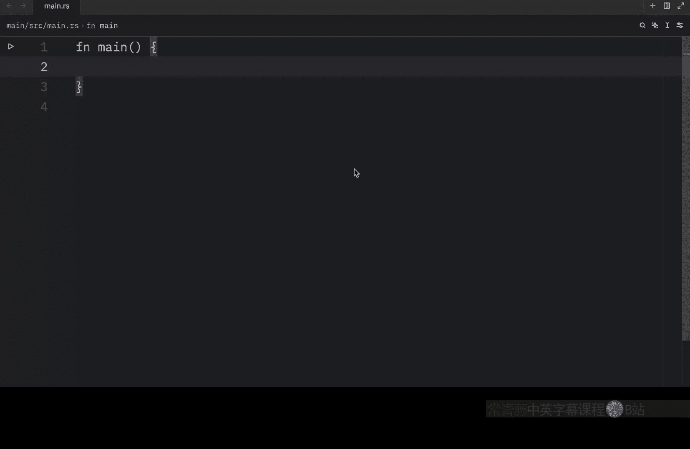

# 053：Rust 中的字符串类型 🧵

在本节课中，我们将更深入地学习 Rust 中的字符串类型。通常，我们将字符串视为集合，因为在 Rust 中，字符串本质上是一个字节集合。在其他语言（如 Python）中，我们通常将字符串视为字符集合，这同样是一种集合。在接下来的几个视频中，我们将讨论所有集合类型共有的操作，例如创建、更新和读取。我们也会看看字符串与其他集合有何不同。但首先，让我们从了解什么是字符串开始本节的学习。

## 核心语言中的字符串类型


在 Rust 核心语言中，只有一种字符串类型：**字符串切片**。我们之前已经见过很多次，它看起来像这样：
```rust
let s = "Bob";
```
这是一个字符串切片。如果我们调试它，得到的输出是 `"Bob"`。

在之前的课程中，我们讨论过字符串切片，它是对存储在其他地方的 UTF-8 编码字符串数据的引用。例如，字符串字面量直接存储在程序的二进制文件中，因此它们就是字符串切片。

## 标准库中的 String 类型

`String` 类型由 Rust 的标准库提供，而非内置于核心语言中。它是一种可增长、可变、拥有所有权的 UTF-8 编码字符串类型。当 Rust 开发者提到“字符串”时，他们可能指的是 `String` 类型或字符串切片类型，而不仅仅是其中一种。虽然本系列的这一部分将主要关注 `String` 类型，但这两种类型在 Rust 标准库中都大量使用，并且都是 UTF-8 编码的。




## 与向量的相似性




现在，许多适用于向量的操作也同样适用于 `String` 类型。这是因为 `String` 实际上是围绕一个字节向量（`Vec<u8>`）的包装器，附带一些额外的保证、限制和能力。

以下是它们工作方式相同的一个函数示例：`new` 函数。
```rust
let s = String::new(); // 创建一个空字符串
let v: Vec<i32> = Vec::new(); // 创建一个空的 i32 类型向量
```
这行代码创建了一个新的空字符串，我们稍后可以向其中加载数据。如果我们调试这两者，得到的输出将是一个空字符串和一个空向量。

## 创建带有初始值的字符串

通常，我们会有一个想要使用的字符串初始值。例如，我们可能有一个 `&str` 类型的文本：
```rust
let text: &str = "Hello, Bob";
```
此时，`text` 是一个字符串切片。正如你所见，我们没有使用 `String` 构造函数。当我们使用这样的引号时，默认创建的是一个字符串切片。

为了将其转换为一个拥有所有权的 `String`，我们需要使用以下方法：
```rust
let text = text.to_string(); // 现在 text 是 String 类型
```
或者，你也可以直接这样做：
```rust
let text = "Hello, Bob".to_string();
```
第二种方法是使用 `String::from` 函数：
```rust
let text = String::from("Hello, Bob");
```
这两种方法做的事情完全相同，选择哪一种取决于个人偏好。

## UTF-8 编码的重要性




请记住，字符串是 UTF-8 编码的，这意味着我们可以在其中包含任何正确编码的数据。这就是为什么以下所有内容都是有效的，即使包含特殊字符：
```rust
let hello = String::from("你好");
let emoji = String::from("😊");
```

---




本节课中，我们一起学习了 Rust 中两种主要的字符串类型：核心语言的字符串切片（`&str`）和标准库的 `String` 类型。我们了解了 `String` 是可增长、可变且拥有所有权的，并且它是基于 `Vec<u8>` 实现的。我们还学习了如何创建空字符串以及如何从字符串字面量创建拥有所有权的 `String`（使用 `.to_string()` 或 `String::from`）。最后，我们强调了 Rust 字符串的 UTF-8 编码特性，使其能够支持多种语言和字符。在下一节中，我们将探讨如何在 Rust 中更新字符串。