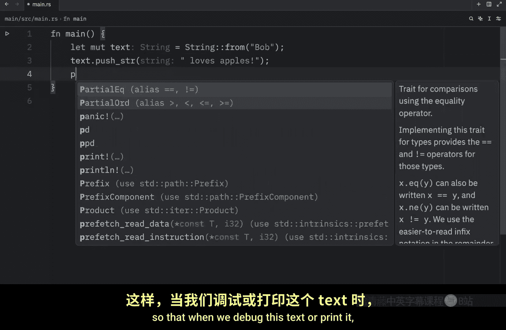
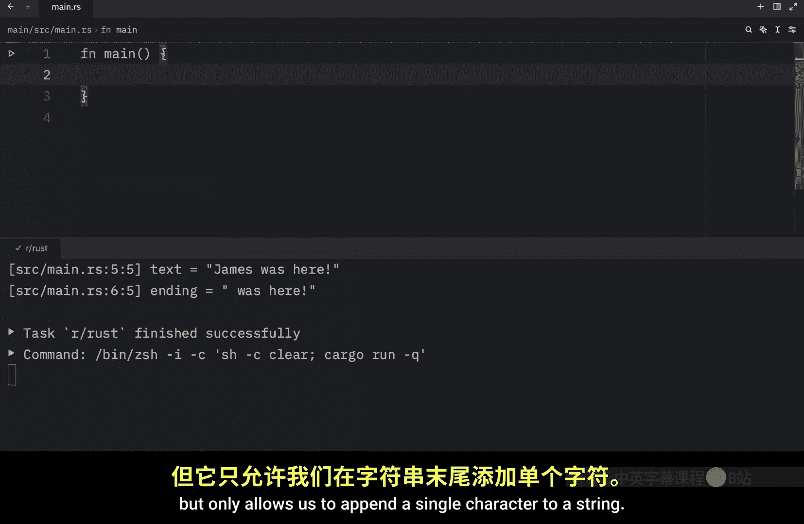
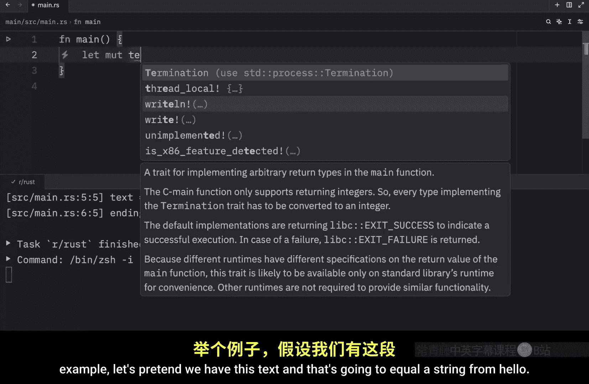
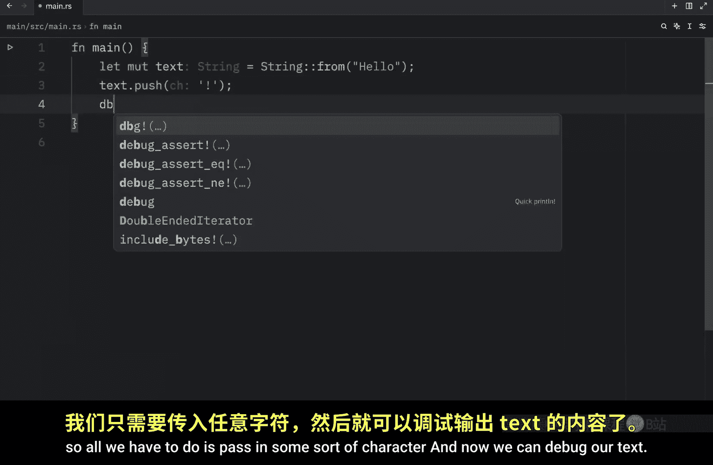
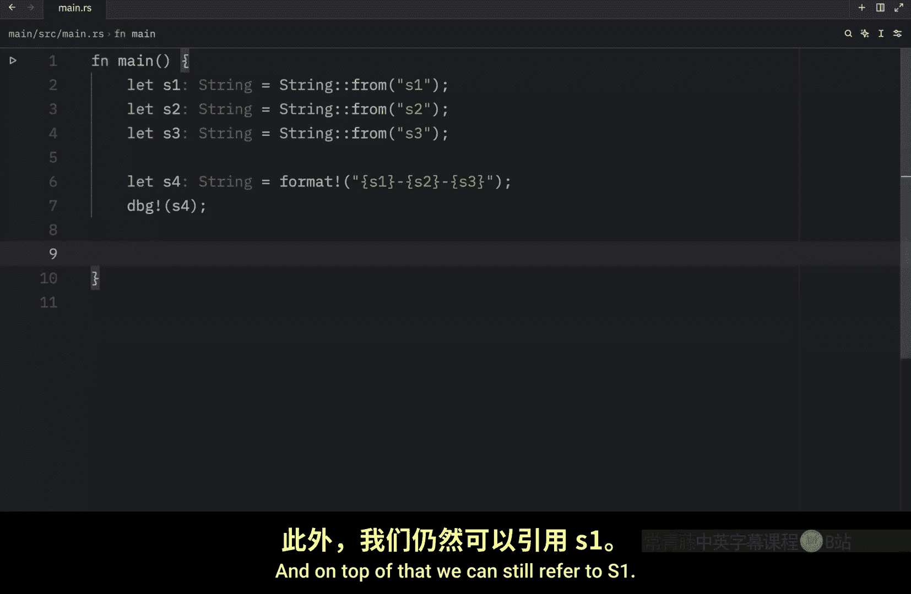
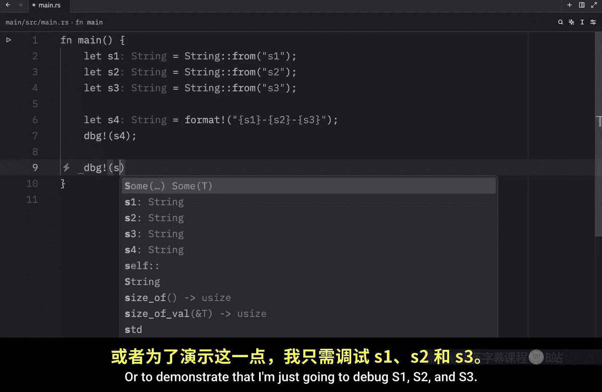
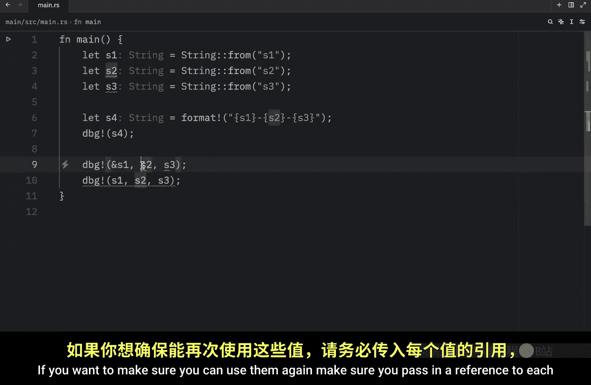

# 054：字符串的扩展与拼接 📝

在本节课中，我们将继续学习 Rust 中的字符串。我们将重点探讨如何扩展字符串的内容，以及如何将多个字符串拼接在一起。字符串在 Rust 中类似于向量（Vector），可以动态增长其大小和内容，只需向其“推送”更多数据即可。

## 扩展字符串：`push_str` 与 `push` 方法

上一节我们介绍了字符串的基本概念，本节中我们来看看如何向一个已有的字符串追加内容。Rust 提供了两种主要方法：`push_str` 用于追加字符串切片，`push` 用于追加单个字符。


首先，我们创建一个可变的字符串变量作为起点。




```rust
let mut text = String::from("Bob");
```

接下来，我们使用 `push_str` 方法向这个字符串追加内容。这个方法接收一个字符串切片（`&str`）作为参数，这样它就不会取得参数的所有权，我们之后仍然可以使用这个参数。

```rust
text.push_str(" loves apples");
println!("{:?}", text); // 输出: "Bob loves apples"
```

为了更清晰地展示所有权机制，我们可以用一个变量来存储要追加的内容。



```rust
let mut text = String::from("James");
let ending = " was here";
text.push_str(ending);
println!("{:?}", text); // 输出: "James was here"
println!("{:?}", ending); // 仍然可以正常使用 `ending`
```

即使 `ending` 是一个 `String` 类型，`push_str` 方法也会要求我们传入其切片形式（`&ending`），Rust 会确保这一点，避免意外的所有权转移。




除了追加整个字符串，我们还可以使用 `push` 方法向字符串末尾添加单个字符。

```rust
let mut text = String::from("hello");
text.push('!');
println!("{:?}", text); // 输出: "hello!"
```

以上就是向字符串中追加数据的基本方法。接下来，让我们看看如何将多个字符串连接成一个。

## 字符串拼接：`+` 运算符与 `format!` 宏



在 Python 等语言中，使用 `+` 运算符拼接字符串非常简单直接。但在 Rust 中，`+` 运算符的行为稍有不同，涉及到所有权和引用的概念。

首先，我们创建两个字符串。

```rust
let s1 = String::from("hello");
let s2 = String::from(" Bob");
```

如果我们尝试直接使用 `s1 + s2`，编译器会报错。我们需要将第二个操作数 `s2` 以引用的形式传入。

```rust
let s3 = s1 + &s2;
println!("{:?}", s3); // 输出: "hello Bob"
```

执行此操作后，你会注意到两件事：
1.  **`s1` 的所有权被移动**：在拼接操作后，我们无法再使用 `s1`，因为它的所有权在 `+` 运算中被消耗了。
2.  **`s2` 需要以引用形式传入**：这是因为 `+` 运算符底层调用的 `add` 方法的签名类似于：
    `fn add(self, s: &str) -> String`
    它取得第一个字符串（`self`）的所有权，并接收第二个字符串的切片引用，然后返回一个新的 `String`。

当需要拼接两个以上的字符串时，使用 `+` 运算符会变得繁琐且难以阅读。

```rust
let s1 = String::from("tic");
let s2 = String::from("tac");
let s3 = String::from("toe");
let s4 = s1 + "-" + &s2 + "-" + &s3;
println!("{:?}", s4); // 输出: "tic-tac-toe"
// 此时 s1 已不可用
```


因此，对于复杂的字符串拼接，更推荐使用 `format!` 宏。它的工作方式类似于 `println!` 宏，但不是将结果打印到屏幕，而是将其作为一个新的 `String` 返回。

以下是使用 `format!` 宏的示例：

```rust
let s1 = String::from("tic");
let s2 = String::from("tac");
let s3 = String::from("toe");
let s4 = format!("{}-{}-{}", s1, s2, s3);
println!("{:?}", s4); // 输出: "tic-tac-toe"
```

使用 `format!` 宏有两大优点：
1.  **代码可读性高**：格式清晰，一目了然。
2.  **不取得参数所有权**：`format!` 宏生成的代码使用参数的引用，因此不会消耗 `s1`、`s2`、`s3` 的所有权。拼接操作后，你仍然可以继续使用它们。



```rust
println!("{:?}, {:?}, {:?}", s1, s2, s3); // 全部可以正常使用
```

> **注意**：像 `println!` 这样的宏默认也会取得值的所有权。如果你希望之后再次使用这些变量，应该传入它们的引用，例如 `println!("{:?}", &s1)`。

## 总结 🎯





本节课中我们一起学习了 Rust 中操作字符串的进阶技巧：
*   我们掌握了使用 `push_str` 和 `push` 方法来动态扩展字符串内容。
*   我们了解了使用 `+` 运算符进行字符串拼接时涉及的所有权转移机制，以及它更适合于简单的两字符串拼接场景。
*   我们重点学习了 `format!` 宏，它是进行复杂、多字符串拼接的首选工具，因为它代码清晰且不会夺取参数的所有权，使得代码更安全、更易维护。