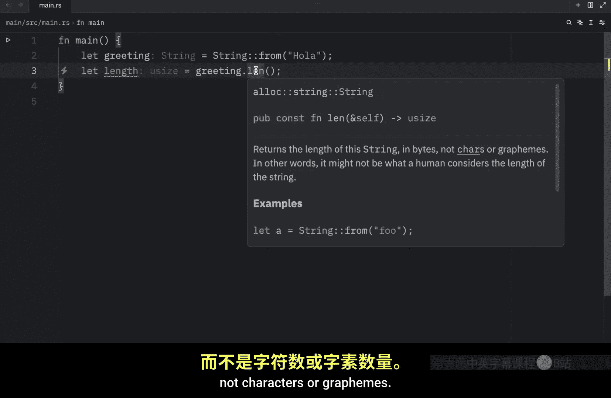
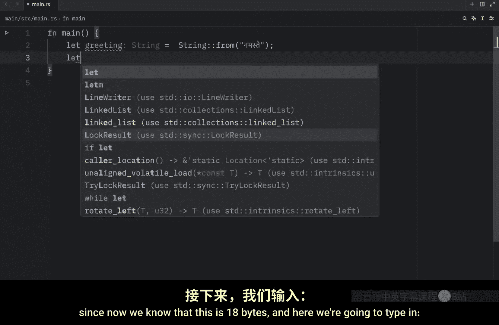
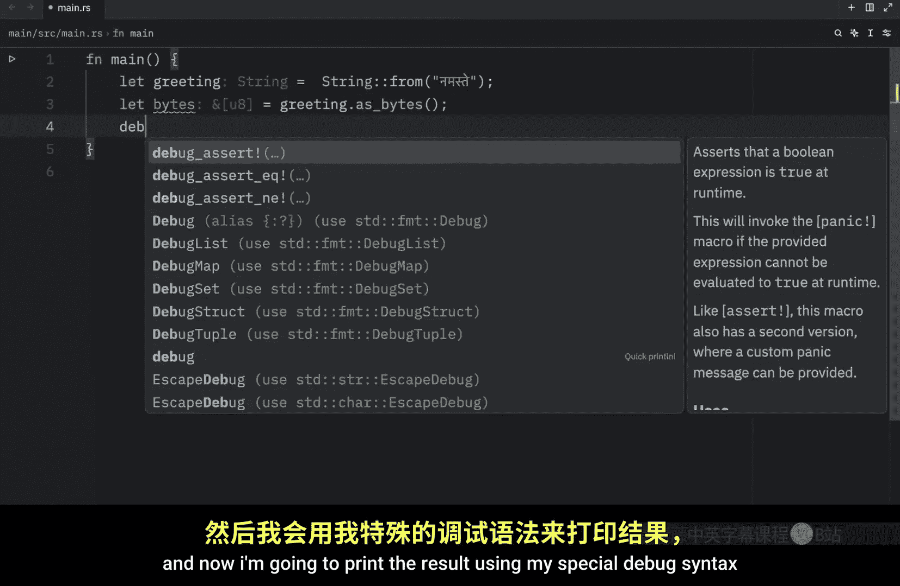
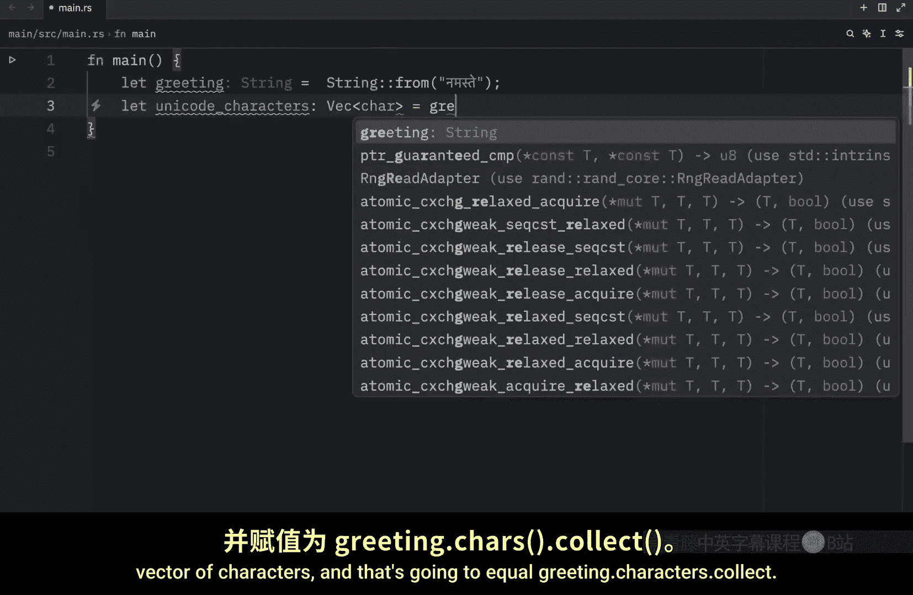
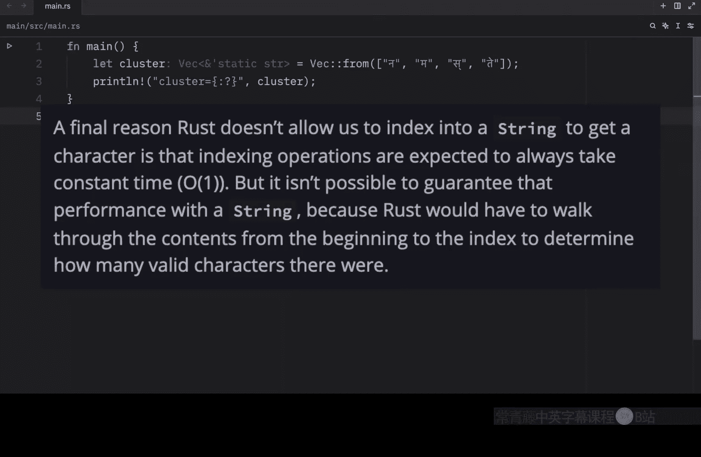
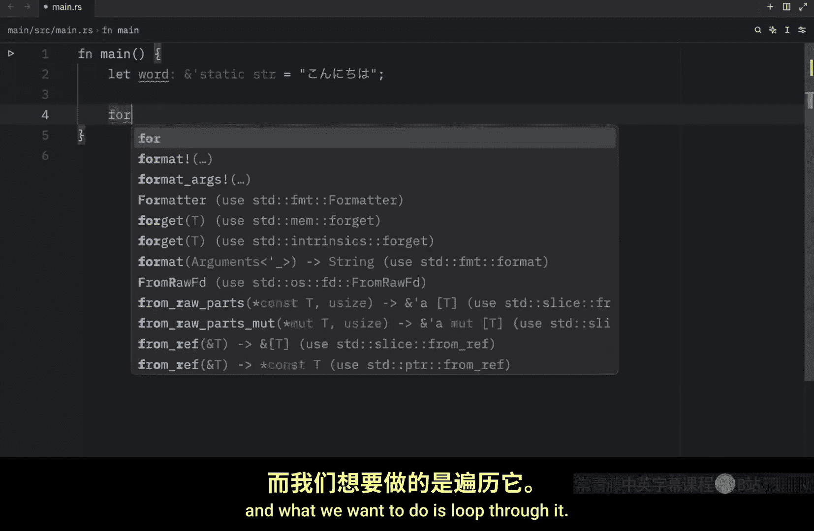
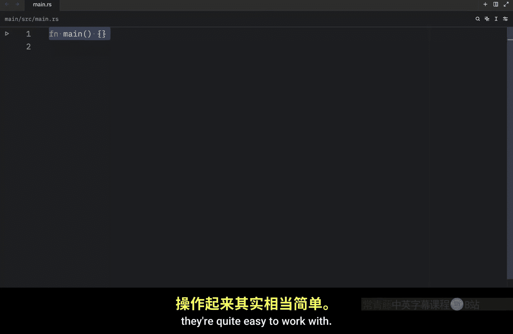

# 055：字符串索引与切片 🔍

在本节课中，我们将要学习 Rust 中字符串索引与切片的核心概念。我们将探讨为何 Rust 不允许直接通过整数索引访问字符串中的字符，以及如何通过切片和迭代来安全地操作字符串数据。

## 概述

在上一节中，我们学习了如何更新字符串。本节中，我们将覆盖本部分的最后一个重要主题：在 Rust 中索引字符串。在许多编程语言中，通过索引访问字符串中的单个字符是常见操作。然而，在 Rust 中，这并不简单。

## 字符串的内部表示

为了解释为何 Rust 不允许直接索引，我们首先需要讨论 Rust 如何在内存中存储字符串。Rust 的 `String` 本质上是 `Vec<u8>` 的包装器。让我们看一些正确编码的 UTF-8 字符串示例。

以下是创建字符串并查看其字节长度的示例：

```rust
let greeting = String::from("Hola");
let length = greeting.len(); // 返回字节长度，而非字符数
println!("{:?}", length); // 输出: 4
```




这个例子很简单，因为我们只使用了常规的拉丁字符。但如果引入特殊字符，情况会变得复杂。

```rust
let greeting = String::from("Здравствуйте");
let length = greeting.len();
println!("{:?}", length); // 输出: 24
```

在这个例子中，俄语字符“З”占用了两个字节的存储空间。这使得简单的索引操作变得困难，因为如果我们尝试索引 `greeting[4]`，我们可能只请求了某个字符的一部分字节，这在单独情况下没有意义。

## 字符串的三种视角


对于 UTF-8 编码，从 Rust 的角度来看，有三种相关的方式来查看字符串：作为字节、作为标量值和作为字素簇。字素簇最接近我们所说的“字母”。

让我们以印地语单词“नमस्ते”为例，看看这三种视角。

首先，我们查看其字节表示：






```rust
let greeting = String::from("नमस्ते");
let bytes = greeting.as_bytes();
println!("{:?}", bytes); // 输出构成该字符串的 18 个字节
```


这是计算机存储此数据的最终方式。



其次，我们将其视为标量值：

```rust
let greeting = String::from("नमस्ते");
let scalar_values: Vec<char> = greeting.chars().collect();
println!("{:?}", scalar_values); // 输出 6 个字符，其中包含变音符号
```

这里返回了六个字符，但第四个和第六个不是字母，而是变音符号。变音符号是表示同一字母不同发音的符号。

第三，我们将其视为字素簇，这会产生人类称之为构成印地语单词“नमस्ते”的四个字母。

Rust 为我们提供了不同的方式来解释原始字符串数据，以便每个程序都可以选择其所需的解释，无论使用何种人类语言。

## 为何不允许直接索引

Rust 不允许我们通过索引字符串来获取字符的另一个最终原因是，索引操作预期总是花费常数时间 O(1)。但对于字符串，这种性能保证是不可能的，因为 Rust 需要从开头遍历内容到指定索引，以确定存在多少有效字符。

## 字符串切片


既然我们已经了解到索引字符串通常不是一个好主意，因为不清楚返回类型应该是什么（应该是一个字节、一个字符、一个字素簇还是一个字符串切片？），那么是时候讨论切片字符串了。



因此，Rust 要求我们在使用索引创建字符串切片时要更加明确。

以下是如何创建字符串切片的示例：

```rust
let greeting = String::from("Здравствуйте");
let s = &greeting[0..4];
println!("{:?}", s); // 输出: "Зд"
```

换句话说，我们需要非常明确地指定要从字符串中提取的数据部分。我们不能只说索引 4，因为 Rust 不理解我们的意思。它不知道我们是想要字符还是字节。所以我们需要极其明确我们想要什么。

如果我们尝试错误地索引或切片，例如使用索引 `[4..5]`，Rust 会 panic，并给出非常详细的错误消息，例如“byte index 5 is not a char boundary; it is inside 'З'”。

## 处理字符串部分的最佳实践

处理字符串部分的最佳方法是明确你想要从中获得什么。你是想要字符还是字节？


例如，如果我们有一个单词并想遍历它：



```rust
let word = String::from("こんにちは");
// 遍历字节
for byte in word.bytes() {
    println!("{}", byte);
}
// 遍历字符
for c in word.chars() {
    println!("{}", c);
}
```

在这两种情况下，我们都额外明确了要从该字符串切片中获取哪些数据。

从字符串中获取字素簇更为复杂，甚至没有包含在标准库中。我们将在未来的视频中讨论。

## 总结




本节课中，我们一起学习了 Rust 中字符串索引与切片的核心概念。我们了解到，由于 UTF-8 编码的复杂性和性能考虑，Rust 不允许直接通过整数索引访问字符串。相反，我们需要使用切片操作，并明确指定我们想要的是字节、字符还是其他形式的表示。通过 `as_bytes()`、`chars()` 方法和字符串切片语法 `&string[start..end]`，我们可以安全且高效地操作字符串数据。字符串可能看起来很复杂，但只要你明确想要从中获取什么，它们就相当容易处理。