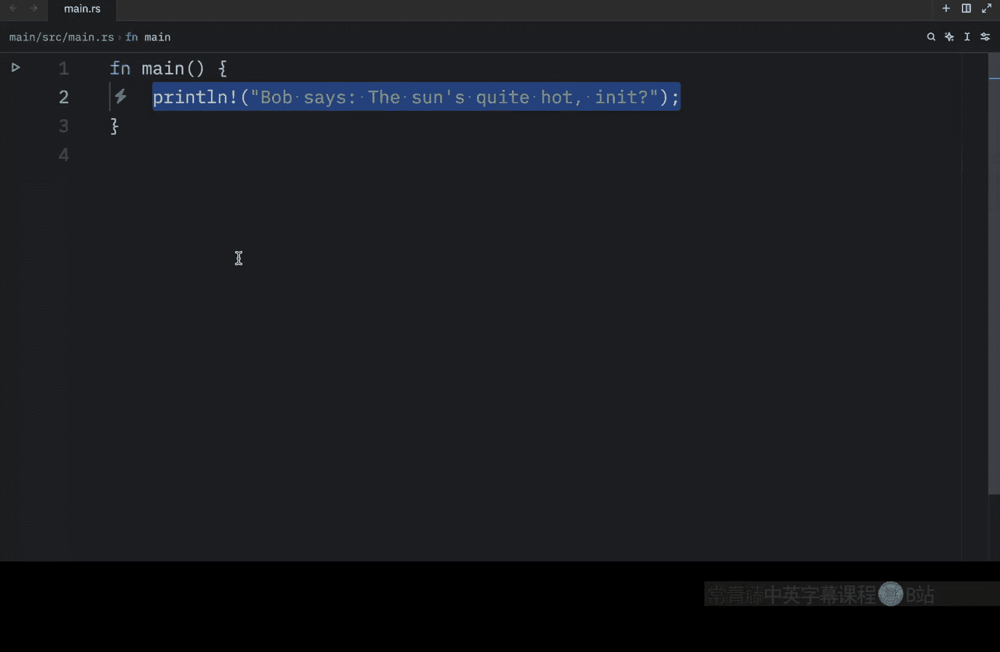
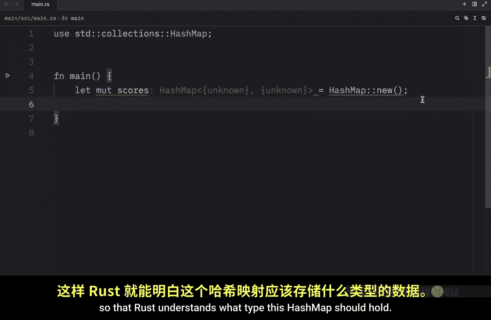
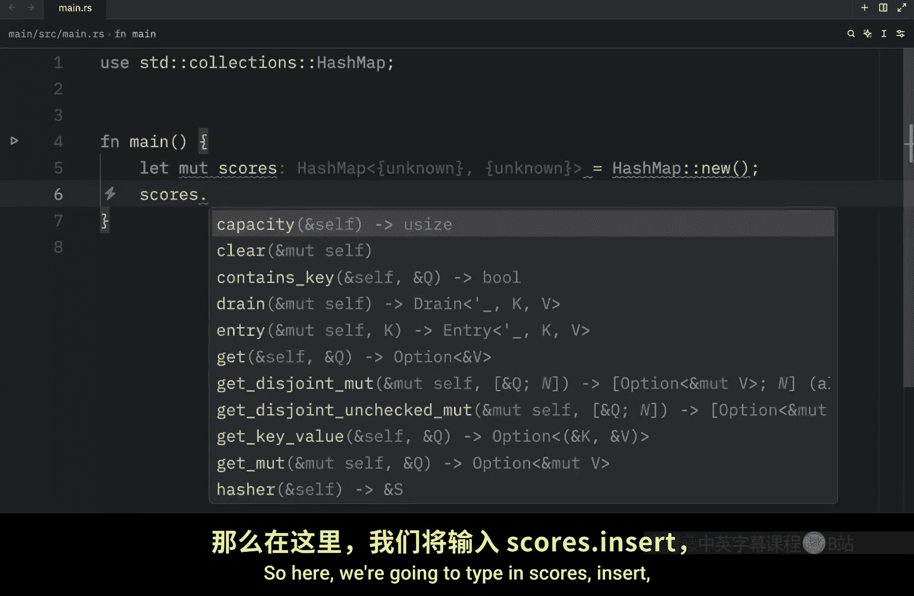
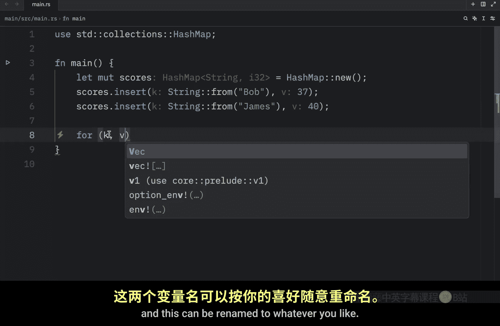
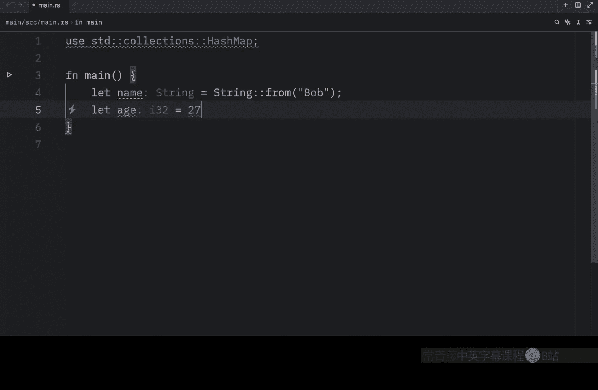
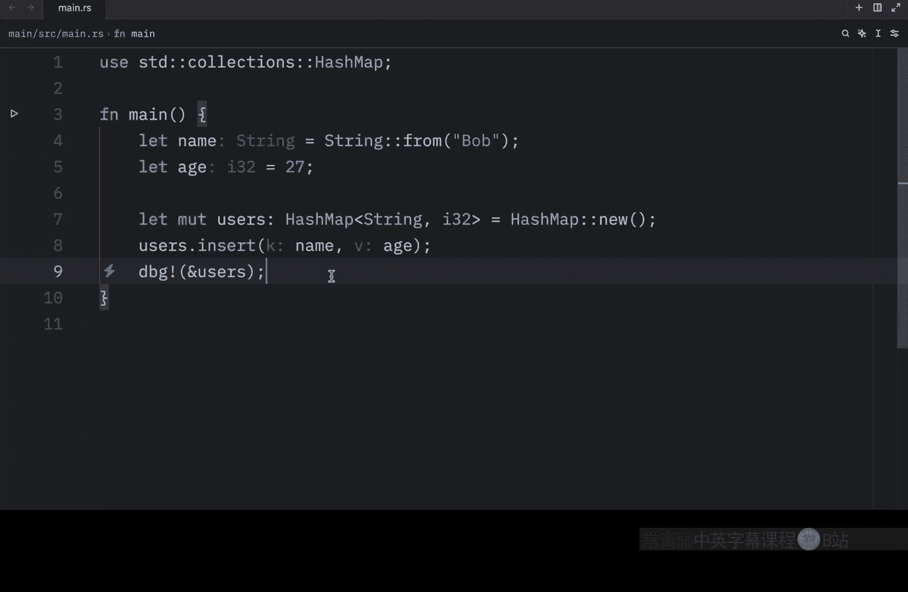
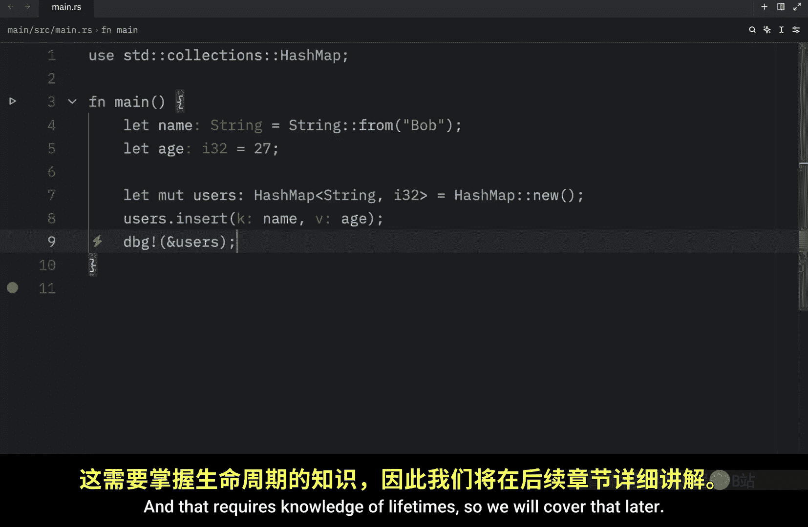

# 056：哈希映射详解 🗺️

在本节课中，我们将要学习 Rust 中的哈希映射。哈希映射是一种非常实用的集合类型，它以键值对的形式存储数据。当我们需要通过键而非索引来查找数据时，哈希映射就显得尤为有用。

## 创建哈希映射




让我们从创建一个新的哈希映射开始。在这个例子中，我们将创建一个存储分数的哈希映射。首先，我们需要从标准库中导入 `HashMap`。

```rust
use std::collections::HashMap;

let mut scores = HashMap::new();
```

与往常一样，如果我们定义了一个没有初始数据的数据结构，Rust 编译器无法推断其类型，因此需要我们显式声明。我们可以选择在创建时声明类型，或者立即插入一些数据，让 Rust 自动推断。

这里，我们选择立即插入数据。



```rust
scores.insert(String::from("Bob"), 37);
```



这样，Rust 就能推断出这个哈希映射的类型是 `HashMap<String, i32>`。键是 `String` 类型，值是 `i32` 类型。

我们再添加一个用户。

```rust
scores.insert(String::from("James"), 40);
```

现在，我们可以打印这个哈希映射来查看内容。

```rust
println!("{:?}", scores);
```

输出结果会清晰地展示键值对。需要了解的是，与向量类似，哈希映射的数据也存储在堆上，并且它是同质的：所有键必须是相同类型，所有值也必须是相同类型。

## 访问哈希映射中的值

上一节我们介绍了如何创建和填充哈希映射，本节中我们来看看如何访问其中的值。我们继续使用上面的例子，尝试获取“Bob”对应的值。

要获取值，我们可以使用 `get` 方法，它接收一个键并返回一个 `Option` 枚举。

```rust
let score = scores.get("Bob");
```

`get` 方法返回的是 `Option<&V>`，即一个可能包含值引用的 `Option`。为了得到一个确定的值，我们可以使用 `copied()` 方法将其转换为 `Option<V>`，然后使用 `unwrap_or` 提供一个默认值。


```rust
let score = scores.get("Bob").copied().unwrap_or(0);
println!("Bob's score is: {}", score);
```

这种方法很便利，因为即使键不存在，程序也不会恐慌，而是返回我们指定的默认值 0。

## 遍历哈希映射

除了访问单个值，我们还可以遍历哈希映射中的所有键值对。以下是遍历的语法。

```rust
for (key, value) in &scores {
    println!("{}: {}", key, value);
}
```


在这个循环中，`key` 和 `value` 是每个键值对的引用。运行这段代码，会输出哈希映射中的所有条目。



## 哈希映射与所有权

现在，我们来探讨哈希映射如何处理所有权，这是 Rust 中的一个核心概念。

对于实现了 `Copy` 特征的类型（如 `i32`），值会被复制到哈希映射中。对于拥有所有权的值（如 `String`），值会被移动，哈希映射将取得其所有权。




让我们看一个例子。


```rust
let name = String::from("Bob");
let age = 27;

let mut users = HashMap::new();
users.insert(name, age); // `name` 被移动，`age` 被复制

// println!("{}", name); // 错误！`name` 的所有权已转移给哈希映射
println!("{}", age); // 正确，`age` 是 i32，实现了 Copy
```

如代码所示，插入后我们不能再使用变量 `name`，因为它的所有权已经转移。但变量 `age` 仍然有效。

我们也可以将值的引用插入哈希映射，这样值本身就不会被移动。但这要求引用所指向的数据的生命周期至少要和哈希映射一样长，这涉及到生命周期的知识，我们将在后续课程中详细讲解。

## 总结






本节课中我们一起学习了 Rust 的哈希映射。我们了解了如何创建和初始化哈希映射，如何通过键访问值（包括安全地处理不存在的键），以及如何遍历所有条目。最重要的是，我们探讨了哈希映射与所有权系统的交互：对于可复制的类型，值被复制；对于拥有所有权的类型，值被移动，哈希映射取得所有权。掌握这些知识是有效使用 Rust 集合类型的关键。