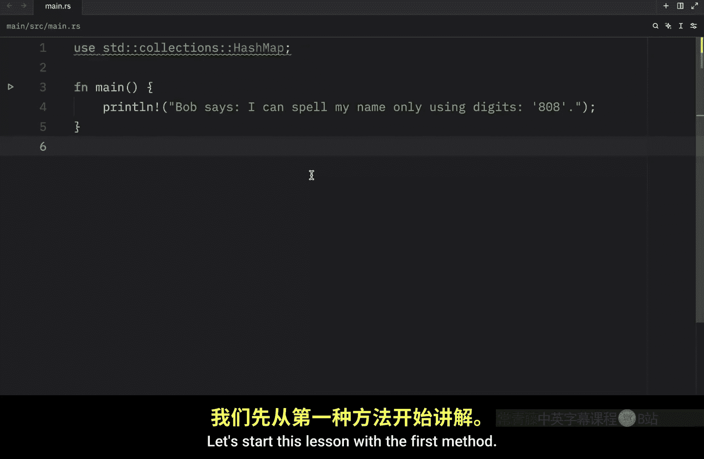
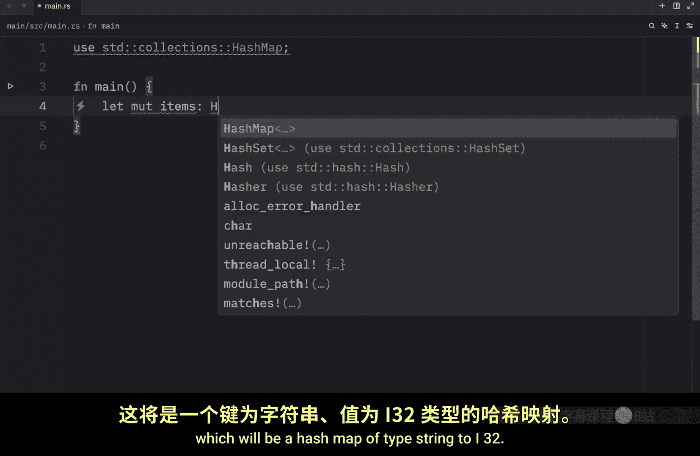
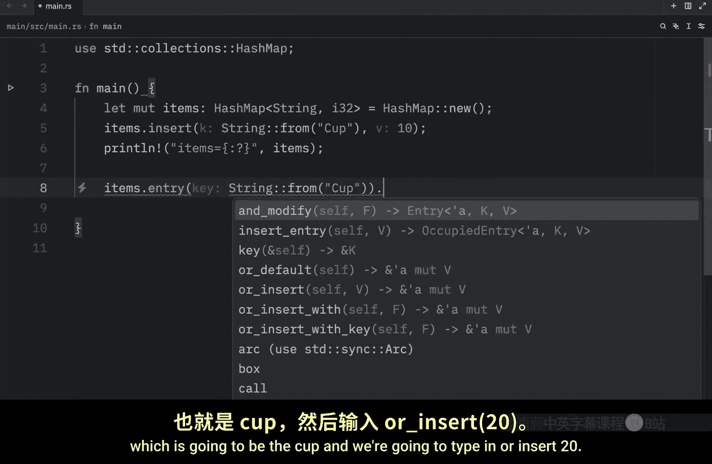
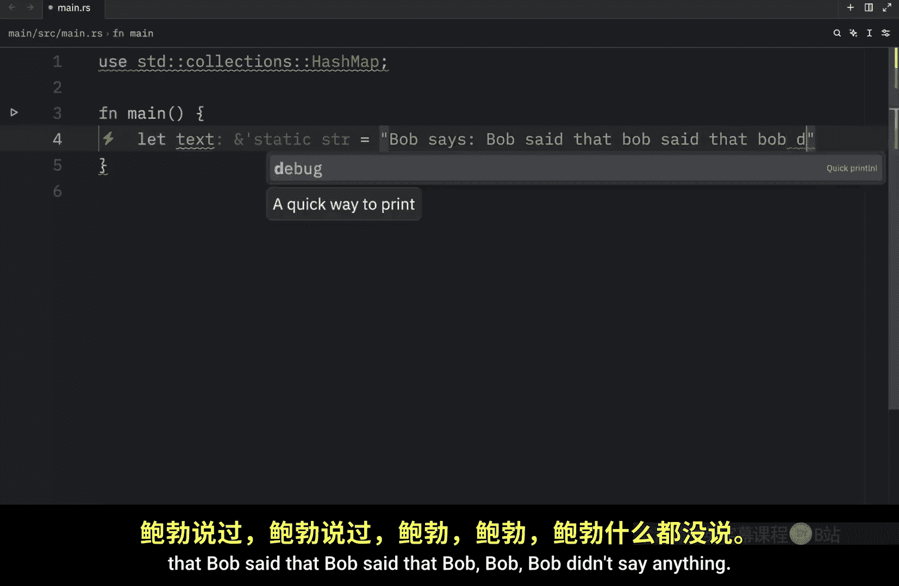
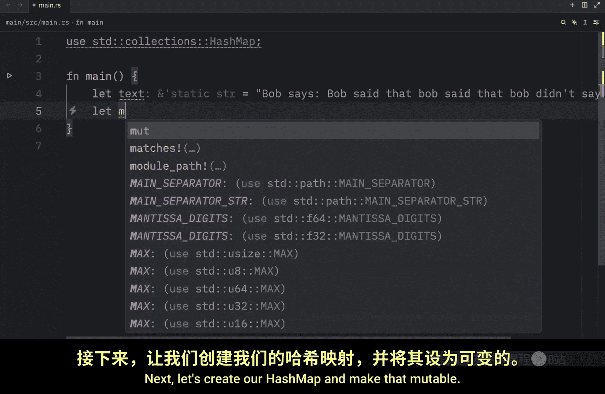
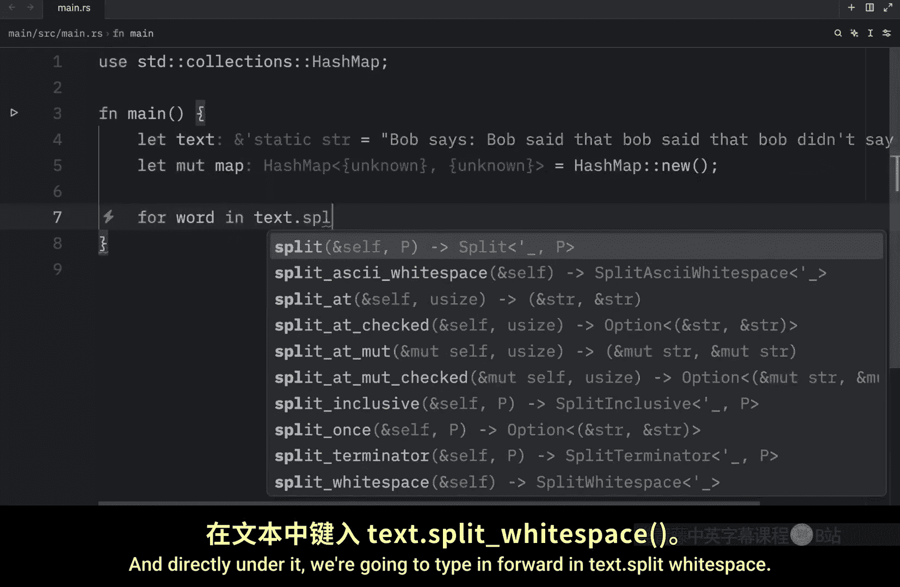
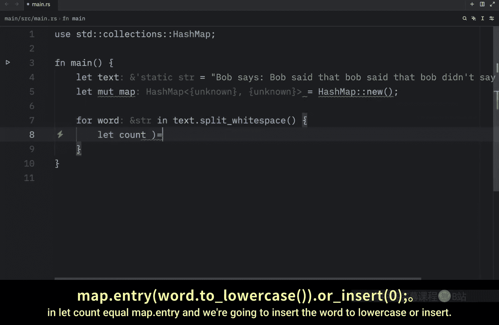
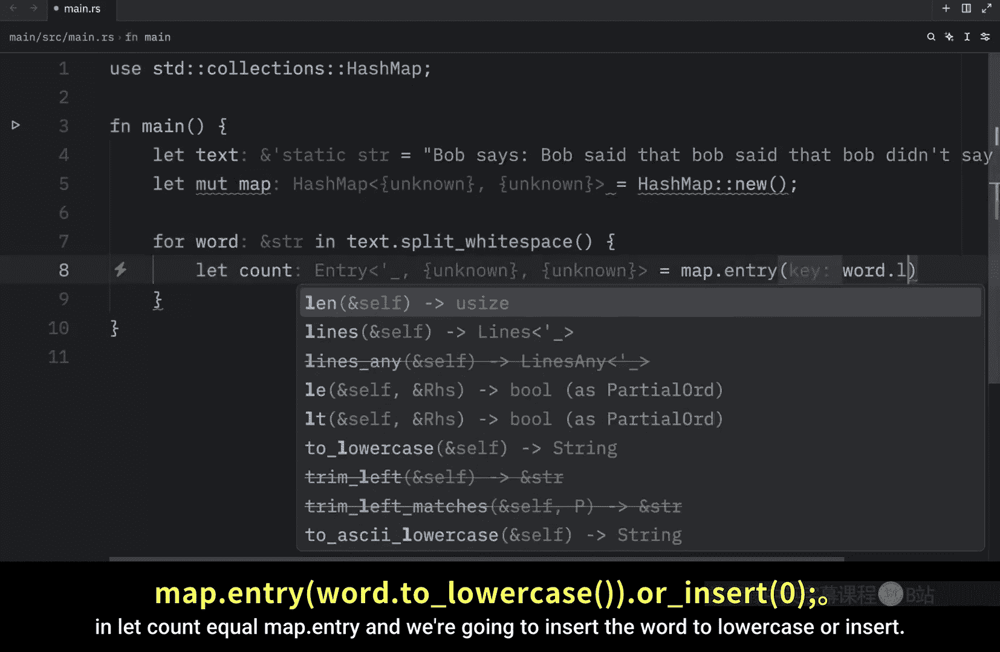
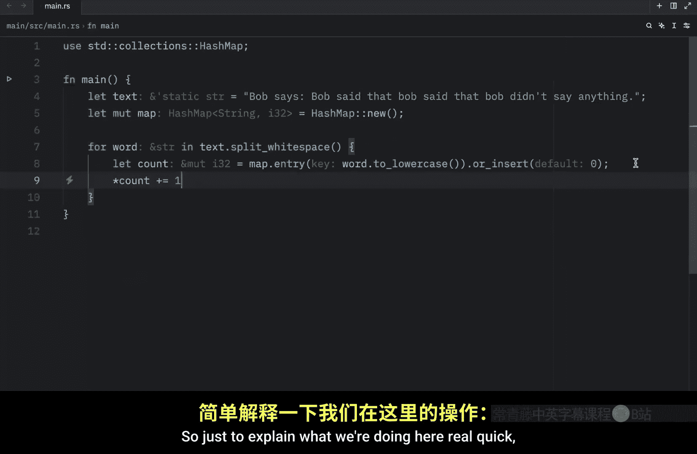
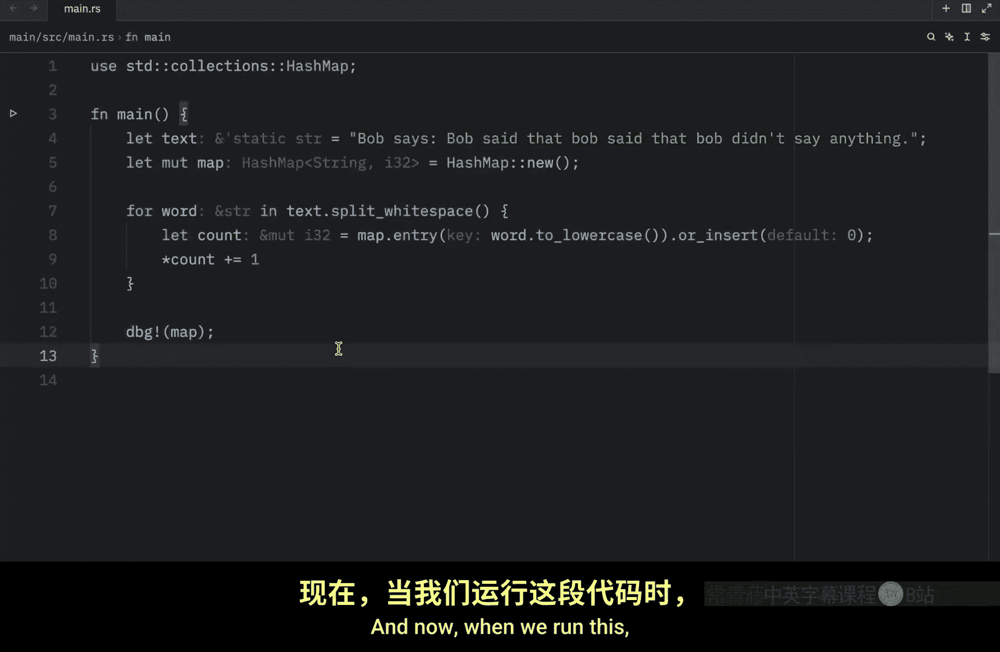

# 057：哈希映射的更新操作 🔄

在本节课中，我们将学习如何更新 Rust 中的哈希映射（HashMap）。哈希映射是一种存储键值对的数据结构，每个键必须是唯一的。我们将探讨几种不同的更新方法，包括直接覆盖、条件插入以及基于旧值更新。

---

上一节我们介绍了如何创建哈希映射，本节中我们来看看如何更新它。





首先，哈希映射中的每个键值对都必须拥有唯一的键。不能存在两个完全相同的键，因为后一个会覆盖前一个。更新哈希映射数据有多种方法。

让我们从第一种方法开始学习。

## 方法一：直接插入（覆盖）

对于这个示例，我们将创建一个哈希映射。以下是创建和插入的代码：

```rust
let mut items = HashMap::new();
items.insert(String::from("cup"), 10);
println!("{:?}", items);
```




这段代码创建一个 `HashMap`，键的类型是 `String`，值的类型是 `i32`。然后插入一个键为 `"cup"`，值为 `10` 的键值对。运行后会输出 `{"cup": 10}`。

现在，如果我们再次插入相同的键：

```rust
items.insert(String::from("cup"), 25);
println!("{:?}", items);
```

由于哈希映射中不能有重复的键，这次插入会完全覆盖之前的键值对。输出将变为 `{"cup": 25}`。

## 方法二：条件插入（Entry API）

如果你想仅在键不存在时才插入键值对，哈希映射提供了一个特殊的 API，叫做 `entry`。它接收你想要检查的键作为参数。

以下是使用 `entry` API 的示例：

```rust
let mut items = HashMap::new();
items.insert(String::from("cup"), 10);


items.entry(String::from("cup")).or_insert(20);
items.entry(String::from("spoon")).or_insert(20);

println!("{:?}", items);
```







`entry` 方法检查键是否存在。`or_insert` 方法仅在键不存在时插入提供的值。
*   对于键 `"cup"`，由于它已存在（值为10），`or_insert(20)` 不会更新其值。
*   对于键 `"spoon"`，由于它不存在，`or_insert(20)` 会将其插入，值为20。





因此，最终输出是 `{"cup": 10, "spoon": 20}`。

`or_insert` 方法返回一个指向该键对应值的可变引用。这意味着你可以使用这个引用来修改值。

```rust
let value = items.entry(String::from("cup")).or_insert(20);
println!("{:?}", value); // 输出 10
```

## 方法三：基于旧值更新

哈希映射另一个常见用例是查找一个键的值，并基于旧值进行更新。例如，统计一段文本中每个单词的出现次数。




以下是实现单词计数器的代码：

```rust
let text = "Bob says: Bob said that. Bob said that Bob. Bob, bob didn't say anything";
let mut map = HashMap::new();

for word in text.split_whitespace() {
    let count = map.entry(word.to_lowercase()).or_insert(0);
    *count += 1;
}



println!("{:?}", map);
```


让我们分解这段代码：
1.  `text.split_whitespace()`：将字符串按空白字符分割，得到一个单词迭代器。
2.  `map.entry(word.to_lowercase()).or_insert(0)`：对于每个单词（转换为小写以忽略大小写差异），检查它是否已在映射中。如果不存在，则插入该键，并将值初始化为0。`entry` 方法返回一个指向该值的可变引用（`count`）。
3.  `*count += 1`：通过解引用操作符 `*`，我们增加该单词的计数。

运行此代码，会输出一个包含每个单词及其出现次数的哈希映射。

**重要说明**：此代码仅为演示目的。一个健壮的单词计数器还需要处理标点符号等问题（例如 `"says:"` 和 `"says"` 会被视为不同的单词）。

## 关于哈希函数


默认情况下，Rust 的 `HashMap` 使用一个名为 **SipHash** 的哈希函数。它能提供对涉及哈希表的拒绝服务（DoS）攻击的抵抗力。这不是最快的哈希算法，但用一定的性能代价换取更好的安全性通常是值得的。

如果你分析代码后发现默认的哈希函数对你的用途来说太慢，可以通过指定不同的哈希器（hasher）来切换到另一个函数。哈希器是实现了 `BuildHasher` trait 的类型。你不需要从头实现自己的哈希器，[crates.io](https://crates.io) 上有其他 Rust 用户共享的库，提供了实现许多常见哈希算法的哈希器。

---


本节课中我们一起学习了更新 Rust 哈希映射的三种主要方法：直接覆盖插入、使用 `Entry` API 进行条件插入，以及基于旧值更新（常用于计数场景）。我们还了解了 `HashMap` 默认使用的 SipHash 哈希函数及其在安全与性能间的权衡。掌握这些更新技巧，能让你更灵活地使用哈希映射来管理数据。