# 058：哈希集合（HashSet）🚀


在本节课中，我们将要学习 Rust 中的哈希集合（HashSet）。这是一种非常有用的数据结构，它允许我们存储一组唯一的值，自动去除所有重复项。

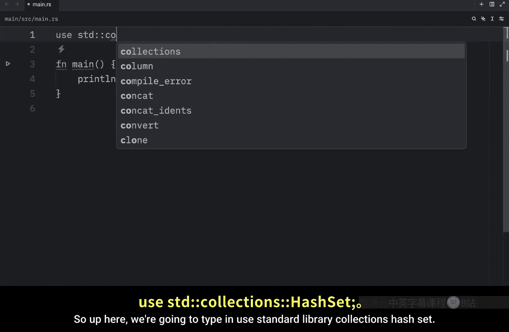

## 导入与创建 HashSet


要使用哈希集合，首先需要从标准库中导入它。

```rust
use std::collections::HashSet;
```

与哈希映射（HashMap）类似，我们可以使用 `new` 函数来创建一个新的空集合。

```rust
let mut numbers: HashSet<i32> = HashSet::new();
```

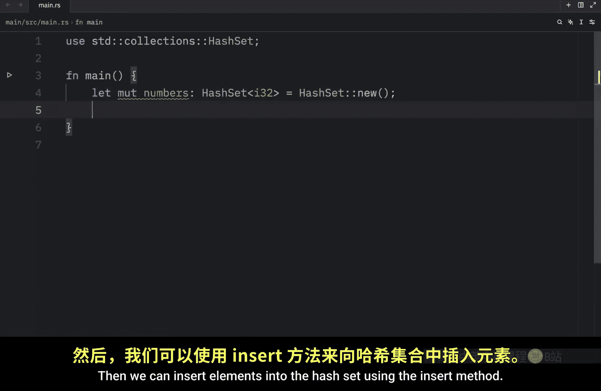

## 插入元素与自动去重

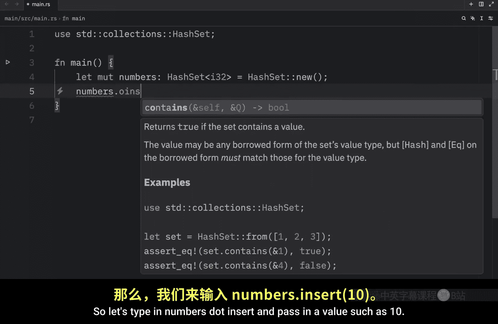

我们可以使用 `insert` 方法向集合中添加元素。哈希集合的核心特性是自动去重，任何重复的值都不会被存储。

```rust
numbers.insert(10);
numbers.insert(20);
numbers.insert(10); // 这个重复的 10 不会被加入集合
println!("{:?}", numbers); // 输出：{10, 20}
```

可以看到，即使我们插入了两次 `10`，集合中最终也只包含一个 `10`。

## 使用 `from` 函数初始化

如果我们在创建集合时就已经知道初始值，可以使用 `HashSet::from` 函数来初始化，这样更简洁。


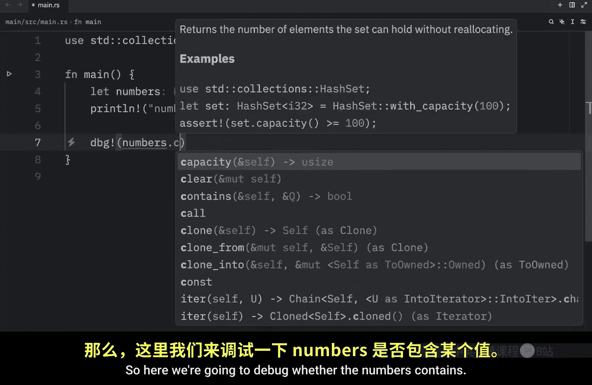

```rust
let numbers = HashSet::from([10, 20, 10]); // 重复的 10 会被自动移除
println!("{:?}", numbers); // 输出：{10, 20}
```

## 常用方法

接下来，我们看看对哈希集合进行操作的几个常用方法。我们将创建一个包含多个数字的集合作为示例。

```rust
let numbers = HashSet::from([1, 2, 2, 3, 4, 5]); // 重复的 2 会被移除
println!("{:?}", numbers); // 输出：{1, 2, 3, 4, 5}
```

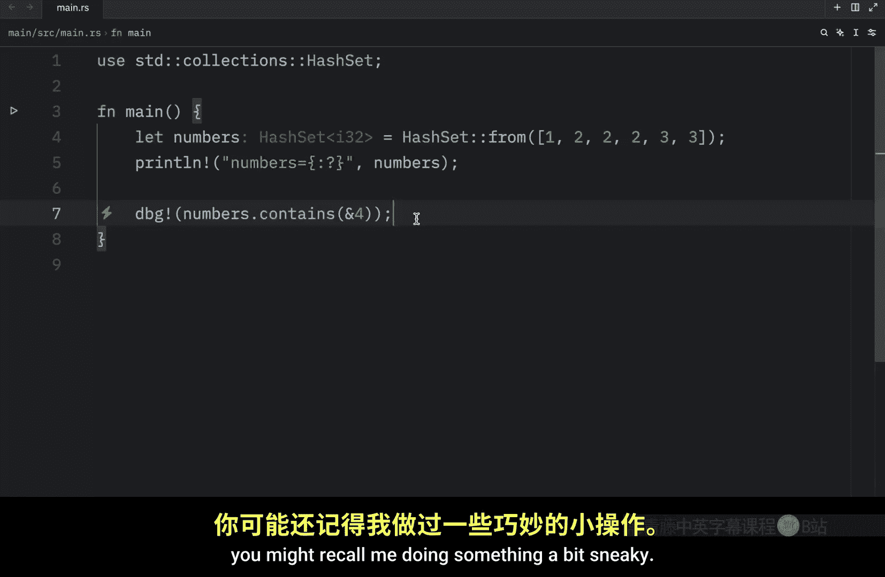


### 检查元素是否存在


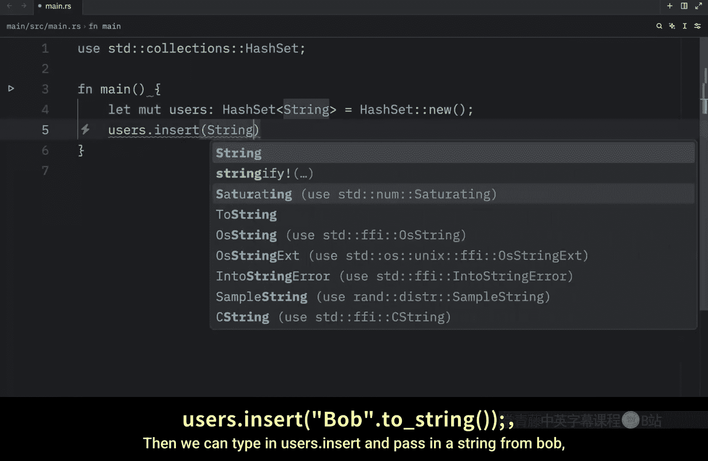

使用 `contains` 方法可以检查某个值是否存在于集合中。它接受一个引用作为参数，以避免不必要的值拷贝。

```rust
println!("{}", numbers.contains(&2)); // 输出：true
println!("{}", numbers.contains(&99)); // 输出：false
```

`contains` 方法支持灵活的查找。例如，即使集合的类型是 `String`，我们也可以传入一个字符串切片（`&str`）进行查找。

```rust
let mut users: HashSet<String> = HashSet::new();
users.insert(String::from("Bob"));
users.insert(String::from("James"));
println!("{}", users.contains("Bob")); // 输出：true
```

### 移除元素


使用 `remove` 方法可以从集合中移除指定的元素。该方法会返回一个布尔值，指示该元素是否被成功移除（即它原先是否存在）。

```rust
let mut numbers = HashSet::from([1, 2, 3, 4, 5]);
let was_present = numbers.remove(&99); // 尝试移除一个不存在的值
println!("{}", was_present); // 输出：false
println!("{:?}", numbers); // 集合不变

let was_present = numbers.remove(&1); // 移除存在的值
println!("{}", was_present); // 输出：true
println!("{:?}", numbers); // 输出：{2, 3, 4, 5}
```

### 获取集合大小与清空

以下是获取集合信息和管理集合的常用方法。

```rust
let numbers = HashSet::from([1, 2, 3, 4, 5]);

// 获取集合长度（元素个数）
println!("{}", numbers.len()); // 输出：5

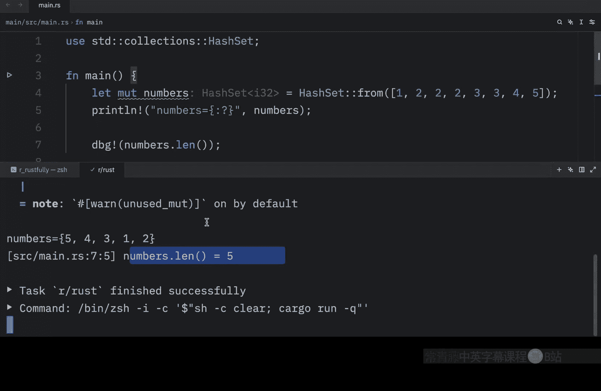


// 检查集合是否为空
println!("{}", numbers.is_empty()); // 输出：false

// 清空集合
let mut mutable_numbers = numbers.clone();
mutable_numbers.clear();
println!("{:?}", mutable_numbers); // 输出：{}
```

### 扩展集合与抽取元素

`extend` 方法可以方便地将一个可迭代对象中的所有元素添加到集合中。`drain` 方法则会清空集合并返回所有被移除的元素。

```rust
let mut numbers = HashSet::new();
// 使用 extend 添加多个元素
numbers.extend([1, 2, 3, 4]);
println!("{:?}", numbers); // 输出：{1, 2, 3, 4}

// 使用 drain 抽取所有元素到一个向量中
let drained: Vec<i32> = numbers.drain().collect();
println!("{:?}", drained); // 输出：[1, 2, 3, 4] (顺序可能不同)
println!("{:?}", numbers); // 输出：{}，集合已空
```

## 遍历集合

我们可以使用 `for` 循环来遍历哈希集合中的所有元素。需要注意的是，**哈希集合不保证元素的存储顺序**，每次遍历的顺序可能不同。


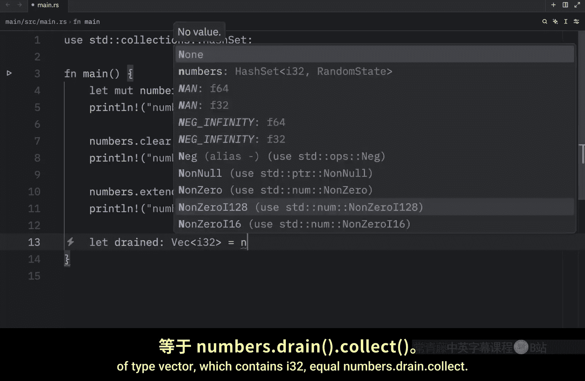

```rust
let users = HashSet::from(["Bob", "James", "Sandra"]);
for user in &users {
    println!("Hello, {}!", user);
}
// 可能的输出顺序（每次运行可能不同）:
// Hello, Sandra!
// Hello, James!
// Hello, Bob!
```

## 集合运算

哈希集合支持标准的数学集合运算，如并集、交集、差集和对称差集。

首先，我们创建两个示例集合。

```rust
let hs1 = HashSet::from([1, 2, 3]);
let hs2 = HashSet::from([2, 3, 4]);
```

### 并集 (Union)

并集包含两个集合中的所有唯一元素。

```rust
let union: HashSet<&i32> = hs1.union(&hs2).collect();
println!("并集: {:?}", union); // 输出：{1, 2, 3, 4}
```

### 交集 (Intersection)

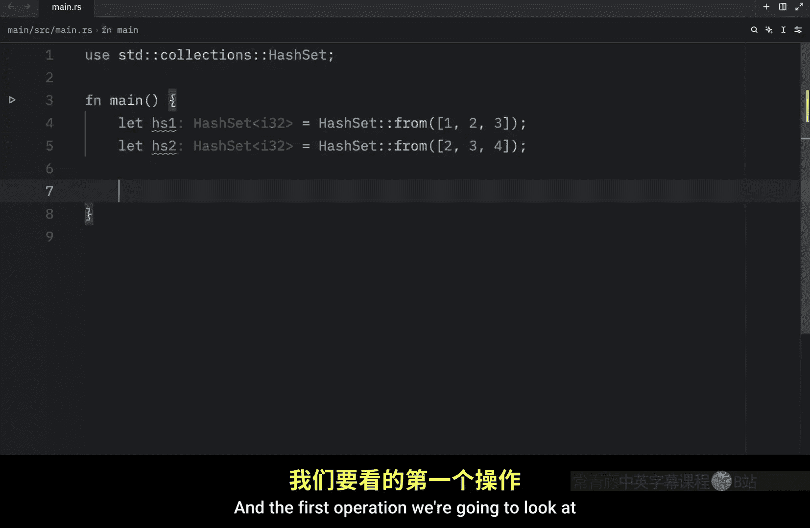

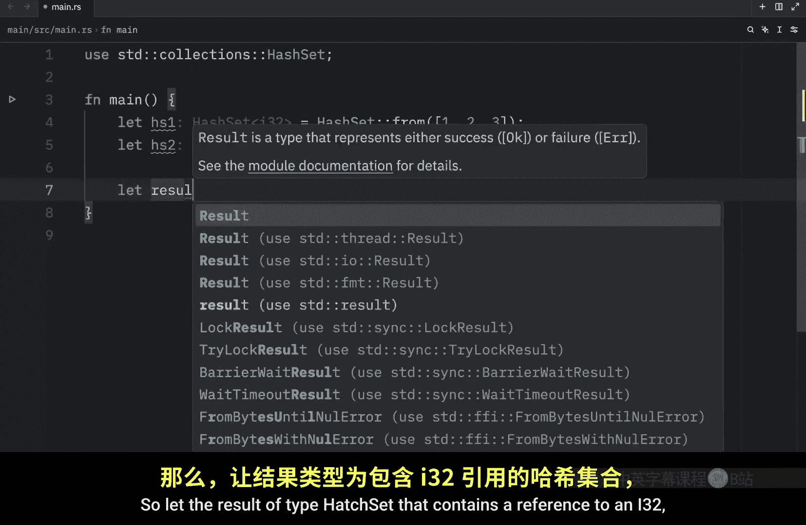

交集包含同时存在于两个集合中的元素。

```rust
let intersection: HashSet<&i32> = hs1.intersection(&hs2).collect();
println!("交集: {:?}", intersection); // 输出：{2, 3}
```

### 差集 (Difference)

差集包含存在于第一个集合但不存在于第二个集合中的元素。**注意：差集的顺序很重要**。

```rust
let diff1: HashSet<&i32> = hs1.difference(&hs2).collect();
println!("hs1 - hs2: {:?}", diff1); // 输出：{1}

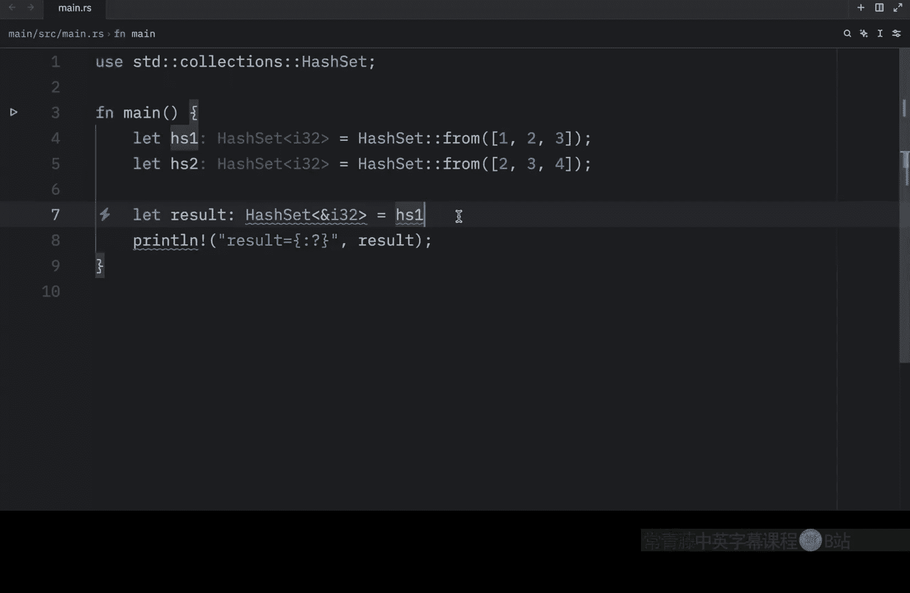

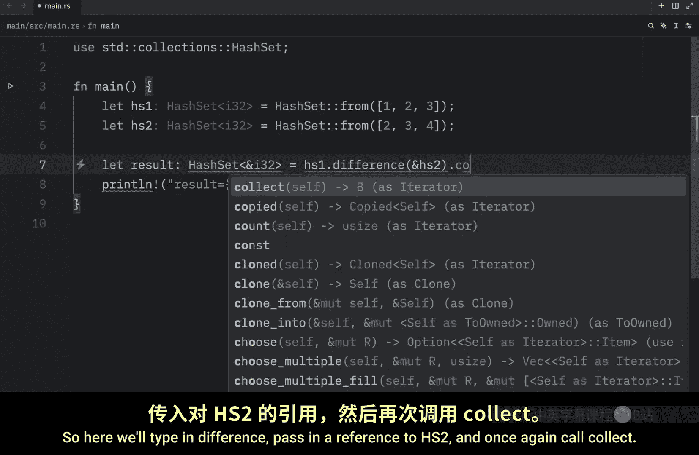

let diff2: HashSet<&i32> = hs2.difference(&hs1).collect();
println!("hs2 - hs1: {:?}", diff2); // 输出：{4}
```

### 对称差集 (Symmetric Difference)

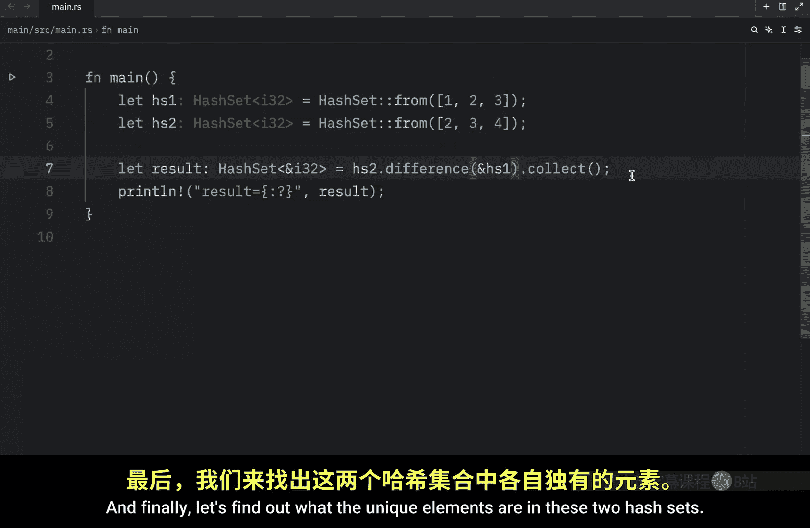

对称差集包含只存在于其中一个集合中，而不同时存在于两个集合中的元素。


```rust
let sym_diff: HashSet<&i32> = hs1.symmetric_difference(&hs2).collect();
println!("对称差集: {:?}", sym_diff); // 输出：{1, 4}
```

---


本节课中我们一起学习了 Rust 的哈希集合（`HashSet`）。我们了解了如何创建和初始化集合，掌握了插入、检查、移除元素等基本操作，并学习了如何获取集合信息、遍历元素。最后，我们探索了强大的集合运算功能，包括并集、交集、差集和对称差集。哈希集合是处理需要保证元素唯一性场景的利器，希望你能在未来的项目中灵活运用它。