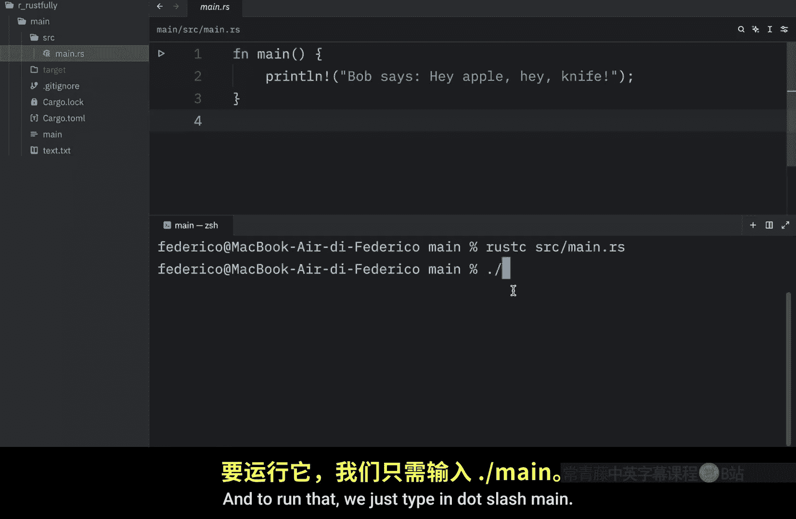
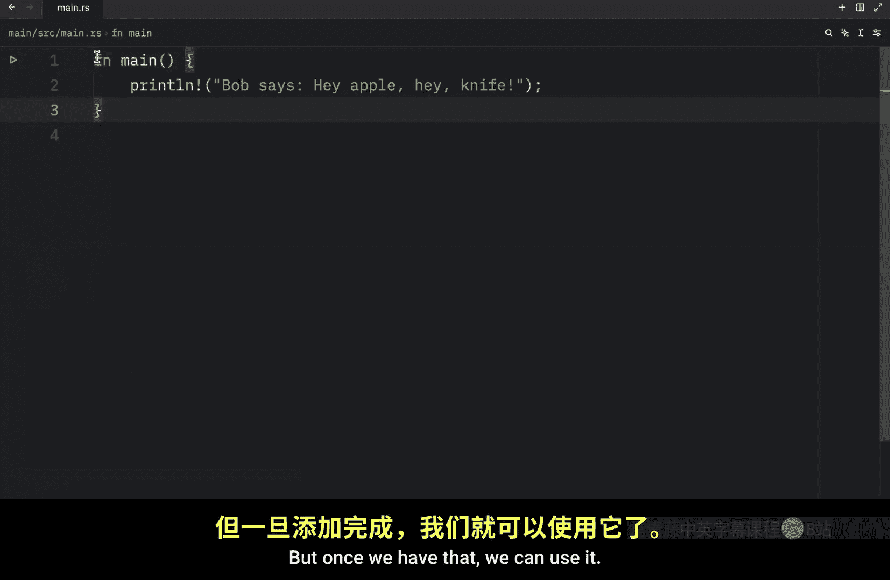
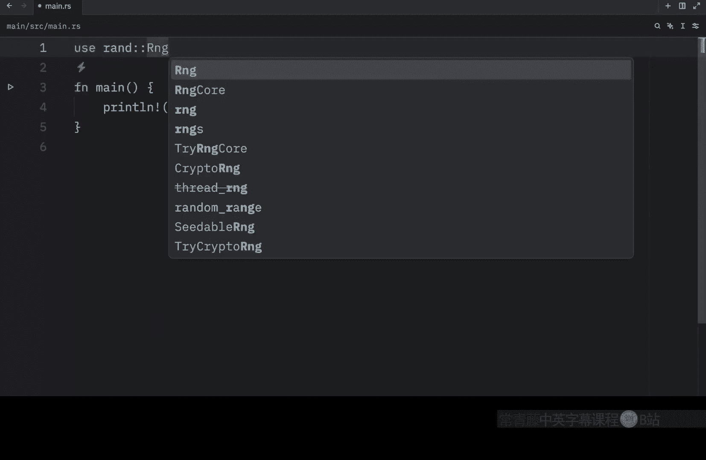
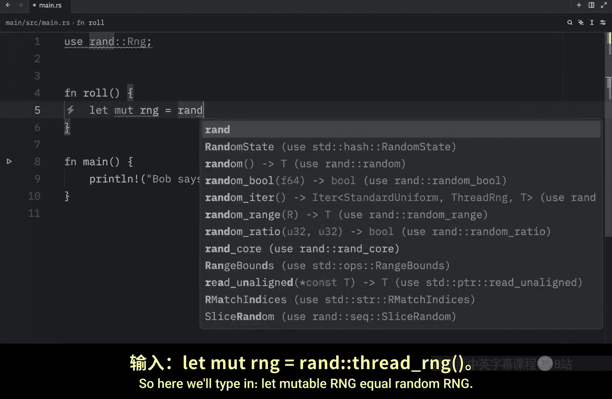
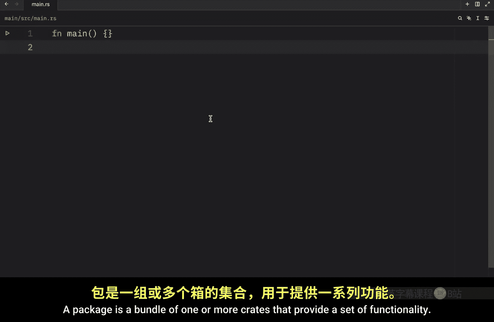
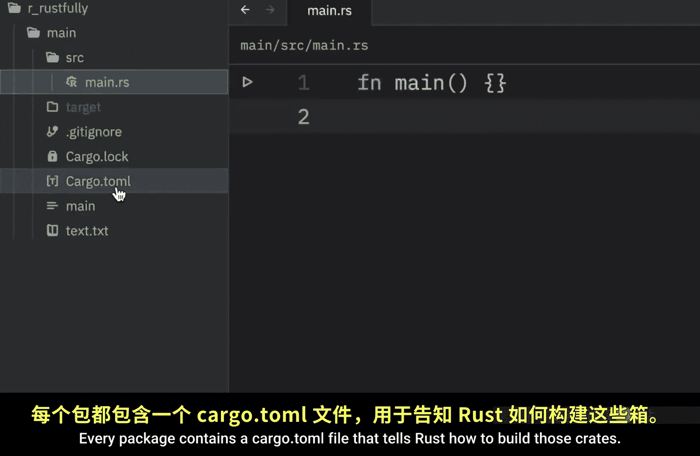

# 059：Rust 中的包和 Crate 详解 📦

在本节课中，我们将学习如何在 Rust 中更好地组织代码，核心概念是**包**和**Crate**。随着项目规模增长，将所有代码放在单个文件中会变得难以管理。Rust 的模块系统提供了强大的工具来组织代码、控制可见性和复用功能。

## 概述

在开始构建大型 Rust 项目前，有必要学习如何使用包、Crate 和模块来更好地组织代码。虽然我们可以将所有代码写在一个包含数千行的文件中，但这会很快变得难以管理。理想情况下，随着项目规模增长，我们应该将代码拆分到多个模块和文件中，将相关功能分组在一起。我们还将讨论如何封装实现细节，以便在更高层次上复用代码。这意味着，一旦我们实现了一个操作，其他代码可以通过其公共接口调用我们的代码，而无需了解其内部实现。

Rust 有几个特性来管理代码的组织结构，包括哪些细节是公开的、哪些是私有的，以及程序中每个作用域内的命名。这些系统有时统称为**模块系统**，它包括：
*   **包**：一个 Cargo 功能，让你可以构建、测试和共享 Crate。
*   **Crate**：一个树形模块结构，可以生成库或可执行文件。
*   **模块**和 **use**：让你控制路径的组织、作用域和私有性。
*   **路径**：一种命名项（如结构体、函数或模块）的方式。

在接下来的几节中，我们将首先讨论包和 Crate。

## 什么是 Crate？📁

一个 **Crate** 是 Rust 编译器一次处理的最小代码单位。


即使我们决定使用 `rustc` 而不是 `cargo` 来编译，并传入一个单独的代码文件，编译器也会将该文件视为一个 Crate。

例如，我们可以尝试通过输入 `rustc` 和 `src/main.rs` 来编译代码。

```bash
rustc src/main.rs
```


这将创建一个可执行文件。如上图所示，在文本上方，我们生成了 `main` 文件。要运行它，只需输入 `./main`。

```bash
./main
```





这样，我们就成功运行了代码。此外，Crate 可以包含模块，这些模块可能定义在其他文件中，并与 Crate 一起编译，我们稍后会看到这一点。

## Crate 的两种形式

一个 Crate 可以有两种形式：**二进制 Crate** 或**库 Crate**。

*   **二进制 Crate** 是可以编译成可执行文件的程序，例如命令行工具或服务器。每个二进制 Crate 必须有一个名为 `main` 的函数，用于定义可执行文件运行时的行为。我们目前创建的所有 Crate 都是二进制 Crate。
*   **库 Crate** 则没有 `main` 函数，也不会编译成可执行文件。相反，它们定义了旨在多个项目中共享的功能。

库 Crate 的一个例子是 `rand` crate，我们用它来生成随机数。要将这个 Crate 添加到我们的项目中，我们需要输入 `cargo add rand`。如果它存在，它会立即添加；否则可能会加载一会儿。添加后，我们就可以使用它了。

我们可以输入 `use rand::Rng`，然后创建一个名为 `roll` 的函数来生成一个随机骰子点数。

```rust
use rand::Rng;

fn roll() {
    let mut rng = rand::thread_rng();
    let roll = rng.gen_range(1..=6);
    println!("You rolled a {}", roll);
}
```

这里，我们创建了一个数字生成器，并让 `roll` 等于 `rng.gen_range(1..=6)`，其中 6 是包含的。我们要做的就是打印一行，显示你掷出的点数。

要运行这段代码，我们只需调用 `roll()` 函数。下次运行时，我们应该会得到不同的点数。第一次运行时，我连续掷出了三个 3，起初我以为是 bug，但只是运气很好。如你所见，第二次运行时，我得到了不同的数字。






`rand` crate 提供了生成随机数的功能。需要注意的是，大多数时候当 Rustaceans 提到“crate”时，他们指的是**库 Crate**，这个术语与通用编程概念中的“库”可以互换使用。

**Crate 根**是 Rust 编译器开始处理的源文件，它构成了 Crate 的根模块。当我们讲到模块部分时，会深入探讨这一点。

## 什么是包？📦


接下来，让我们谈谈包。一个**包**是一个或多个提供一组功能的 Crate 的集合。


每个包都包含一个 `Cargo.toml` 文件，它告诉 Rust 如何构建这些 Crate。

一个包可以包含任意多个二进制 Crate，但最多只能包含一个库 Crate。每个包必须至少包含一个 Crate，无论是二进制 Crate 还是库 Crate。

以下是当我们使用 `cargo new` 创建一个新包时发生的情况。我们将传入一个项目名 `new_project`。

```bash
cargo new new_project
```



然后，我们输入 `ls new_project` 来列出该项目中存在的所有文件和目录。




此时，我们只有一个 `Cargo.toml` 文件和一个 `src` 目录。由于这个项目有 `Cargo.toml` 文件，它正式成为一个包。我们甚至可以导航到这个 `new_project` 目录以便直观地查看。


如你所见，我们有 `Cargo.toml`、`.gitignore`（在此上下文中不重要）和 `src` 目录。在 `src` 目录中，你会看到一个 `main.rs` 文件。这个文件是二进制 Crate 的起点，它以包的名字命名。

如果在 `src` 目录中有一个名为 `lib.rs` 的文件，Cargo 会将其视为库 Crate。一个包可以同时包含这两者。它还可以通过在 `src/bin` 目录中放置文件来拥有多个二进制 Crate。

例如，如果我们要在这里创建一个新文件夹或新目录，我们可以输入 `bin`。

```bash
mkdir src/bin
```


在里面，我们可以添加一些其他的二进制文件，例如 `example.rs`。这里的每个文件都会成为其自己的二进制 Crate。


## 总结

本节课我们一起学习了 Rust 中用于代码组织的核心概念：**包**和**Crate**。

*   **Crate** 是编译的最小单位，分为**二进制 Crate**（可执行程序）和**库 Crate**（共享功能代码）。
*   **包** 通过 `Cargo.toml` 文件管理一个或多个 Crate，一个包最多包含一个库 Crate，但可以有多个二进制 Crate。
*   项目的入口文件：`src/main.rs` 是二进制 Crate 的根，`src/lib.rs` 是库 Crate 的根，额外的二进制 Crate 可以放在 `src/bin/` 目录下。


我知道今天的视频涵盖了很多术语，一开始听起来可能很令人困惑，但我保证随着时间的推移，它会变得越来越清晰。这需要一点时间来适应。作为一个来自 Python 背景的人，我也在努力理解这些概念，所以不用担心，我们会一起弄明白的。理解这些基础是构建结构良好、可维护的 Rust 项目的关键。