# 060：Rust 模块系统入门 🏦

在本节课中，我们将开始学习 Rust 中的模块（modules）以及其他模块系统的组成部分，以更好地理解模块的工作原理。我们将通过创建一个模拟银行账户的小项目来实践，该项目将允许你创建账户、存款、取款并向客户发布重要公告。

## 项目结构与模块创建

我们将从创建第一个模块开始。首先，在 `src` 目录下创建一个名为 `bank.rs` 的新文件。接着，我们将为 `bank` 模块的子模块创建一个目录。

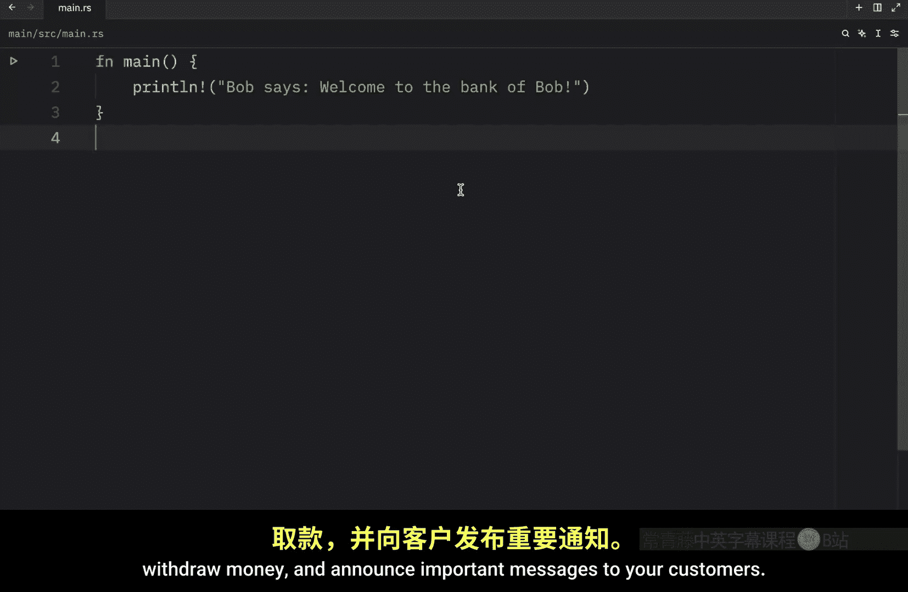

这个目录应命名为 `bank`。虽然目录名不必与模块名完全一致，但强烈建议这样做。如果使用不同的名称，将两者关联起来会复杂得多。我们将在后续课程中讨论这一点。目前，请确保两者名称完全相同，这样 `bank.rs` 文件才能知道它可以在 `bank` 目录中找到更多功能。

在 `bank` 目录中，我们将创建两个文件：`accounts.rs` 和 `transactions.rs`。这些是隶属于 `bank.rs` 的子模块。

## 定义账户子模块

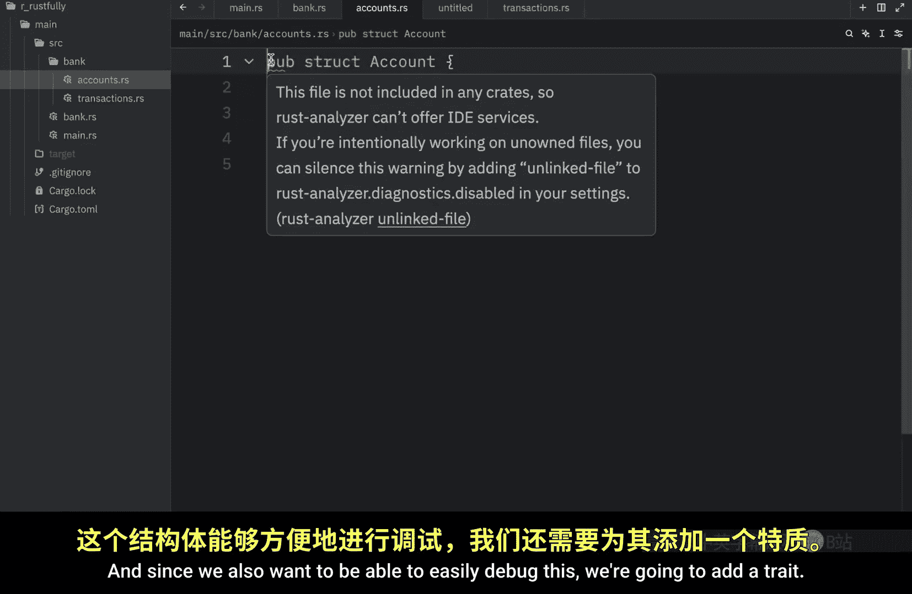

现在，让我们进入 `accounts` 子模块。我们将创建一个公开的结构体（`pub struct`），名为 `Account`。这个结构体将包含一个公开的 `owner` 字段（类型为 `String`）和一个公开的 `balance` 字段（类型为 `i32`）。为了便于调试，我们还将为其派生（derive）`Debug` 特征。

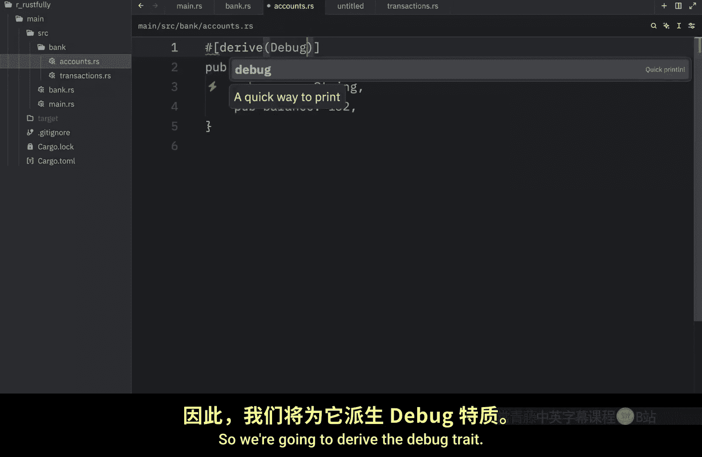

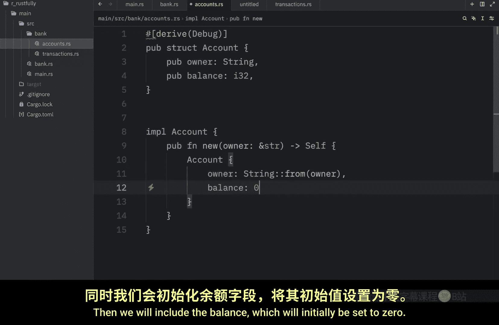

接下来，为这个结构体创建实现（`impl`）。在实现中，我们将创建一个公开的 `new` 函数，它接收一个类型为字符串切片（`&str`）的 `owner` 参数，并返回 `Self`（即 `Account` 实例）。在函数内部，我们初始化并返回一个 `Account` 实例，其中 `owner` 字段由传入的参数转换而来，`balance` 字段初始化为 `0`。

我们定义这个 `new` 方法为公开的（`pub`），以便其他模块能够看到并使用它。换句话说，我们将其暴露给外部世界。如果你尝试移除 `pub` 关键字，稍后会发现 `new` 函数将无法在此模块外部工作。

## 定义交易子模块

接下来，我们进入 `transactions` 子模块。由于我们想在这里使用 `accounts` 模块的功能，需要先导入它。

为此，我们使用 `use` 关键字，后跟 `crate`。`crate` 部分指定了这是一个绝对路径，意味着你基本上可以在任何文件中包含它，效果相同。所以，我们写 `use crate::bank::accounts::Account;`。

由于本课更侧重于语言的模块方面，我将直接粘贴代码，但会解释其作用。我们再次创建了一些希望在整个程序中公开的公共函数，即 `deposit`（存款）和 `withdraw`（取款）。`deposit` 函数允许我们向账户存入资金并打印当前余额。`withdraw` 函数允许我们从账户取款，并在尝试取款前检查用户是否有足够资金。同样重要的是，我们使用了 `pub` 关键字，因为我们希望能在文件外部使用这两个函数。

## 在父模块中声明子模块

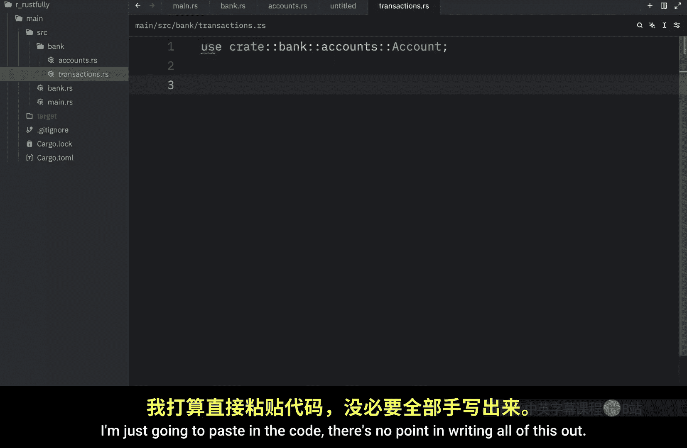

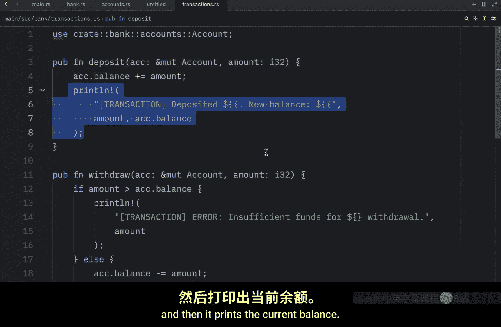

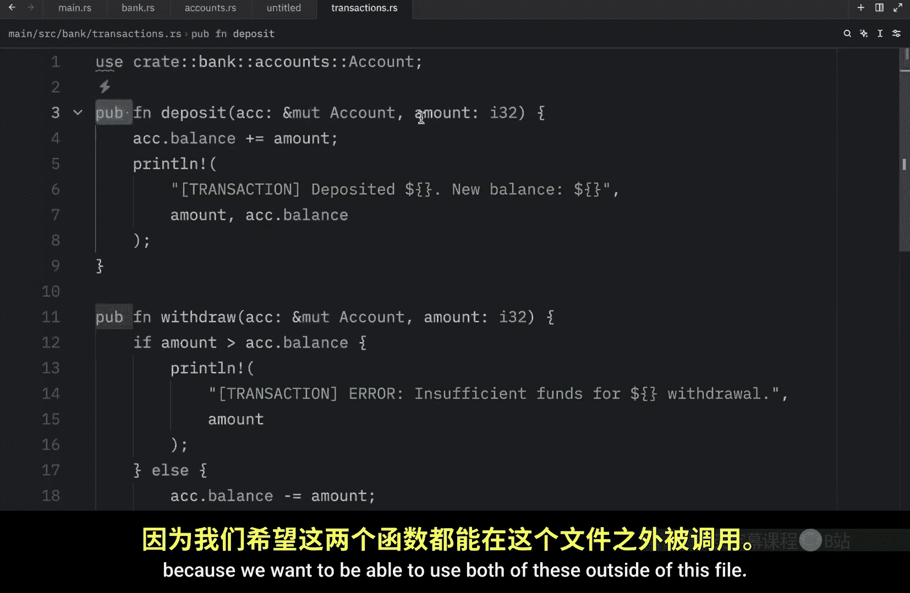

现在，是时候回到我们的 `bank` 模块（`bank.rs` 文件）了。在这里，你可以声明哪些子模块和功能要对程序公开。

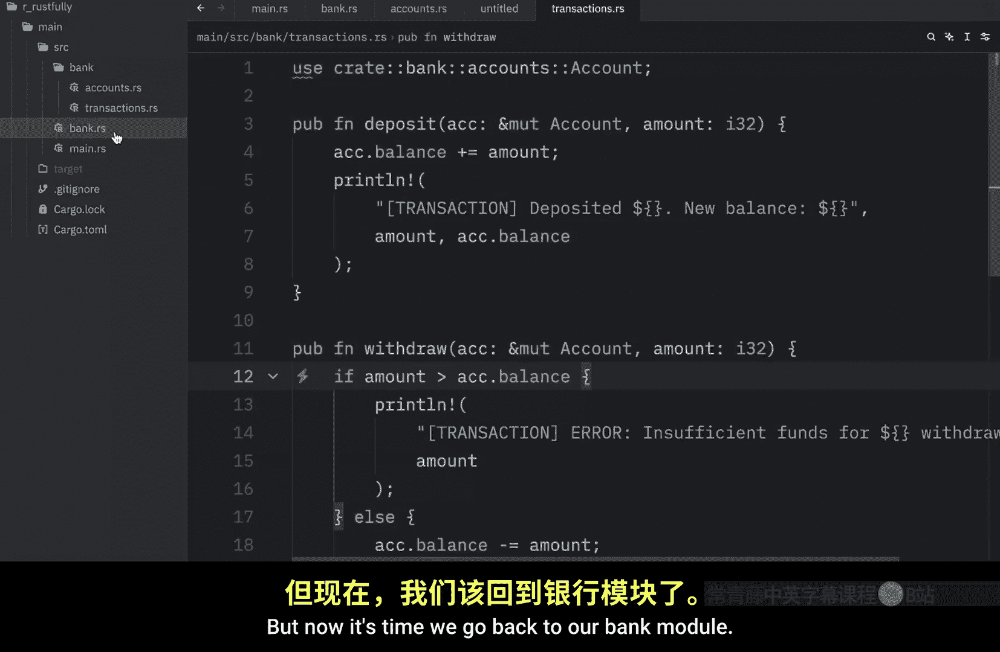

由于我们创建了一个名为 `bank` 的目录，Rust 默认会在这里寻找我们刚刚创建的子模块。这完全是因为我们的模块文件叫 `bank.rs`。再次强调，目录命名为 `bank` 并非巧合，我是有意为之，因为它能很好地将两者关联起来。

在 `bank.rs` 中，我们需要输入 `pub mod accounts;` 和 `pub mod transactions;`。这将把我们在子模块中创建的功能包含进 `bank` 模块，以便我们能在 `main.rs` 中使用。

你并非必须创建子模块，完全可以直接在 `bank.rs` 中创建所有功能。但我想展示的是，如果你想进一步拆分功能，可以使用子模块来实现。

在 `bank.rs` 中，我将保留一个函数，名为 `announce`，它允许我们发布公告。同样，这个函数是公开的，因为我们希望在文件外部使用它。

## 在主程序中使用模块功能

现在我们已经拥有了所有功能，让我们尝试在 `main.rs` 中使用它。

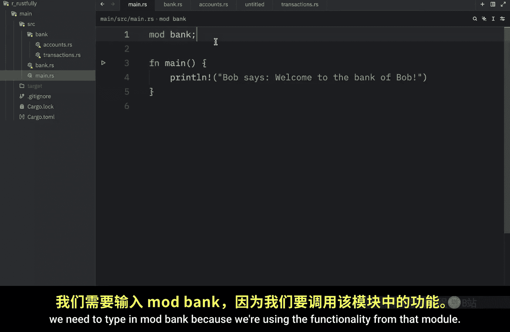

首先，要使用 `bank` 模块的功能，我们需要输入 `mod bank;` 来声明使用该模块。

然后，我们可以创建一个可变的账户：`let mut account = bank::accounts::Account::new("Bob");`，并打印出我们创建了这个账户。

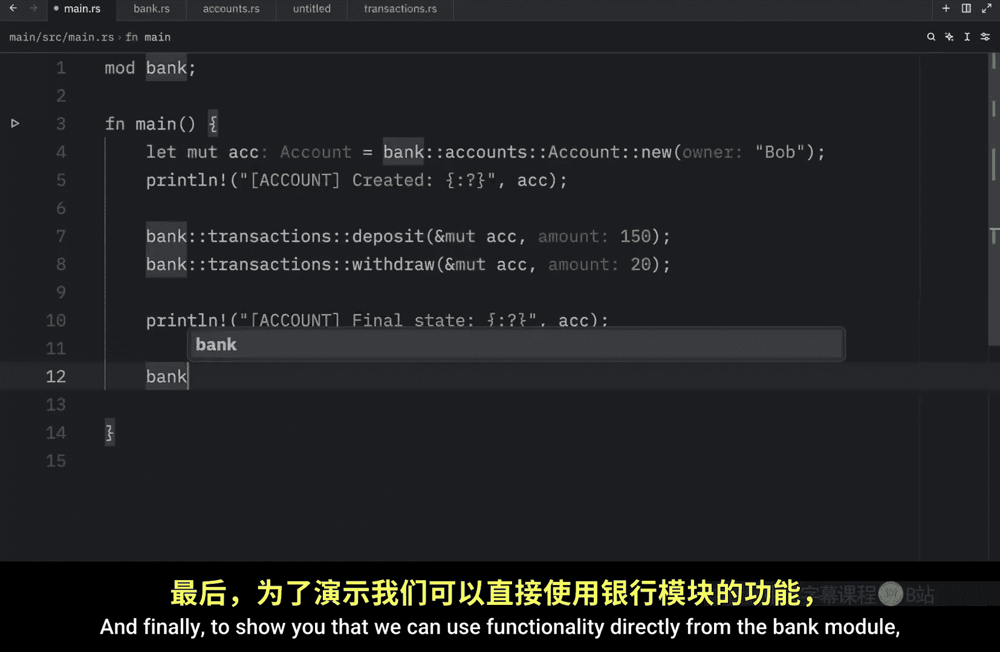

要使用模块中的功能，我们只需输入 `bank::transactions::deposit(&mut account, 150);`，这里我们存入了 150 单位货币（假设是欧元）。接着，我们复制这行代码并修改为取款 20：`bank::transactions::withdraw(&mut account, 20);`。

然后，我想打印账户的最终状态。最后，为了展示我们可以直接使用 `bank` 模块中的功能，我将调用 `bank::announce("There is some maintenance at 1:30 PM.");`。

运行程序后，我们应该得到以下消息：首先显示我们为 Bob 创建了一个账户；然后显示存入了 150（货币单位）；接着 Bob 取款 20，新余额为 130；然后打印账户的最终状态，显示所有者仍是 Bob，余额为 130；最后还有一条银行公告，通知下午 1:30 将有维护。

## 理解公有与私有

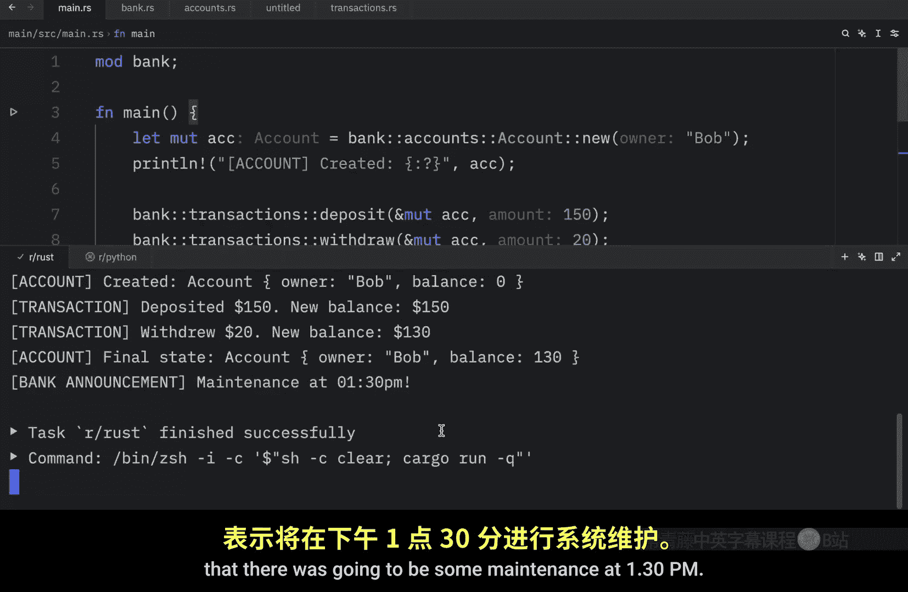

现在让我们回到模块，这次我将移除 `announce` 函数的 `pub` 部分，看看会发生什么。一旦我移除 `pub` 并回到 `main.rs`，你会发现我们无法再使用 `announce`，因为它现在被视为私有的。默认情况下，你创建的所有功能都被认为是私有的，除非你明确指定其为公开。

因此，如果我们希望 `main.rs` 文件能看到这个函数，就必须将其设为公开。对于子模块也是如此，如果我们移除 `transactions` 模块声明前的 `pub`，`main.rs` 将无法看到它，因为 `transactions` 现在是私有的。所以我们需要确保它是公开的。

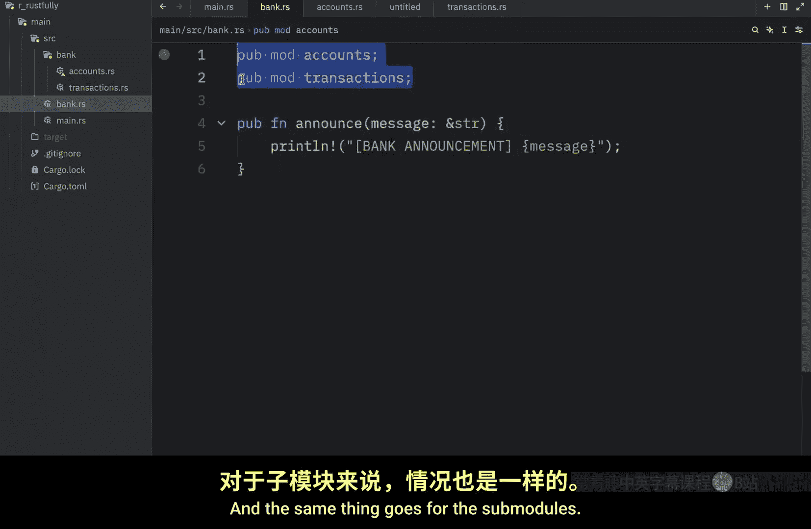

如果我们再深入一层，进入 `transactions.rs` 文件，移除 `deposit` 函数前的 `pub`，我们仍然会在 `main.rs` 中得到错误，因为这个函数不再是公开的，它只能在 `transactions` 文件内部使用。如果我们希望在文件外部访问它，就需要将其设为公开。注意，关键字是 `pub`，而不是 `public`。

## 模块与目录的命名关联

最后，还有一点我想在今天说明。再次强调，如果你将这个目录命名为其他名称，将 `bank` 模块与目录关联起来会困难得多。例如，让我们将其重命名为 `extra`。一旦这样做，Rust 将很难找到 `extra`，我们将不得不使用一些特殊的语法来定位它。我们不能仅仅输入 `pub mod accounts;`，因为 Rust 会不知道它在哪里。

但是，如果我们将其命名为与模块完全相同的名称（即 `bank`），Rust 就能将两者联系起来，理解 `bank` 目录属于 `bank` 模块，从而轻松找到这些子模块。当然，你并非必须将其命名为 `bank`，我将在后续课程中教你如果将其命名为 `extra` 之类的名称，该如何引用它。

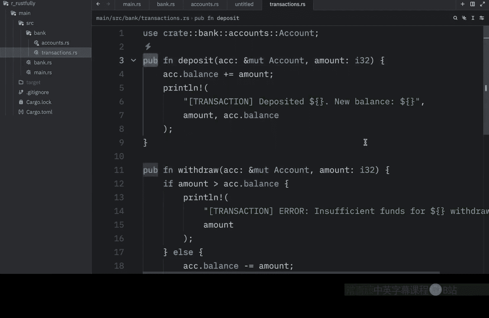

## 总结

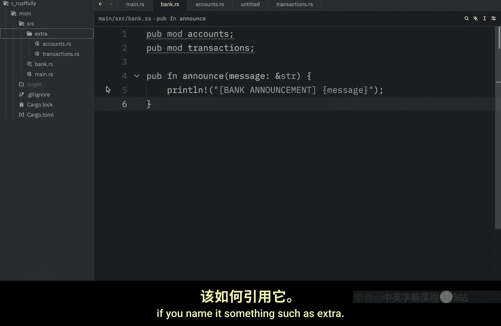

本节课中，我们一起学习了 Rust 模块系统的基础知识。我们创建了一个银行模拟项目，实践了如何通过创建 `bank.rs` 文件和对应的 `bank/` 目录来组织模块。我们定义了 `accounts` 和 `transactions` 两个子模块，并在其中创建了公开的结构体和函数。我们了解了如何使用 `pub` 关键字控制模块、结构体和函数的可见性，以及模块文件与目录的命名约定如何影响 Rust 查找子模块。最后，我们在 `main.rs` 中成功使用了这些模块功能，完成了存款、取款和发布公告的操作。理解模块的公有与私有边界是构建清晰、可维护 Rust 程序的关键。