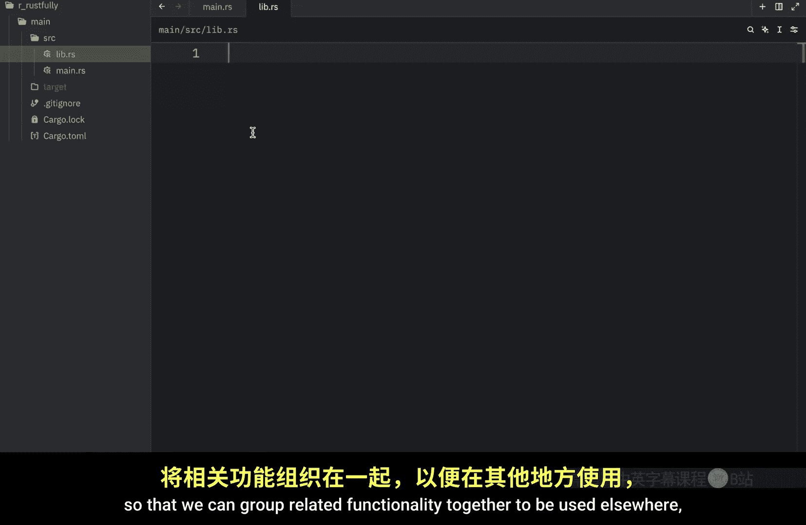
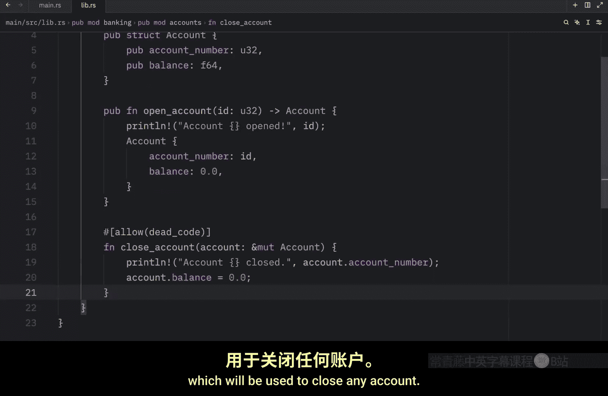
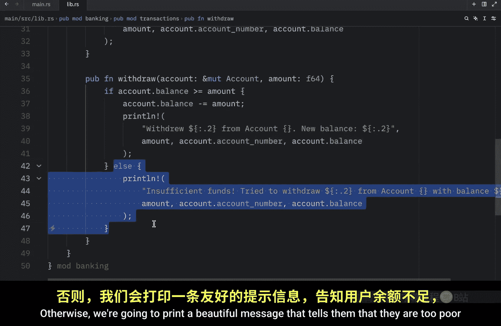
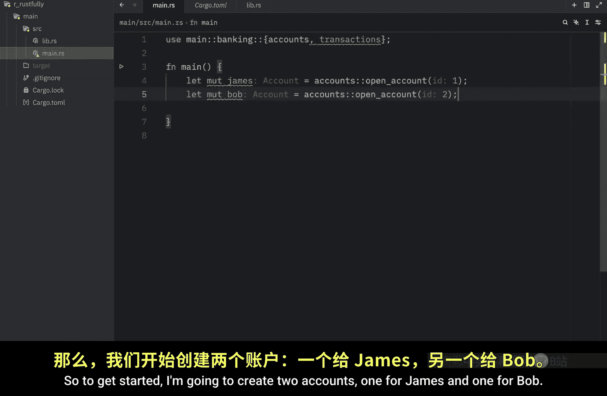
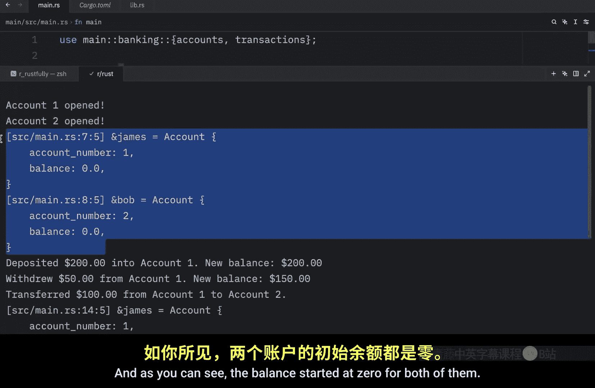
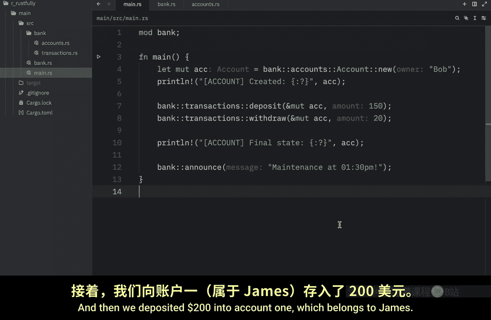
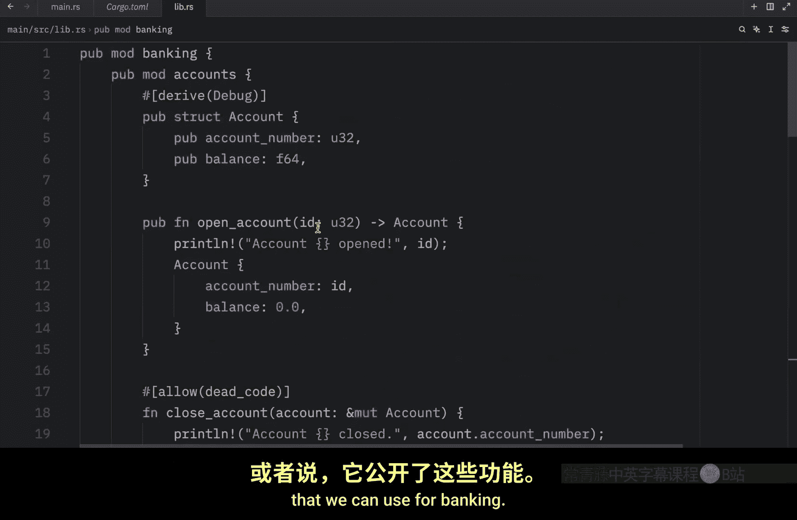

# 061：如何在 Rust 中使用 `lib.rs` 📚

在本节课中，我们将深入学习 Rust 中的模块系统，并创建我们的第一个库。我们将探讨模块定义的另一种方式，并构建一个包含账户和交易功能的银行系统库。

## 概述

上一节我们介绍了如何在 Rust 中创建模块。本节中，我们将进一步讨论模块，并学习如何在 Rust 中创建和使用库。我们将创建一个名为 `lib.rs` 的库文件，作为项目的入口点，将相关功能组织在一起供其他模块使用。

## 模块定义的另一种方式

之前我们学习了通过创建 `bank.rs` 文件和 `bank` 目录来定义模块。这是 Rust 文档中推荐的方式。然而，Rust 还提供了另一种定义模块的方法。

以下是另一种方法的具体步骤：

1.  将 `bank.rs` 文件重命名为 `mod.rs`。
2.  将 `mod.rs` 文件移动到 `bank` 目录内部。

此时，`main.rs` 文件会报错，因为它找不到名为 `bank` 的模块。这是因为模块的入口点现在变成了 `bank` 目录下的 `mod.rs` 文件。Rust 会将 `mod.rs` 识别为所在目录的模块入口点。

这两种方式（`bank.rs` 或 `bank/mod.rs`）在功能上完全等效，你可以根据项目结构和个人偏好选择使用哪一种。

## 创建第一个 Rust 库

现在，让我们开始创建第一个库。首先，清理之前的代码，并重置 `main.rs` 文件。

在 `src` 目录下，创建一个名为 `lib.rs` 的新文件。我们将在这里构建我们的银行系统库。库的目的是将相关的功能组织在一起，以便在其他地方复用，就像我们使用 `rand` crate 来生成随机数一样。

首先，我们创建顶层的模块，命名为 `banking`。这是我们的库的起点。

```rust
pub mod banking {
```

我们需要使用 `pub` 关键字将其公开，以便其他文件可以访问这个模块。




### 创建账户模块

在 `banking` 模块内部，我们创建第一个子模块 `accounts`。

```rust
    pub mod accounts {
```

在 `accounts` 模块中，我们定义一个公开的结构体 `Account`，用于表示银行账户。

```rust
        pub struct Account {
            pub account_number: u32,
            pub balance: f64,
        }
```

接下来，我们创建一个公开的构造函数 `open_account`，用于创建新的 `Account` 实例。

```rust
        pub fn open_account(account_number: u32) -> Account {
            Account {
                account_number,
                balance: 0.0,
            }
        }
```




然后，我们创建一个私有函数 `close_account`，用于模拟关闭账户的操作。由于没有使用 `pub` 关键字，这个函数只能在 `accounts` 模块内部使用。


```rust
        #[allow(dead_code)]
        fn close_account(account: Account) {
            // 模拟执行关闭账户的危险操作
        }
    }
```

将某些功能（如关闭账户）设为私有是一种良好的实践，可以防止库的用户意外执行危险操作。

### 创建交易模块

在 `accounts` 模块下方，我们创建另一个子模块 `transactions`。

```rust
    pub mod transactions {
```

为了在 `transactions` 模块中使用 `accounts` 模块中定义的 `Account` 结构体，我们需要将其引入作用域。这里使用 `use super::accounts::Account;` 语法。关键字 `super` 允许我们引用当前模块上一层级（即 `banking` 模块）中定义的功能。

```rust
        use super::accounts::Account;
```

现在，我们可以在 `transactions` 模块中创建功能函数。首先是 `deposit` 函数，用于向指定账户存款。

```rust
        pub fn deposit(account: &mut Account, amount: f64) {
            account.balance += amount;
            println!("存入 ${}。新余额：${}", amount, account.balance);
        }
```



接下来是 `withdraw` 函数，用于从指定账户取款。在取款前，我们需要检查账户余额是否充足。

```rust
        pub fn withdraw(account: &mut Account, amount: f64) {
            if account.balance >= amount {
                account.balance -= amount;
                println!("取出 ${}。新余额：${}", amount, account.balance);
            } else {
                println!("余额不足。无法取出 ${}。当前余额：${}", amount, account.balance);
            }
        }
```

最后，我们创建 `transfer` 函数，用于在两个账户之间转账。同样，在转账前需要检查源账户的余额。

```rust
        pub fn transfer(from: &mut Account, to: &mut Account, amount: f64) {
            if from.balance >= amount {
                from.balance -= amount;
                to.balance += amount;
                println!("从账户 {} 向账户 {} 转账 ${}。", from.account_number, to.account_number, amount);
            } else {
                println!("账户 {} 余额不足，无法完成 ${} 的转账。", from.account_number, amount);
            }
        }
    }
}
```

至此，我们完成了 `lib.rs` 库文件的编写。`lib.rs` 是库项目的默认入口点，用于公开你想让整个项目使用的功能。

## 在 `main.rs` 中使用库

库创建完成后，我们可以在 `main.rs` 文件中使用它。首先，需要通过 `use` 语句将库引入作用域。你需要使用你的项目名称（在 `Cargo.toml` 的 `[package]` 部分定义）作为路径的起点。

```rust
use main::banking::{accounts, transactions};
```

假设项目名为 `main`，上述代码从 `banking` 库中导入了 `accounts` 和 `transactions` 模块。

现在，我们可以使用库中定义的功能。首先，为 James 和 Bob 各创建一个账户。

```rust
fn main() {
    let mut account_james = accounts::open_account(1);
    let mut account_bob = accounts::open_account(2);

    println!("账户创建成功：{:?}, {:?}", account_james, account_bob);
}
```

运行程序，输出显示两个账户的初始余额均为 0。

接下来，执行一系列交易操作：

1.  向 James 的账户存入 200 美元。
2.  从 James 的账户取出 50 美元。
3.  James 向 Bob 的账户转账 100 美元。



```rust
    transactions::deposit(&mut account_james, 200.0);
    transactions::withdraw(&mut account_james, 50.0);
    transactions::transfer(&mut account_james, &mut account_bob, 100.0);

    println!("交易后账户状态：{:?}, {:?}", account_james, account_bob);
```

运行完整的程序，输出将逐步显示：
-   两个账户的初始余额为 0。
-   向 James 存款 200 美元后，其余额变为 200 美元。
-   从 James 取款 50 美元后，其余额变为 150 美元。
-   James 向 Bob 转账 100 美元后，James 的余额变为 50 美元，Bob 的余额变为 100 美元。

所有这些操作都是通过我们创建的 `banking` 库完成的，该库暴露了所有可用的银行功能。

## 总结


本节课中我们一起学习了：
1.  Rust 中定义模块的另一种方式：使用目录内的 `mod.rs` 文件作为入口点。
2.  如何创建 Rust 库：在 `src/lib.rs` 文件中组织模块和功能。
3.  使用 `pub` 关键字控制模块和项的可见性。
4.  使用 `use super::...` 语法引用父模块中的项。
5.  在二进制包（`src/main.rs`）中通过项目名引入并使用自定义库的功能。







通过构建一个简单的银行系统库，我们实践了如何将代码组织成可复用的模块化组件，这是构建大型 Rust 项目的基础。