# 062：泛型函数 🧬

在本节课中，我们将开始学习 Rust 中的泛型。首先，我们会了解如何在函数中使用泛型，然后是结构体和枚举。我们还将讨论泛型对代码性能的影响。

## 泛型解决的问题

在深入泛型之前，我们先快速看一下它们旨在解决的问题。假设你想创建一个函数，用于从列表中获取第一个整数。

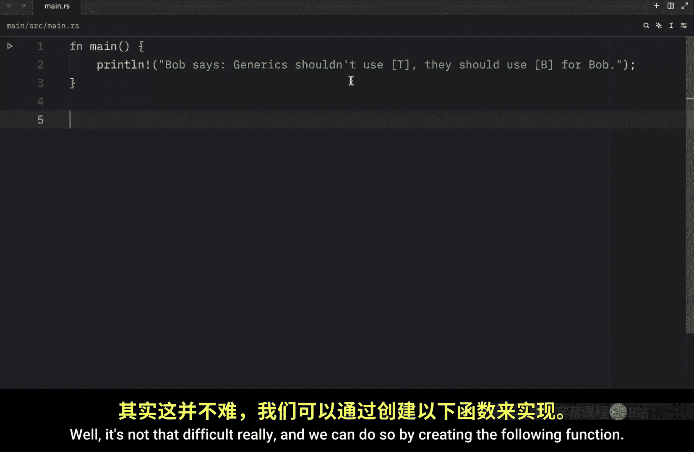

这并不难，我们可以通过创建以下函数来实现：

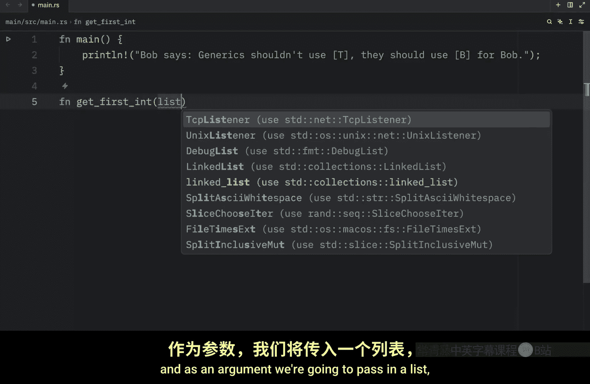

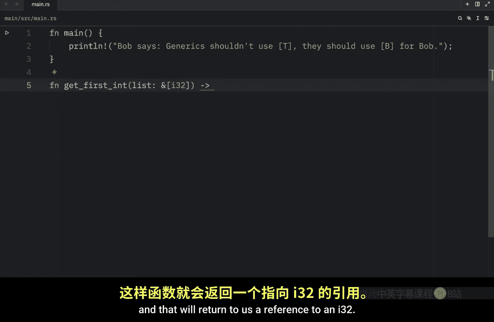


```rust
fn get_first_int(list: &[i32]) -> &i32 {
    &list[0]
}
```

我们将创建一个名为 `get_first_int` 的函数，它接收一个整数切片作为参数，并返回一个对 `i32` 的引用。在函数内部，我们只需返回列表的第一个元素。

要使用这个函数，我们需要创建一些数字：

```rust
fn main() {
    let numbers = vec![1, 2, 3];
    println!("{:?}", get_first_int(&numbers));
}
```

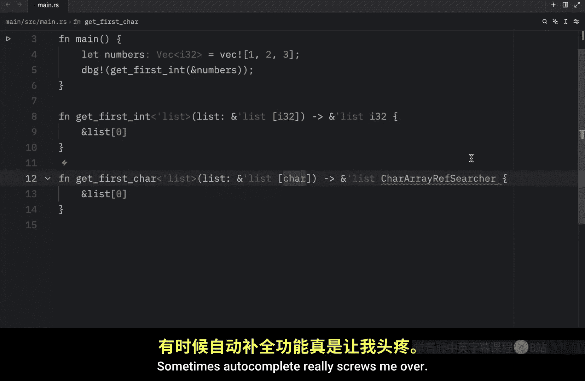

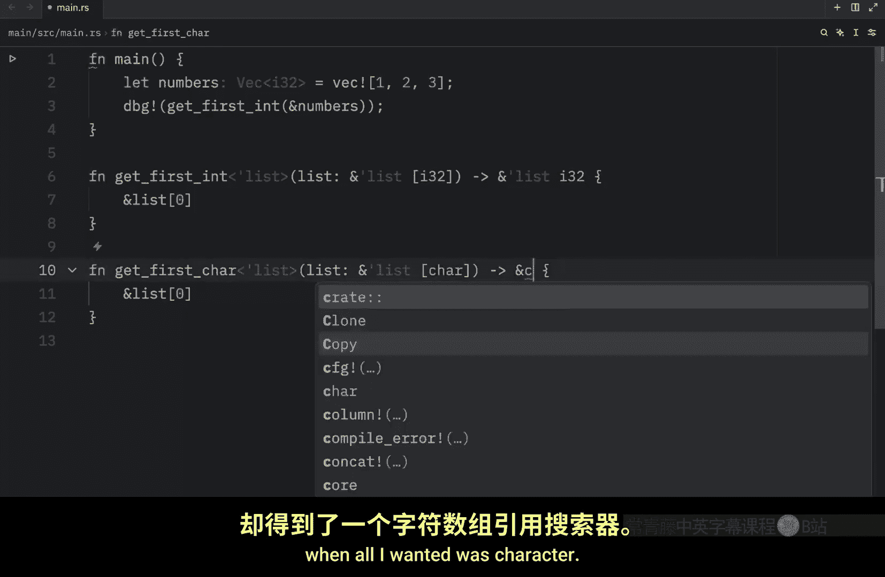

运行此代码，我们将得到列表中的第一个整数，即 `1`。

现在，假设我们也想从列表中获取第一个字符。这也不难，但我们必须为此编写一个全新的函数：

```rust
fn get_first_char(list: &[char]) -> &char {
    &list[0]
}
```

我们复制并粘贴了上面的函数，将其重命名为 `get_first_char`，并将参数和返回类型从 `i32` 改为 `char`。

然后，我们可以在主函数中使用它：

```rust
fn main() {
    let characters = vec!['A', 'B', 'C'];
    println!("{:?}", get_first_char(&characters));
}
```

运行此代码，我们将得到字符向量中的第一个字符 `'A'`。

这两个函数都能正常工作，但我们违反了编程的一个基本原则：我们毫无理由地重复了代码。这两个函数都包含完全相同的逻辑，用于从可迭代对象中获取第一个元素。现在想象一下，如果你想从列表中获取第一个浮点数或布尔值，你真的要为每个操作都创建一个专门的函数吗？当然不会，除非你是按小时计费、讨厌你的老板并且没有任何截止日期。

## 使用泛型解决代码重复问题

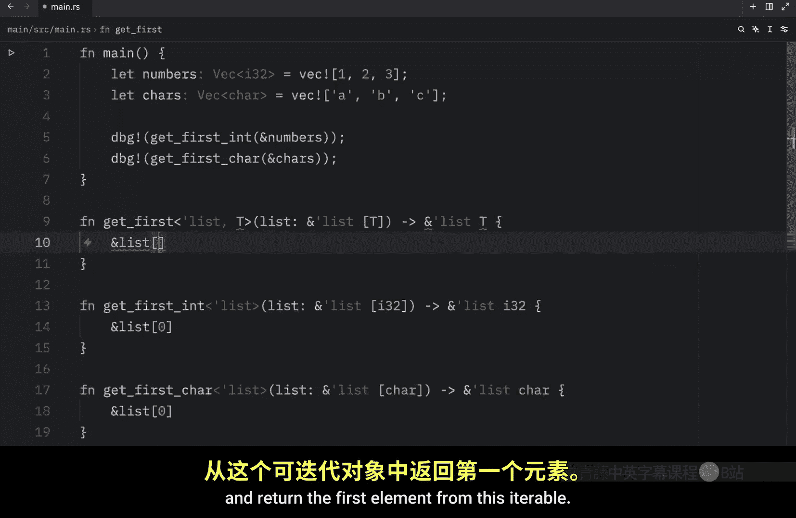

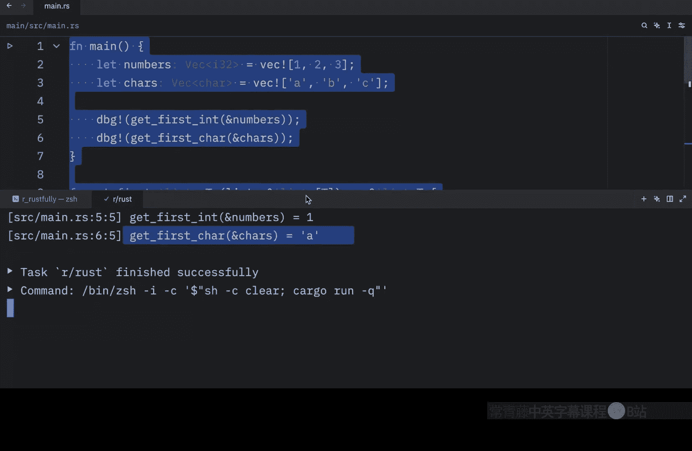

接下来，我们来看看如何使用泛型来解决我们遇到的代码重复问题。

我们将保留上述所有代码，以便与即将创建的新函数进行比较。现在，我们来创建一个泛型函数：

```rust
fn get_first<T>(list: &[T]) -> &T {
    &list[0]
}
```

在尖括号 `< >` 中，我们指定一个泛型类型，将其设置为 `T`。这是一个常见的泛型命名约定，`T` 代表类型。接下来，我们创建列表变量，它将是泛型类型 `T` 的切片，并返回对该类型值的引用。

函数内部，我们执行与其他两个函数相同的操作：返回此可迭代对象的第一个元素。

现在，创建完成后，我们可以移除之前那两个专门的函数，代码将以完全相同的方式工作：

```rust
fn main() {
    let numbers = vec![1, 2, 3];
    let characters = vec!['A', 'B', 'C'];
    println!("{:?}", get_first(&numbers));
    println!("{:?}", get_first(&characters));
}
```

如你所见，我们使用泛型和单个函数从两个向量中获取了第一个元素。这意味着我们不再需要另外两个函数了。

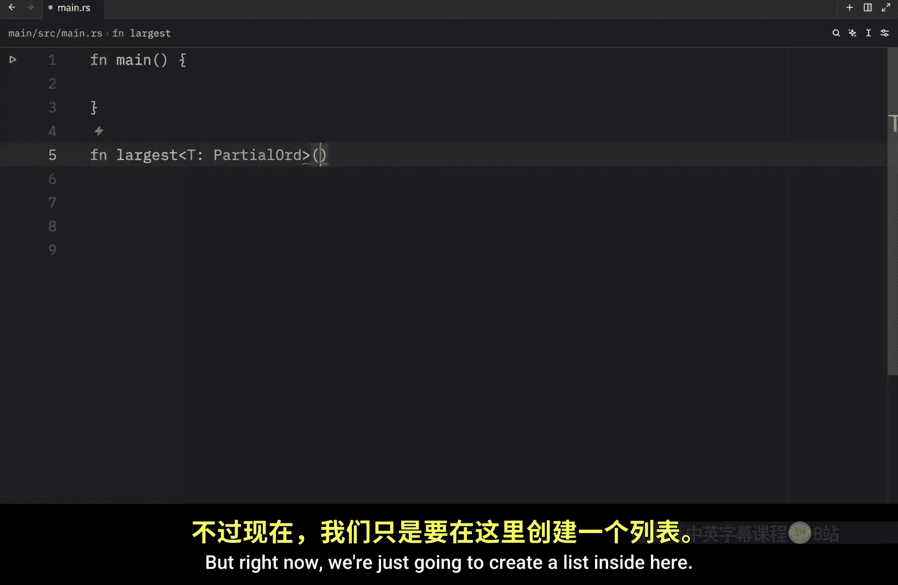


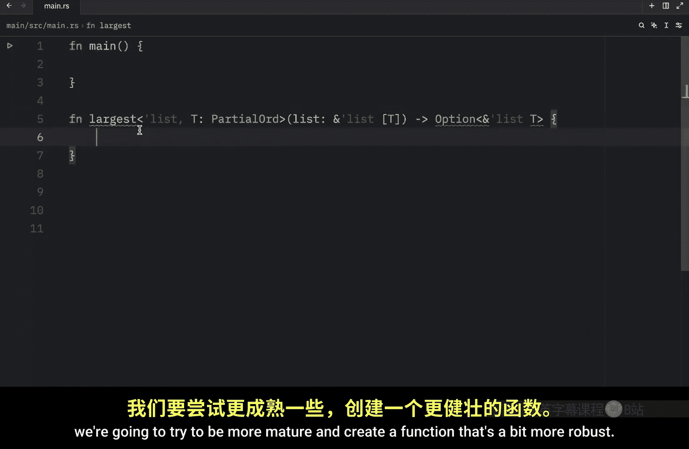


请注意，这个泛型函数远非完美，如果列表为空，它将失败。我创建它只是为了演示泛型的工作原理。另外，你可能也注意到了 `T` 旁边的内联类型提示，这与生命周期有关，我们将在后续课程中介绍，现在不必担心。请专注于本视频中关于泛型的部分。

## 带约束的泛型函数示例

现在，让我们看另一个使用泛型的例子。这次我们将创建一个处理方式更恰当的函数，并为泛型类型添加约束。

这些约束允许我们在泛型函数中更具体。例如，我们可以创建一个 `largest` 函数，并通过定义 `T` 具有 `PartialOrd` 特征来指定 `T` 使用该特征。通过定义这个特征，我们告诉 Rust 元素必须是可比较的，例如整数、浮点数和字符。如果不包含它，Rust 会建议我们使用它，以便可以在类型 `T` 上使用比较运算符。稍后创建完函数后，我会展示移除它会发生什么。

现在，我们开始创建函数：

```rust
fn largest<T: PartialOrd>(list: &[T]) -> Option<&T> {
    if list.is_empty() {
        return None;
    }
    let mut largest = &list[0];
    for item in list.iter() {
        if item > largest {
            largest = item;
        }
    }
    Some(largest)
}
```

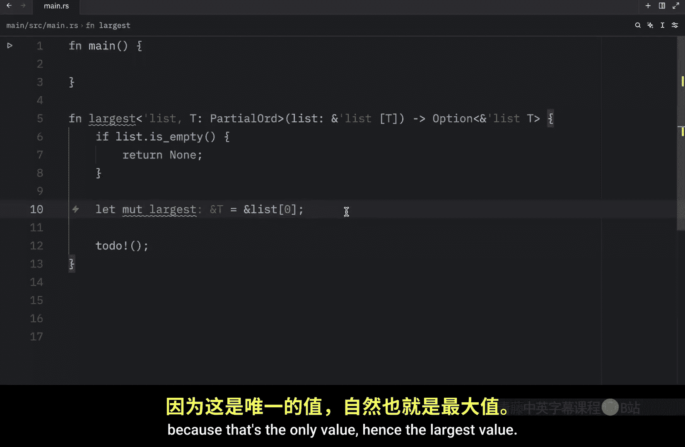


这次，我们尝试创建一个更健壮的函数。首先，检查列表是否为空，如果为空则返回 `None`，因为没有最大值。然后，将列表的第一个元素设为初始最大值。如果可迭代对象只包含一个值，它将返回这个值，因为这是唯一的值，也就是最大值。接着，遍历列表，检查当前项是否大于当前最大值，如果是，则更新最大值。最后，返回 `Some(largest)`。


如前所述，这里的约束允许我们在类型 `T` 上使用比较运算符。因为没有它，Rust 将不知道我们在这里试图比较什么。毕竟，在没有约束的情况下，`T` 可以是任何东西。但通过添加这个约束，我们告诉 Rust 这必须是一个可以与比较运算符一起使用的类型。如果你将鼠标悬停在 `PartialOrd` 上，你会看到它是一个用于形成偏序的类型的特征，这意味着我们与泛型类型一起使用的类型必须适用于这些比较运算符。

定义了这个函数后，我们可以回到主函数并尝试使用它：

```rust
fn main() {
    let characters = vec!['A', 'B', 'C', 'Z'];
    let numbers = vec![1, 2, 3];
    println!("{:?}", largest(&characters));
    println!("{:?}", largest(&numbers));
}
```

我们将再次创建一些字符和数字，然后调试输出 `largest` 函数应用于字符和数字的结果。我们会注意到，它对字符和整数都完美工作：`'Z'` 是最大的字符，`3` 是最大的整数。我们能够使用单个函数找出最大的整数，这非常棒，因为它意味着更少的代码重复。即使这些是浮点数，例如 `1.5` 和 `4.6`，我们的代码仍然可以运行。


## 总结


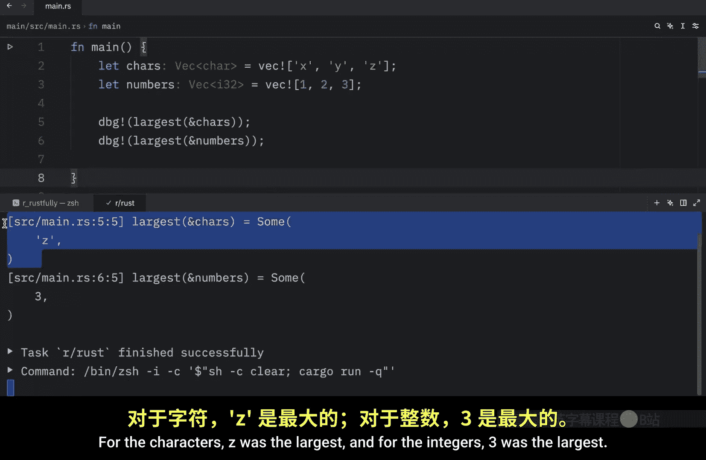

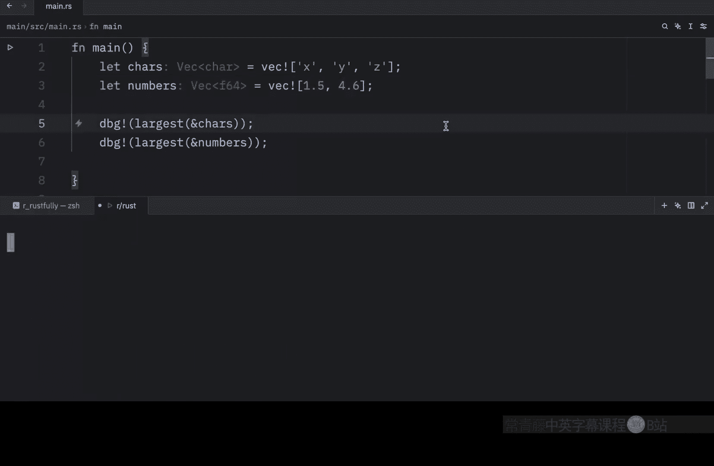

本节课中，我们一起学习了 Rust 中的泛型函数。我们首先看到了没有泛型时，为不同类型编写相同逻辑函数导致的代码重复问题。然后，我们学习了如何使用泛型类型参数 `T` 来创建通用的函数，从而消除重复。最后，我们探讨了如何通过特征约束（如 `PartialOrd`）来限制泛型类型，使其支持特定的操作（如比较），从而编写出更健壮、更灵活的泛型函数。泛型是 Rust 实现代码复用和类型安全的核心工具之一。